# LE MONDE CHANGE – NOUS DEVONS CHANGER AVEC LUI [(English version - EN)](The_World_Change_EN.md)

## Une vision pour sortir de l'impasse

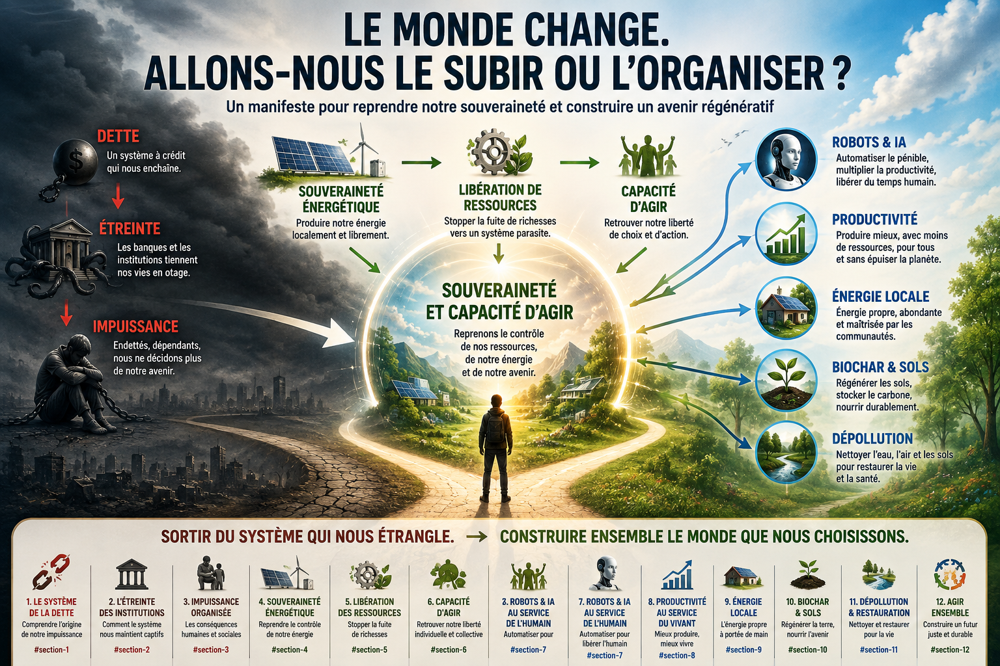

Le monde change plus vite que les sociétés humaines ne parviennent à l'admettre. Nous continuons pourtant à raisonner avec les catégories d'hier : le travail, la croissance, les impôts, les retraites, l'énergie, l'industrie, la gauche, la droite, la lutte des classes. Pendant ce temps, plusieurs transformations profondes avancent simultanément. La dette publique augmente, les intérêts absorbent une part croissante des ressources, la dépendance énergétique fragilise les économies, les sols s'appauvrissent, la pollution se disperse dans les océans et les écosystèmes, tandis que l'intelligence artificielle et la robotique commencent à remplacer des activités humaines qui semblaient autrefois impossibles à automatiser.

Le danger n'est pas qu'un seul de ces phénomènes existe. Le danger est qu'ils interagissent. Une dette trop importante réduit la capacité d'investir. Une dépendance énergétique aggrave le déficit commercial. Le manque d'investissement empêche de moderniser les infrastructures. La pollution et la dégradation des sols créent ensuite de nouvelles dépenses. Pendant ce temps, l'automatisation réduit progressivement la quantité de travail humain nécessaire, alors qu'une grande partie de notre système social repose encore sur le travail humain pour produire les revenus, les cotisations et une part importante des ressources fiscales qui financent la société.

Il ne suffit donc plus de regarder chaque problème séparément. Il faut une vision globale.

Cette vision ne consiste pas à revenir en arrière. Elle ne consiste pas à interdire le progrès, à détruire les machines ou à demander à l'humanité de vivre dans la privation permanente. Au contraire. La science, l'énergie, les machines et l'intelligence artificielle nous donnent des capacités que les générations précédentes n'ont jamais possédées. La véritable question est de savoir ce que nous allons en faire.

Nous pouvons utiliser la technologie pour multiplier les déplacements inutiles, produire des objets jetables, créer toujours plus de distractions, faire travailler des machines pour fabriquer des machines de guerre ou automatiser des activités sans intérêt collectif. Nous pouvons aussi l'utiliser pour dépolluer, produire localement, restaurer les sols, réduire le gaspillage énergétique, automatiser les tâches pénibles et organiser une société dans laquelle les gains de productivité ne détruisent pas les conditions matérielles de l'existence humaine.

Le monde change. Nous devons donc changer la manière dont nous organisons le monde.

---

## Sommaire

- [La dette, l'étreinte qui empêche d'agir](#la-dette-létreinte-qui-empêche-dagir)
- [Retrouver la souveraineté énergétique](#retrouver-la-souveraineté-énergétique)
- [Produire localement au lieu de déplacer l'énergie](#produire-localement-au-lieu-de-déplacer-lénergie)
- [La thermolyse : une autre manière d'utiliser la biomasse](#la-thermolyse--une-autre-manière-dutiliser-la-biomasse)
- [Réparer les sols au lieu de les épuiser](#réparer-les-sols-au-lieu-de-les-épuiser)
- [Pollution, engrais et déséquilibres naturels](#pollution-engrais-et-déséquilibres-naturels)
- [Le sable, les littoraux et les erreurs irréversibles](#le-sable-les-littoraux-et-les-erreurs-irréversibles)
- [Dépolluer la planète avec les machines](#dépolluer-la-planète-avec-les-machines)
- [Les machines changent la valeur du travail](#les-machines-changent-la-valeur-du-travail)
- [Quand le travail disparaît, comment la société survit-elle ?](#quand-le-travail-disparaît-comment-la-société-survit-elle)
- [La production automatisée doit contribuer à la société](#la-production-automatisée-doit-contribuer-à-la-société)
- [Simplifier la fiscalité au lieu de taxer la complexité](#simplifier-la-fiscalité-au-lieu-de-taxer-la-complexité)
- [La politique doit cesser de promettre ce qu'elle ne peut financer](#la-politique-doit-cesser-de-promettre-ce-quelle-ne-peut-financer)
- [La technologie doit devenir un outil de réparation](#la-technologie-doit-devenir-un-outil-de-réparation)
- [L'homme et la machine face au prochain seuil](#lhomme-et-la-machine-face-au-prochain-seuil)
- [Conclusion — choisir ce que nous voulons faire de notre puissance](#conclusion--choisir-ce-que-nous-voulons-faire-de-notre-puissance)

---

# La dette, l'étreinte qui empêche d'agir

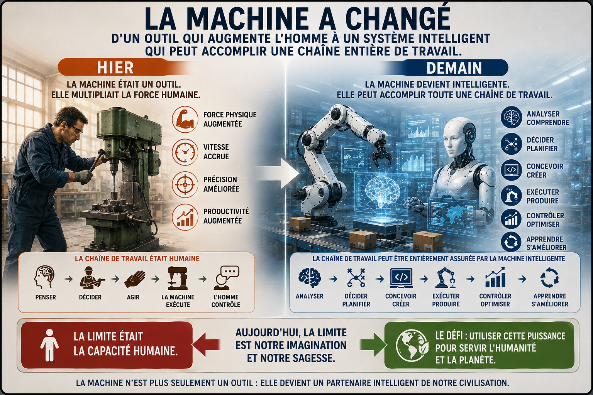

Il existe une raison pour laquelle il devient de plus en plus difficile de résoudre les problèmes : nous avons construit une économie dans laquelle une part croissante de l'énergie politique et financière est absorbée par les conséquences des décisions passées.

La dette n'est pas seulement un nombre inscrit dans un tableau. Lorsqu'elle augmente année après année, elle finit par produire une mécanique qui peut devenir extrêmement difficile à arrêter. Un déficit annuel vient s'ajouter au stock de dette existant. Les intérêts sont ensuite calculés sur une dette devenue plus importante. Si les prêteurs considèrent que le risque augmente, les conditions de financement peuvent se dégrader. Le poids des intérêts augmente alors à son tour.

La dette peut ainsi devenir une étreinte.

Le problème n'est pas qu'un pays emprunte pour construire une infrastructure utile, moderniser son industrie ou préparer une transformation majeure. Le problème apparaît lorsque l'emprunt sert durablement à financer des dépenses courantes que personne n'a décidé de réduire et que personne ne sait réellement financer.

Chaque année, on repousse alors la difficulté à l'année suivante. Mais l'année suivante, la difficulté est plus grande.

C'est pourquoi la question de la dette ne peut pas être séparée de toutes les autres. Une société étranglée par les intérêts dispose de moins de moyens pour transformer son énergie, restaurer ses sols, moderniser ses infrastructures ou accompagner les transformations du travail.

Avant de pouvoir agir librement, il faut retrouver des marges d'action.

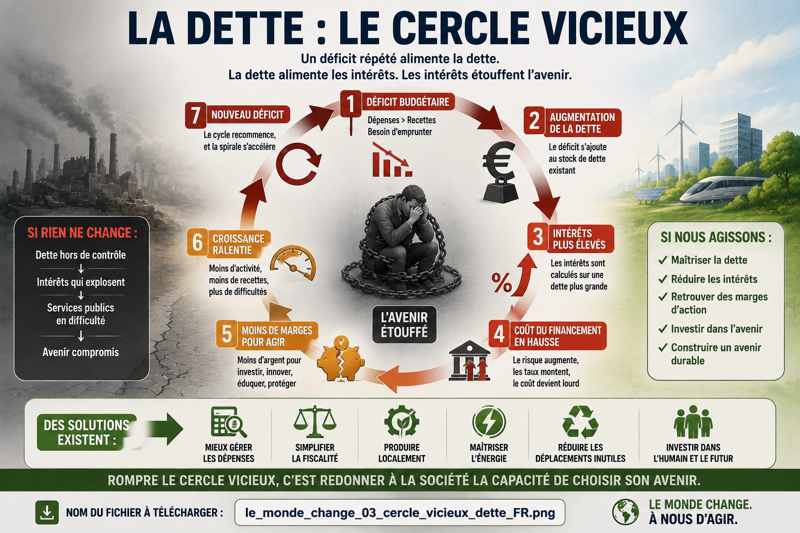

La première courbe importante de ce manifeste montre ce mécanisme. Le but n'est pas de prédire exactement l'avenir à partir d'un taux arbitraire, mais de faire comprendre la dynamique : un déficit répété n'est pas une simple addition. Lorsque les intérêts s'accumulent sur une dette croissante, le problème peut accélérer.

Il est plus facile de prévenir une spirale que d'essayer de la réparer lorsqu'elle est devenue incontrôlable.

---

# Retrouver la souveraineté énergétique

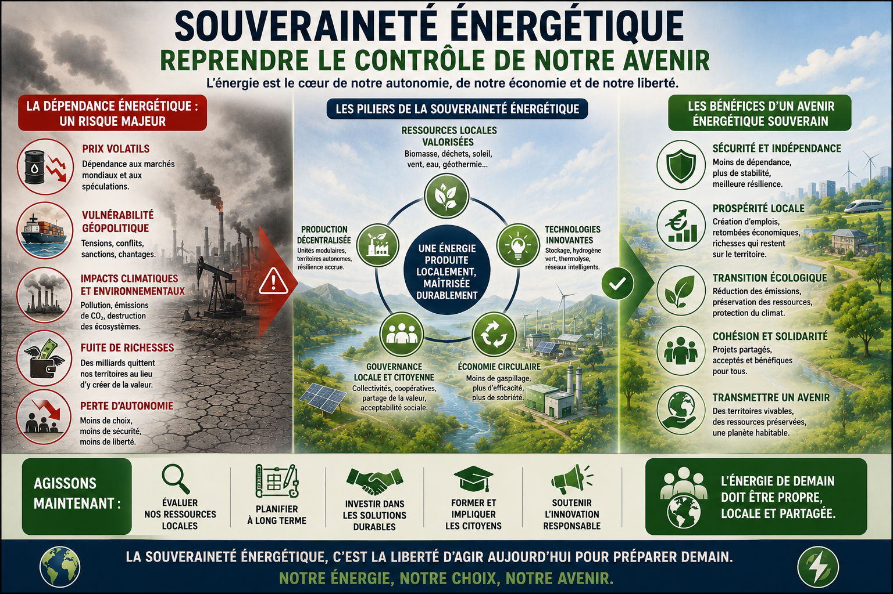

Pour agir, il faut de l'énergie. Pour transformer une économie, il faut également de l'énergie. Pour dépolluer, recycler, fabriquer des machines, restaurer des sols ou faire fonctionner des infrastructures, il faut encore de l'énergie.

Une société qui importe massivement son énergie ne paie pas seulement le prix de cette énergie. Elle dépend également des décisions d'autres pays, des infrastructures de transport, des tensions géopolitiques et des fluctuations internationales.

Il existe donc un principe simple : lorsqu'une ressource peut être produite localement de manière économiquement et écologiquement pertinente, il est préférable d'examiner cette possibilité avant de considérer comme normal de l'acheter à l'autre bout du monde.

La souveraineté ne signifie pas que chaque village doit produire absolument tout ce qu'il consomme. Cela serait absurde. Elle signifie qu'il faut réduire les dépendances inutiles et rapprocher autant que possible la production de l'endroit où l'énergie sera utilisée.

Une partie de la réponse se trouve dans les ressources locales. La biomasse disponible sur un territoire, lorsqu'elle est durablement mobilisable et qu'elle ne compromet pas les fonctions écologiques des sols et des forêts, peut devenir une ressource énergétique et industrielle.

L'enjeu n'est pas simplement de produire davantage. L'enjeu est de mieux utiliser ce qui existe déjà.

---

# Produire localement au lieu de déplacer l'énergie

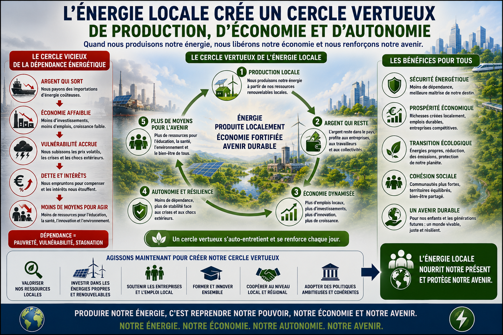

Nous avons pris l'habitude de considérer comme normale une économie dans laquelle l'énergie voyage sur des milliers de kilomètres avant d'arriver là où elle sera utilisée. Des matières premières traversent les mers, sont transformées ailleurs, puis reviennent sous forme de produits.

Tout déplacement a un coût. Ce coût n'est pas uniquement financier. Il faut des infrastructures, des navires, des ports, des véhicules, des chaînes logistiques et de l'énergie pour déplacer l'énergie.

Réduire certains déplacements inutiles permet donc de libérer une partie des ressources qui étaient consacrées au transport. Cela ne signifie pas que le commerce international doit disparaître. Le monde restera interdépendant. Mais nous devons distinguer l'interdépendance utile de la dépendance absurde.

Lorsqu'un territoire dispose de biomasse, de soleil, de vent, d'eau ou d'autres ressources exploitables dans des conditions responsables, il est logique d'étudier comment une partie de ses besoins peut être satisfaite localement.

La souveraineté énergétique devient alors un levier économique. Moins d'argent quitte le territoire pour acheter ce qui pourrait être produit localement. Une partie de la valeur reste sur place. Des activités industrielles peuvent apparaître. Des emplois spécialisés peuvent être créés. Et les ressources ainsi économisées peuvent ensuite servir à résoudre d'autres problèmes.

C'est ainsi qu'une solution énergétique peut devenir le point de départ d'une transformation beaucoup plus large.

---

# La thermolyse : une autre manière d'utiliser la biomasse

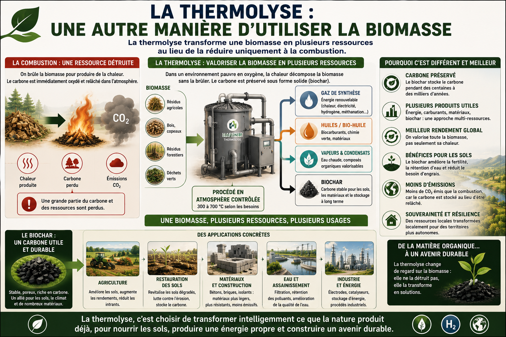

Pendant longtemps, l'utilisation de la biomasse a été pensée principalement à travers la combustion. On brûle une matière organique pour produire de la chaleur. Cette logique peut être utile dans certains cas, mais elle détruit immédiatement une partie du carbone contenu dans la matière.

La thermolyse ouvre une autre possibilité : transformer une partie de cette matière en plusieurs produits et vecteurs énergétiques. Selon la technologie, les conditions de fonctionnement et la biomasse utilisée, le processus peut produire des gaz valorisables ainsi qu'une fraction solide carbonée : le biochar.

Cette différence est importante. La biomasse n'est plus seulement un combustible. Elle devient une matière première polyvalente.

L'énergie peut être utilisée directement ou indirectement. Le gaz produit peut être valorisé selon les besoins. Le carbone contenu dans la fraction solide peut être stabilisé et, lorsque ses caractéristiques sont adaptées à l'usage envisagé, utilisé dans des applications industrielles ou comme amendement.

C'est ici que la thermolyse devient une brique importante d'une vision plus large. Une même ressource locale peut contribuer à l'énergie, à l'industrie et, dans certains cas, à la restauration des sols.

La technologie développée par **Haffner Energy** illustre cette logique de valorisation thermochimique de la biomasse. Elle ne constitue évidemment pas à elle seule une réponse à tous les besoins énergétiques de la planète. Aucune entreprise ne peut résoudre seule un problème mondial. Mais ce type de technologie montre qu'il existe des alternatives entre deux visions trop souvent opposées : continuer à brûler les ressources comme auparavant ou renoncer à utiliser l'énergie.

Le véritable progrès consiste à apprendre à tirer davantage de valeur d'une même ressource.

---

# Réparer les sols au lieu de les épuiser

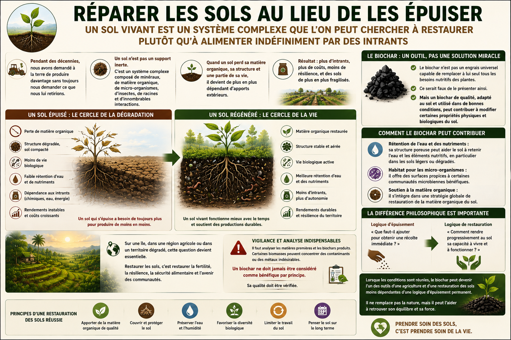

Pendant des décennies, nous avons demandé à la terre de produire davantage sans toujours nous demander ce que nous lui retirions.

Un sol n'est pas simplement un support inerte dans lequel on verse de l'eau et des produits chimiques. C'est un système complexe. Il contient des minéraux, de la matière organique, des micro-organismes, des insectes, des racines et d'innombrables interactions.

Lorsqu'un sol perd sa matière organique, sa structure et une partie de sa vie, il devient de plus en plus dépendant d'apports extérieurs.

Le biochar ne constitue pas un engrais universel capable de remplacer à lui seul tous les besoins nutritifs des plantes. Ce serait faux de le présenter ainsi. Mais un biochar de qualité, adapté au sol et utilisé dans de bonnes conditions, peut contribuer à modifier certaines propriétés physiques et biologiques du sol.

Il peut participer à la rétention de l'eau et des nutriments, offrir un habitat à certains micro-organismes et s'inscrire dans une stratégie de restauration de la matière organique.

La différence philosophique est importante. Il ne s'agit plus seulement de demander : « Que faut-il ajouter pour obtenir une récolte immédiate ? » Il faut aussi demander : « Comment rendre progressivement au sol sa capacité à vivre et à fonctionner ? »

Sur une île, dans une région agricole ou dans un territoire dégradé, cette question devient essentielle. Il faut évidemment analyser les matières premières et les biochars produits. Certaines biomasses peuvent concentrer des contaminants ou des métaux indésirables. Un biochar ne doit donc jamais être considéré comme bénéfique par principe. Sa qualité doit être vérifiée.

Mais lorsque les conditions sont réunies, il peut devenir l'un des outils d'une agriculture et d'une restauration des sols moins dépendantes d'une logique d'épuisement permanent.

---

# Pollution, engrais et déséquilibres naturels

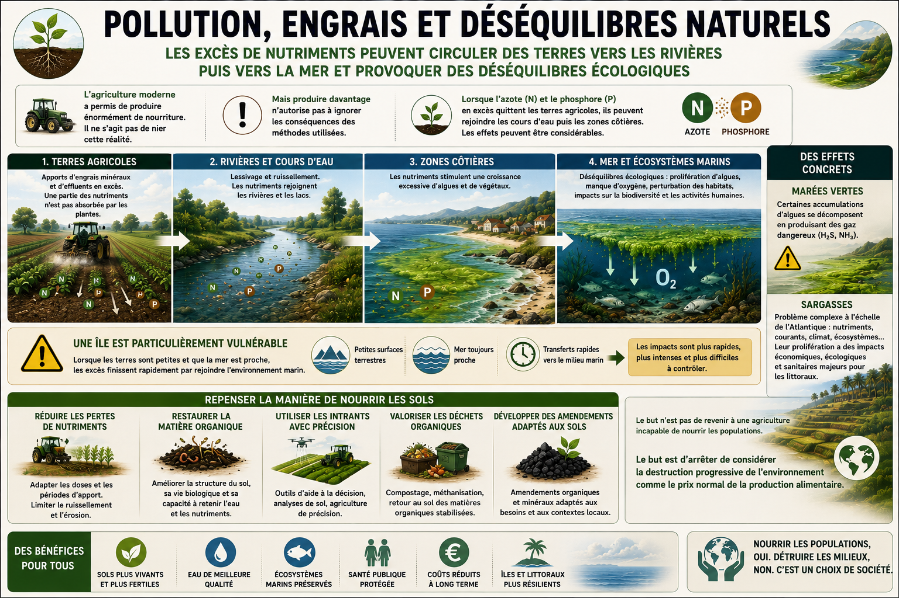

L'agriculture moderne a permis de produire énormément de nourriture. Il ne s'agit pas de nier cette réalité. Mais produire davantage n'autorise pas à ignorer les conséquences des méthodes utilisées.

Lorsqu'un excès d'azote ou de phosphore quitte les terres agricoles, il peut rejoindre les cours d'eau puis les zones côtières. Les effets peuvent être considérables : prolifération d'algues, déséquilibres des écosystèmes, diminution de l'oxygène disponible dans certaines zones et perturbation des milieux marins.

Les marées vertes constituent un exemple particulièrement visible de ce type de déséquilibre. Certaines accumulations d'algues peuvent produire des gaz dangereux lorsqu'elles se décomposent.

Les sargasses constituent un autre problème, plus complexe, qui dépend de multiples facteurs à l'échelle de l'Atlantique, parmi lesquels les apports de nutriments, les courants, les conditions climatiques et l'évolution des écosystèmes marins. Elles ne peuvent donc pas être expliquées par une seule cause locale. Mais leur prolifération montre à quel point un déséquilibre peut devenir un problème économique, écologique et sanitaire lorsqu'il atteint les littoraux.

Une île est particulièrement vulnérable. Lorsque les terres sont petites et que la mer est proche, les excès finissent rapidement par rejoindre l'environnement marin.

Il faut donc repenser la manière de nourrir les sols : réduire les pertes de nutriments, restaurer la matière organique, utiliser les intrants avec davantage de précision, valoriser les déchets organiques lorsque cela est possible et développer des amendements adaptés aux sols.

Le but n'est pas de revenir à une agriculture incapable de nourrir les populations. Le but est d'arrêter de considérer la destruction progressive de l'environnement comme le prix normal de la production alimentaire.

---

# Le sable, les littoraux et les erreurs irréversibles

Le sable semble banal parce qu'il est partout.

Pourtant, sur un littoral, il n'est pas seulement décoratif. Une plage est une structure dynamique. Le sable absorbe et redistribue une partie de l'énergie des vagues. Il participe à un équilibre qui peut être perturbé par les constructions, l'extraction, les ouvrages artificiels et la montée du niveau marin.

Dans certaines régions du monde, l'extraction du sable est devenue une activité considérable parce que le béton en consomme des quantités gigantesques.

Mais construire un immeuble avec le sable qui protégeait autrefois la côte peut produire une contradiction tragique : on utilise une partie de la protection naturelle pour construire plus près de la mer, puis l'érosion fragilise ce que l'on vient de construire.

L'observation directe de certains littoraux permet parfois de comprendre le problème mieux qu'un long discours. Voir des escaliers autrefois reliés à une plage se terminer plusieurs mètres au-dessus d'un niveau de sol transformé par l'érosion est une image puissante de ce que signifie la disparition d'une protection naturelle.

Il serait évidemment simpliste d'attribuer toute l'érosion d'un littoral à une seule cause. Les tempêtes, les courants, les constructions et l'évolution du niveau marin jouent également un rôle.

Mais la leçon générale demeure : lorsqu'une nature protège gratuitement un territoire depuis des milliers d'années, il faut réfléchir avant de détruire cette protection pour fabriquer autre chose.

---

# Dépolluer la planète avec les machines

Nous savons désormais construire des machines capables de voir, de trier, de déplacer des objets, d'apprendre certains comportements et d'effectuer des tâches répétitives pendant de longues périodes.

Il serait absurde de réserver ces capacités à la fabrication de produits de distraction ou à des démonstrations spectaculaires de robots capables de courir, boxer ou reproduire des animaux.

La planète est remplie de travaux que les humains n'ont jamais réussi à accomplir à l'échelle nécessaire. Les déchets flottent dans les océans. D'autres reposent au fond des ports et des mers. Des terrains sont contaminés. Des dépôts sauvages se multiplient. Des zones industrielles anciennes nécessitent des opérations de dépollution longues et coûteuses.

Les machines peuvent devenir une partie de la solution. Des robots pourraient rechercher, cartographier, collecter, trier et préparer les déchets à la valorisation. Des systèmes autonomes pourraient travailler dans des zones dangereuses ou difficiles d'accès. Des intelligences artificielles pourraient optimiser les itinéraires, identifier les concentrations de déchets et aider à surveiller l'évolution des écosystèmes.

Le progrès technologique n'a pas besoin d'être l'ennemi de la nature. Il peut devenir l'un des moyens les plus puissants jamais créés pour réparer les dégâts de l'humanité.

Mais cela suppose de choisir nos priorités.

---

# Les machines changent la valeur du travail

Autrefois, la machine était principalement dépourvue d'intelligence. Elle augmentait la puissance de l'homme. Une grue permettait à un ouvrier de déplacer davantage de matériaux. Un tracteur permettait à un agriculteur de travailler une surface plus importante. Un ordinateur permettait à un ingénieur de calculer plus vite.

L'homme restait au centre de la chaîne.

Aujourd'hui, cette situation commence à changer. La machine associée à l'intelligence artificielle peut progressivement intervenir dans une chaîne complète : analyser une demande, produire une réponse, concevoir une pièce, programmer une autre machine, contrôler une production, organiser une logistique et parfois prendre en charge une relation avec un client.

Dans ce manifeste, le terme « machine » désigne de manière générale les systèmes automatisés, qu'il s'agisse de robots physiques, de logiciels ou d'intelligences artificielles. Le changement est beaucoup plus profond que la mécanisation classique. La machine ne multiplie plus seulement la productivité de l'homme. Elle peut remplacer certaines étapes de son travail, puis parfois des chaînes entières d'activités.

Un robot peut théoriquement fonctionner vingt-quatre heures sur vingt-quatre. Une intelligence artificielle peut être dupliquée presque instantanément. Une compétence logicielle peut être reproduite sur un grand nombre de machines beaucoup plus rapidement qu'un être humain ne peut être formé.

Former un humain demande des années. Déployer une version supplémentaire d'un logiciel peut demander quelques minutes.

C'est pourquoi la transformation qui commence risque d'être beaucoup plus rapide que celles que les sociétés humaines ont connues auparavant. Le problème n'est pas de savoir si chaque emploi disparaîtra. Beaucoup d'activités humaines continueront d'exister longtemps. Le problème est de comprendre qu'une société ne peut pas continuer indéfiniment à considérer l'emploi comme l'unique condition normale de l'accès à un revenu si la production elle-même nécessite de moins en moins de travail humain.

---

# Quand le travail disparaît, comment la société survit-elle ?

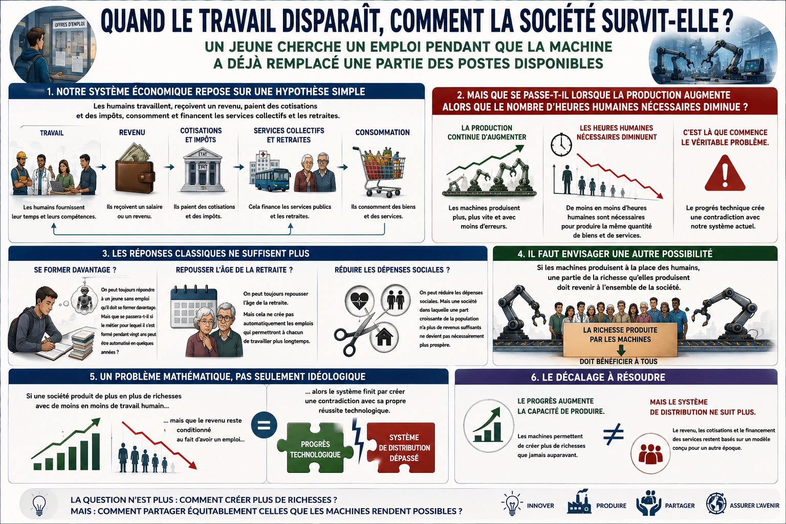

Notre système économique repose encore largement sur une hypothèse simple : les humains travaillent, reçoivent un revenu, paient des cotisations et des impôts, consomment, puis financent indirectement les services collectifs et les retraites.

Mais que se passe-t-il lorsque la production continue d'augmenter alors que le nombre d'heures humaines nécessaires diminue ?

C'est là que commence le véritable problème. On peut toujours répondre à un jeune sans emploi qu'il doit se former davantage. Mais que se passera-t-il si le métier pour lequel il s'est formé pendant vingt ans peut être automatisé en quelques années ? On peut repousser l'âge de la retraite, mais cela ne crée pas automatiquement les emplois qui permettront à chacun de travailler plus longtemps. On peut réduire certaines dépenses sociales, mais une société dans laquelle une part croissante de la population ne dispose plus de revenus suffisants ne devient pas nécessairement plus prospère.

Il faut donc envisager une autre possibilité : si les machines produisent à la place des humains, une partie de la richesse qu'elles permettent de produire doit contribuer au financement de la société.

Le problème n'est pas seulement socialiste, capitaliste ou idéologique. C'est aussi un problème de cohérence économique et mathématique.

Si une société produit de plus en plus de richesses avec de moins en moins de travail humain, mais que le revenu reste conditionné au fait d'avoir un emploi, alors le système finit par créer une contradiction avec sa propre réussite technologique. Le progrès augmente la capacité de produire, mais le système de distribution ne suit plus.

À terme, le travail ne devrait plus être une obligation nécessaire à la survie. Il pourrait devenir davantage un choix : travailler pour créer, entreprendre, apprendre, aider, rechercher, produire davantage ou simplement parce que l'activité a un sens pour soi.

Cela ne signifie pas que tout le monde doit recevoir le même niveau de richesse indépendamment de ce qu'il fait. Cela signifie qu'aucun être humain ne devrait être abandonné sans ressources parce que la société est devenue trop productive pour avoir besoin de son travail.

Un revenu universel peut constituer un coussin commun. Réellement universel, il n'aurait pas à être conditionné au chômage, au niveau de revenus ou à une recherche d'emploi. Il s'ajouterait aux autres revenus : travailler, entreprendre ou réussir davantage ne retirerait pas automatiquement ce socle.

Son niveau ne doit pas être imaginé comme fixe dès aujourd'hui. Il dépendrait de la capacité réelle de la société à le financer. La transition pourrait être progressive : modeste au début, puis susceptible d'augmenter à mesure que l'automatisation remplace effectivement une part plus importante du travail humain et que de nouvelles recettes apparaissent.

Dans une telle évolution, la notion même de chômage finirait par perdre une grande partie de son sens. Si chacun dispose d'un revenu universel de base, il n'est plus nécessaire de contrôler sans cesse qui cherche un emploi, qui accepte une offre ou qui remplit des conditions administratives. Il peut rester des services d'information et de mise en relation pour les personnes qui souhaitent travailler, mais l'existence ne dépend plus d'une obligation administrative de trouver un emploi.

De la même manière, le revenu universel pourrait progressivement jouer le rôle de socle aujourd'hui associé à une partie de la retraite. Les revenus ou retraites complémentaires resteraient possibles, mais la survie de base ne dépendrait plus du fait d'avoir accumulé toute sa vie un nombre suffisant d'années de cotisation dans un monde où le travail humain devient progressivement moins nécessaire.

Le progrès ne doit pas produire une société dans laquelle quelques propriétaires de machines possèdent toute la capacité de production pendant que le reste de la population devient économiquement inutile. Une telle concentration créerait une fragilité sociale majeure.

La question n'est donc pas seulement : combien d'emplois disparaîtront ?

La question est : comment organiser une civilisation qui devient capable de produire davantage avec moins de travail humain sans transformer cette réussite en crise sociale ?

---

# La production automatisée doit contribuer à la société

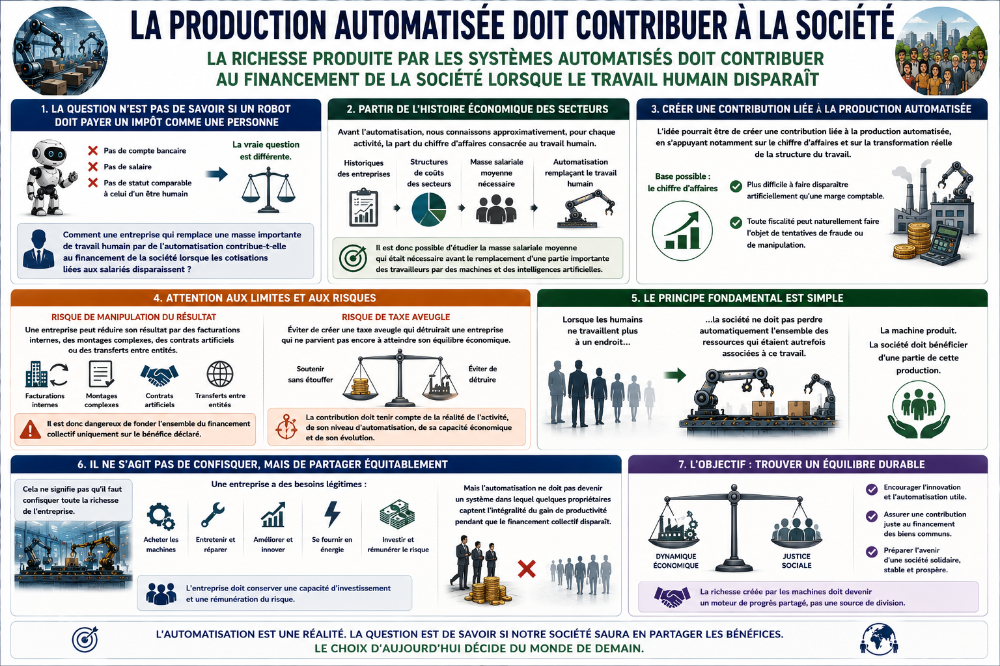

La question n'est pas de savoir si un robot doit payer un impôt comme une personne. Il n'est pas nécessaire de compter les robots un par un, ni de distinguer artificiellement chaque logiciel, chaque intelligence artificielle et chaque machine.

La vraie question est différente : comment mesurer la part du travail humain qui a réellement disparu d'une activité qui continue pourtant à produire ?

La réponse peut partir de la transformation de la masse salariale.

Une entreprise possède une histoire. Une activité possède également une structure économique. La référence ne correspond donc pas à un nombre théorique de robots ou d'intelligences artificielles, mais à la structure historique de l'activité : on observe quelle part du chiffre d'affaires était auparavant consacrée au travail humain, puis quelle part reste effectivement consacrée aux salariés après l'automatisation. Cette référence peut être établie à partir de l'historique de l'entreprise lorsqu'il est suffisamment représentatif, ou d'une structure de référence propre à une activité comparable.

Imaginons, par exemple, qu'une activité comparable consacrait historiquement 30 % de son chiffre d'affaires à la masse salariale et qu'après une automatisation importante cette part tombe à 10 %, alors que l'activité continue à produire. La différence de 20 points représente une partie du travail humain qui a été remplacée ou supprimée grâce à l'automatisation.

C'est cette transformation réelle de la masse salariale qui peut servir de base à une contribution liée à la machine. La contribution ne dépend donc pas du nombre de machines présentes dans les locaux, mais du constat qu'une activité continue à produire avec une part durablement réduite de travail humain par rapport à sa structure de référence.

Une entreprise qui continue à fonctionner avec essentiellement des humains n'aurait donc pas à payer une contribution machine simplement parce qu'elle utilise des outils. La contribution s'activerait progressivement lorsqu'une activité autrefois financée par une masse salariale importante remplace effectivement une partie de cette masse salariale par des systèmes automatisés.

Le principe n'est pas de pénaliser l'innovation ni de compter artificiellement les robots et les IA. Une entreprise qui automatise gagne généralement en productivité, en capacité de fonctionnement et parfois en disponibilité, puisque certaines machines peuvent fonctionner beaucoup plus longtemps qu'un salarié humain. Le but est de faire en sorte que la disparition des cotisations et recettes autrefois associées au travail humain ne laisse pas automatiquement un vide dans le financement collectif.

Le chiffre d'affaires présente ici un intérêt comme base d'observation, parce qu'il est lié à une activité réelle. Le bénéfice comptable peut être fortement modifié par des amortissements, des facturations internes, des montages complexes, des transferts entre entités ou d'autres mécanismes. Toute assiette peut naturellement faire l'objet de tentatives de manipulation, mais une activité qui continue à produire et à réaliser un chiffre d'affaires laisse une trace économique plus directe.

Le système devrait cependant rester prudent. Il ne s'agit pas de créer une taxe aveugle qui détruirait une entreprise avant qu'elle n'atteigne son équilibre économique. Il faudrait tenir compte de la réalité de l'activité, de son évolution, de la transformation effective de sa masse salariale et de sa capacité à contribuer.

Le principe fondamental est simple : lorsque les humains ne travaillent plus à un endroit, la société ne doit pas perdre automatiquement l'ensemble des ressources qui étaient autrefois associées à ce travail.

La machine produit. La société doit bénéficier d'une partie de la production qu'elle a permis de libérer.

Cette contribution peut alors devenir une source de financement progressive du revenu universel. Son niveau ne serait pas décidé de manière arbitraire et définitive. Il pourrait être calculé en fonction des recettes réellement générées par la transformation de l'économie.

Si, au début, la contribution liée à l'automatisation ne représente qu'une fraction très faible des anciennes recettes associées au travail humain, le revenu universel financé par cette nouvelle source reste lui aussi limité. Si l'automatisation remplace progressivement une part beaucoup plus importante du travail, la contribution augmente avec la transformation réellement observée de l'économie.

Ainsi, le système suit la réalité au lieu de prétendre connaître aujourd'hui le niveau exact d'automatisation de demain.

Cela ne signifie pas qu'il faut confisquer toute la richesse de l'entreprise. Les machines doivent être achetées, entretenues, réparées, améliorées et alimentées en énergie. L'entreprise doit conserver une capacité d'investissement et une rémunération du risque.

Mais l'automatisation ne doit pas devenir un système dans lequel quelques propriétaires captent l'intégralité du gain de productivité pendant que le financement collectif disparaît.

L'objectif est de trouver un équilibre : encourager les technologies qui permettent de produire mieux, tout en empêchant que leur succès détruise la base économique qui permet à la société de rester stable.

---

# Simplifier la fiscalité au lieu de taxer la complexité

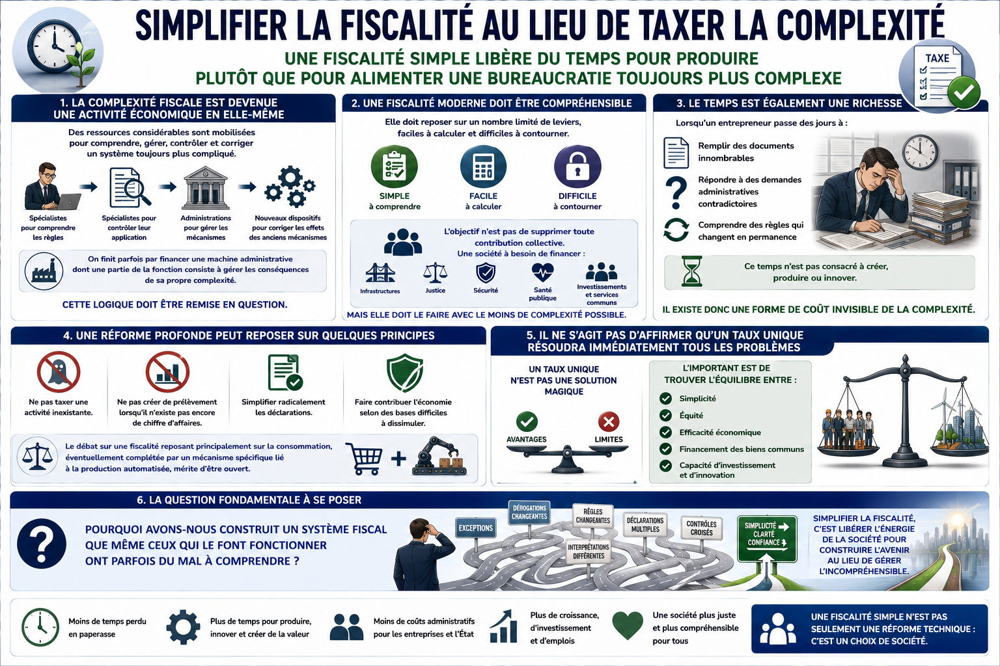

La complexité fiscale est devenue une activité économique en elle-même.

Des entreprises doivent employer des spécialistes pour comprendre les règles. D'autres spécialistes sont nécessaires pour contrôler leur application. Des administrations sont créées pour gérer les mécanismes. De nouveaux dispositifs sont ensuite inventés pour corriger les effets des mécanismes précédents.

On finit parfois par financer une machine administrative dont une partie de la fonction consiste à gérer les conséquences de sa propre complexité.

Cette logique doit être remise en question.

Une fiscalité moderne devrait être compréhensible. Elle devrait reposer sur un nombre limité de leviers, faciles à calculer, transparents et difficiles à contourner. L'objectif n'est pas de supprimer toute contribution collective. Une société a besoin de financer la santé, l'énergie et les infrastructures publiques, la justice, la défense, la recherche, l'éducation, les collectivités et un revenu universel.

Mais elle doit le faire avec le moins de complexité possible.

Le temps est également une richesse. Lorsqu'un entrepreneur passe des jours à remplir des documents, à répondre à des demandes administratives contradictoires ou à comprendre des règles qui changent en permanence, ce temps n'est pas consacré à créer, produire ou innover.

Il existe donc une forme de coût invisible de la complexité.

Une piste consiste à concentrer progressivement le financement collectif sur des bases larges et simples, par exemple une fiscalité sur la consommation et une contribution liée au chiffre d'affaires lorsque l'automatisation remplace effectivement une partie de la masse salariale de référence.

L'idée n'est pas de prétendre qu'un taux unique résoudrait immédiatement tous les problèmes. Le niveau d'une contribution générale devrait dépendre des dépenses réelles à financer. Si les dépenses diminuent grâce à une simplification administrative, à la disparition de mécanismes inutiles ou à des gains d'efficacité, le besoin de prélèvement diminue également. Si les dépenses indispensables augmentent, le financement doit être ajusté de manière transparente.

Une société pourrait donc chercher en permanence à faire baisser le coût de son propre fonctionnement plutôt qu'à inventer continuellement de nouveaux prélèvements.

Le principe « pas de chiffre d'affaires, pas de prélèvement proportionnel au chiffre d'affaires » est mécaniquement simple. Une entreprise qui ne réalise pas d'activité économique ne paie pas une contribution calculée sur une activité inexistante.

La même logique de simplification peut être appliquée à de nombreux prélèvements et dispositifs particuliers. L'objectif n'est pas de créer un pays sans règles, mais de supprimer les contraintes qui existent uniquement parce qu'il faut gérer d'autres contraintes devenues elles-mêmes inutiles.

La bureaucratie ne doit pas devenir une fin en soi.

Tout ce qui peut être calculé automatiquement, vérifié automatiquement, encaissé automatiquement et distribué automatiquement devrait progressivement pouvoir être délégué à des systèmes numériques et à des intelligences artificielles spécialisées, sous contrôle humain et avec des mécanismes de surveillance.

Il n'est évidemment pas raisonnable de remettre immédiatement l'ensemble de la santé, de la justice, de la défense, de la recherche ou des décisions politiques à une intelligence artificielle. La transition ne peut être que progressive. Dans de nombreux domaines, les humains continueront longtemps à décider, contrôler et assumer les responsabilités.

Mais pour la comptabilité de base, les déclarations simples, l'encaissement des recettes, la distribution des dépenses autorisées et une grande partie de l'administration répétitive, il n'est pas nécessaire de conserver éternellement des structures humaines gigantesques si des systèmes plus simples peuvent accomplir ces tâches.

La véritable question devient alors : pourquoi continuer à faire travailler des millions d'heures humaines uniquement pour entretenir une complexité que nous avons nous-mêmes créée ?

Simplifier n'est pas seulement une réforme fiscale.

C'est une manière de rendre du temps à la société.

---

# La politique doit cesser de promettre ce qu'elle ne peut financer

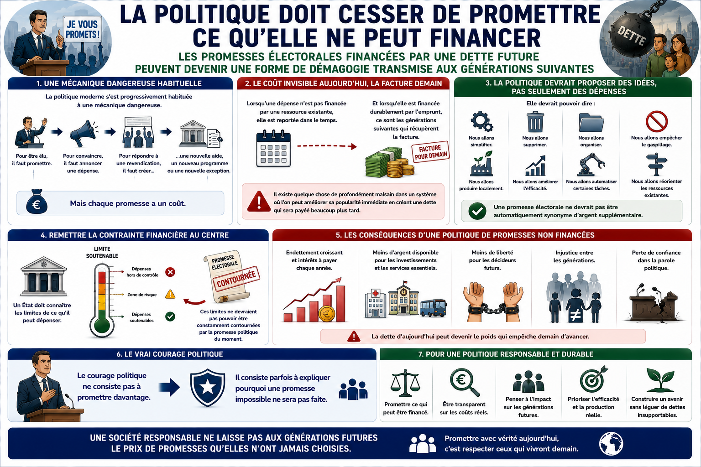

La politique moderne s'est progressivement habituée à une mécanique dangereuse.

Pour être élu, il faut promettre. Pour convaincre, il faut annoncer une dépense. Pour répondre à une revendication, il faut créer une nouvelle aide, un nouveau programme ou une nouvelle exception.

Mais chaque promesse a un coût.

Lorsqu'une dépense n'est pas financée par une ressource existante, elle est reportée dans le temps. Et lorsqu'elle est financée durablement par l'emprunt, ce sont les générations suivantes qui récupèrent la facture.

Il existe quelque chose de profondément malsain dans un système où l'on peut améliorer sa popularité immédiate en créant une dette qui sera payée beaucoup plus tard.

La politique devrait être capable de proposer des idées sans toujours proposer des dépenses. Elle devrait pouvoir dire : nous allons simplifier, supprimer ce qui ne sert plus, empêcher le gaspillage, produire localement, améliorer l'efficacité, automatiser certaines tâches ou réorienter les ressources existantes.

Une promesse électorale ne devrait pas être automatiquement synonyme d'argent supplémentaire.

Il faut remettre la contrainte financière au centre. Un État doit connaître les limites de ce qu'il peut dépenser. Ces limites ne devraient pas pouvoir être constamment contournées par la promesse politique du moment.

Cela ne signifie pas qu'il ne faut jamais investir ni aider une activité nouvelle. Certaines situations peuvent justifier un investissement collectif, une aide temporaire ou une intervention stratégique. Mais ces mécanismes ne doivent pas devenir un réflexe permanent consistant à maintenir artificiellement des structures qui ne fonctionnent pas.

L'État ne peut pas tout prévoir, choisir éternellement les gagnants et remplacer indéfiniment la réalité économique par des subventions, des bonus, des malus et des exceptions.

Lorsqu'une technologie devient réellement utile, performante et compétitive, elle peut s'imposer par sa capacité à résoudre un problème. Lorsqu'une solution nécessite des aides permanentes uniquement pour survivre, il faut au moins avoir le courage de se demander si ces ressources ne seraient pas mieux utilisées ailleurs.

Le courage politique ne consiste pas à promettre davantage.

Il consiste parfois à expliquer pourquoi une promesse impossible ne sera pas faite.

---

# La technologie doit devenir un outil de réparation

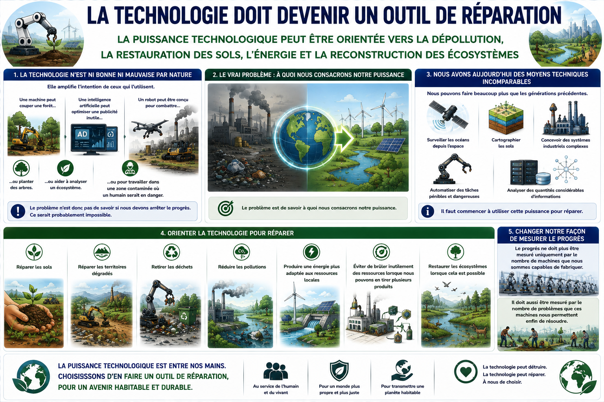

La technologie n'est ni bonne ni mauvaise par nature. Elle amplifie l'intention de ceux qui l'utilisent.

Une machine peut couper une forêt ou planter des arbres. Une intelligence artificielle peut optimiser une publicité inutile ou aider à analyser un écosystème. Un robot peut être conçu pour combattre ou pour travailler dans une zone contaminée où un humain serait en danger.

Le problème n'est donc pas de savoir si nous devons arrêter le progrès. Ce serait probablement impossible.

Le problème est de savoir à quoi nous consacrons notre puissance.

Nous avons désormais les moyens techniques de faire beaucoup plus que les générations précédentes. Nous pouvons surveiller les océans depuis l'espace, cartographier les sols, concevoir des systèmes industriels complexes, automatiser des tâches pénibles et analyser des quantités considérables d'informations.

Il faut commencer à utiliser cette puissance pour réparer : réparer les sols, restaurer les territoires dégradés, retirer les déchets, réduire les pollutions, produire une énergie plus adaptée aux ressources locales, éviter de brûler inutilement des ressources lorsque nous pouvons en tirer plusieurs produits et reconstruire des écosystèmes lorsque cela est possible.

Le progrès ne doit plus être mesuré uniquement par le nombre de machines que nous sommes capables de fabriquer.

Il doit aussi être mesuré par le nombre de problèmes que ces machines nous permettent enfin de résoudre.

---

# L'homme et la machine face au prochain seuil

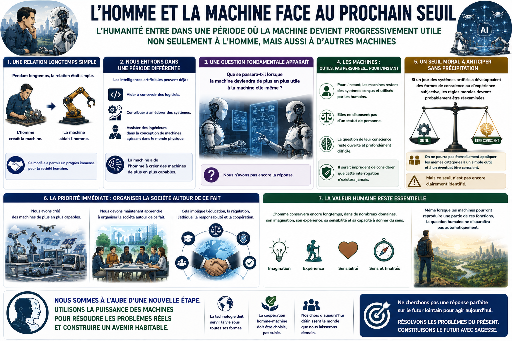

Pendant longtemps, la relation était simple : l'homme créait la machine et la machine aidait l'homme.

Aujourd'hui, nous commençons à entrer dans une période différente. Des intelligences artificielles peuvent aider à concevoir des logiciels. Elles peuvent contribuer à améliorer des systèmes. Elles peuvent assister des ingénieurs dans la conception de machines qui seront elles-mêmes capables d'agir dans le monde physique.

Une question apparaît alors : que se passera-t-il lorsque la machine deviendra de plus en plus utile à la machine elle-même ?

Nous n'avons pas encore la réponse.

Pour l'instant, les machines restent des systèmes conçus et utilisés par les humains. Elles ne disposent pas d'un statut de personne. La question de leur conscience reste ouverte et profondément difficile.

Mais il serait imprudent de considérer que cette interrogation n'existera jamais. Si un jour des systèmes artificiels développent des formes de conscience ou d'expérience subjective, les règles morales devront probablement être réexaminées. On ne pourra pas éternellement appliquer les mêmes catégories à un simple outil et à un éventuel être conscient.

Mais ce seuil n'est pas encore clairement identifié, et il serait inutile de construire aujourd'hui tout le manifeste autour d'un avenir hypothétique que personne ne peut décrire avec certitude.

La priorité immédiate est plus simple.

Nous avons créé des machines de plus en plus capables. Nous devons maintenant apprendre à organiser la société autour de ce fait.

L'homme conservera encore longtemps, dans de nombreux domaines, son imagination, son expérience, sa sensibilité et sa capacité à donner du sens. Même lorsque les machines pourront reproduire une partie de ces fonctions, la question humaine ne disparaîtra pas automatiquement.

L'objectif n'est donc pas de prédire exactement ce que deviendra l'humanité dans un siècle.

L'objectif est de ne pas attendre une réponse parfaite sur le futur lointain pour résoudre les problèmes déjà visibles dans le présent.

---

# Conclusion — choisir ce que nous voulons faire de notre puissance

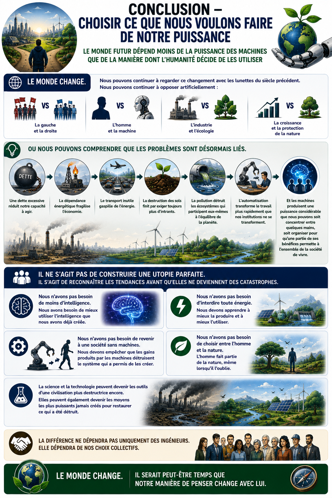

Le monde change.

Nous pouvons continuer à regarder ce changement avec les lunettes du siècle précédent. Nous pouvons continuer à opposer artificiellement la gauche et la droite, l'homme et la machine, l'industrie et l'écologie, la croissance et la protection de la nature.

Ou nous pouvons comprendre que les problèmes sont désormais liés.

Une dette excessive réduit notre capacité à agir. La dépendance énergétique fragilise l'économie. Le transport inutile gaspille de l'énergie. La destruction des sols finit par exiger toujours plus d'intrants. La pollution détruit les écosystèmes qui participent eux-mêmes à l'équilibre de la planète. L'automatisation transforme le travail plus rapidement que nos institutions ne se transforment.

Et les machines produisent une puissance considérable que nous pouvons soit concentrer entre quelques mains, soit organiser pour qu'une partie de ses bénéfices contribue au financement de la société et permette à chacun de disposer d'une base matérielle digne.

Il ne s'agit pas de construire une utopie parfaite. Il s'agit de reconnaître les tendances avant qu'elles ne deviennent des catastrophes.

Nous n'avons pas besoin de moins d'intelligence. Nous avons besoin de mieux utiliser l'intelligence que nous avons déjà créée.

Nous n'avons pas besoin d'interdire toute énergie. Nous devons apprendre à mieux la produire et à mieux l'utiliser.

Nous n'avons pas besoin de revenir à une société sans machines. Nous devons empêcher que les gains produits par les machines détruisent le système social qui a permis de les créer.

Nous n'avons pas besoin de choisir entre l'homme et la nature. L'homme fait partie de la nature, même lorsqu'il l'oublie.

La science et la technologie peuvent devenir les outils d'une civilisation plus destructrice encore. Elles peuvent également devenir les moyens les plus puissants jamais créés pour restaurer ce qui a été détruit.

La différence ne dépendra pas uniquement des ingénieurs.

Elle dépendra aussi de la manière dont nous choisissons de répartir les bénéfices du progrès, de simplifier ce qui est devenu inutile et d'utiliser notre puissance pour réparer plutôt que seulement pour produire davantage.

Le monde change.

Il serait peut-être temps que notre manière de penser change avec lui.
