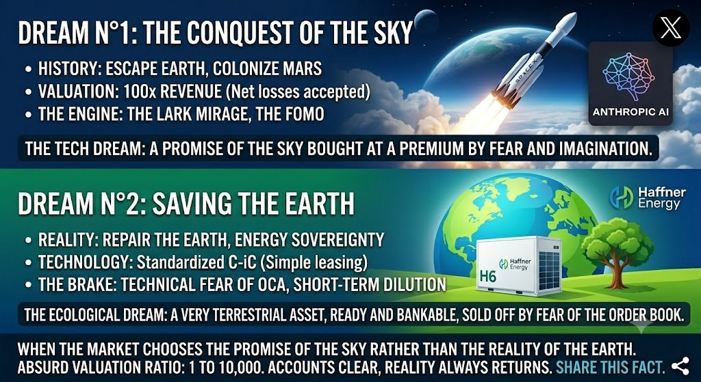
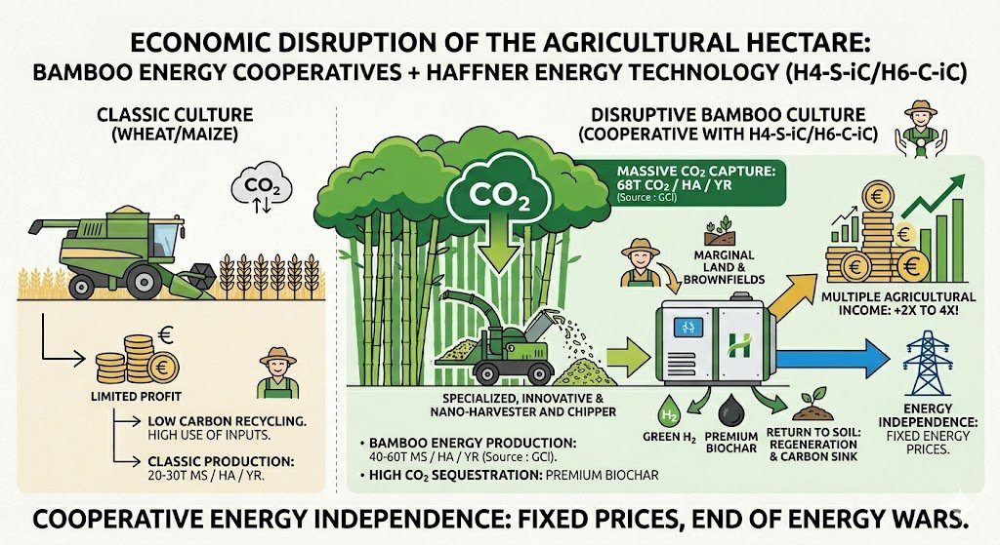
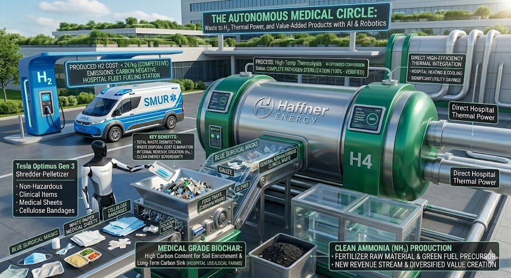
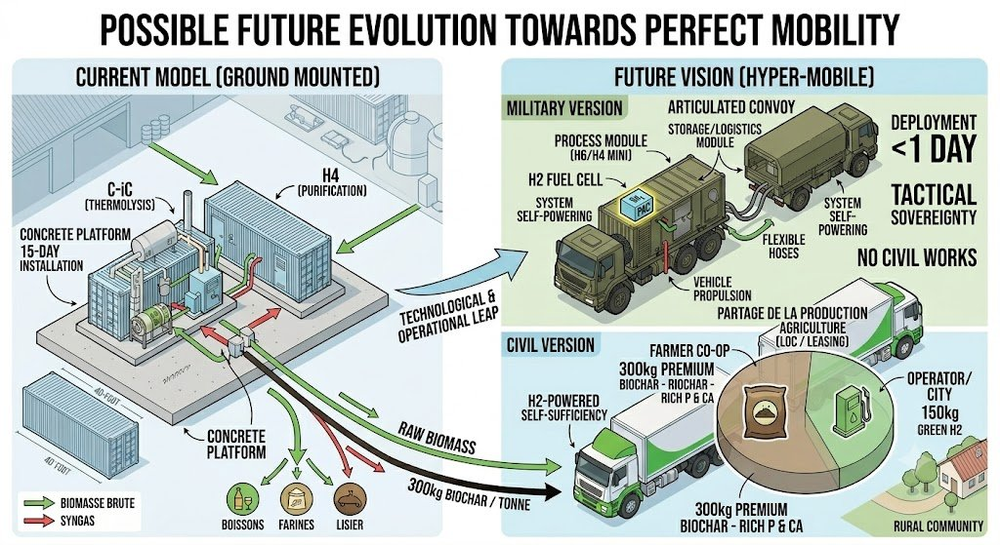
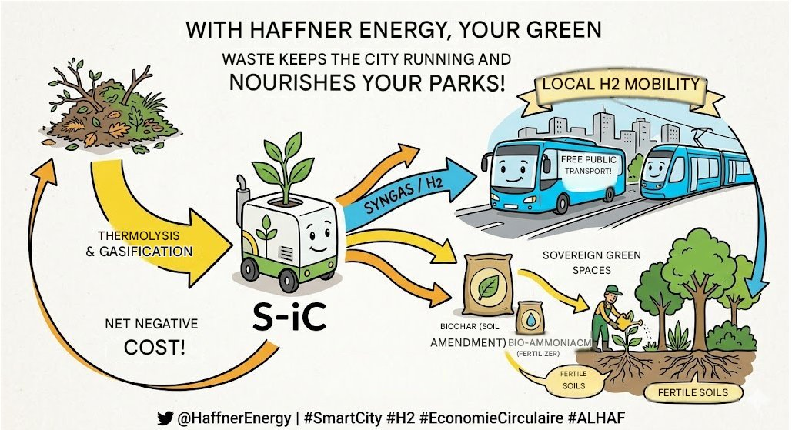
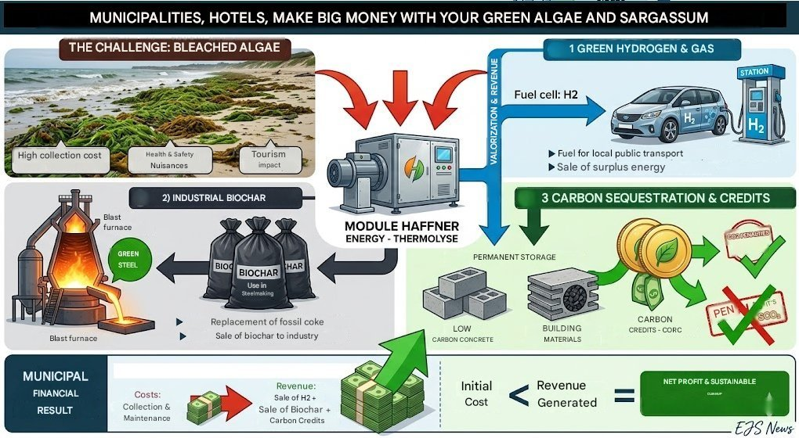
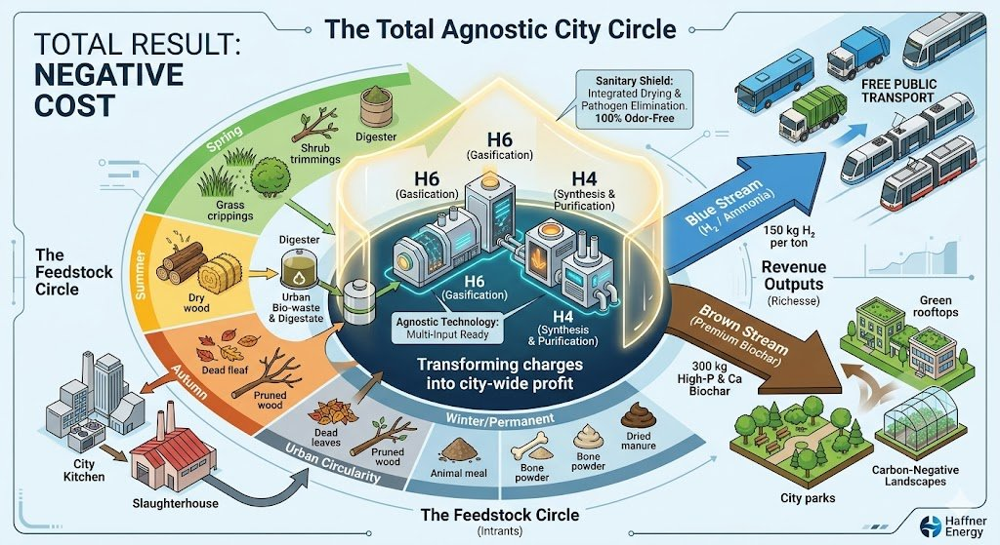

# MANIFESTO FOR TECHNOLOGICAL SOVEREIGNTY AND RESILIENCE [(Version française - FR)](manifeste_souverainete_technologique_v3_FR.md)

*Toward a national ecosystem of energy, health, and agricultural autonomy*

📥 [Read the Manifesto for Technological Sovereignty and Resilience](README.md)

Independent Strategic Note - EJS - June 2026

> **Transparency note:** This text advocates for a specific technology, the thermolysis process developed by Haffner Energy, in which the author is an individual shareholder. It is not investment advice but an argued analysis, published in a spirit of transparency: the author fully acknowledges the position taken in this text, which he considers justified by the company's technological lead and the number of patents it holds in this field.

## I. Assessment: industrial sovereignty under pressure

France is going through a period of strategic tension, marked by a growing gap between its innovation capacity and its industrial reality. Between administrative heaviness and short-term steering, several of our industrial flagships struggle to scale up. This assessment deserves to be stated plainly: our nation, historically a pioneer in engineering and energy, risks losing part of its technological mastery if nothing changes.

While some of our SMEs carrying major technological breakthroughs face strong financial pressure, avoidable difficulties, or choose to relocate to more welcoming markets, patents and know-how are being exported to foreign powers quicker to seize tomorrow's technologies.

The current energy model relies largely on centralized grids and on technologies such as electrolysis powered by fossil or nuclear energy — hydrogen that then finds itself in direct competition with artificial intelligence, cryptocurrencies, or industry for access to electricity. This choice contributes to inflation, puts heavy strain on our financial resources, and saturates our electrical infrastructure. Grid-based electrolysis acts as a bottleneck on an electrical infrastructure already under pressure from the massive electrification of usage.

This strategy weakens our economy and burdens our ability to support the future development of artificial intelligence and robotics, which will require massive, decentralized, and ideally sovereign power availability. Every terawatt-hour devoted to electrolysis is one terawatt-hour less for supercomputers and French digital sovereignty. A technological breakthrough could ease this constraint.

Sovereignty is not decreed; it is built on mastery of the value chain, from waste to resource, from atom to machine. It is becoming necessary to restore an industrial sovereignty that relies less on unstable foreign solutions, and more on the smart, local valorization of our biomass and energy resources.

We stand at a pivotal moment: continue on the current trajectory at the risk of seeing our capacity to bounce back erode, or take charge of our technological and energy destiny through the deployment of decentralized thermolysis systems.

## II. The Solution: high-yield decentralized biomass thermolysis

**The thermodynamic challenge: the limits of so-called clean energy in the face of the urgency to sequester carbon**

A frequent blind spot in current energy policies is overlooking a basic point of thermodynamics. Massively deploying electrolysis based on nuclear power or poorly offset fossil-derived hydrogen is not enough to solve the climate crisis if, in parallel, the atmosphere is not being decarbonized. Any massive energy production, even labeled as clean, structurally generates dissipated anthropogenic heat. Yet as long as the historical stock of CO₂ remains in the atmosphere, it traps part of that heat near the surface. Consuming ever more energy in a system already saturated with carbon, without simultaneously creating a carbon sink, poses a genuine physical problem.

The rise of generative artificial intelligence and heavy robotics will amplify this phenomenon: the growing use of computing power and machine fleets will create unprecedented energy demand, making it all the more urgent to evolve the underlying energy infrastructure.

In this context, the thermolysis technology developed by Haffner Energy is one of the few industrial architectures to date capable of addressing this dual constraint: producing competitive energy while extracting and durably sequestering carbon in the form of solid biochar. It aims not merely to be carbon neutral, but carbon negative. It also gives a useful role to robotics: rather than simply consuming energy, tomorrow's automated systems could collect and sort plastic and organic waste to feed these transformation modules — producing synthetic fuels and hydrogen at a competitive cost compared to fossil fuels, while reducing pollution.

Thermolysis technology could form the pillar of a new model in which every territory — from the urban neighborhood to the agricultural cooperative — stops being a mere consumer and becomes a producer of its own energy independence.

**1. Multi-stream energy and chemical production: less waste**

This system transforms "waste," which today costs money to bury or burn, into a valuable raw material. Through controlled thermolysis, organic matter is broken down to extract a range of useful products:

- **On-site hydrogen:** produced directly at the point of consumption (the local production station can also serve as a hydrogen refueling station), reducing losses linked to transport and high-pressure storage. This on-site production can power heavy mobility fleets — emergency medical vehicles, buses, trains, trams, trucks — strengthening the autonomy of local services.

- **Biomethane and SAF (Sustainable Aviation Fuel):** the technology can produce high-energy-density sustainable fuels, useful for both civilian transport and aviation needs. A direct thermodynamic shortcut from solid to synthesis gas avoids some of the less efficient conversion cascades found in other biofuel pathways (such as AtJ or e-SAF).

- **Decentralized synthetic chemistry:** the process also opens the way to local ammonia production from biomass waste, a key component of fertilizers. By bringing this synthesis closer to farms through cooperatives, farmers become less exposed to the volatility of global natural gas prices.

**2. Enriched biochar, an asset for soil and for regulation**

By recovering phosphorus, calcium, and trace elements contained in organic residues (canteen leftovers, hospital waste), thermolysis produces a quality biochar that can restore the biological structure of depleted or arid soils, curb desertification, and act as a stable long-term carbon sink.

At the European regulatory level, biochar offers the State an interesting compliance lever. By recording these volumes of sequestered carbon (CORC credits) in France's National Low-Carbon Strategy (PNIEC), the country could reduce its carbon debt and limit penalties tied to missing carbon-sink targets.

By unifying these streams, thermolysis does more than produce energy: it connects economy, agriculture, and public health. Each unit installed becomes a building block of territorial autonomy.

**3. Security and territorial resilience: hospitals and communities at the heart of autonomy**

Sovereignty also rests on a nation's ability to maintain essential services under any circumstances. By combining thermolysis with automation, it becomes possible to strengthen the energy, ecological, and health resilience of our critical infrastructure.

- **Hospital-City hubs: the autonomous, circular hospital:** hospitals could reduce their grid dependence by combining thermolysis with robotic automation for internal logistics (collection and sorting of hospital and urban organic waste). The energy produced would power operating rooms, while recovered heat would serve to heat buildings or produce cooling for storing medicines and vaccines and running morgues — while reducing staff exposure to infectious waste.

- **Tactical military mobility:** the logistical vulnerability of armed forces often lies in their dependence on fuel resupply. Miniaturized thermolysis modules, transportable on mobile platforms, could allow a detachment to draw energy from local biomass or its own waste, reducing dependence on logistics convoys.

- **Pollution reduction and public health:** by progressively replacing systematic incineration, a source of air pollution, thermolysis reduces emissions of fine particles and toxic compounds linked to fossil combustion. This is an environmental gain, but potentially also a public health gain, by reducing certain respiratory and cardiovascular conditions linked to air pollution.

    

    

- **Risk prevention:** today, maintaining certain land is held back by its cost, which can contribute to wildfires. Brush clearing could become a paying activity if the harvested biomass feeds high-yield modules, producing valuable hydrogen and biochar.

## III. Economic outlook: a lever for budgetary restructuring

The decentralized thermolysis model goes beyond a technical feat: it is a potentially significant lever for national budgetary restructuring. Our current system remains largely exposed to fluctuations in global energy markets and to rising waste-treatment costs. Deploying this technology could act on three macroeconomic levers:

- **Reducing fossil fuel imports and improving the trade balance:** by valorizing our own resources — agricultural biomass, forestry deposits, municipal waste — France would reduce its financial transfers abroad for fossil energy purchases. France's energy bill runs between €60 and €80 billion each year, a major cause of the trade deficit. Adding the €3 billion in fertilizer and ammonia imports tied to fossil gas, substituting these imports with decentralized thermochemical production and becoming a net exporter of biochar (CORC credits) could improve the trade balance by €30 to €40 billion per year.

- **Impact on GDP and public debt:** every euro not spent on fossil energy purchases potentially stays invested in the real economy of the territories, which could generate a gain of 1.5 to 2 GDP points annually and new tax revenue without increasing the tax burden on households.

- **Social impact: jobs and public health:** the modular 2 to 5 MW architecture favors a local industrial network, with the potential for 50,000 to 80,000 non-relocatable jobs across the territories. Progressively replacing mass incineration with thermolysis could also reduce the financial burden of certain respiratory conditions on the Social Security budget.

    

- **Deployment flexibility:** the modular system (2 to 5 MW), mobile, requiring no heavy foundation, operational in about 3 weeks, offers financial adaptability (leasing, direct purchase, territorial cooperatives) that could facilitate access to energy independence for different types of actors.

- **Turning waste into assets:** this technology transforms a cost (waste treatment) into a source of revenue (energy, fertilizer), economic value that would stay captured locally rather than being spent on costly disposal processes.

**Reference technical and economic data (C-iC H6 Module)**

| Parameter | Detail |
|---|---|
| **Thermochemical power** | Decentralized modular unit, 2 MW to 5 MW nominal. |
| **Single-line output** | Continuous production of 60 kg of ultra-pure hydrogen (H2) per hour per base C-iC module. |
| **Conversion efficiency** | 75% to over 80% overall energy efficiency (solid → usable gas), with no biochemical cascade. |
| **Feedstock & consumption** | ~1 tonne of raw biomass/hour (wheat straw, forestry residue, Class B wood, algae, dried SRF — 140 types tested). Auto-thermal process, no significant electrical draw from the grid. |
| **Estimated initial CAPEX** | €2 to 5 million per containerized engineering module depending on desired fuel output (syngas, H2, biomethane, SAF...). Factory assembly, installation in under one month with no civil engineering works. |
| **Target net OPEX** | Cost below €2/kg of high-purity hydrogen or fuel equivalent, amortization included and balanced by co-product valorization. |
| **Valorized co-product** | Production of 200 kg of solid biochar per tonne of biomass (agricultural amendment and CORC carbon sequestration credits). |

## IV. Call to action

Several measures could accelerate a responsible deployment of this technology:

- **A strategic asset audit:** an inventory of breakthrough technology SMEs whose know-how is critical, along with measures to protect them from excessive financial pressure and help them scale up industrially. A mechanism to guard against certain destabilizing financing practices (misuse of OCEANE bonds or warrants, massive short-selling) could help stabilize the governance of these companies and protect the savings of investors holding shares in PEA-PME accounts.

- **A reform of financing tools:** loosening certain restrictions that limit support from institutions like BPI for strategic companies in periods of risk, on the basis that financing technologies vital to the nation constitutes a long-term strategic investment.

- **An accelerated regulatory framework for sovereignty projects:** the current complexity of zoning or ICPE (classified installation) procedures imposes delays of 18 to 24 months before commissioning. A "fast-track" mechanism, with provisional operating authorizations granted in under 3 months for modular installations coupled with critical infrastructure (hospitals, logistics bases, agricultural cooperatives), could speed up these deployments without compromising on safety requirements.

- **Greater priority in public procurement:** if this technology's performance is confirmed at scale, a progressive systematization of its deployment in critical infrastructure (hospitals, military logistics bases, priority agricultural zones) could create a driving effect to help conquer export markets.

## Conclusion

One strength of this technology lies in its indifference to feedstock type. Unlike first-generation biofuel pathways, which compete directly with food-producing farmland, or heavy biomass projects that put pressure on forest cover, the decentralized thermolysis model relies on unvalorized residual deposits: cereal straw, forestry residue, end-of-life recovered wood (Class B), urban biowaste, and solid recovered fuel (SRF). The exploitable national deposit amounts to tens of millions of tonnes per year — a resource currently seen as a burden, which this technology turns into an asset, without additional pressure on food or forest sovereignty.

  

  

Decentralized dry thermolysis is not presented as just another alternative, but as one possible building block of long-term resilience. Repairing our environment with the tools of engineering seems, in my view, a more workable near-term path than space exploration for addressing today's energy and climate challenges. France has the resources and the know-how to drive this transition; what remains is the political and industrial will to fully embrace it.

---

## 📚 Additional sector-specific analyses

This manifesto has been developed into targeted technical notes for different audiences:

- 🏥 [Data centers and Artificial Intelligence: Toward a single virtuous scenario](analyses/Datacenters_et_Intelligence_Artificielle_-_le_seul_scenario_vertueux.md)
- 🏥 [The autonomous, circular hospital: thermolysis in the service of health resilience](analyses/HOPITAL_AUTONOME_DECARBONATION_ET_ENERGIE_VERTE_SOLUTION_THERMOLYSE_HAFFNER_ENERGY.md)
- 🪖 [Tactical energy autonomy: defense and military sovereignty](analyses/AUTONOMIE_ENERGETIQUE_TACTIQUE_DEFENSE_SOUVERAINETE_MILITAIRE.md)
- 🌾 [Hydrogen independence within reach of every territory (local authorities, rural officials)](analyses/L_INDEPENDANCE_EN_HYDROGENE_A_PORTEE_DE_CHAQUE_TERRITOIRE_COLLECTIVITES_ELUS_RURAUX.md)
- ✈️ [Haffner Energy SAF: an immediate French solution for aviation decarbonization](analyses/LE_SAF_HAFFNER_ENERGY_UNE_SOLUTION_FRANCAISE_IMMEDIATE_POUR_LA_DECARBONATION_DE_L_AVIATION.md)
- 🇫🇷 [Haffner Energy: France letting its energy revolution move abroad](analyses/REVOLUTION_ENERGETIQUE_ET_ABANDON_DE_SOUVERAINETE_NATIONALE.md)
- 📊 [Global energy source comparison: why Haffner Energy thermolysis changes everything](analyses/COMPARAISON_SOURCES_ENERGIE_THERMOLYSE_HAFFNER_ENERGY.md)
- 🌡️ [Climate ranking of energy sources: anthropogenic heat included](analyses/CLASSEMENT_CLIMATIQUE_SOURCES_ENERGIE_CHALEUR_ANTHROPIQUE.md)

---

**Disclaimer:** *This strategic note is an independent contribution to the public debate on industrial and energy sovereignty. The author expresses personal opinions based on publicly available data and does not act on behalf of the company mentioned. As an individual shareholder, this text is shared in a spirit of transparency, for informational and macroeconomic analysis purposes only. It does not constitute investment advice, an incitement to buy, or a stock market recommendation.*
