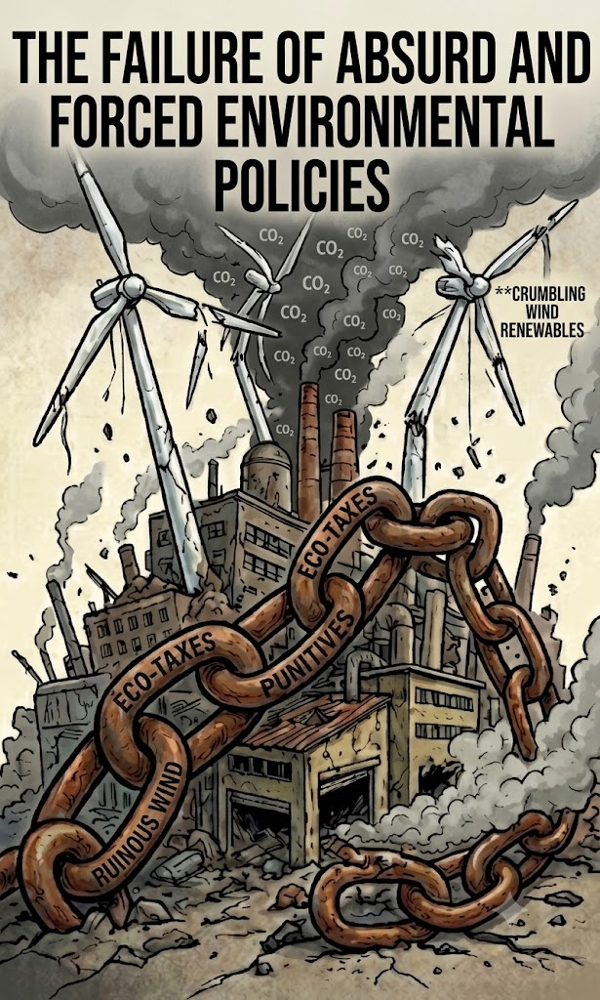
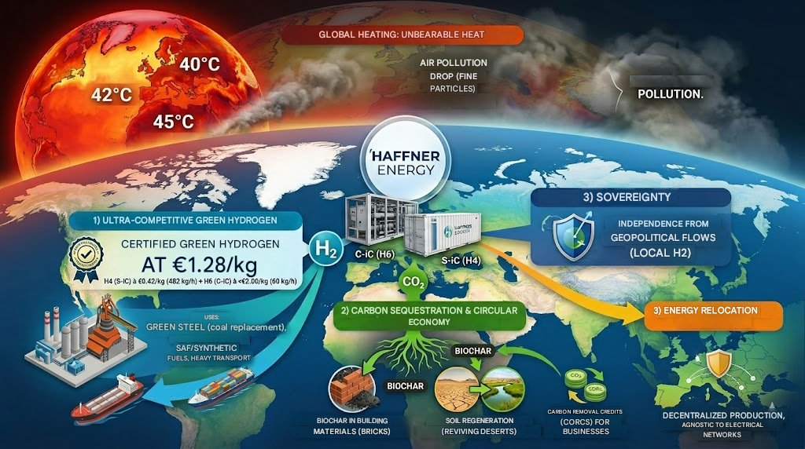
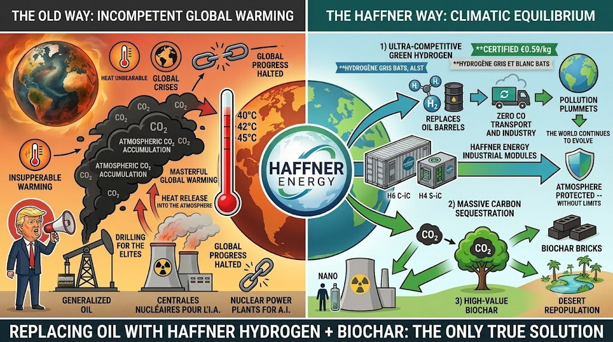
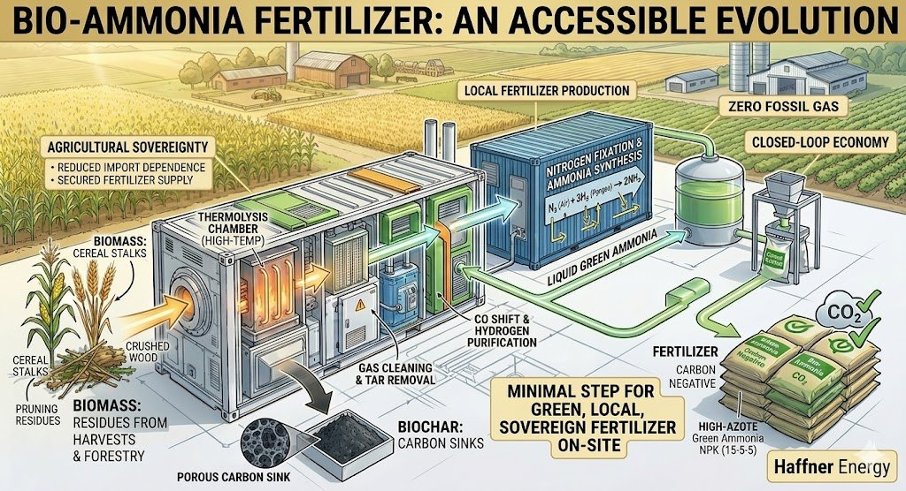
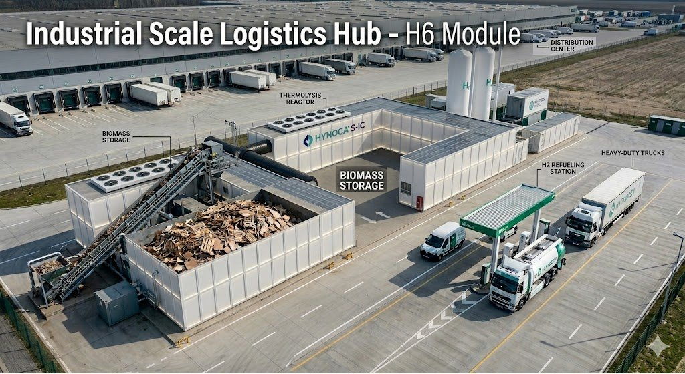
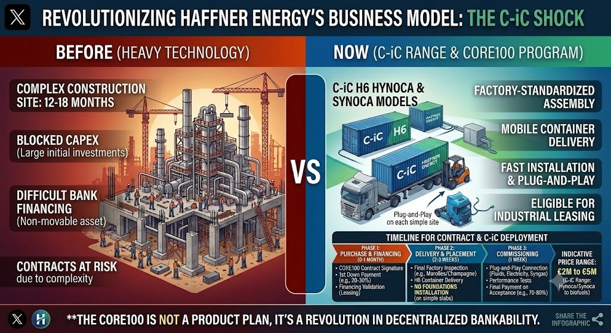

# MANIFESTO FOR TECHNOLOGICAL SOVEREIGNTY AND RESILIENCE

*Towards a National Ecosystem of Energy, Health and Agricultural Autonomy*

Independent Strategic Note - EJS - June 2026

**I. Observation: The Silent Erosion of Our Sovereignty**

France is going through a major strategic crisis, marked by a growing gap between its technological innovation capabilities and its industrial reality. Under the guise of administrative orthodoxy and short-term management, we are sacrificing our industrial flagships on the altar of bureaucracy. The observation is clear: our nation, historically a pioneer in engineering and energy, is losing its technological mastery.

While our high-value SMEs, carriers of major breakthroughs, are subjected to fierce financial predation, avoidable bankruptcies or forced exile to more welcoming lands, our patents are being captured by foreign powers. These nations, more pragmatic, have understood the urgency of appropriating tomorrow’s technologies while we abandon them at the highest level due to a lack of strategic vision.

The energy model we currently follow is, in many respects, a financial and ecological dead end. Based on excessive dependence on centralized networks and blind trust in non-ecological technologies such as electrolysis produced with fossil or nuclear energies — so that this hydrogen ends up competing with artificial intelligences, cryptocurrencies or industry — this system creates inflation, exhausts our financial resources and saturates our electrical infrastructure. Grid electrolysis acts as a bottleneck that congests a national electrical infrastructure already saturated by the massive electrification of uses. By favoring solutions that consume precious energy instead of generating it intelligently, we enter a vicious circle in the name of a fake ecology.

This strategy weakens not only our economy, but also mortgages our ability to support the future development of artificial intelligence and robotics, which will require massive, decentralized and, above all, sovereign available power. Every terawatt-hour wasted in electrolysis is a terawatt-hour taken from supercomputers and France’s digital sovereignty. It is time to end this blindness that promotes our industrial decline through an immediate and radical technological breakthrough.

Complacency is no longer an option. We can no longer afford to let our engineers and entrepreneurs be the architects of others’ prosperity. Sovereignty is not decreed; it is built on mastery of the value chain, from waste to resource, from the atom to the machine. It is imperative to restore industrial sovereignty that no longer relies on the importation of fragile, unstable foreign solutions that create dependence and wars, but on the local and intelligent valorization of our biomass and our energy deposits.

We are at a crossroads: either we continue to watch our rebound capabilities erode until collapse, or we regain, starting today, full control of our technological and energy destiny through the massive deployment of decentralized thermolysis systems.

**II. The Solution: High-Yield Decentralized Biomass Thermolysis**

**The Global Thermodynamic Trap: The Illusion of Clean Energies in the Face of the Urgency of Carbon Sinks**

The major conceptual error of current energy policies lies in forgetting the most basic laws of thermodynamics. Massively deploying electrolysis based on nuclear power or poorly compensated fossil-origin hydrogen does nothing to solve the climate crisis if we continue to saturate the atmosphere with thermal vectors without decarbonizing in parallel. Any massive energy production, even labeled as clean, structurally generates dissipated anthropic heat that warms the Earth’s envelope. As long as the historical CO₂ stock remains in the atmosphere, it acts as a locked greenhouse, preventing this heat from escaping into space. Wanting to consume ever more energy in a carbon-saturated system without simultaneously creating carbon sinks is a physical aberration.

In this regard, the imminent arrival of generative artificial intelligence and heavy robotics will act as an exponential accelerator of this phenomenon. This technological baby drill — the frenzied, global and reckless use of computing power and machine fleets — will create an unprecedented energy pull in human history, leading the Earth toward an irreversible ecological impasse if the underlying infrastructure remains unchanged.

In this context of absolute tension, the thermolysis technology developed by Haffner Energy stands out as the only industrial architecture in the world capable of solving this dual equation simultaneously: it generates clean, highly competitive energy while extracting and permanently sequestering carbon in the form of solid biochar. It is not content with being neutral; it is carbon negative. It finally gives a virtuous mission to the robotic revolution: instead of saturating the grids, tomorrow’s automated systems and robots must be put to the service of active planetary depollution — notably by collecting and sorting our millions of tons of plastic and organic waste to feed these transformation modules. This is how we will produce synthetic fuels and hydrogen at a cost lower than fossil energies, while actively healing the biosphere.

Thermolysis technology constitutes the pillar of a new model of society, a paradigm where every territory — from the urban district to the agricultural cooperative — ceases to be a simple passive consumer to become its own producer of independence. It is not just an energy alternative; it is an ecological architecture of perfect autonomy producing cleanly and massively at prices close to fossil fuels.

**1. Multi-Stream Energy and Chemical Production: The End of Waste**

This system radically transforms “waste,” which no longer costs anything to landfill or burn, into a raw material of sovereign wealth. Through a controlled thermolysis process, organic matter is broken down to extract a full range of strategic products:

- **Local Hydrogen:** By producing hydrogen directly at the point of consumption (the local production station is also a hydrogen refueling station for vehicles), we eliminate losses related to transport and high-pressure storage. This on-site production makes it possible to instantly supply heavy mobility fleets, such as SAMU vehicles, buses, trains, trams, trucks... guaranteeing total autonomy of local services and abolishing the notions of national logistical chains and dependence on OPEC.

- **Biomethane and SAF (Sustainable Aviation Fuel):** The technology makes it possible to generate high-energy-density sustainable fuels. These vectors are essential to ensure the strategic autonomy of our transport infrastructures, whether to support the civilian logistical network or to secure the aeronautical fuel needs of our air forces. Through a direct thermodynamic shortcut from solid to syngas, it avoids the inefficient conversion cascades of competing biofuel pathways (such as AtJ or e-SAF).

- **Decentralized Synthetic Chemistry:** The process also opens the way to local production of ammonia from biomass waste, a fundamental component of fertilizers. By mastering this synthesis as close as possible to farms via cooperatives, we break the monopoly of global markets and the influence of foreign powers on our food security. Our farmers will no longer be at the mercy of natural gas price volatility.

**2. Enriched Biochar, Black Gold of Soils and Regulatory Asset**

This is where the loop closes through very significant decarbonization of the atmosphere. By methodically recovering phosphorus, calcium and trace elements contained in organic residues (whether cafeteria leftovers or hospital waste), the thermolysis technique produces high-quality biochar. This product does more than amend soils: it transforms them. It durably restores the biological structure of depleted lands or arid zones, acts as a nutrient sponge, effectively fights desertification and, above all, becomes a solid and stable carbon sink for centuries to come.

On the European regulatory level, biochar offers the State a unique lever for compliance. By including these volumes of high-quality sequestered carbon (CORC credits) in its National Integrated Energy-Climate Plan (PNIEC), France erases its carbon debt and avoids the colossal financial penalties from Brussels for failing to meet carbon sink targets.

We are no longer content with polluting less by avoiding bacteria nests and fine particles; we are actively restoring the fertility of our planet. By unifying these flows, thermolysis does more than generate energy: it recreates coherence between the economy, the land and public health. Every unit installed on the territory becomes a link in the reconstruction of our national autonomy.

**3. Global Security and Resilience: The Hospital and the Territory at the Heart of Autonomy**

True sovereignty rests on a nation’s ability to maintain its essential services, even under the pressure of state incompetence, systemic refusal of artificial intelligence or debt. By integrating thermolysis with cutting-edge automation, we transform our critical infrastructures into real energy, ecological and health fortresses.

- **Hospital-City Hubs: The Autonomous and Circular Hospital:** The hospital, the nerve center of our healthcare system, must cease to be a fragile dependence on the grid. By coupling thermolysis technology with robotic automation (a robot of the Optimus type can handle it), we create a closed circuit of unequaled efficiency. Robots take charge of complex internal logistics: they collect and sort, with surgical precision and safety, hospital and urban organic waste. These materials are routed in real time to the integrated thermolysis unit on site. The result is total self-sufficiency: the energy produced powers operating theaters, while the waste heat generates, via absorption machines, the heating of buildings or the cold necessary for the storage of medicines, vaccines and the operation of morgues. This system protects healthcare personnel from the risks of handling infectious waste and ensures continuity of care, regardless of external hazards.

- **The Military Mobility Revolution: Miniaturization at the Service of Tactical Autonomy:** The vulnerability of armed forces too often lies in their lifelines: constant fuel resupply. The miniaturization of thermolysis modules could radically change the situation. Capable of being transported on mobile platforms, these very low CAPEX systems allow a military detachment to extract its energy from biomass encountered in the field or from waste generated by the unit itself. By freeing itself from logistical convoys, priority targets of the enemy, our forces gain unprecedented operational agility. This is the end of dependence on external oil flows; it is, on the battlefield, the guarantee of autonomy and operational superiority.

- **Depollution and Public Health: An Economy of the Living:** It is time to break with the archaic methods of systematic incineration, responsible for chronic air pollution that weighs heavily on our healthcare system. Thermolysis, by treating biomass waste through controlled thermal transformation, significantly eliminates the emission of fine particles and toxic compounds associated with fossil combustion. The ultra-pure hydrogen produced powers the economy. This is not only an environmental gain, it is a major public health measure. By agreeing to clean the air of our cities and eliminate sources of local pollution, we reduce respiratory and cardiovascular pathologies, generating massive structural savings for our public health system. By healing our environment, we heal ourselves and durably lighten the financial burden on the national budget.

- **Risk Prevention: Insurance Costs in Free Fall:** Today, many lands are not maintained because of the cost involved. These negligences often lead to forest fires that then endanger homes. Tomorrow, systematic clearing of risk zones will be highly remunerated work given the very high yield of the modules. All biomass will produce very large quantities of hydrogen and Biochar, the latter having commercial value.

**III. Economic Assessment and Macroeconomic Shock: Inverting the Curve of Decline through Territorial Autonomy**

The decentralized thermolysis model is not limited to a technical feat; it constitutes a lever for profound budgetary restructuring for the nation, capable of redefining the very structure of our Gross Domestic Product (GDP). Our current state system, structurally in deficit, is on one hand exploited by politicians to secure their elections, and on the other hand enslaved to fluctuations in global energy markets and the rising costs of waste treatment. The deployment of this technology would break this cycle through three direct macroeconomic levers:

- **The End of the Hemorrhage of Fossil Imports and the Recovery of the Trade Balance:** By valorizing our own resources — agricultural biomass, forest deposits and municipal waste — we stop transferring billions of euros abroad to buy fossil energies that will warm the atmosphere. France’s annual energy bill amounts to between 60 and 80 billion euros, constituting the major cause of our chronic trade deficit. Adding the 3 billion euros of imports of fertilizers and ammonia based on fossil gas, our financial sovereignty is literally siphoned off. Substituting these imports with decentralized thermochemical production and transforming France into a net exporter of high-performance Biochar (CORC credits) would make it possible to redress the trade balance by 30 to 40 billion euros per year, erasing at a stroke nearly half of the national deficit.

- **The Multiplier Effect on GDP and the Lightening of Public Debt:** Every billion euros no longer paid to oil cartels or foreign gas powers remains injected into the real economy of our territories. This shift in financial flows generates a mechanical gain of 1.5 to 2 points of annual GDP. This regain of sovereign wealth offers the State new organic tax revenues without increasing household taxation, initiating the only truly viable process of repaying our abyssal public debt through the increase in produced wealth and not through austerity.

- **The Social Dividend: Sovereign Jobs and Sanitary Living Comfort:** Unlike centralized heavy industries, the 2MW to 5MW modular architecture calls for a local industrial mesh. This is the promise of creating 50,000 to 80,000 non-offshorable jobs in the heart of our countryside and municipalities. At the same time, the progressive replacement of mass incineration by clean thermolysis cleans the air of our cities. By eliminating fine particles and combustion pollutants, this transition radically improves living comfort and public health, lightening by several billion euros per year the structural financial burden on Social Security budgets.

- **Flexibility and Agility of Deployment Models:** To guarantee massive and rapid adoption, the low-cost modular system with power ranging from 2MW to 5MW per module, mobile, requiring no foundation, almost no electricity, operational in 3 weeks, offers a unique return on investment and total financial adaptability. Whether through leasing contracts, direct purchase by private actors or the creation of territorial energy cooperatives, each solution is designed to maximize responsiveness. This agility allows every actor, from the smallest farmer to the largest local authority, to access energy independence without suffering the brake of traditional banking cumbersome processes.

- **Yield through Value Valorization:** This technology transforms by transmuting biomass waste, i.e. burdens, into assets and revenues. Today, waste treatment is a financial loss swallowed by heavy management costs. Tomorrow, this same material can become a constant source of energy and fertilizer. This economic value, instead of disappearing in costly, polluting elimination processes that contribute to global warming, remains captured on the territory, stimulating local employment, financing public services and durably strengthening the cash flow of local authorities.

**Reference Technical and Economic Data (C-iC H6 Module)**

| Parameter                          | Details |
|------------------------------------|---------|
| **Module Power**                   | Modular decentralized thermochemical module from 2 MW to 5 MW nominal. |
| **Production Flow**                | Continuous production of 60 kg of ultra-pure hydrogen (H₂) per hour and per base C-iC module. |
| **Conversion Efficiency**          | From 75% to over 80% overall energy efficiency (solid → useful gas), without any biochemical cascade. |
| **Inputs & Consumption**           | ~1 tonne of raw biomass per hour (wheat straw, forestry residues, Class B wood, algae, dried RDF, 140 types successfully tested). Autothermal process with no significant need for grid electricity. |
| **Estimated Initial CAPEX**        | €2 to 5 million per containerized engineering module depending on the desired fuel (Syngas, H₂, biomethane, SAF...). Factory assembly, rapid installation in <1 month without civil engineering. |
| **Target Net OPEX**                | Production cost below €2/kg of high-purity hydrogen or equivalent fuel (SAF/methane), including amortization and balanced by co-product valorization. |
| **Valued Co-product**              | Production of 200 kg of solid biochar per tonne of biomass (high-value agricultural amendment and CORC carbon sequestration credits). |

**IV. Call to Action: National Sovereignty Shock**

It is imperative that the State cease to be the passive observer of its own downgrading. Common sense demands an immediate break in the destructive conduct of industrial policy in France and elsewhere:

- **Audit of Strategic Assets:** The State must launch, without delay, a national census of disruptive technological SMEs whose expertise is critical to our survival. These companies must be protected, shielded from foreign financial predation and supported to reach industrial scale. The State must imperatively put in place a financial shield — a Sovereignty Anti-Dilution Fund — to prohibit the forced use of predatory alternative financing structures (speculative funds abusing OCEANE or BSA lines) that plunder and destroy the savings of French investors held in PEA-PMEs. These predatory mechanisms organize the systematic short selling of our listed gems; they massively dilute share capital by issuing millions or even billions of new shares, and trigger the immediate assault of Hedge Funds in short positions as soon as contracts are signed. These practices make any stable governance impossible, pulverize stock market valuation and permanently block access to traditional bank credit, thus offering our intellectual property to foreign powers on a silver platter.

- **Reform of Financing Tools:** The statutory locks that prevent organizations like BPI from supporting sovereignty companies in times of risk must be lifted. If a technology is vital for the nation, if it can save the planet and reduce the country’s debt, the financial risk is, by nature, a national risk that the State must cover. Financing must no longer be a simple accounting operation entrusted to an irresponsible party, but a strategic investment for the country’s sustainability.

- **Establishment of a “Regulatory Fast-Track” for Sovereignty Projects:** French administrative orthodoxy and the complexity of urban planning instructions or ICPE procedures (Classified Installations for Environmental Protection) today constitute bottlenecks that kill innovation in the bud, imposing 18 to 24 month delays before any commissioning. Faced with budgetary and climate urgency, the State must establish a regulatory “Fast-Track” mechanism, granting the right to immediate experimentation and provisional operating authorizations in less than 3 months for any modular decentralized installation coupled with critical infrastructure (hospitals, logistics bases, agricultural cooperatives). Bureaucracy must no longer be the gravedigger of our territorial resilience.

- **Absolute Prioritization of Public Procurement:** The power of the State must serve as a catalyst. If the performance of this technology is confirmed, there must be a systematization of the deployment of these units in all critical infrastructures: hospitals, military logistics bases and priority agricultural zones. By becoming the first customer of its own innovations, France will create the necessary pull effect to conquer global markets.

**Conclusion: The Choice of History**

The sanctuarization of an agnostic and non-conflictual deposit: One of the major strengths of this technological breakthrough lies in its total agnosticism with regard to inputs. Unlike first-generation biofuel pathways that come into direct conflict with food-producing agricultural land, or heavy biomass projects threatening forest cover, the decentralized thermolysis model relies exclusively on unvalorized residual deposits. Cereal straw, sylvicultural residues, end-of-life recovered wood (Class B), urban biowaste or solid recovered fuels (SRF) from sorting refuse: the exploitable national deposit amounts to tens of millions of tons per year. It is a local, fatal resource, today considered a financial or environmental burden, that we transform into a strategic asset with no pressure on the Nation’s food or forest sovereignty.

Decentralized dry thermolysis technology does not propose a simple alternative, it lays the foundations of a civilizational resilience. Fleeing an Earth that has become uninhabitable to go live in space cannot and must not be humanity’s only ambition. Our duty is to repair our world with the genius of our engineering. The future of France and the world will be autonomous, robotized, decarbonized and sovereign, or it will not be. We have the machines to depollute, the process to transmute waste into pure energy, and the mechanism to cool the atmosphere through carbon sequestration. It is time to stop letting our revolutionary technologies die, abandon them to bureaucracy or deliver them to financial predation. France has the resources to lead this renaissance; all that is missing is the political will to regain control of our industrial destiny and take action.

**Disclaimer:** *This strategic note is an independent contribution to the public debate on industrial and energy sovereignty. The author expresses personal opinions based on public data and in no way acts on behalf of the company mentioned. Being himself an individual shareholder, this text is shared in a spirit of transparency, for exclusively informative and macroeconomic analysis purposes. It does not in any way constitute investment advice, an incentive to buy or a stock market recommendation.*
