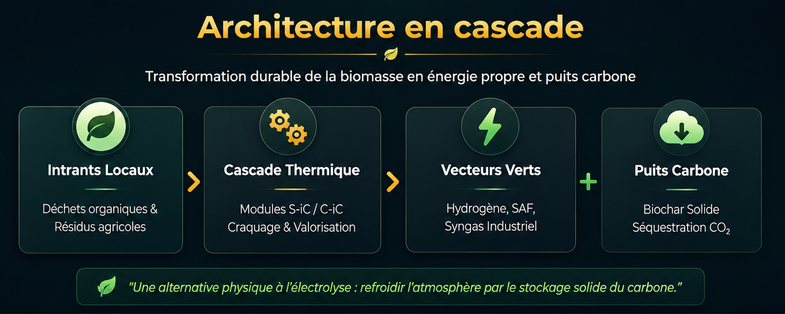

# A Plea for Technological Sovereignty and Resilience
### Towards a national ecosystem of energy, health, and agricultural autonomy
**Independent Strategic Brief — June 2026**

📥 **[Read the Technological Sovereignty Manifesto (French version)](manifeste_souverainete_technologique_v3_FR.md)**

📥 **[View the strategic presentation (Advocacy Kit in PDF format)](Kit_de_Plaidoyer_Souveraineté_Technologique.pdf)**

📥 **[View the executive summary on energy sovereignty & industrial resilience](EXECUTIVE_SUMMARY.md)**

---

## I. Assessment: The silent erosion of our sovereignty

France is facing a major strategic crisis, marked by a widening gap between its technological innovation capabilities and its industrial reality. Under the guise of administrative orthodoxy and short-sighted management, we are sacrificing our industrial flagships on the altar of demagoguery, bureaucracy, and incompetence regarding technology, science, and finance. The conclusion is undeniable: our nation—historically a pioneer in engineering and energy—is losing its technological mastery. This decline at every level is subconsciously felt by the population, which expresses widespread frustration at this ongoing deterioration.

While our high-value SMEs—drivers of major breakthroughs—are subjected to relentless financial predation, avoidable bankruptcies, or forced exile to more welcoming shores, our patents are being snapped up by foreign powers. These more pragmatic nations have grasped the urgency of securing the technologies of tomorrow, whereas we are abandoning them at the highest levels due to a lack of strategic vision.

### The failure of absurd and forced environmental policies
The energy model we are currently pursuing is, in many respects, a financial and ecological dead end. Based on an excessive reliance on centralized grids and blind faith in non-eco-friendly technologies—such as electrolysis powered by fossil fuels or nuclear energy—this type of hydrogen finds itself in direct competition with essential electricity uses (notably for universal electrification and data centers). We are bearing the full brunt of the inconsistency inherent in top-down planning that is detached from the thermal and geographical realities of our local regions.

---

## II. The Solution: A Technological Breakthrough via Decentralized Biomass Thermolysis

Faced with this impasse, a mature, immediately deployable French technological alternative exists: the decentralized production of green hydrogen, renewable gases, and synthetic fuels through the thermolysis of biomass and organic residues, coupled with the co-production of biochar.

### The Global Thermodynamic Trap: The Illusion of Clean Energy vs. the Urgent Need for Carbon Sinks
The major conceptual flaw in current energy policies lies in overlooking the most fundamental laws of thermodynamics. Massively deploying electrolysis based on nuclear power—or hydrogen derived from fossil fuels with inadequate offsetting—does nothing to solve the climate crisis if we continue to saturate the atmosphere with thermal energy carriers without simultaneously decarbonizing. Any large-scale energy production, even if labeled "clean," structurally generates dissipated anthropogenic heat that warms the Earth's atmosphere. Yet, as long as the stock of historical CO₂ remains in the atmosphere, it acts like a sealed greenhouse, preventing this heat from escaping into space. Seeking to consume ever-increasing amounts of energy in a carbon-saturated system without simultaneously creating carbon sinks is a physical absurdity.

In this regard, the imminent rise of generative artificial intelligence and heavy robotics will act as an exponential accelerator of this phenomenon. This technological "baby drill"—the frenetic, global, and reckless use of computing power and machine fleets—will create an unprecedented surge in energy demand, driving the Earth toward an irreversible ecological dead end if the underlying infrastructure remains unchanged.

Against this backdrop of extreme tension, decentralized thermolysis technology (embodied notably by the industrial architecture of the H6 module) stands out as the only solution capable of simultaneously solving this dual equation: it generates clean, highly competitive energy (with a production cost of under €2/kg) while extracting and permanently sequestering carbon in the form of solid biochar. It does not merely achieve neutrality; it is **carbon-negative**.

Finally, it offers a virtuous mission for the robotics revolution: rather than simply saturating networks, the automated systems and robots of tomorrow must be harnessed for the active cleanup of the planet—specifically by collecting and sorting the millions of tons of plastic and organic waste that feed these processing modules.

### Key technical specifications (Standard H6 Module)

| Parameter | Specified standard value |
| :--- | :--- |
| **Nominal thermal capacity** | 2 MW to 5 MW per modular unit |
| **Input (residual biomass / waste)** | 1.0 to 1.2 tonnes/hour (depending on moisture content < 30%) |
| **Green hydrogen (H₂) output** | 130 to 150 kg/hour (99.97% purity) |
| **Co-product: Solid biochar** | 250 to 300 kg/hour (stable carbon sequestration) |
| **Overall energy efficiency** | > 75% to 80% (optimized endothermic process) |
| **Estimated net production cost (H₂)** | < €2.00/kg (including carbon credit valuation) |

---

## III. The stock market and financial strategy: Protecting our industrial gems

Our national industrial base cannot survive without a complete overhaul of its financial protection mechanisms. It is unacceptable for French technological flagships to be left vulnerable to predatory stock market practices.

### Auditing strategic assets: A shield against financial predation
The State must immediately launch a national inventory of SMEs developing breakthrough technologies whose expertise is critical to our survival. These companies must be safeguarded—protected from foreign financial predation—and supported as they scale up to industrial production. The State must urgently implement a financial shield—a **Sovereignty Anti-Dilution Fund**—to prohibit forced reliance on predatory alternative financing structures (hedge funds exploiting OCEANE or warrant-based financing lines) that plunder and destroy the savings of French investors held in PEA-PME accounts. These predatory mechanisms orchestrate the systematic short-selling of our listed corporate gems; they massively dilute share capital by issuing millions—or even billions—of new shares and trigger immediate attacks by short-selling hedge funds the moment contracts are signed. Such practices make stable governance impossible, shatter market valuations, and permanently block access to traditional bank credit, effectively handing our intellectual property to foreign powers on a silver platter.

---

## IV. Call to Action: Regaining Control

An industrial resurgence demands immediate, pragmatic decisions to break the deadlock of inertia.

1. **Establishing a "Regulatory Fast-Track" for sovereignty projects:** French administrative orthodoxy and the complexity of urban planning regulations or ICPE (environmental compliance) procedures currently create bottlenecks that stifle innovation at the source, imposing delays of 18 to 24 months before any facility can become operational. Faced with budgetary and economic urgency, the State must implement a regulatory "Fast-Track" mechanism, granting the right to immediate experimentation and provisional operating permits within three months for any decentralized modular installation linked to critical infrastructure (hospitals, logistics hubs, agricultural cooperatives).
2. **Public guarantee for industrialization risks:** If a technology is vital to the nation, the associated financial risk is, by nature, a national risk that the State must underwrite. Financing must no longer be a mere delegated accounting task, but a strategic investment.
3. **Absolute priority for public procurement:** Systematizing the deployment of these decentralized thermolysis units across all of the country's critical infrastructure. By becoming the first customer for its own innovations, France will generate the momentum needed to capture global markets.

---

## Conclusion: A Choice for History

Decentralized dry thermolysis technology offers more than just an alternative; it lays the foundation for civilizational resilience. Fleeing an Earth rendered uninhabitable to live in space cannot and must not be humanity's sole ambition. Our duty is to repair our world through the genius of our engineering.

The future of France and the world will be autonomous, automated, decarbonized, and sovereign—or it will not exist at all. We possess the machines to clean up pollution, the process to transmute waste into pure energy, and the mechanism to cool the atmosphere through carbon sequestration. It is time to stop letting our revolutionary technologies die, abandoning them to bureaucracy, or feeding them to financial predators. France has the resources to lead this renaissance; all that is missing is the political will to regain control of our industrial destiny and take action.

**EJS — Independent Strategic Note**

---

### ⚠️ Disclaimer
*This strategic note is an independent contribution to the public debate on industrial and energy sovereignty. The author expresses personal opinions based on public data and is in no way acting on behalf of the companies mentioned. As a long-term individual shareholder, the author shares this text in the interest of transparency and for purely informational and macroeconomic analysis purposes. It does not constitute investment advice, an inducement to buy, or a stock market recommendation.*

