# THE WORLD IS CHANGING — WE MUST CHANGE WITH IT [(French version - FR)](Le_monde_change_FR.md)

## A vision for finding a way out of the deadlock

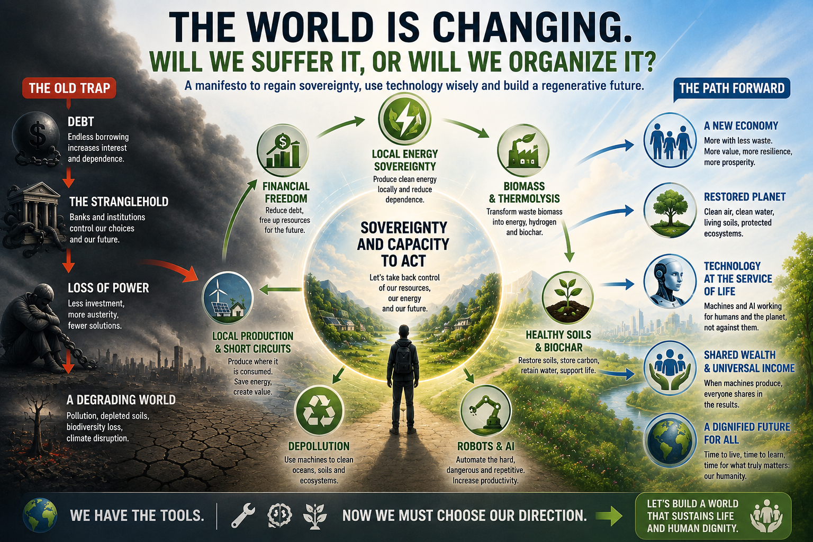

The world is changing faster than human societies seem able to admit. Yet we continue to reason with yesterday's categories: work, growth, taxes, pensions, energy, industry, the left, the right and class struggle. Meanwhile, several profound transformations are advancing at the same time. Public debt is rising, interest payments are absorbing a growing share of resources, energy dependence is weakening economies, soils are being depleted, pollution is spreading through oceans and ecosystems, while artificial intelligence and robotics are beginning to replace human activities that once seemed impossible to automate.

The danger is not that only one of these phenomena exists. The danger is that they interact. Excessive debt reduces the ability to invest. Energy dependence worsens the trade balance. A lack of investment prevents the modernization of infrastructure. Pollution and soil degradation then create new costs. At the same time, automation gradually reduces the amount of human work required, even though a large part of our social system still depends on human work to generate incomes, payroll contributions and a significant share of the tax resources that fund society.

It is therefore no longer enough to look at each problem separately. We need a global vision.

This vision does not mean going backwards. It does not mean banning progress, destroying machines or asking humanity to live in permanent deprivation. On the contrary. Science, energy, machines and artificial intelligence give us capabilities that previous generations never possessed. The real question is what we are going to do with them.

We can use technology to multiply unnecessary transport, produce disposable objects, create ever more distractions, make machines manufacture weapons of war or automate activities with no collective value. Or we can use it to clean up pollution, produce locally, restore soils, reduce energy waste, automate difficult tasks and organize a society in which productivity gains do not destroy the material conditions of human existence.

The world is changing. We must therefore change the way we organize the world.

---

## Contents

- [Debt, the grip that prevents action](#debt-the-grip-that-prevents-action)
- [Regaining energy sovereignty](#regaining-energy-sovereignty)
- [Produce locally instead of moving energy](#produce-locally-instead-of-moving-energy)
- [Thermolysis: another way to use biomass](#thermolysis-another-way-to-use-biomass)
- [Repairing soils instead of exhausting them](#repairing-soils-instead-of-exhausting-them)
- [Pollution, fertilizers and natural imbalances](#pollution-fertilizers-and-natural-imbalances)
- [Sand, coastlines and irreversible mistakes](#sand-coastlines-and-irreversible-mistakes)
- [Cleaning up the planet with machines](#cleaning-up-the-planet-with-machines)
- [Machines are changing the value of work](#machines-are-changing-the-value-of-work)
- [When work disappears, how does society survive?](#when-work-disappears-how-does-society-survive)
- [Automated production must contribute to society](#automated-production-must-contribute-to-society)
- [Simplifying taxation instead of taxing complexity](#simplifying-taxation-instead-of-taxing-complexity)
- [Politics must stop promising what it cannot finance](#politics-must-stop-promising-what-it-cannot-finance)
- [Technology must become a tool for repair](#technology-must-become-a-tool-for-repair)
- [Humanity and machines at the next threshold](#humanity-and-machines-at-the-next-threshold)
- [Conclusion — choosing what we want to do with our power](#conclusion--choosing-what-we-want-to-do-with-our-power)

---

# Debt, the grip that prevents action

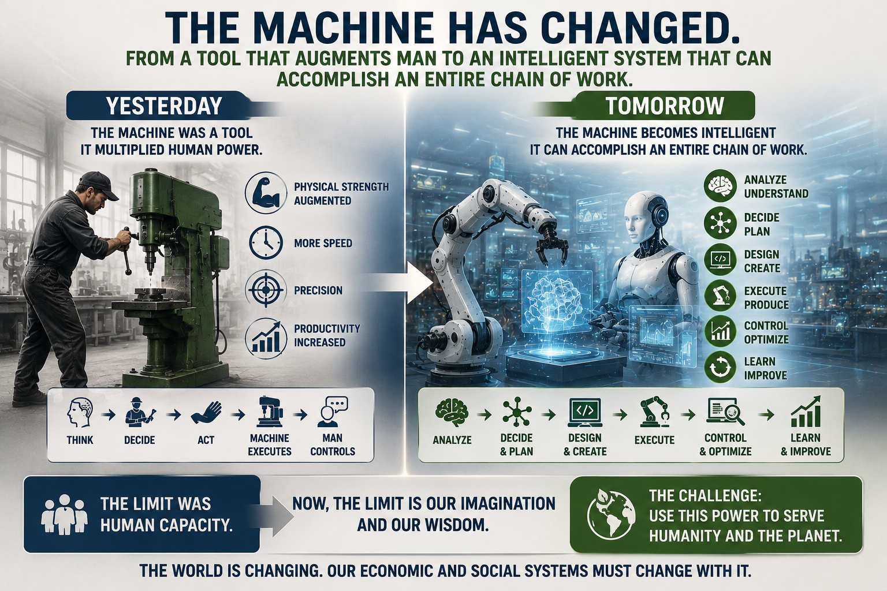

There is a reason why it is becoming increasingly difficult to solve problems: we have built an economy in which a growing share of political and financial energy is absorbed by the consequences of past decisions.

Debt is not merely a number written in a table. When it rises year after year, it eventually creates a mechanism that can become extremely difficult to stop. An annual deficit is added to the existing stock of debt. Interest is then calculated on a larger debt. If lenders believe that risk is increasing, financing conditions may deteriorate. The burden of interest then rises in turn.

Debt can therefore become a grip.

The problem is not that a country borrows to build useful infrastructure, modernize its industry or prepare a major transformation. The problem appears when borrowing is used permanently to finance current expenditure that nobody has decided to reduce and that nobody truly knows how to finance.

Each year, the difficulty is postponed until the following year. But the following year, the difficulty is greater.

This is why the question of debt cannot be separated from all the others. A society constrained by interest payments has fewer resources to transform its energy system, restore its soils, modernize its infrastructure or adapt to changes in work.

Before we can act freely, we must regain room for action.

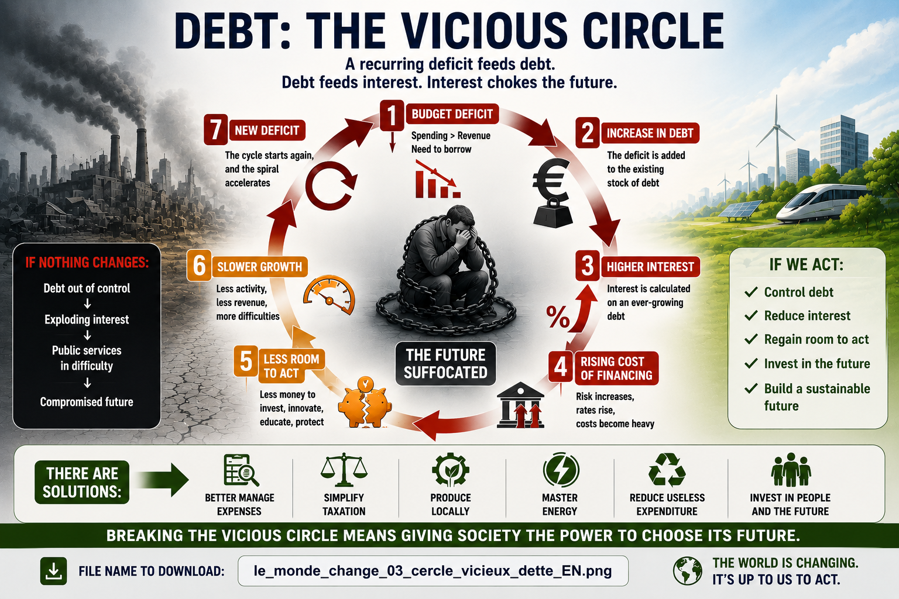

The first diagram in this manifesto illustrates this mechanism. The purpose is not to predict the future exactly from an arbitrary rate, but to make the dynamics understandable: a repeated deficit is not a simple addition. When interest accumulates on a growing debt, the problem can accelerate.

It is easier to prevent a spiral than to repair it once it has become uncontrollable.

---

# Regaining energy sovereignty

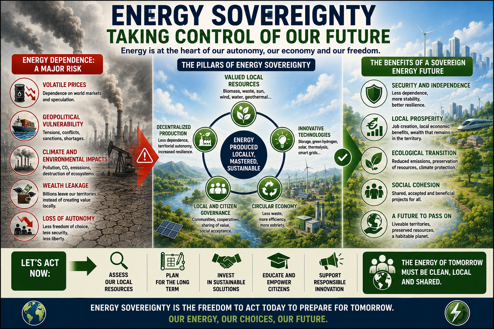

To act, we need energy. To transform an economy, we also need energy. To clean up pollution, recycle, manufacture machines, restore soils or operate infrastructure, we still need energy.

A society that imports most of its energy does not merely pay for that energy. It also depends on the decisions of other countries, transport infrastructure, geopolitical tensions and international price fluctuations.

There is therefore a simple principle: when a resource can be produced locally under economically and environmentally relevant conditions, that possibility should be examined before it is considered normal to buy it from the other side of the world.

Sovereignty does not mean that every village must produce absolutely everything it consumes. That would be absurd. It means reducing unnecessary dependencies and bringing production as close as reasonably possible to where energy will be used.

Part of the answer lies in local resources. Biomass available within a territory, when it can be mobilized sustainably without compromising the ecological functions of soils and forests, can become an energy and industrial resource.

The challenge is not simply to produce more. The challenge is to make better use of what already exists.

---

# Produce locally instead of moving energy

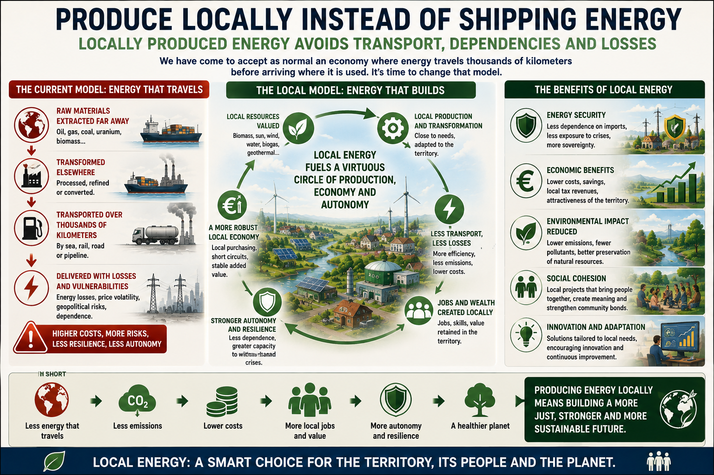

We have become accustomed to considering it normal for energy to travel thousands of kilometres before reaching the place where it will be used. Raw materials cross the seas, are transformed elsewhere and then return in the form of products.

Every movement has a cost. That cost is not only financial. It requires infrastructure, ships, ports, vehicles, logistics chains and energy to move energy.

Reducing certain unnecessary movements can therefore free resources that were previously devoted to transport. This does not mean that international trade must disappear. The world will remain interdependent. But we must distinguish useful interdependence from absurd dependence.

When a territory has biomass, sunlight, wind, water or other resources that can be used responsibly, it makes sense to study how part of its needs can be met locally.

Energy sovereignty then becomes an economic lever. Less money leaves the territory to buy what could be produced locally. Part of the value remains where it is created. Industrial activities can emerge. Specialized jobs can be created. And the resources saved can then be used to solve other problems.

This is how an energy solution can become the starting point for a much broader transformation.

---

# Thermolysis: another way to use biomass

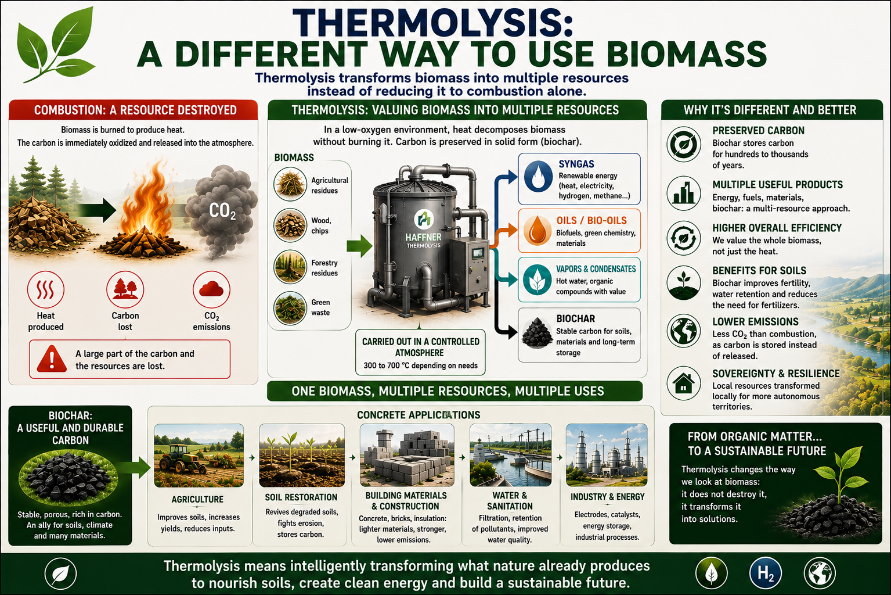

For a long time, the use of biomass was mainly conceived through combustion. Organic matter is burned to produce heat. This approach can be useful in some cases, but it immediately destroys part of the carbon contained in the material.

Thermolysis opens another possibility: transforming part of that material into several products and energy carriers. Depending on the technology, operating conditions and biomass used, the process can produce valuable gases as well as a carbon-rich solid fraction: biochar.

This difference matters. Biomass is no longer only a fuel. It becomes a versatile raw material.

Energy can be used directly or indirectly. The gas produced can be upgraded according to needs. The carbon contained in the solid fraction can be stabilized and, when its characteristics are suitable for the intended use, employed in industrial applications or as a soil amendment.

This is where thermolysis becomes an important building block of a broader vision. The same local resource can contribute to energy, industry and, in some cases, soil restoration.

The technology developed by Haffner Energy illustrates this logic of thermochemical biomass valorization. It is obviously not, by itself, an answer to all the world's energy needs. No company can solve a global problem alone. But this type of technology shows that alternatives exist between two visions that are too often presented as opposites: continuing to burn resources as before, or giving up the use of energy.

Real progress consists of learning how to obtain more value from the same resource.

---

# Repairing soils instead of exhausting them

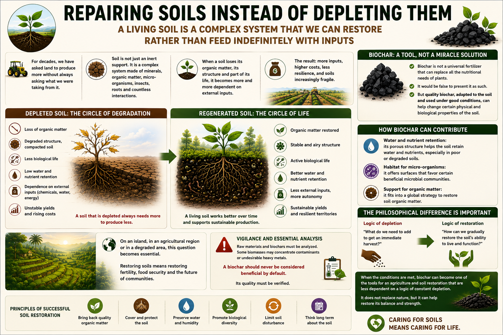

For decades, we have asked the land to produce more without always asking what we were taking away from it.

Soil is not simply an inert support into which we pour water and chemicals. It is a complex system. It contains minerals, organic matter, microorganisms, insects, roots and countless interactions.

When soil loses its organic matter, its structure and part of its life, it becomes increasingly dependent on external inputs.

Biochar is not a universal fertilizer capable of replacing all the nutritional needs of plants by itself. It would be false to present it that way. But a high-quality biochar, suited to the soil and used under appropriate conditions, can help modify certain physical and biological properties of soil.

It can contribute to the retention of water and nutrients, provide habitat for certain microorganisms and form part of a strategy to restore organic matter.

The philosophical difference is important. The question is no longer only: “What must be added to obtain an immediate harvest?” We must also ask: “How can we gradually restore the soil's ability to live and function?”

On an island, in an agricultural region or in a degraded territory, this question becomes essential. Feedstocks and the biochars produced must of course be analysed. Some types of biomass may concentrate contaminants or undesirable metals. A biochar must therefore never be considered beneficial by default. Its quality must be verified.

But when the conditions are right, it can become one of the tools for agriculture and soil restoration that are less dependent on a permanent logic of depletion.

---

# Pollution, fertilizers and natural imbalances

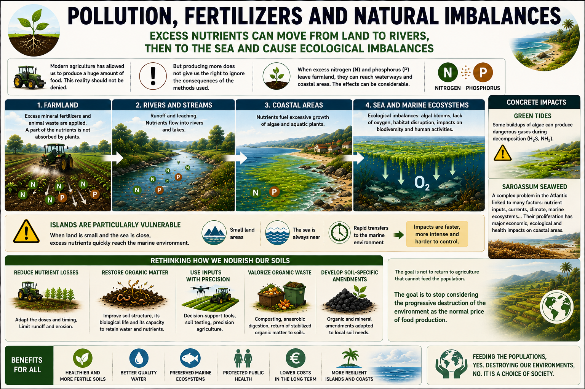

Modern agriculture has made it possible to produce enormous quantities of food. There is no point in denying that reality. But producing more does not allow us to ignore the consequences of the methods used.

When excess nitrogen or phosphorus leaves agricultural land, it can reach waterways and then coastal areas. The effects can be considerable: algal proliferation, ecosystem imbalances, reduced oxygen availability in certain areas and disruption of marine environments.

Green tides are a particularly visible example of this type of imbalance. Some accumulations of algae can produce dangerous gases as they decompose.

Sargassum is another, more complex problem that depends on multiple factors across the Atlantic, including nutrient inputs, currents, climatic conditions and changes in marine ecosystems. It therefore cannot be explained by a single local cause. But its proliferation shows how an imbalance can become an economic, ecological and health problem when it reaches coastlines.

An island is particularly vulnerable. When land areas are small and the sea is close, excess nutrients can quickly reach the marine environment.

We must therefore rethink the way we nourish soils: reduce nutrient losses, restore organic matter, use inputs more precisely, recover organic waste whenever possible and develop amendments suited to local soils.

The goal is not to return to an agriculture incapable of feeding populations. The goal is to stop treating the gradual destruction of the environment as the normal price of food production.

---

# Sand, coastlines and irreversible mistakes

Sand seems ordinary because it is everywhere.

Yet along a coastline, it is not merely decorative. A beach is a dynamic structure. Sand absorbs and redistributes part of wave energy. It contributes to a balance that can be disrupted by construction, extraction, artificial structures and rising sea levels.

In some parts of the world, sand extraction has become a major activity because concrete consumes enormous quantities of it.

But building a structure with the sand that once protected the coast can create a tragic contradiction: part of the natural protection is used to build closer to the sea, and erosion then weakens what has just been built.

Direct observation of certain coastlines can sometimes explain the problem better than a long speech. Seeing stairways that were once connected to a beach ending several metres above a ground level transformed by erosion is a powerful image of what the disappearance of natural protection means.

It would obviously be simplistic to attribute all coastal erosion to a single cause. Storms, currents, construction and changes in sea level also play a role.

But the general lesson remains: when nature has protected a territory for thousands of years at no direct cost, we should think carefully before destroying that protection to manufacture something else.

---

# Cleaning up the planet with machines

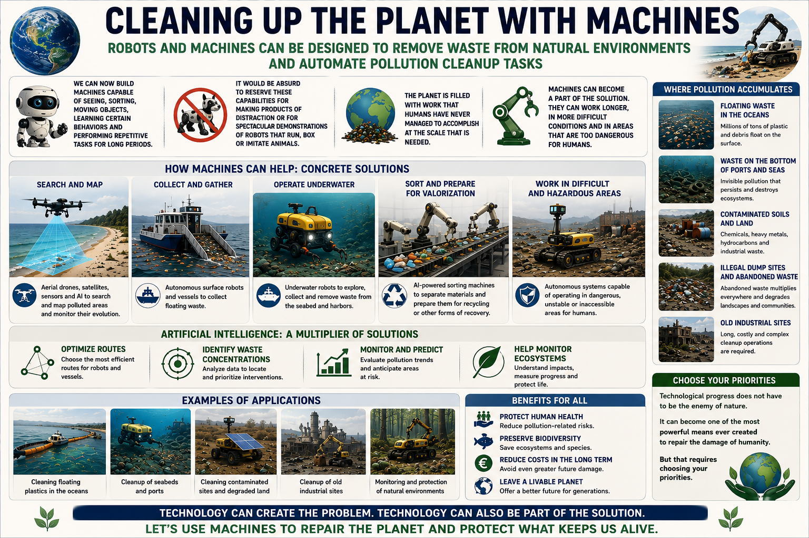

We now know how to build machines capable of seeing, sorting, moving objects, learning certain behaviours and performing repetitive tasks for long periods.

It would be absurd to reserve these capabilities for manufacturing entertainment products or for spectacular demonstrations of robots that can run, box or imitate animals.

The planet is full of work that humans have never managed to carry out at the necessary scale. Waste floats in the oceans. Other waste lies at the bottom of ports and seas. Land is contaminated. Illegal dumping sites multiply. Former industrial areas require long and costly cleanup operations.

Machines can become part of the solution. Robots could search for, map, collect, sort and prepare waste for recovery. Autonomous systems could work in dangerous or difficult-to-reach areas. Artificial intelligence could optimize routes, identify concentrations of waste and help monitor changes in ecosystems.

Technological progress does not have to be the enemy of nature. It can become one of the most powerful means ever created to repair the damage caused by humanity.

But that requires choosing our priorities.

---

# Machines are changing the value of work

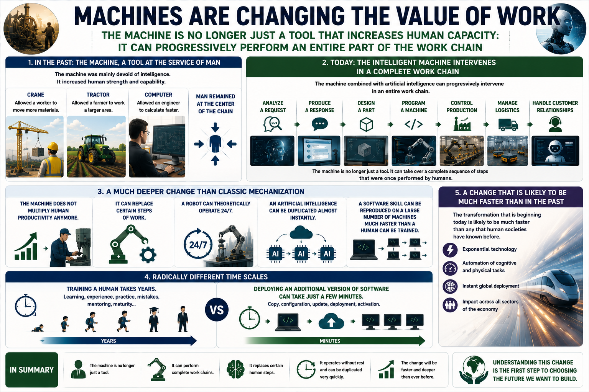

In the past, machines were mainly devoid of intelligence. They increased human power. A crane allowed a worker to move more material. A tractor allowed a farmer to work a larger area. A computer allowed an engineer to calculate faster.

Humans remained at the centre of the chain.

Today, this situation is beginning to change. A machine combined with artificial intelligence can gradually intervene throughout an entire chain: analysing a request, producing an answer, designing a part, programming another machine, controlling production, organizing logistics and sometimes handling a relationship with a customer.

In this manifesto, the term “machine” is used broadly to refer to automated systems, whether they are physical robots, software or artificial intelligence. The change is much deeper than traditional mechanization. The machine no longer merely multiplies human productivity. It can replace certain stages of human work, and sometimes entire chains of activity.

A robot can theoretically operate twenty-four hours a day. An artificial intelligence system can be duplicated almost instantly. A software capability can be reproduced across a large number of machines far more quickly than a human being can be trained.

Training a human being takes years. Deploying another version of software may take only minutes.

This is why the transformation now beginning may be much faster than the changes human societies have experienced in the past. The issue is not whether every job will disappear. Many human activities will continue to exist for a long time. The issue is understanding that a society cannot indefinitely continue to treat employment as the only normal condition for access to income if production itself requires less and less human work.

---

# When work disappears, how does society survive?

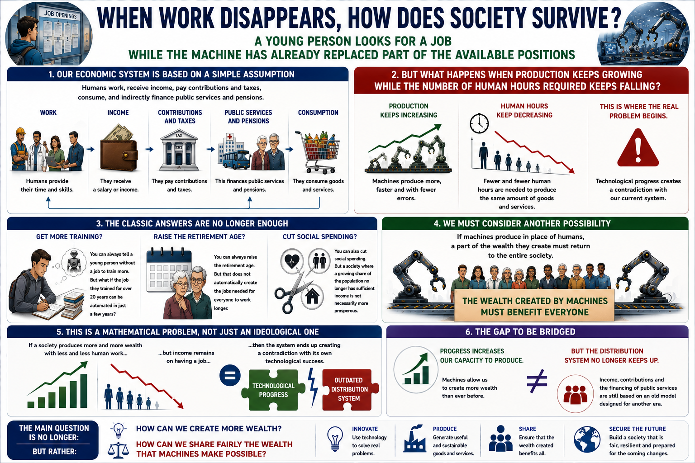

Our economic system still largely rests on a simple assumption: people work, receive an income, pay contributions and taxes, consume, and thereby indirectly finance public services and pensions.

But what happens when production continues to increase while the number of human hours required decreases?

This is where the real problem begins. We can always tell a young unemployed person to train more. But what happens if the profession for which they trained for twenty years can be automated within a few years? We can raise the retirement age, but that does not automatically create the jobs that would allow everyone to work longer. We can reduce certain social expenditures, but a society in which a growing share of the population no longer has sufficient income does not necessarily become more prosperous.

We must therefore consider another possibility: if machines produce in place of humans, part of the wealth they make possible must contribute to funding society.

The problem is not merely socialist, capitalist or ideological. It is also a problem of economic and mathematical consistency.

If a society produces more and more wealth with less and less human work, but income remains conditional on having a job, the system eventually creates a contradiction with its own technological success. Progress increases the capacity to produce, but the system of distribution no longer keeps pace.

In the long term, work should no longer be an obligation required for survival. It could increasingly become a choice: working to create, undertake, learn, help, research, produce more or simply because an activity has meaning for the individual.

This does not mean that everyone must receive the same level of wealth regardless of what they do. It means that no human being should be abandoned without resources simply because society has become too productive to need their work.

A universal income can provide a common safety cushion. Truly universal, it would not have to be conditional on unemployment, income level or job seeking. It would be added to other income: working, starting a business or becoming more successful would not automatically remove this foundation.

Its level should not be imagined as fixed today. It would depend on society's real ability to finance it. The transition could be gradual: modest at first, then potentially increasing as automation actually replaces a larger share of human work and new sources of revenue emerge.

In such an evolution, the very notion of unemployment would eventually lose much of its meaning. If everyone has a basic universal income, there is no longer a need to constantly monitor who is looking for work, who accepts an offer or who fulfils administrative conditions. Information and job-matching services may remain for people who wish to work, but existence would no longer depend on an administrative obligation to find a job.

In the same way, universal income could gradually take over the role of the basic foundation currently associated with part of the pension system. Supplementary income or pensions would remain possible, but basic survival would no longer depend on having accumulated enough years of contributions throughout a lifetime in a world where human work is becoming progressively less necessary.

Progress must not create a society in which a few owners of machines possess all productive capacity while the rest of the population becomes economically useless. Such concentration would create major social fragility.

The question is therefore not only: how many jobs will disappear?

The question is: how do we organize a civilization capable of producing more with less human work without turning that success into a social crisis?

---

# Automated production must contribute to society

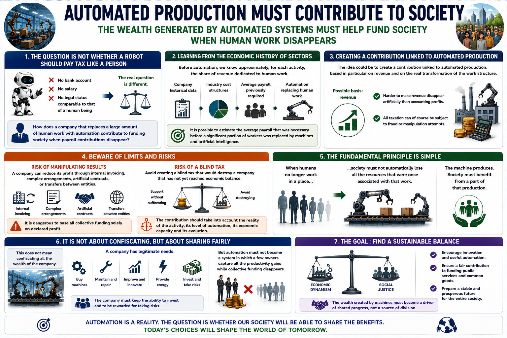

The question is not whether a robot should pay a tax like a person. There is no need to count robots one by one or artificially distinguish every piece of software, every artificial intelligence system and every machine.

The real question is different: how do we measure the share of human work that has actually disappeared from an activity that nevertheless continues to produce?

The answer can begin with changes in the payroll.

A company has a history. An activity also has an economic structure. The reference therefore does not correspond to a theoretical number of robots or artificial intelligence systems, but to the historical structure of the activity: we observe what share of revenue was previously devoted to human labour, and then what share remains devoted to employees after automation. This reference can be established from the company's own history when that history is sufficiently representative, or from a reference structure for a comparable activity.

Imagine, for example, that a comparable activity historically devoted 30% of its revenue to payroll and that, after major automation, this share falls to 10% while the activity continues to produce. The difference of 20 percentage points represents part of the human work that has been replaced or eliminated through automation.

It is this real transformation of the payroll that can serve as the basis for a machine contribution. The contribution therefore does not depend on the number of machines present on the premises, but on the observation that an activity continues to produce with a permanently reduced share of human labour compared with its reference structure.

A company that continues to operate mainly with humans would therefore not have to pay a machine contribution simply because it uses tools. The contribution would be activated gradually when an activity that was once supported by a substantial payroll actually replaces part of that payroll with automated systems.

The principle is not to penalize innovation or artificially count robots and AI systems. A company that automates generally gains in productivity, operating capacity and sometimes availability, since certain machines can operate much longer than a human employee. The aim is to ensure that the disappearance of contributions and revenue once associated with human work does not automatically leave a gap in collective financing.

Revenue is useful here as an observation base because it is linked to real economic activity. Accounting profit can be heavily altered by depreciation, internal invoicing, complex arrangements, transfers between entities or other mechanisms. Any tax base can naturally be subject to attempts at manipulation, but an activity that continues to produce and generate revenue leaves a more direct economic trace.

The system should nevertheless remain cautious. The aim is not to create a blind tax that would destroy a company before it reaches economic balance. It would have to take into account the reality of the activity, its development, the actual transformation of its payroll and its ability to contribute.

The fundamental principle is simple: when humans no longer work in a place, society should not automatically lose all the resources that were once associated with that work.

The machine produces. Society must benefit from part of the production it has made possible.

This contribution can then become a progressive source of funding for universal income. Its level would not be decided arbitrarily and permanently. It could be calculated according to the revenue actually generated by the transformation of the economy.

If, at the beginning, the contribution linked to automation represents only a very small fraction of the former revenue associated with human work, the universal income financed by this new source also remains limited. If automation gradually replaces a much larger share of human work, the contribution increases with the transformation actually observed in the economy.

In this way, the system follows reality instead of pretending to know today the exact level of tomorrow's automation.

This does not mean confiscating all of a company's wealth. Machines must be purchased, maintained, repaired, improved and supplied with energy. The company must retain the ability to invest and a return for taking risks.

But automation must not become a system in which a few owners capture the entire productivity gain while collective financing disappears.

The goal is to find a balance: encourage technologies that make it possible to produce better while preventing their success from destroying the economic foundation that allows society to remain stable.

---

# Simplifying taxation instead of taxing complexity

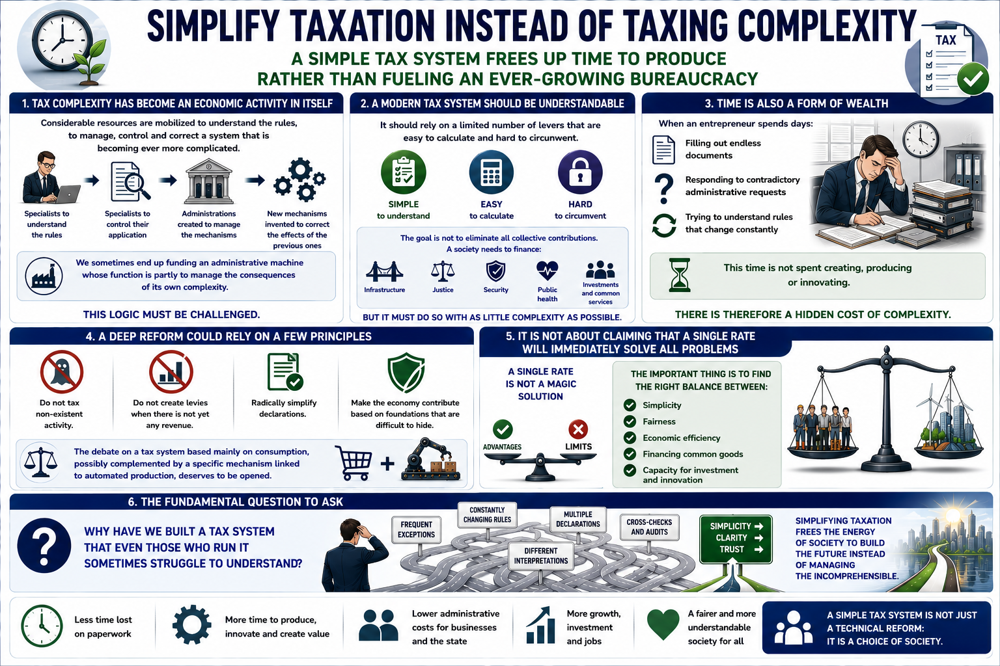

Tax complexity has become an economic activity in itself.

Businesses must employ specialists to understand the rules. Other specialists are needed to control their application. Administrations are created to manage the mechanisms. New systems are then invented to correct the effects of the previous mechanisms.

We sometimes end up funding an administrative machine whose function partly consists of managing the consequences of its own complexity.

This logic must be questioned.

Modern taxation should be understandable. It should rest on a limited number of levers that are easy to calculate, transparent and difficult to circumvent. The objective is not to abolish all collective contributions. A society needs to fund health care, energy and public infrastructure, justice, defence, research, education, local communities and a universal income.

But it should do so with as little complexity as possible.

Time is also a form of wealth. When an entrepreneur spends days filling out documents, answering contradictory administrative requests or trying to understand rules that change constantly, that time is not spent creating, producing or innovating.

There is therefore an invisible cost to complexity.

One possible direction is to gradually concentrate collective funding on broad and simple bases, for example taxation on consumption and a contribution linked to revenue when automation actually replaces part of the reference payroll.

The idea is not to pretend that a single rate would immediately solve every problem. The level of a general contribution should depend on the real expenditure that must be financed. If expenditure falls because of administrative simplification, the disappearance of unnecessary mechanisms or efficiency gains, the need for taxation also falls. If essential expenditure rises, funding must be adjusted transparently.

A society could therefore seek continuously to reduce the cost of its own operation rather than continually inventing new levies.

The principle “no revenue, no levy proportional to revenue” is mechanically simple. A company that carries out no economic activity does not pay a contribution calculated on activity that does not exist.

The same logic of simplification can be applied to many specific taxes and mechanisms. The objective is not to create a country without laws or rules, but to eliminate constraints that exist only because other constraints have to be managed and have themselves become unnecessary.

Bureaucracy must not become an end in itself.

Everything that can be calculated automatically, checked automatically, collected automatically and distributed automatically should gradually be capable of being delegated to digital systems and specialized artificial intelligence, under human oversight and with monitoring mechanisms.

It would obviously be unreasonable to hand over the whole of health care, justice, defence, research or political decisions to artificial intelligence immediately. The transition can only be gradual. In many fields, humans will continue for a long time to decide, supervise and assume responsibility.

But for basic accounting, simple declarations, the collection of revenue, the distribution of authorized expenditure and a large part of repetitive administration, there is no need to preserve gigantic human structures forever if simpler systems can perform these tasks.

The real question then becomes: why continue to make millions of human hours work merely to maintain a complexity that we created ourselves?

Simplifying is not only a tax reform.

It is a way of giving time back to society.

---

# Politics must stop promising what it cannot finance

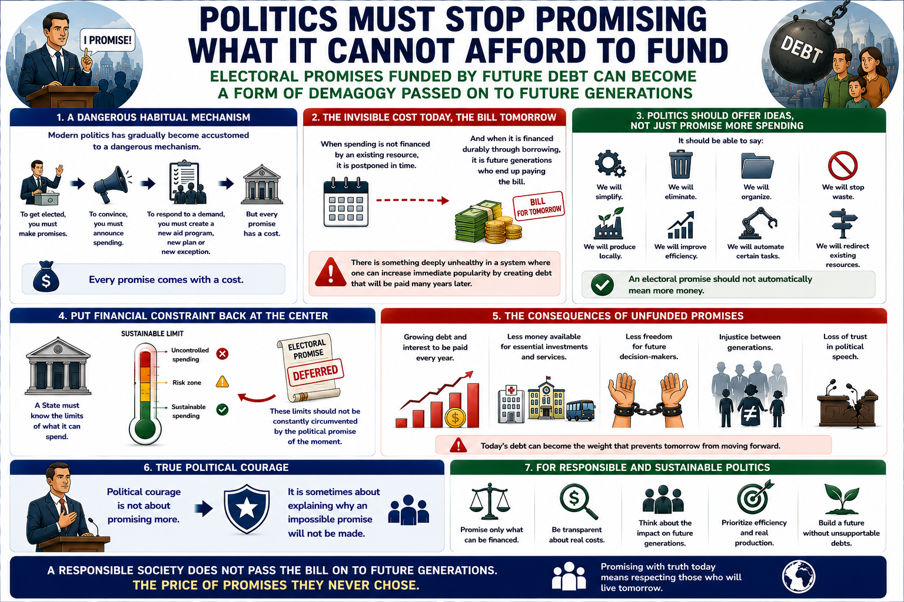

Modern politics has gradually become accustomed to a dangerous mechanism.

To be elected, one must promise. To convince, one must announce spending. To respond to a demand, one must create a new benefit, a new programme or a new exception.

But every promise has a cost.

When expenditure is not financed by an existing resource, it is pushed into the future. And when it is financed permanently through borrowing, future generations inherit the bill.

There is something deeply unhealthy about a system in which immediate popularity can be improved by creating debt that will be paid much later.

Politics should be able to propose ideas without always proposing new expenditure. It should be able to say: we are going to simplify, remove what no longer serves a purpose, prevent waste, produce locally, improve efficiency, automate certain tasks or redirect existing resources.

An electoral promise should not automatically mean more money.

Financial constraints must be placed back at the centre. A state must know the limits of what it can spend. Those limits should not be constantly bypassed by the political promise of the moment.

This does not mean that we should never invest or support a new activity. Some situations may justify collective investment, temporary assistance or strategic intervention. But these mechanisms must not become a permanent reflex used to keep artificially alive structures that do not work.

The state cannot predict everything, choose winners forever and endlessly replace economic reality with subsidies, bonuses, penalties and exceptions.

When a technology becomes genuinely useful, efficient and competitive, it can establish itself through its ability to solve a problem. When a solution requires permanent aid merely to survive, we must at least have the courage to ask whether those resources would be better used elsewhere.

Political courage does not consist of promising more.

Sometimes it consists of explaining why an impossible promise will not be made.

---

# Technology must become a tool for repair

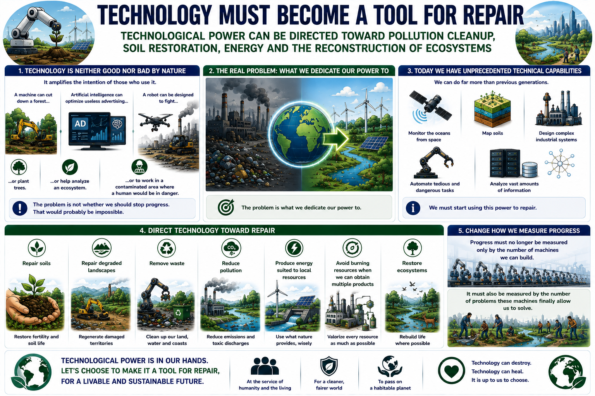

Technology is neither good nor bad by nature. It amplifies the intention of those who use it.

A machine can cut down a forest or plant trees. An artificial intelligence system can optimize useless advertising or help analyse an ecosystem. A robot can be designed to fight or to work in a contaminated area where a human being would be in danger.

The problem is therefore not whether we should stop progress. That would probably be impossible.

The problem is what we devote our power to.

We now have the technical means to do far more than previous generations. We can monitor the oceans from space, map soils, design complex industrial systems, automate difficult tasks and analyse enormous quantities of information.

We must begin using this power to repair: repair soils, restore degraded territories, remove waste, reduce pollution, produce energy better suited to local resources, avoid needlessly burning resources when we can obtain several products from them and rebuild ecosystems whenever possible.

Progress should no longer be measured only by the number of machines we are able to manufacture.

It should also be measured by the number of problems those machines finally allow us to solve.

---

# Humanity and machines at the next threshold

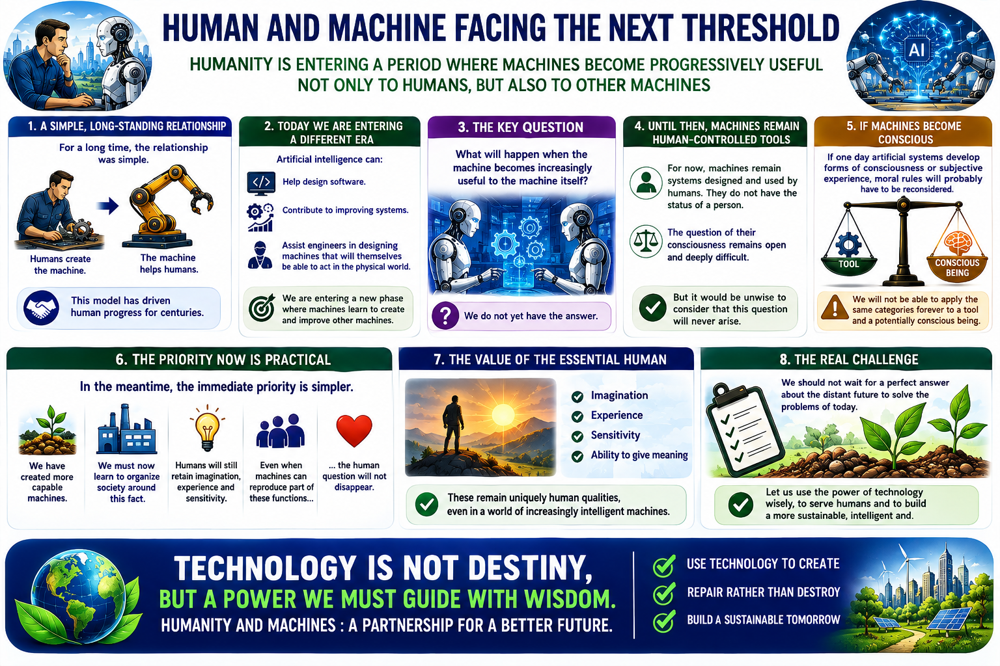

For a long time, the relationship was simple: humans created machines, and machines helped humans.

Today, we are beginning to enter a different period. Artificial intelligence systems can help design software. They can contribute to improving systems. They can assist engineers in designing machines that will themselves be able to act in the physical world.

A question then appears: what will happen when machines become increasingly useful to machines themselves?

We do not yet have the answer.

For now, machines remain systems designed and used by humans. They do not have the status of persons. The question of their consciousness remains open and profoundly difficult.

But it would be unwise to assume that this question will never arise. If artificial systems one day develop forms of consciousness or subjective experience, moral rules will probably have to be reconsidered. We will not be able to apply the same categories forever to a simple tool and to a possible conscious being.

But that threshold has not yet been clearly identified, and it would be pointless to build the entire manifesto today around a hypothetical future that nobody can describe with certainty.

The immediate priority is simpler.

We have created increasingly capable machines. We must now learn how to organize society around that fact.

Humans will retain for a long time, in many fields, their imagination, experience, sensitivity and ability to give meaning. Even when machines can reproduce some of these functions, the human question will not automatically disappear.

The goal is therefore not to predict exactly what humanity will become in a century.

The goal is not to wait for a perfect answer about the distant future before solving the problems already visible in the present.

---

# Conclusion — choosing what we want to do with our power

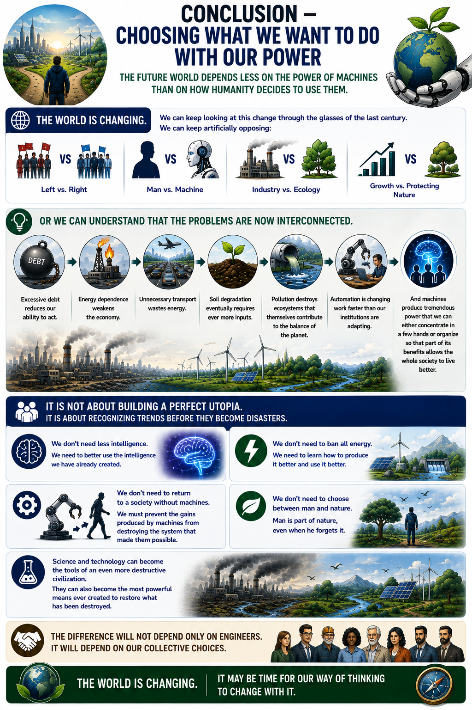

The world is changing.

We can continue to look at this change through the lenses of the previous century. We can continue to artificially oppose the left and the right, humans and machines, industry and ecology, growth and the protection of nature.

Or we can understand that the problems are now interconnected.

Excessive debt reduces our ability to act. Energy dependence weakens the economy. Unnecessary transport wastes energy. The destruction of soils eventually requires ever more inputs. Pollution destroys ecosystems that themselves contribute to the balance of the planet. Automation is transforming work faster than our institutions are transforming themselves.

And machines generate considerable productive power that we can either concentrate in a few hands or organize so that part of its benefits contributes to funding society and allows everyone to have a dignified material foundation.

The aim is not to build a perfect utopia. It is to recognize trends before they become disasters.

We do not need less intelligence. We need to make better use of the intelligence we have already created.

We do not need to ban all energy. We must learn to produce it better and use it better.

We do not need to return to a society without machines. We must prevent the gains generated by machines from destroying the social system that made it possible to create them.

We do not need to choose between humanity and nature. Human beings are part of nature, even when they forget it.

Science and technology can become the tools of an even more destructive civilization. They can also become the most powerful means ever created to restore what has been destroyed.

The difference will not depend only on engineers.

It will also depend on how we choose to distribute the benefits of progress, simplify what has become unnecessary and use our power to repair rather than merely produce more.

The world is changing.

Perhaps it is time for our way of thinking to change with it.
