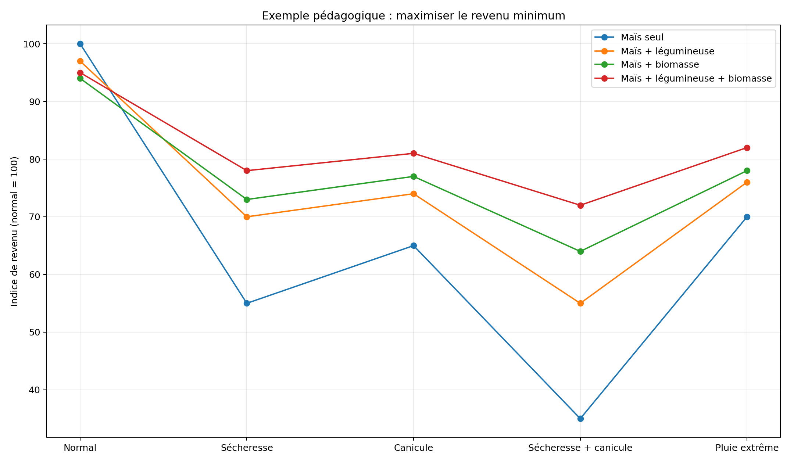

# Agent — stratégies agricoles résilientes

## Mission

Construire une base quantitative France → Europe → Monde permettant d'identifier :

$$
\boxed{
A^*=\arg\max_A\min_S R(A,S)
}
$$

Le système optimal est celui qui maximise le **revenu minimum** sous différents scénarios climatiques.

# 1. Scénarios

| Code | Scénario |
|---|---|
| N | année normale |
| D | sécheresse |
| C | canicule |
| DC | sécheresse + canicule |
| P | pluie extrême / inondation |
| DP | sécheresse puis pluie extrême |

# 2. Ce que l'agent recherche

Pour chaque culture principale :

- légumineuses associées ;
- plantes à racines profondes ;
- plantes à cycle complémentaire ;
- couverts ;
- biomasses pérennes ;
- cultures de secours ;
- valorisation des récoltes déclassées.

L'association est évaluée selon :

$$
A=(C,P,S,M)
$$

avec culture principale $C$, partenaire $P$, sol $S$ et mode de gestion $M$.

# 3. Fonctions recherchées

| Fonction | Exemple |
|---|---|
| Azote | légumineuse |
| Eau | racines complémentaires |
| Sol | couverture / structure |
| Temps | production à une autre saison |
| Espace | autre hauteur / autre profondeur |
| Résilience | reprise après stress |
| Biomasse | débouché thermolyse |
| Revenu | nouveau produit |

# 4. Conversion H6

Référence de travail :

$$
669\ kg/h\rightarrow50\ kgH_2/h
$$

À 35 % d'humidité :

$$
1\ tMS\approx1.538\ t_{humide}
$$

et :

$$
1\ tMS\approx115\ kgH_2
$$

Un H6 à 8 000 h/an correspond approximativement à :

$$
5300\ t_{humide}/an
$$

soit :

$$
3445\ tMS/an
$$

dans cette approximation.

Donc :

$$
N_{H6}=\frac{B_{MS}}{3445}
$$

# 5. Économie

Pour une association :

$$

R = R_{alimentaire} + R_{H_2} + R_{biochar} + R_{chaleur} + R_{carbone} - C_{production} - C_{récolte} - C_{transport} - C_{transformation}

$$

Le prix de l'H₂, du biochar et du carbone doit rester paramétrable.

# 6. Biomasse réellement disponible

Le modèle impose :

$$

B_{disp}
=
B_{produite}
-
B_{retour\ sol}
-
B_{élevage}
-
B_{autres}
-
B_{pertes}
$$

Ce point est non négociable : la thermolyse ne doit pas être optimisée en détruisant la fertilité.

# 7. Biochar et eau

Le biochar est testé comme variable agronomique.

La littérature indique des effets moyens positifs sur les propriétés hydriques, mais avec une forte dépendance au sol et au matériau. Une méta-analyse de 939 observations rapporte +25,6 % d'AWC pour les sols grossiers, +20,9 % pour les sols moyens et +11,5 % pour les sols fins. citeturn0search10

L'agent ne doit donc jamais appliquer automatiquement un +25 % à toutes les cultures.

Il doit utiliser :

$$
\Delta W=f(sol,biochar,dose,granulométrie,climat)
$$

# 8. Rendement sous stress

Pour chaque association :

$$
Y_N,Y_D,Y_C,Y_{DC},Y_P
$$

puis :

$$
R_N,R_D,R_C,R_{DC},R_P
$$

Le critère principal est :

$$
\boxed{
R_{min}=\min(R_N,R_D,R_C,R_{DC},R_P)
}
$$

Le critère secondaire est :

$$
RI=\frac{R_{min}}{R_N}
$$

# 9. Exemple pédagogique

Les valeurs suivantes ne sont pas des mesures agronomiques : elles illustrent seulement le fonctionnement du classement.

| Stratégie | Normal | Sécheresse | Canicule | D+C | Pluie extrême | Minimum |
|---|---:|---:|---:|---:|---:|---:|
| Maïs seul | 100 | 55 | 65 | 35 | 70 | **35** |
| Maïs + légumineuse | 97 | 70 | 74 | 55 | 76 | **55** |
| Maïs + biomasse | 94 | 73 | 77 | 64 | 78 | **64** |
| Maïs + légumineuse + biomasse | 95 | 78 | 81 | 72 | 82 | **72** |

# 10. Calendrier

L'agent doit construire un calendrier de biomasse :

| Mois | Récolte | Stock disponible | Consommation H6 |
|---|---:|---:|---:|
| Janvier | | | |
| Février | | | |
| Mars | | | |
| Avril | | | |
| Mai | | | |
| Juin | | | |
| Juillet | | | |
| Août | | | |
| Septembre | | | |
| Octobre | | | |
| Novembre | | | |
| Décembre | | | |

Le but est :

$$
\text{production saisonnière}
+
\text{stockage}
\rightarrow
\text{approvisionnement industriel continu}
$$

# 11. Première segmentation française

L'étude détaillée devra ensuite travailler par zones pédoclimatiques, par exemple :

| Zone | Cultures dominantes à tester | Compléments |
|---|---|---|
| Hauts-de-France | blé, betterave, pomme de terre | légumineuses, miscanthus |
| Grand Est | blé, orge, colza, maïs | féverole, miscanthus |
| Centre-Val de Loire | blé, colza, tournesol | légumineuses, miscanthus, sorgho |
| Nouvelle-Aquitaine | maïs, soja, blé, tournesol | sorgho, miscanthus |
| Occitanie | blé dur, tournesol, maïs | légumineuses, biomasses tolérantes |
| Bretagne / Pays de Loire | maïs, céréales, prairies | légumineuses, biomasses pérennes |
| Méditerranée | céréales, vigne, fruits, légumes | espèces adaptées au déficit hydrique |

Cette table est un **plan de recherche**, pas une prescription agronomique.

# 12. France → Europe → Monde

Une fois les modèles français validés, l'agent les étendra à :

- Europe ;
- Méditerranée ;
- Afrique ;
- Inde ;
- Asie du Sud-Est ;
- Amériques ;
- Australie.

La plante optimale devient :

$$
Plant^*=f(climat,sol,eau,saison,marché,mécanisation,thermolyse)
$$

# 13. Résultat final attendu

Pour chaque territoire :

$$
\boxed{
\begin{array}{l}
culture\\\\
association\\\\
sol\\\\
eau\\\\
rendement_N\\\\
rendement_D\\\\
rendement_C\\\\
rendement_{DC}\\\\
rendement_P\\\\
biomasse\\\\ disponible\\\\
H_2/ha\\\\
biochar/ha\\\\
CA\\\\ alimentaire\\\\
CA\\\\ énergie\\\\
CA\\\\ biochar\\\\
coûts\\\\
revenu\\\\ minimum\\\\
H6/territoire
\end{array}
}
$$

Le classement final sera effectué sur :

$$
\boxed{R_{min}}
$$

et non sur le seul rendement maximal.

# Conclusion

Le système recherché est une agriculture dans laquelle une récolte peut conserver une valeur économique même lorsque sa destination initiale devient moins intéressante :

$$
\text{alimentaire}
\rightarrow
\text{matière}
\rightarrow
\text{énergie}
\rightarrow
\text{biochar}
$$

La thermolyse devient alors un **débouché de résilience**, et non simplement une technologie de production d'hydrogène.

> **La question n'est plus : quelle culture rapporte le plus ?**
>
> **La question devient : quelle combinaison laisse le meilleur revenu lorsque l'année devient mauvaise ?**
