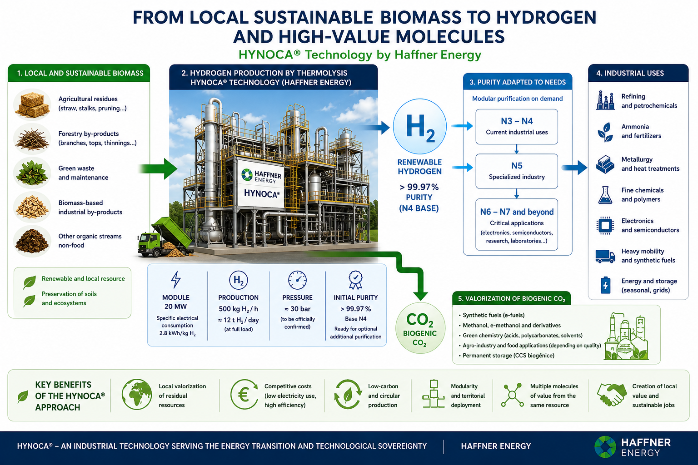
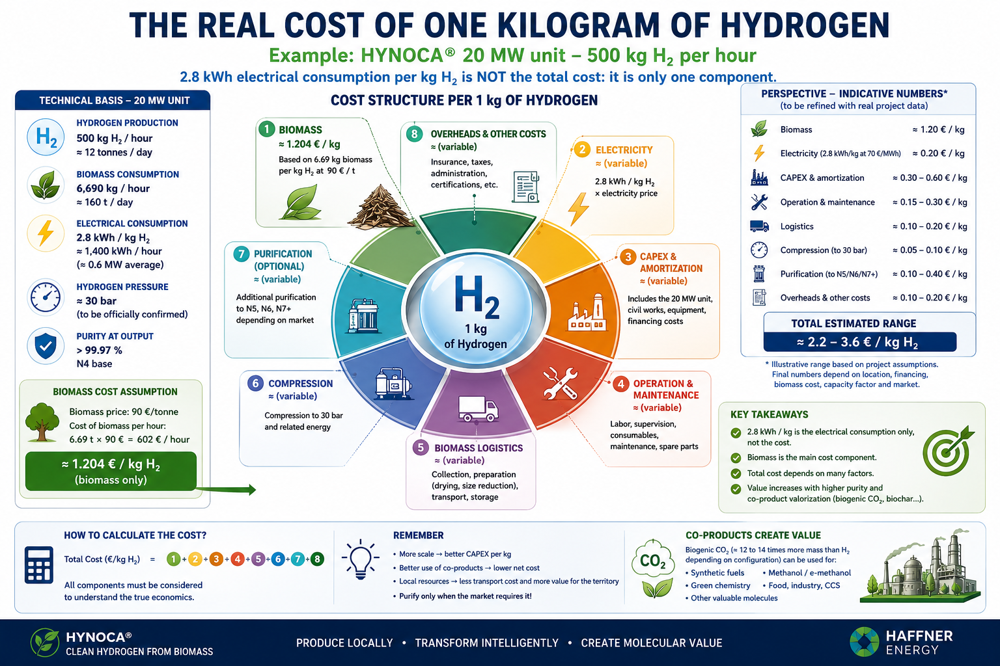
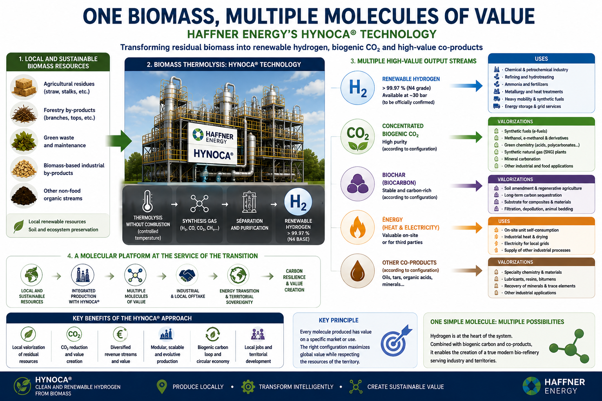
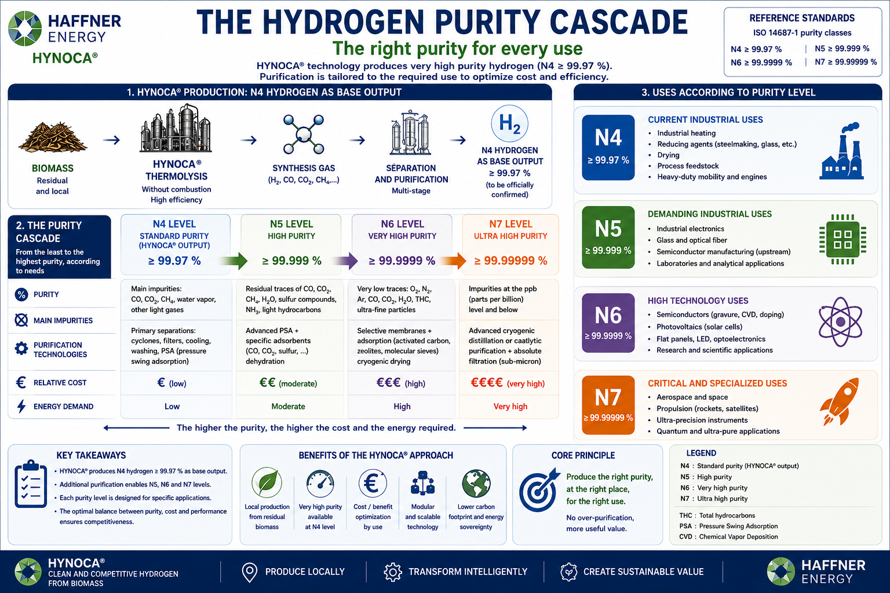
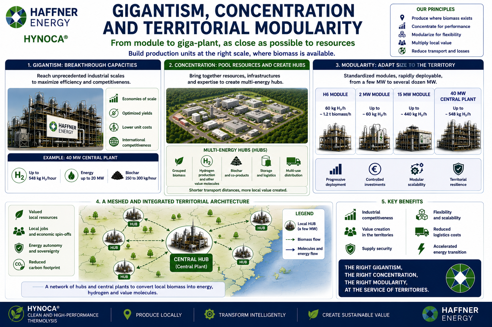
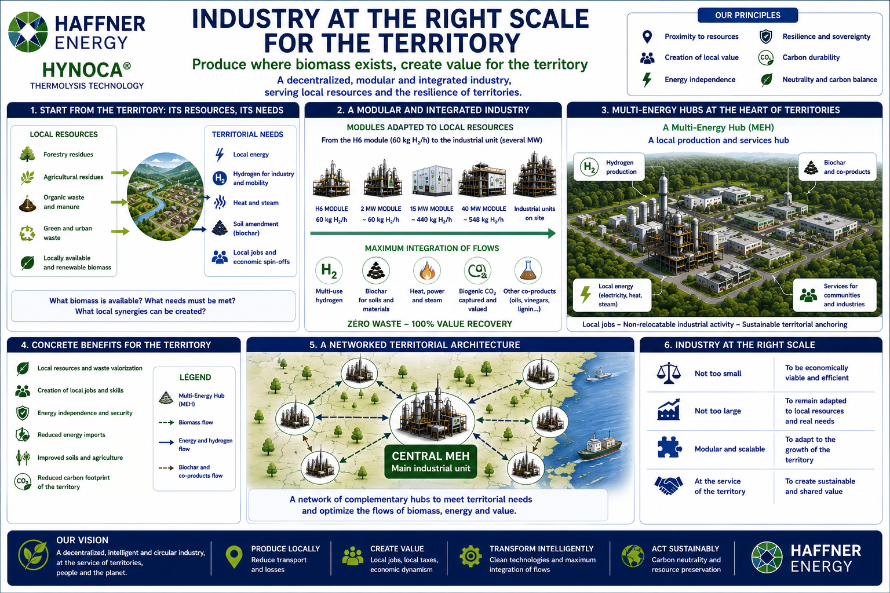

# ATLAS OF HIGH-VALUE HYDROGEN [(French version - FR)](Atlas_hydrogene_Haffner_Energy_FR.md)

## From local residual biomass to very high-purity industrial applications

### Territorial production, purity, economics and industrial modularity

> **Version 1.0 — August 2026**
>
> This Atlas examines hydrogen uses according to purity and specifications, taking the HYNOCA® technology developed by Haffner Energy as its starting point. Publicly documented data are distinguished from technical performance figures announced but not yet officially published. Any data relating to the future 20 MW configuration will need to be verified and updated when officially disclosed.

---

# Introduction — One simple molecule, radically different markets

Hydrogen is chemically a simple molecule. Yet, from an industrial perspective, there is no single hydrogen market. Hydrogen intended for large-volume chemical synthesis, a metallurgical process, the production of synthetic fuels, an electronics application or the semiconductor industry does not necessarily meet the same requirements. The difference lies not only in the quantity of hydrogen produced, but also in its purity, in the exact nature of the impurities it contains and in the producer's ability to guarantee these characteristics all the way to the point of use.

This Atlas begins with a particularly interesting technological case: renewable hydrogen production through biomass thermolysis using the HYNOCA® technology developed by Haffner Energy. The hydrogen produced has an announced initial purity above 99.97%. This quality already provides an important basis for many industrial applications and can also serve as a high-quality feedstock for additional purification stages when these are economically justified.

The interest of this approach is not limited to the molecule's initial quality. It also relies on potentially competitive production when biomass is locally available and used in an industrial system designed at the right scale. The actual cost of hydrogen then depends on several parameters: biomass price and preparation, electricity consumption, industrial investment, operation, maintenance, logistics, compression, storage, possible transport and, for certain markets, the cost of additional purification modules.

The central question of this Atlas is therefore:

> **How can a hydrogen molecule produced locally from residual biomass move up the value chain, from large industrial markets to the most demanding applications in terms of purity?**

---

# 1. The starting point: HYNOCA® and hydrogen above 99.97%

The HYNOCA® technology developed by Haffner Energy uses biomass thermolysis to produce synthesis gas, then separate and treat hydrogen. One of the advantages of this route is that it does not rely on the same energy architecture as an electrolyser: the energy contained in the biomass directly contributes to the molecular production process.

The hydrogen obtained has an initial purity above 99.97%. This quality is already close to the range commonly associated, in a simplified nomenclature, with high-purity categories. However, it should be remembered that designations such as N3, N4, N5, N6 or higher do not always fully describe an industrial specification. The nature of residual impurities — water, oxygen, nitrogen, carbon monoxide, carbon dioxide, hydrocarbons or other contaminants — can be as important as the overall purity percentage.

Hydrogen above 99.97% can therefore represent two things at the same time: a product directly usable for certain markets and a high-quality feedstock for additional purification. This second possibility is essential. It avoids designing the entire plant as an installation that must produce the highest imaginable purity from the outset.

The most rational strategy is to produce an excellent initial quality and then add purification modules when the market, contracts and value created genuinely justify this additional expense.

---

# 2. The 20 MW configuration: high capacity without becoming an infinite-scale plant

The development of a future 20 MW configuration represents another industrial scale. According to the technical information currently used as a working basis for this Atlas, this unit would target production of approximately **500 kg of hydrogen per hour**, corresponding to a theoretical maximum capacity of around **12 tonnes per day** under continuous operation.

In this scenario, the hydrogen would be produced at a pressure of approximately **30 bar**, a point that will need to be confirmed when the final technical specifications are officially published. This pressure matters when understanding the overall balance of the chain, because outlet pressure is not a minor detail: it influences additional compression requirements depending on the final method of storage, transport and use.

The planned specific electricity consumption would be around **2.8 kWh per kilogram of hydrogen**. This figure is not a production cost. It only indicates the quantity of electricity consumed for each kilogram produced under the conditions considered.

It must therefore be clearly separated from the other economic components.

For a production rate of 500 kg of hydrogen per hour, with approximately **6,690 kg of biomass consumed per hour**, the biomass cost at **€90 per tonne** represents around **€602.10 per hour**, or approximately **€1.20/kg of hydrogen** for the feedstock alone.

The calculation is:

$$
6.69\ \text{t/h} \times 90\ €/t = 602.10\ €/h
$$

$$
602.10\ €/h \div 500\ \text{kg H₂/h} = 1.2042\ €/kg H₂
$$

To this component must then be added the electricity consumption:

$$
2.8\ \text{kWh/kg H₂} \times electricity\ price
$$

followed by industrial investment, depreciation, operation, maintenance, biomass preparation and logistics, as well as any additional purification stages.

The total cost can therefore never be reduced to the single figure of **2.8 kWh/kg**. This strong electrical performance is an important parameter in the economic model, but only one of its parameters.

> **Low specific electricity consumption reduces one component of the cost. It does not replace biomass or industrial capital.**

The performance figures for the 20 MW configuration described in this section will need to be updated when the official technical data are published.

---

# 3. The real production system: the territory

A high-power installation cannot be sized independently of its environment. In a biomass-based model, the ultimate limit is not only the size that industry knows how to build. It is also determined by the quantity of biomass that a territory can supply sustainably.

For a unit consuming approximately 6.69 tonnes of biomass per hour, the resource mobilised becomes considerable. On a daily basis, this represents more than 160 tonnes. Over a full year of operation, such volumes require precise mapping of available resources, their seasonality, their cost, their logistical density and, above all, their genuinely sustainable character.

The objective should not be to search ever farther for biomass in order to keep an artificially oversized plant operating. The logic should be the opposite: determine what the territory can provide without degrading its capacity for regeneration, then adapt the number and size of industrial units to that reality.

Priority should be given to flows that do not require the destruction of new ecosystems: agricultural residues, processing by-products, green waste, maintenance biomass, biomass-derived industrial waste and other organic flows that are genuinely available locally. Forest residues must also be assessed carefully, because excessive extraction can impoverish forest soils and ecosystems.

Renewable biomass is not necessarily biomass available without limit. This distinction is one of the fundamental principles of the Atlas.

> **The size of an installation should be determined not only by what it can produce, but also by what the territory can sustainably provide.**

---

# 4. One installation, several high-value molecules

The economic value of a technology such as HYNOCA® should not be assessed exclusively through the selling price of one kilogram of hydrogen. Biomass transformation can generate several streams that may be monetised depending on the technological configuration and the markets that can actually be reached.

Hydrogen is the primary value stream. Its destination can vary according to its purity and specifications. Concentrated biogenic CO₂ is another potentially strategic stream when it can be used industrially, locally valorised or combined with hydrogen in certain synthesis routes.

Depending on the technologies and value chains considered, the combination of hydrogen and biogenic carbon can open possibilities for certain synthetic fuels, methanol and its derivatives, synthetic methane and other chemical molecules.

This multi-product logic can strengthen the economic resilience of an installation. When the price of one product falls, other streams may retain value. But no co-product should automatically be treated as a source of revenue: **a molecule has economic value only if a customer, a use and a value chain capable of absorbing it genuinely exist.**

---

# 5. The purity cascade

One of the central ideas of this Atlas is that the entire production should not be pushed towards maximum purity.

One kilogram of hydrogen intended for a large-volume process does not necessarily need to be purified to N6, N7 or beyond. Doing so would represent an unnecessary expense and could potentially reduce the competitiveness of the product.

The optimal model is a cascade. Initial production above 99.97% can directly supply markets compatible with that quality. Only part of the production can be directed towards additional modules. At each stage, the quantity available for the highest purity levels may decrease, while the value per kilogram may increase.

The logic therefore becomes:

- high initial quality for compatible industrial markets;
- additional purification towards N4 or N5 when specialised customers justify it;
- N6 and higher levels for the most sensitive applications;
- tailor-made specifications when the overall purity percentage is no longer sufficient to describe the actual requirements.

This architecture makes it possible to follow demand instead of imposing maximum quality on the entire production.

> **The best molecule is not necessarily the purest one. It is the one whose quality precisely matches the process that uses it.**

---

# 6. From large volumes to extreme specialisation

Purity categories provide a useful educational way to represent a gradual increase in industrial specialisation. In practice, each market must be studied according to its own specifications.

Levels corresponding approximately to N3 and N4 cover a range in which potential volumes can remain very large. Major chemical and industrial processes can represent substantial outlets, provided that the contaminants present are compatible with the equipment involved.

N5 and N6 progressively lead towards more specialised markets. The potential value per kilogram may increase, but demand becomes more concentrated in certain sectors and territories.

N7 and higher correspond to needs for which the question is no longer only the total size of the market. Proximity to an industrial or scientific cluster may become decisive. Producing several tonnes per day of ultra-high-purity hydrogen in a region with no users requiring that level of quality could become economically absurd.

A global mapping effort will therefore gradually need to cross-reference purity level, quantities consumed, industrial sectors, countries and the geographical concentration of customers.

The question will no longer simply be: “Which country consumes the most hydrogen?”

It will become:

> **Which territory consumes what quantity of hydrogen, with which specifications, for which processes and at what distance from a competitive production source?**

---

# 7. The trap of ultra-high-purity hydrogen

Very large production of N7, N8 or even higher purity hydrogen may appear technologically impressive. But it does not automatically constitute an economic advantage.

The most demanding markets are generally much narrower than mass industrial markets. Excessive growth in supply could put downward pressure on prices if demand does not keep pace.

Production should therefore be designed at several levels. An installation can produce a large quantity of industrial-grade hydrogen and reserve only a limited fraction for extreme purification. This fraction can gradually increase as contracts, customers and specialised industries develop.

The model thus becomes scalable. A unit is not necessarily frozen for its entire operating life. It can receive additional purification modules if an electronics, scientific or advanced industrial cluster emerges within its area of influence.

> **Modularity makes it possible to avoid building today a purification capacity whose market may not exist until tomorrow.**

---

# 8. The global market is not evenly distributed

Industrial hydrogen consumption is heavily concentrated in major economies and in regions with significant chemical, energy or manufacturing activity. Very high-purity markets have a different geography, more closely linked to advanced-technology clusters.

The Atlas will therefore gradually need to distinguish several major categories of territories: regions with high industrial consumption, major refining and chemical centres, ammonia and fertiliser production areas, electronics clusters, semiconductor regions and areas specialised in advanced scientific research and manufacturing.

A future global map should make it possible to visualise the meeting point of three elements:

> **sustainable resource + production capacity + suitable customer**

It is at the intersection of these three elements that the true potential of a unit lies.

---

# 9. Local does not mean autarky

Producing locally does not mean rejecting international trade. It would neither be realistic nor desirable to ask every territory to manufacture every product it consumes.

The logic is different. The aim is to avoid unnecessarily transporting large quantities of bulky raw materials when their transformation can take place near their source.

Biomass often has a relatively low value density compared with the molecules or products obtained after transformation. When local processing is relevant, it can reduce the transport of raw material and create additional economic activity.

Part of the production can then remain local, while another part can be exported.

> **Local production can be the first stage of a global value chain, rather than its opposite.**

---

# 10. Modularity versus gigantism: an open question

A large plant is not inherently a mistake. Some complex forms of production require a concentration of skills, machinery, suppliers and processes that justifies very large scale.

But the constant pursuit of gigantism has a limit: some costs do not disappear. They are simply shifted outside the plant.

A very large installation can require considerable infrastructure, massive resource concentration, heavy logistics, regional economic dependence and strong systemic vulnerability when it stops operating.

When a region depends on a single dominant activity, a production shutdown can simultaneously affect employment, businesses, subcontractors, infrastructure and local public finances.

The question is therefore not whether all industry should become small. It is rather:

> **Which activities genuinely need to be concentrated, and which can be reproduced in modular form?**

---

# 11. Economies of scale can also be achieved through replication

Traditional industry often seeks economies of scale by increasing the size of an installation.

Modularity offers another route: building many standardised units.

The first unit may be expensive to design. But when an industrial model is replicated, improved and standardised, design and engineering costs can be spread across a large number of installations.

The system therefore does not necessarily seek to build an infinitely larger plant. It seeks to replicate a proven technical architecture, standardised modules, maintenance procedures, a supply chain and purification solutions adapted to different markets.

Growth then comes from the number of units and their geographical deployment rather than from unlimited concentration in a single territory.

> **Economies of scale do not always come from the size of one plant. They can also come from the intelligent repetition of the same module.**

---

# 12. Industry at the right scale

The fundamental question raised by this Atlas is therefore not only: how should hydrogen be produced?

It is also: **at what scale should it be produced?**

A unit that is too small can be expensive and unable to finance certain equipment. A unit that is too large can require excessive resource concentration and become dependent on a territory that it may itself help to weaken.

The right scale probably lies within a range determined by the quantity of sustainably available biomass, the territory's logistical capacity, proximity to users, the size of local and regional markets, the possibility of valorising co-products and the ability to reproduce the installation elsewhere.

In this vision, a 20 MW configuration is not necessarily a symbol of gigantism. It can represent an industrial unit large enough to improve the economics of the process while remaining replicable across different resource basins.

The central principle becomes:

> **The optimal size of an installation is not the largest possible one. It is the largest one that remains compatible with sustainably available resources and the territory's real economic needs.**

---

# Conclusion — One molecule, several levels of value, several industrial scales

Hydrogen produced through biomass thermolysis represents a particularly interesting route when it combines good initial purity, low specific electricity consumption and an economic model based on the local valorisation of sustainably available resources.

The development of higher-capacity units can improve certain economic and energy performances. But greater capacity also implies greater biomass consumption and must therefore be designed according to the actual capacity of the territory.

The future of this approach probably does not lie solely in building a limited number of gigantic plants capable of concentrating ever more resources on the same site.

It may also lie in a network of units adapted to territories, producing a significant but limited quantity of hydrogen and then directing that production towards several levels of value.

Part of the output can remain at its initial purity for large industrial markets. Another part can be progressively purified for more demanding uses. Biogenic CO₂ can, when a market exists, enter other value chains.

This architecture offers another vision of industry.

> **Produce locally. Transform intelligently. Purify only when it creates real value. Replicate rather than oversize.**

The objective is neither to produce infinitely pure hydrogen nor an infinite quantity of energy.

The objective is to build industrial systems capable of producing enough, at a competitive cost, while respecting the ability of territories to continue existing, regenerating themselves and diversifying their economies.

---

# Sources and reference documents

## Haffner Energy — HYNOCA® C-iC

- Technical datasheet: https://www.haffner-energy.com/fr/hynocac-ic-datasheet/
- Indicative price of the documented configuration: €4,970,000 excluding VAT.
- Technical and economic data should be reviewed directly from the official datasheet whenever this Atlas is updated.

## Haffner Energy — documents and updates

- Official website: https://www.haffner-energy.com/
- H6 generation: https://www.haffner-energy.com/fr/haffner-energy-unveils-the-h6-generation/

---

# Technical scope and evolving data

This Atlas deliberately distinguishes between **publicly documented data** and **prospective data used as working assumptions** for the future 20 MW configuration. This distinction is particularly important for the envisaged hourly production rate, biomass consumption, specific electricity consumption and hydrogen outlet pressure, all of which will need to be updated when the final technical specifications are officially published.

The figures relating to the 20 MW configuration should therefore be read as a representation of the technical scenario currently studied in this Atlas, and not as a final manufacturer's datasheet. Data confirmed by official Haffner Energy documents, on the other hand, retain their status as the reference for equipment already publicly documented.

Likewise, the educational purity nomenclature — N3, N4, N5, N6, N7 and beyond — does not replace detailed industrial specifications. Depending on the final application, the nature and concentration of residual impurities may be more important than the simple number of “9s” appearing in a purity percentage.

The Atlas is intended to evolve as new public data make it possible to refine the economics of production, the costs and energy consumption of purification stages, market structure by purity level, the sectoral and geographical distribution of demand and the identification of needs genuinely compatible with N6, N7, N8 and higher levels.

This evolution is not a qualification of the general reasoning presented here. It corresponds to the normal functioning of a technical Atlas: a stable structure progressively enriched with more precise data, additional sources and sectoral mapping.
