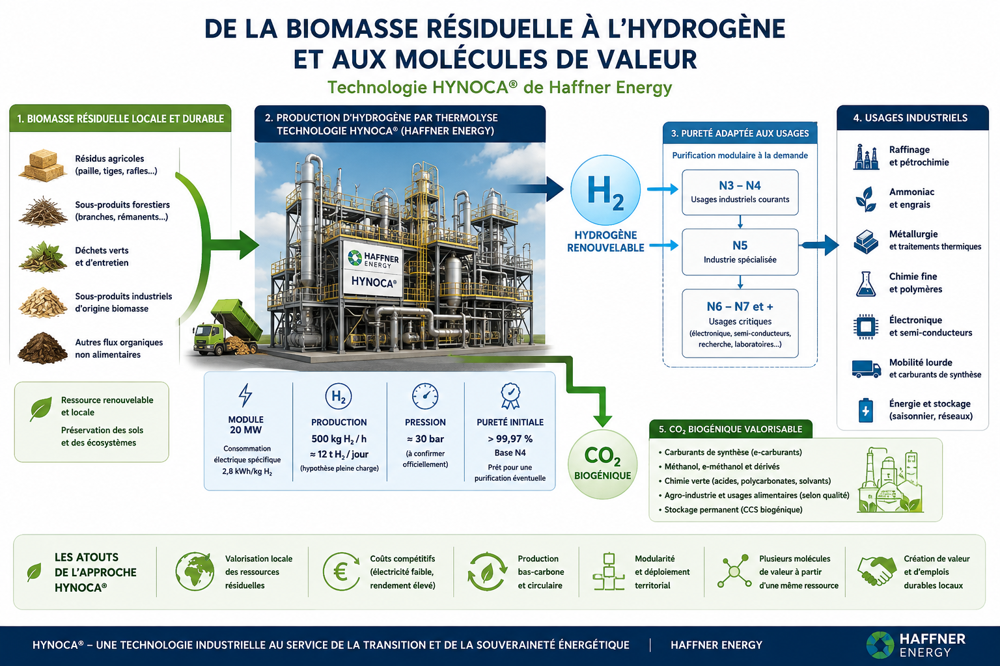
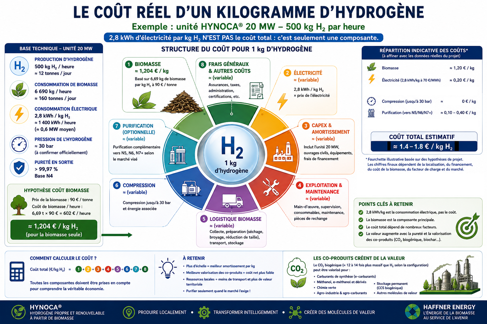
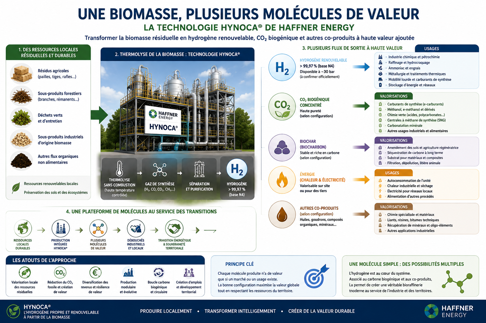
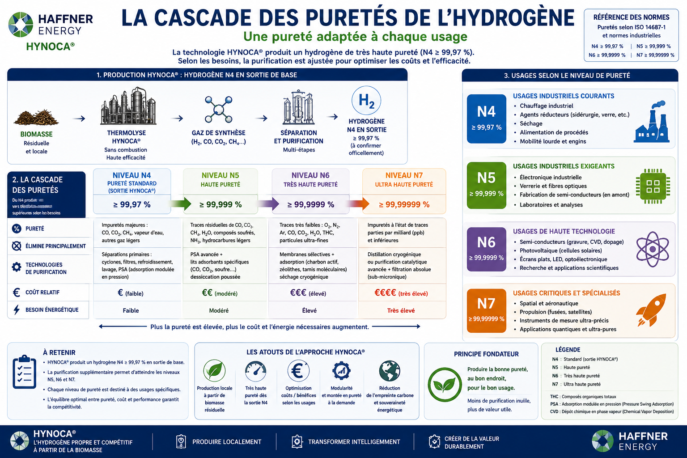
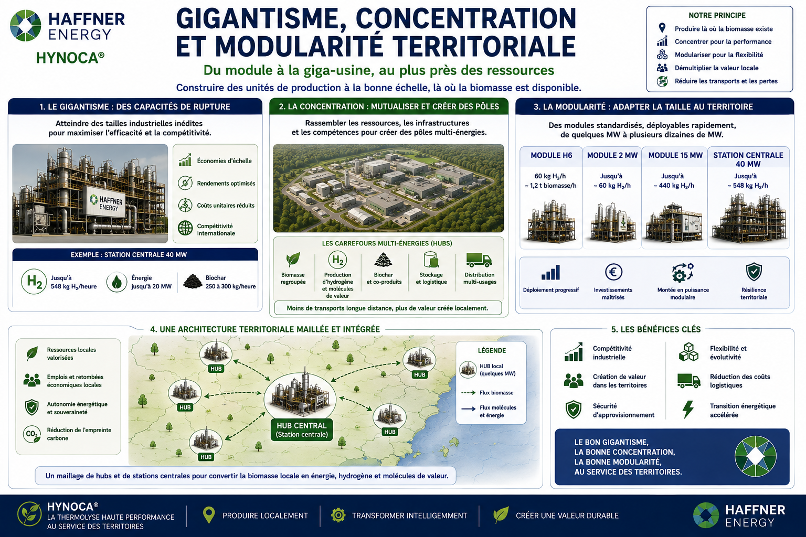
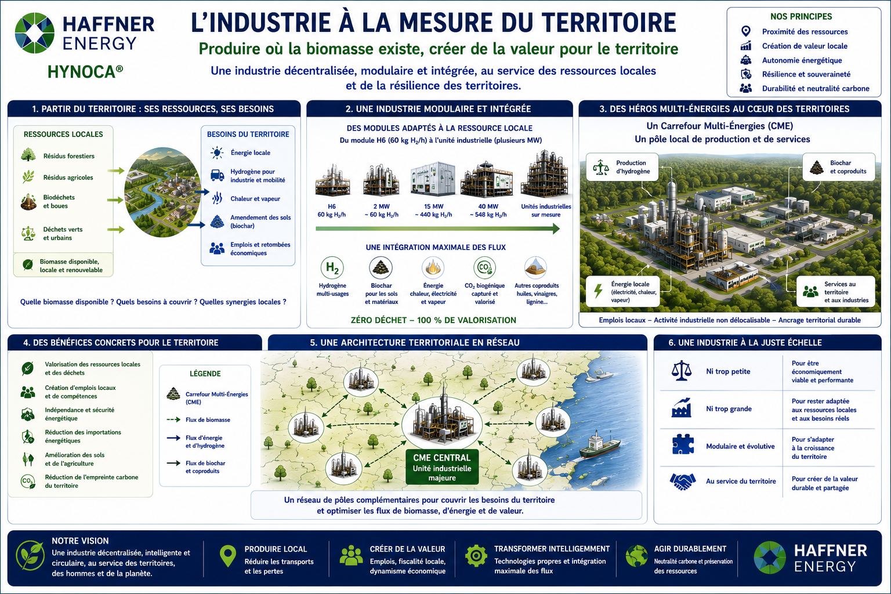

# ATLAS DE L'HYDROGÈNE À HAUTE VALEUR [(English version - EN)](Atlas_hydrogen_Haffner_Energy_EN.md)

## De la biomasse résiduelle locale aux usages industriels de très haute pureté

### Production territoriale, pureté, économie et modularité industrielle

> **Version 1.0 — août 2026**
>
> Cet Atlas étudie les usages de l'hydrogène en fonction de sa pureté et de ses spécifications, en prenant comme point de départ la technologie HYNOCA® développée par Haffner Energy. Les données publiques sont distinguées des performances techniques annoncées mais pas encore publiées officiellement. Toute donnée relative à la future configuration 20 MW devra être vérifiée et actualisée lors de sa divulgation officielle.

---

# Introduction — Une molécule simple, des marchés radicalement différents

L'hydrogène est chimiquement une molécule simple. Pourtant, sur le plan industriel, il n'existe pas un unique marché de l'hydrogène. Un hydrogène destiné à une synthèse chimique de grand volume, à un procédé métallurgique, à la fabrication de carburants de synthèse, à une application électronique ou à une industrie de semi-conducteurs ne répond pas nécessairement aux mêmes exigences. La différence ne réside pas seulement dans la quantité d'hydrogène produite, mais dans sa pureté, dans la nature exacte des impuretés qu'il contient et dans la capacité du producteur à garantir ces caractéristiques jusqu'au point d'utilisation.

Cet Atlas part d'un cas technologique particulièrement intéressant : la production d'hydrogène renouvelable par thermolyse de biomasse selon la technologie HYNOCA® développée par Haffner Energy. L'hydrogène produit présente une pureté initiale annoncée supérieure à 99,97 %. Cette qualité constitue déjà une base importante pour de nombreux usages industriels et peut également servir de matière première à des étapes complémentaires de purification lorsque celles-ci sont économiquement justifiées.

L'intérêt de cette approche ne se limite cependant pas à la qualité initiale de la molécule. Il repose également sur une production potentiellement compétitive lorsque la biomasse est disponible localement et valorisée dans un système industriel conçu à la bonne échelle. Le coût réel de l'hydrogène dépend alors de plusieurs paramètres : prix et préparation de la biomasse, consommation électrique, investissement industriel, exploitation, maintenance, logistique, compression, stockage, transport éventuel et, pour certains marchés, coût des modules supplémentaires de purification.

La question centrale de cet Atlas est donc la suivante :

> **Comment une molécule d'hydrogène produite localement à partir de biomasse résiduelle peut-elle progresser dans la chaîne de valeur, depuis les grands marchés industriels jusqu'aux usages les plus exigeants en matière de pureté ?**

---

# 1. Le point de départ : HYNOCA® et l'hydrogène à plus de 99,97 %

La technologie HYNOCA® développée par Haffner Energy utilise la thermolyse de la biomasse pour produire un gaz de synthèse, puis séparer et traiter l'hydrogène. L'un des intérêts de cette voie est qu'elle ne repose pas sur la même architecture énergétique qu'un électrolyseur : l'énergie contenue dans la biomasse participe directement au processus de production moléculaire.

L'hydrogène obtenu présente une pureté initiale supérieure à 99,97 %. Cette qualité se situe déjà à proximité du domaine couramment associé, dans une nomenclature simplifiée, aux catégories de haute pureté. Il faut néanmoins rappeler que les désignations N3, N4, N5, N6 ou davantage ne suffisent pas toujours à décrire une spécification industrielle complète. La nature des impuretés résiduelles — eau, oxygène, azote, monoxyde de carbone, dioxyde de carbone, hydrocarbures ou autres contaminants — peut être aussi importante que le pourcentage global de pureté.

L'hydrogène à plus de 99,97 % peut donc constituer simultanément deux choses : un produit directement utilisable pour certains marchés et une matière première de grande qualité pour une purification complémentaire. Cette seconde possibilité est essentielle. Elle évite de concevoir toute l'usine comme une installation devant produire dès l'origine la pureté maximale imaginable.

La stratégie la plus rationnelle consiste à produire une excellente qualité initiale, puis à ajouter des modules de purification lorsque le marché, les contrats et la valeur créée justifient réellement cette dépense.

---

# 2. Le 20 MW : une grande capacité sans être une usine infinie

Le développement d'une future configuration de 20 MW représente une autre échelle industrielle. Selon les informations techniques actuellement utilisées comme base de travail pour cet Atlas, cette unité viserait une production d'environ **500 kg d'hydrogène par heure**, soit une capacité théorique maximale de l'ordre de **12 tonnes par jour** en fonctionnement continu.

Dans ce scénario, l'hydrogène serait produit à une pression d'environ **30 bar**, point qui devra être confirmé lors de la publication officielle des caractéristiques techniques définitives. Cette pression est importante pour comprendre le bilan global de la chaîne, car la pression de sortie n'est pas un détail : elle influence les besoins de compression supplémentaires selon le mode de stockage, de transport et d'utilisation finale.

La consommation électrique spécifique envisagée serait d'environ **2,8 kWh par kilogramme d'hydrogène**. Cette donnée ne constitue pas un coût de production. Elle indique uniquement la quantité d'électricité consommée pour chaque kilogramme produit dans les conditions considérées.

Il faut donc la séparer clairement des autres postes économiques.

Pour une production de 500 kg d'hydrogène par heure, avec environ **6 690 kg de biomasse consommés par heure**, le coût de la biomasse à **90 €/tonne** représente environ **602,10 € par heure**, soit environ **1,20 €/kg d'hydrogène** pour la matière première seule.

Le calcul est le suivant :

$$
6.69\,\mathrm{t/h} \times 90\,\mathrm{EUR/t} = 602.10\,\mathrm{EUR/h}
$$

$$
602.10\,\mathrm{EUR/h} \div 500\,\mathrm{kg\,H_2/h} = 1.2042\,\mathrm{EUR/kg\,H_2}
$$

À cette composante doivent ensuite s'ajouter la consommation électrique :

$$
2.8\,\mathrm{kWh/kg\,H_2} \times \mathrm{prix\ de\ l'électricité}
$$

puis l'investissement industriel, son amortissement, l'exploitation, la maintenance, la préparation et la logistique de la biomasse, ainsi que les éventuelles étapes supplémentaires de purification.

Le coût total ne peut donc jamais être réduit à la seule donnée de **2,8 kWh/kg**. Cette excellente performance électrique constitue un paramètre important du modèle économique, mais seulement l'un de ses paramètres.

> **Une faible consommation électrique spécifique réduit une composante du coût. Elle ne remplace ni la biomasse ni le capital industriel.**

Les performances de la configuration 20 MW décrites dans cette section devront être mises à jour lorsque les données techniques officielles seront publiées.

---

# 3. Le véritable système de production : le territoire

Une installation de grande puissance ne peut pas être dimensionnée indépendamment de son environnement. Dans un modèle utilisant de la biomasse, la limite ultime n'est pas uniquement la taille que l'industrie sait construire. Elle est également déterminée par la quantité de biomasse qu'un territoire peut fournir durablement.

Pour une unité consommant environ 6,69 tonnes de biomasse par heure, la ressource mobilisée devient considérable. À l'échelle d'une journée, cela représente plus de 160 tonnes. À l'échelle d'une année de fonctionnement, les volumes imposent une cartographie précise des ressources disponibles, de leur saisonnalité, de leur coût, de leur densité logistique et surtout de leur caractère réellement durable.

L'objectif ne doit pas être de chercher toujours plus loin de la biomasse afin de maintenir une usine artificiellement surdimensionnée. La logique doit être inverse : déterminer ce que le territoire peut céder sans dégrader sa capacité de régénération, puis adapter le nombre et la taille des unités industrielles à cette réalité.

La priorité doit être donnée aux flux qui n'exigent pas la destruction de nouveaux écosystèmes : résidus agricoles, sous-produits de transformation, déchets verts, biomasse d'entretien, déchets industriels d'origine biomasse et autres flux organiques réellement disponibles localement. Les résidus forestiers doivent eux aussi être évalués avec prudence, car une extraction excessive peut appauvrir les sols et les écosystèmes forestiers.

Une biomasse renouvelable n'est pas nécessairement une biomasse disponible sans limite. Cette distinction constitue l'un des principes fondamentaux de l'Atlas.

> **La taille d'une installation devrait être déterminée non seulement par ce qu'elle sait produire, mais aussi par ce que le territoire peut durablement lui fournir.**

---

# 4. Une installation, plusieurs molécules de valeur

L'intérêt économique d'une technologie comme HYNOCA® ne doit pas être évalué exclusivement en fonction du prix de vente d'un kilogramme d'hydrogène. La transformation de la biomasse peut générer plusieurs flux susceptibles d'être valorisés selon la configuration technologique et les marchés accessibles.

L'hydrogène constitue le premier flux de valeur. Sa destination peut varier selon sa pureté et ses spécifications. Le CO₂ biogénique concentré constitue un autre flux potentiellement stratégique lorsqu'il peut être utilisé industriellement, valorisé localement ou associé à de l'hydrogène dans certaines voies de synthèse.

Selon les technologies et les chaînes de valeur considérées, l'association d'hydrogène et de carbone biogénique peut ouvrir des possibilités pour certains carburants de synthèse, le méthanol et ses dérivés, le méthane de synthèse et d'autres molécules chimiques.

Cette logique multi-produits peut renforcer la résilience économique d'une installation. Lorsque le prix d'un produit baisse, les autres flux peuvent conserver une valeur. Mais il ne faut pas considérer automatiquement chaque coproduit comme une source de revenu : **une molécule n'a une valeur économique que si un client, une utilisation et une filière capable de l'absorber existent réellement.**

---

# 5. La cascade des puretés

L'une des idées centrales de cet Atlas est que toute la production ne doit pas être poussée vers la pureté maximale.

Un kilogramme d'hydrogène destiné à un procédé de grand volume n'a pas nécessairement besoin d'être purifié jusqu'à N6, N7 ou davantage. Le faire représenterait une dépense inutile et réduirait potentiellement la compétitivité du produit.

Le modèle optimal est une cascade. La production initiale à plus de 99,97 % peut alimenter directement les marchés compatibles avec cette qualité. Une partie seulement peut être dirigée vers des modules complémentaires. À chaque étape, la quantité disponible pour les niveaux les plus élevés peut diminuer, tandis que la valeur par kilogramme peut augmenter.

La logique devient donc la suivante :

- une qualité initiale élevée pour les marchés industriels compatibles ;
- une purification complémentaire vers N4 ou N5 lorsque des clients spécialisés le justifient ;
- des niveaux N6 et au-delà pour les applications les plus sensibles ;
- des spécifications sur mesure lorsque le pourcentage global de pureté ne suffit plus à décrire les besoins.

Cette architecture permet de suivre la demande au lieu d'imposer une qualité maximale à toute la production.

> **La meilleure molécule n'est pas nécessairement la plus pure. C'est celle dont la qualité correspond précisément au procédé qui l'utilise.**

---

# 6. Des grands volumes à la spécialisation extrême

Les catégories de pureté constituent une manière pédagogique de représenter une montée progressive dans la spécialisation industrielle. Dans la pratique, chaque marché doit être étudié selon ses propres spécifications.

Les niveaux correspondant approximativement à N3 et N4 couvrent une zone où les volumes potentiels peuvent rester très importants. Les grands procédés chimiques et industriels peuvent représenter des débouchés considérables, à condition que les contaminants présents soient compatibles avec les installations.

Les niveaux N5 et N6 conduisent progressivement vers des marchés plus spécialisés. La valeur potentielle par kilogramme peut augmenter, mais la demande devient plus concentrée dans certains secteurs et certains territoires.

Les niveaux N7 et au-delà correspondent à des besoins où la question n'est plus seulement le volume total du marché. La proximité d'un cluster industriel ou scientifique peut devenir déterminante. Produire plusieurs tonnes par jour d'hydrogène ultra-pur dans une région qui ne possède aucun utilisateur de ce niveau de qualité pourrait devenir économiquement absurde.

Il faudra donc construire progressivement une cartographie croisant le niveau de pureté, les quantités consommées, les secteurs industriels, les pays et la concentration géographique des clients.

La question ne sera plus simplement : « Quel pays consomme le plus d'hydrogène ? »

Elle deviendra :

> **Quel territoire consomme quelle quantité d'hydrogène, avec quelles spécifications, pour quels procédés et à quelle distance d'une source de production compétitive ?**

---

# 7. Le piège de l'hydrogène ultra-pur

Une production très élevée d'hydrogène N7, N8 ou au-delà pourrait sembler technologiquement impressionnante. Mais elle ne constitue pas automatiquement un avantage économique.

Les marchés les plus exigeants sont généralement beaucoup plus étroits que les marchés industriels de masse. Une augmentation excessive de l'offre pourrait exercer une pression sur les prix si la demande ne suit pas.

La production doit donc être conçue à plusieurs niveaux. Une installation peut produire une grande quantité d'hydrogène de qualité industrielle et réserver une fraction limitée à la purification extrême. Cette fraction peut augmenter progressivement à mesure que les contrats, les clients et les industries spécialisées se développent.

Le modèle devient ainsi évolutif. Une unité n'est pas nécessairement figée pour toute sa durée de vie. Elle peut recevoir de nouveaux modules de purification si un cluster électronique, scientifique ou industriel apparaît dans sa zone d'influence.

> **La modularité permet de ne pas construire aujourd'hui une capacité de purification dont le marché n'existera peut-être que demain.**

---

# 8. Le marché mondial n'est pas réparti uniformément

L'hydrogène industriel est fortement concentré dans les grandes économies et dans les régions possédant une activité chimique, énergétique ou manufacturière importante. Les marchés de très haute pureté présentent une géographie différente, davantage liée aux clusters de technologies avancées.

L'Atlas devra donc distinguer progressivement plusieurs grandes catégories de territoires : les régions de forte consommation industrielle, les grands centres de raffinage et de chimie, les zones de production d'ammoniac et d'engrais, les clusters électroniques, les régions spécialisées dans les semi-conducteurs et les zones de recherche et de fabrication scientifique avancée.

Une future cartographie mondiale devra permettre de visualiser la rencontre de trois éléments :

> **ressource durable + capacité de production + client adapté**

C'est à l'intersection de ces trois éléments que se trouve le véritable potentiel d'une unité.

---

# 9. Le local n'est pas l'autarcie

Produire localement ne signifie pas refuser les échanges internationaux. Il ne serait ni réaliste ni souhaitable de demander à chaque territoire de fabriquer tous les produits qu'il consomme.

La logique est différente. Il s'agit d'éviter de transporter inutilement de grandes quantités de matières premières volumineuses lorsque leur transformation peut être réalisée près de leur source.

La biomasse possède souvent une densité de valeur relativement faible par rapport aux molécules ou produits obtenus après transformation. Lorsqu'une transformation locale est pertinente, elle peut réduire les transports de matière brute et créer une activité économique supplémentaire.

Une partie de la production peut ensuite rester sur place et une autre partie être exportée.

> **La production locale peut être la première étape d'une chaîne mondiale, et non son opposé.**

---

# 10. La modularité face au gigantisme : une question ouverte

La grande usine n'est pas intrinsèquement une erreur. Certaines productions complexes nécessitent une concentration de compétences, de machines, de fournisseurs et de procédés qui justifie une très grande taille.

Mais la recherche permanente du gigantisme possède une limite : certains coûts ne disparaissent pas. Ils sont simplement déplacés hors de l'usine.

Une très grande installation peut exiger des infrastructures considérables, une concentration massive de ressources, une logistique lourde, une dépendance économique régionale et une forte vulnérabilité systémique lorsqu'elle s'arrête.

Lorsqu'une région dépend d'une seule activité dominante, un arrêt de production peut affecter simultanément l'emploi, les commerces, les sous-traitants, les infrastructures et les finances publiques locales.

La question n'est donc pas de savoir si toute industrie doit devenir petite. Elle est plutôt la suivante :

> **Quelles activités doivent réellement être concentrées et lesquelles peuvent être reproduites sous forme de modules ?**

---

# 11. Les économies d'échelle peuvent aussi être obtenues par réplication

L'industrie traditionnelle recherche souvent des économies d'échelle en augmentant la taille d'une installation.

La modularité propose une autre voie : construire de nombreuses unités standardisées.

La première unité peut être coûteuse à concevoir. Mais lorsqu'un modèle industriel est reproduit, amélioré et standardisé, les coûts de conception et d'ingénierie peuvent être répartis sur un grand nombre d'installations.

Le système ne cherche donc pas nécessairement à construire une usine infiniment plus grande. Il cherche à reproduire une architecture technique éprouvée, des modules standardisés, des procédures de maintenance, une chaîne d'approvisionnement et des solutions de purification adaptées à différents marchés.

La croissance provient alors du nombre d'unités et de leur diffusion géographique plutôt que d'une concentration illimitée dans un seul territoire.

> **Les économies d'échelle ne proviennent pas toujours de la taille d'une usine. Elles peuvent aussi provenir de la répétition intelligente d'un même module.**

---

# 12. L'industrie à la bonne échelle

La question fondamentale posée par cet Atlas n'est donc pas seulement : comment produire de l'hydrogène ?

Elle est également : **à quelle échelle faut-il le produire ?**

Une unité trop petite peut être coûteuse et incapable de financer certains équipements. Une unité trop grande peut exiger une concentration excessive de ressources et devenir dépendante d'un territoire qu'elle contribue elle-même à fragiliser.

La bonne échelle se trouve probablement dans une zone déterminée par la quantité de biomasse durablement disponible, la capacité logistique du territoire, la proximité des utilisateurs, la taille des marchés locaux et régionaux, la possibilité de valoriser les coproduits et la capacité de reproduire l'installation ailleurs.

Dans cette vision, une configuration de 20 MW n'est pas nécessairement un symbole de gigantisme. Elle peut représenter une unité industrielle suffisamment importante pour améliorer l'économie du procédé, tout en restant reproductible dans différents bassins de ressources.

Le principe central devient :

> **La taille optimale d'une installation n'est pas la plus grande possible. C'est la plus grande qui reste compatible avec les ressources durablement disponibles et les besoins économiques réels du territoire.**

---

# Conclusion — Une molécule, plusieurs niveaux de valeur, plusieurs échelles d'industrie

L'hydrogène produit par thermolyse de biomasse représente une voie particulièrement intéressante lorsqu'il combine une bonne pureté initiale, une consommation électrique spécifique réduite et une économie fondée sur la valorisation locale de ressources disponibles de manière durable.

Le développement d'unités de plus grande capacité peut améliorer certaines performances économiques et énergétiques. Mais une capacité plus importante implique également une consommation accrue de biomasse et doit donc être pensée en fonction de la capacité réelle du territoire.

L'avenir de cette approche ne réside probablement pas dans la construction d'un nombre limité d'usines gigantesques capables de concentrer toujours davantage de ressources sur un même site.

Il peut également résider dans un réseau d'unités adaptées aux territoires, produisant une quantité importante mais limitée d'hydrogène, puis dirigeant cette production vers plusieurs niveaux de valeur.

Une partie peut rester à sa pureté initiale pour les grands marchés industriels. Une autre peut être progressivement purifiée vers des usages plus exigeants. Le CO₂ biogénique peut, lorsqu'un marché existe, rejoindre d'autres chaînes de valeur.

Cette architecture propose une autre vision de l'industrie.

> **Produire localement. Transformer intelligemment. Purifier uniquement lorsque cela crée une valeur réelle. Répliquer plutôt que démesurer.**

L'objectif n'est pas de produire un hydrogène infiniment pur ni une quantité infinie d'énergie.

L'objectif est de construire des systèmes industriels capables de produire suffisamment, à un coût compétitif, tout en respectant la capacité des territoires à continuer d'exister, de se régénérer et de diversifier leur économie.

---

# Sources et documents de référence

## Haffner Energy — HYNOCA® C-iC

- Fiche technique : https://www.haffner-energy.com/fr/hynocac-ic-datasheet/
- Prix indicatif de la configuration documentée : 4 970 000 € HT.
- Les données techniques et économiques doivent être relues directement dans la fiche officielle lors de chaque mise à jour de cet Atlas.

## Haffner Energy — documents et actualités

- Site officiel : https://www.haffner-energy.com/
- Génération H6 : https://www.haffner-energy.com/fr/haffner-energy-unveils-the-h6-generation/

---

# Périmètre technique et données en évolution

Cet Atlas distingue volontairement les **données publiques documentées** des **données prospectives utilisées comme hypothèses de travail** pour la future configuration 20 MW. Cette distinction est particulièrement importante pour la production horaire envisagée, la consommation de biomasse, la consommation électrique spécifique et la pression de sortie de l'hydrogène, qui devront être actualisées lorsque les caractéristiques techniques définitives seront publiées officiellement.

Les chiffres relatifs à la configuration 20 MW doivent donc être lus comme une représentation du scénario technique actuellement étudié dans cet Atlas, et non comme une fiche constructeur définitive. Les données confirmées par les documents officiels de Haffner Energy conservent, quant à elles, leur statut de référence pour les équipements déjà documentés publiquement.

De même, la nomenclature pédagogique des puretés — N3, N4, N5, N6, N7 et au-delà — ne remplace pas les spécifications industrielles détaillées. Selon l'usage final, la nature et la concentration des impuretés résiduelles peuvent être plus importantes que le seul nombre de « 9 » figurant dans un pourcentage de pureté.

L'Atlas a vocation à évoluer à mesure que de nouvelles données publiques permettront d'affiner l'économie de la production, les coûts et consommations des étapes de purification, la structure des marchés par niveau de pureté, la répartition sectorielle et géographique de la demande et l'identification des besoins réellement compatibles avec les niveaux N6, N7, N8 et au-delà.

Cette évolution n'est pas une réserve sur le raisonnement général présenté ici. Elle correspond au fonctionnement normal d'un Atlas technique : une structure stable, enrichie progressivement par des données plus précises, des sources supplémentaires et des cartographies sectorielles.

