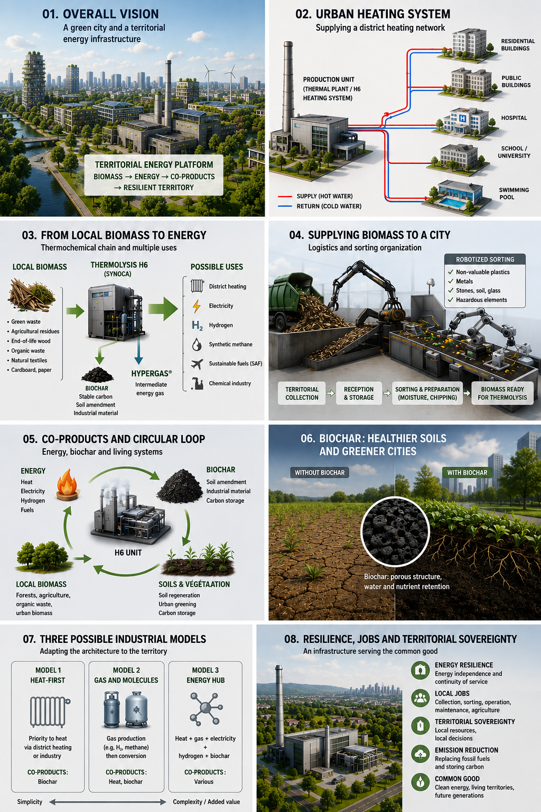
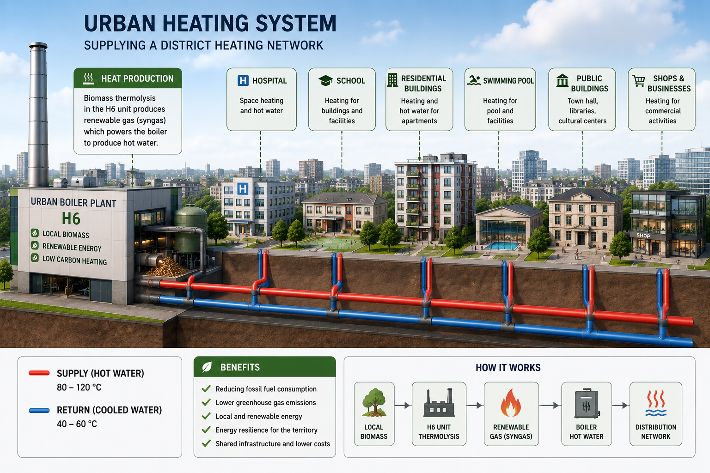
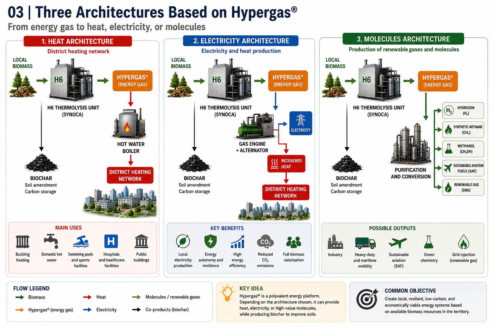
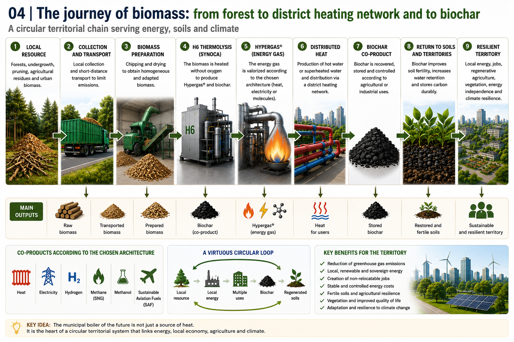
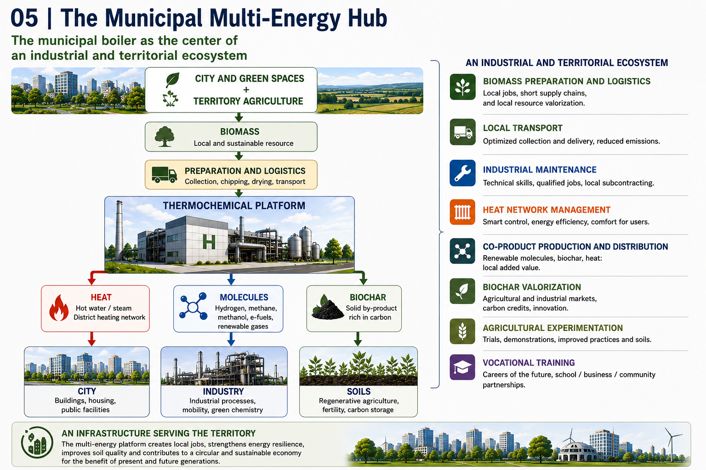
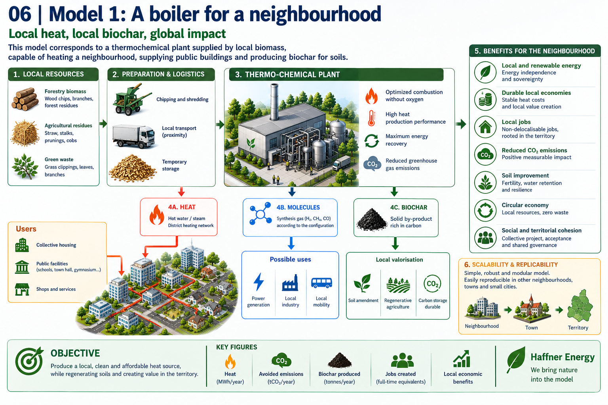
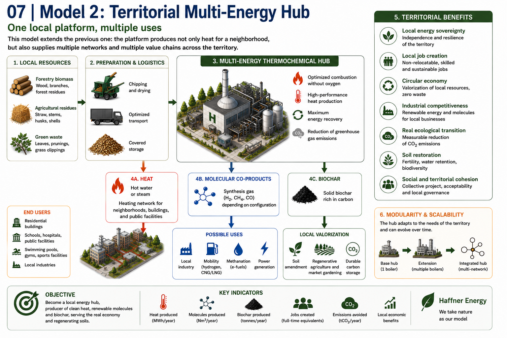
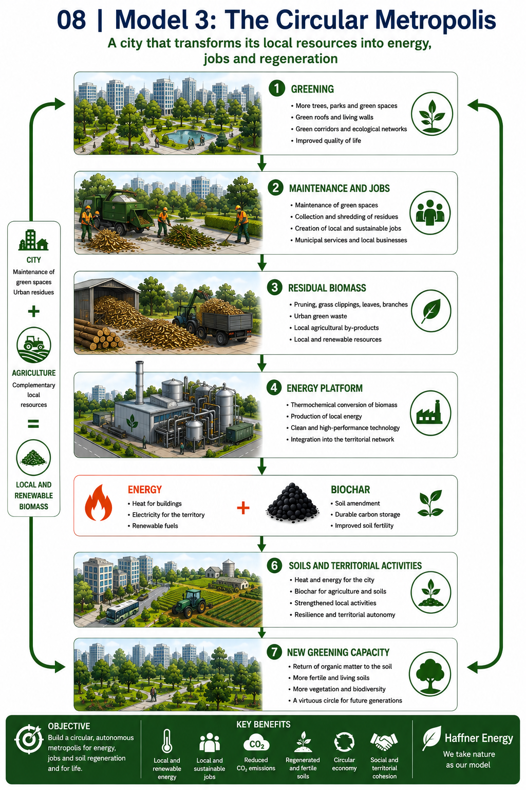

# The Municipal Boiler of the Future [(Version française - FR)](chaudiere_municipale_du_futur_FR.md)

In this article, the term “municipal boiler” refers to thermal production infrastructure as seen from the perspective of a local authority. Technically, the architecture considered may combine a thermochemical platform, the production of an energy gas, and the thermal energy recovery equipment required for a district heating network.

## From local biomass to district heating, co-products and a circular territorial economy

> **Working document — Global Atlas of the Economic Valorization of Biochar**

[**→ View the Haffner Energy technical PDF**](../media/PDF/Synoca_vs_Biomass_Boiler_Position_Paper_EN.png)

---

## Introduction — Can a boiler become the heart of a territory?

When discussing a boiler rated at several hundred kilowatts or several megawatts, we are obviously no longer talking about heating an individual home. We are entering the field of equipment capable of supplying a group of buildings, a hospital, a university, a swimming pool, a prison, public buildings or a genuine urban district heating network. Yet a boiler is still often imagined as a relatively simple piece of equipment: a fuel enters, it is burned, and heat is distributed to users.

Modern thermolysis technologies nevertheless make it possible to consider a broader architecture. Biomass is no longer necessarily used solely as a fuel burned directly. It can first be converted into an intermediate energy gas, which can then be directed toward different uses depending on the industrial configuration selected. Heat remains a major outlet, but it becomes one element of a system that may also include the production of renewable gas, electricity, hydrogen, methane or other synthetic molecules.

From this perspective, the question is no longer simply: **how can a natural-gas or fuel-oil boiler be replaced?** It becomes: **how can the biomass resources available around a city be used to build local energy infrastructure capable of providing several services to the territory?**

The ambition of this article is therefore not to present a miracle plant capable of solving all the problems of a metropolitan area. Rather, it examines an industrial hypothesis: **the municipal boiler could become the visible centre of a broader territorial platform linking biomass, energy, co-products, agriculture, local employment, greening and the progressive improvement of territorial resilience.**



---

# 1. Why does a city need boilers rated at several megawatts?

The thermal power required by a city is on a completely different scale from that of an individual dwelling. An apartment building may already require substantial capacity for space heating and domestic hot water. When several buildings are grouped together, or when the consumers include facilities such as a hospital, university, swimming pool or administrative complex, demand can reach several megawatts.

It is precisely in this context that centralized production becomes attractive. Instead of installing and maintaining a multitude of small independent systems, one central energy source can supply heat to several consumers. The heat is then distributed through an appropriately designed hydraulic network.

A multi-megawatt boiler or thermal platform could therefore form the energy core of a district comprising:

- several multi-family residential buildings;
- municipal buildings;
- a school or university facility;
- a sports centre or swimming pool;
- a hospital or healthcare facility;
- offices or tertiary-sector buildings;
- shops and public facilities.

The first fundamental idea is therefore simple: **an urban boiler is not merely an enlarged domestic appliance. It is network infrastructure.**



---

# 2. From the conventional boiler to the thermochemical platform

In a traditional boiler, the principle is relatively direct: a fuel is burned to produce heat. The architecture considered here is different. In the case of the public solutions presented by Haffner Energy, biomass passes through a thermochemical chain that notably produces synthesis gas or an intermediate energy gas called Hypergas®. This gas can then be valorized according to the installed architecture.

Heat is the most direct application. The gas produced can supply a suitable boiler and generate hot water or superheated hot water for a thermal network. But the interest of the concept lies in the fact that the intermediate gas potentially opens the way to other forms of valorization.

```text
BIOMASS
   ↓
PREPARATION
   ↓
THERMOLYSIS / REFORMING
   ↓
ENERGY GAS
   ├── heat
   ├── electricity
   ├── hydrogen, depending on the dedicated architecture
   └── other molecules, depending on the installed conversion equipment
```

This representation must nevertheless be interpreted correctly. The theoretical possibility of valorizing an intermediate gas in several ways does not mean that a given installation can automatically produce all these products at the same time or instantly switch from one to another. **An energy intermediate can be versatile without every plant being universal.**

---

# 3. The public architectures: SYNOCA, SYNOCA+ and HYNOCA

Public information from Haffner Energy makes it possible to identify several architectures corresponding to different end uses. They should not be regarded as simple commercial variants of the same boiler, because each involves a different valorization chain.

The SYNOCA solution is the architecture most directly associated with the production of a renewable gas that can be used for thermal applications and, depending on the associated equipment, for electricity generation. In the public technical datasheet examined, the solution is notably associated with a 120°C superheated hot-water boiler.

SYNOCA+ adds more advanced gas preparation in order to make the gas compatible with pathways leading to methane or methanol. It is nevertheless important to be precise: the ability to prepare the gas for subsequent synthesis does not mean that the final methanation or methanol-synthesis units are automatically included in the price of the basic module.

HYNOCA corresponds to an architecture dedicated to the production of renewable hydrogen from biomass. The separation and purification chain increases the complexity of the installation, which explains why a hydrogen architecture may have a higher CAPEX than an installation primarily intended to produce gas or heat.

```text
                  BIOMASS
                    ↓
           THERMOCHEMICAL TECHNOLOGY
                    ↓
              INTERMEDIATE GAS
                    ↓
        ┌────────────┼─────────────┐
        ↓            ↓             ↓
     SYNOCA       SYNOCA+       HYNOCA
        ↓            ↓             ↓
  Heat /          Preparation    Hydrogen
  electricity     for synthesis  + biogenic CO₂
```

<!-- IMAGE-03 : images/03-trois-architectures-hypergas.png -->


---

# 4. Nominal power is not necessarily final useful power

When an installation is announced as having a capacity of 2 MW, it is necessary to know exactly what that figure refers to: the energy power of the incoming biomass, the output power of the main product, or the thermal power available. Between the energy contained in the biomass and the energy ultimately used by the consumer, several conversion stages take place.

```text
ENERGY CONTAINED IN THE BIOMASS
                ↓
        THERMOCHEMICAL CONVERSION
                ↓
         GAS OR INTERMEDIATE PRODUCT
                ↓
        CONVERSION TO A FINAL USE
                ↓
      ENERGY ACTUALLY USED
```

If the final objective is heat, the overall efficiency may differ from the efficiency obtained when the objective is to produce electricity or hydrogen. This is why a 2 MW installation should never automatically be interpreted as an installation capable of delivering 2 MW of useful energy in any form.

This is where a dense urban environment has an advantage: **heat considered secondary in an isolated industrial plant can become a resource when a district heating network or thermal consumers are located nearby.**

---

# 5. Why district heating is an excellent first outlet

Heating is probably one of the simplest ways to valorize thermal energy locally. A city already has major needs for several months of the year. If an installation can supply heat suitable for an existing network or a new distribution infrastructure, it can replace part of the fossil fuels previously used.

The major advantage of a district heating network is that it allows production to be shared. Instead of installing an individual boiler in every building, central infrastructure produces the heat and sends it to several consumers.

This approach can be particularly relevant in:

- dense collective-housing districts;
- hospital areas;
- university campuses;
- large administrative complexes;
- sports facilities;
- areas where several public buildings are grouped together.

---

# 6. The problem of seasonality

Heating is needed in winter, but much less during the summer period. Thermal infrastructure designed solely to meet the winter peak may therefore experience lower utilization for several months.

This is where co-products and different valorization pathways become interesting. During the cold period, priority can be given to heat production. During periods when demand declines, part of the resource could be directed, depending on the equipment installed, toward other uses:

- electricity generation;
- cogeneration;
- cooling production from heat;
- gas preparation for a synthesis chain;
- hydrogen production in a dedicated installation.

Nevertheless, seasonality should not be presented as an automatic function guaranteed by current equipment. An installation capable of producing several co-products simultaneously or alternatively requires appropriate conversion, storage and control equipment.

The real industrial question is therefore: **how much does flexibility cost?**

---

# 7. Urban biomass: a resource that already exists

A city does not necessarily start with zero biomass. It already maintains its parks, trees, gardens and public spaces. Pruning, trimming and the replacement of vegetation generate residues that must be collected, transported and treated.

The project must therefore not consider every plant material as an immediately usable resource. A genuine supply chain must be organized:

```text
COLLECTION
   ↓
INSPECTION
   ↓
SORTING
   ↓
CHIPPING
   ↓
SCREENING
   ↓
STORAGE
   ↓
FEEDING THE UNIT
```

The best biomass is therefore not necessarily the one that is free at the source. It is the one that offers the best compromise between availability, quality, collection cost, preparation and transport distance.

<!-- IMAGE-04 : images/04-voyage-de-la-biomasse.png -->


---

# 8. Agriculture as a second source of biomass

A metropolitan area probably cannot supply a large installation solely with residues from its own parks. It can, however, rely on a wider territorial catchment area.

In our working scenario, we imagined an installation consuming approximately **50,000 tonnes of biomass per year**, with, for example:

- approximately **13,000 tonnes** coming from municipal activities and territorial maintenance;
- approximately **37,000 tonnes** purchased from local producers.

If agricultural biomass were purchased, hypothetically, at **€30 per tonne**, this would represent approximately **€1.11 million per year** paid to suppliers for the 37,000 tonnes concerned.

This figure is not official data for any particular city. It is an economic scenario intended to illustrate the mechanism. From the plant's point of view, it is an expense. From the territorial point of view, part of that expense becomes income distributed locally.

---

# 9. An expense for the plant can become income for the territory

The conventional analysis of an industrial installation focuses on its costs and revenues. The cost of biomass is then simply entered in the expense column.

A local authority can nevertheless adopt a broader perspective. If it purchases part of its biomass from farmers or local suppliers, the money paid becomes income for a local economic activity.

```text
ENERGY PLATFORM
        ↓ payment
LOCAL FARMERS
        ↓ income
CONSUMPTION / INVESTMENT
        ↓
LOCAL BUSINESSES AND SERVICES
        ↓
TERRITORIAL ECONOMIC ACTIVITY
```

It would obviously be exaggerated to consider that every euro spent automatically creates several additional euros of wealth. But the general principle is clear: **a territory can choose to organize part of its energy expenditure in a way that generates more local economic flows.**

---
# 10. The municipal boiler as the centre of an industrial ecosystem

This is where the boiler ceases to be merely a technical piece of equipment. Around the platform, several activities can develop:

- biomass preparation and logistics;
- local transport;
- industrial maintenance;
- district heating network management;
- production and distribution of co-products;
- biochar valorization;
- agricultural experimentation;
- vocational training.

The city could therefore have infrastructure around which several previously separate sectors meet: municipal services, agriculture, energy, industry and soil management.

```text
CITY AND GREEN SPACES
          +
TERRITORIAL AGRICULTURE
          ↓
        BIOMASS
          ↓
PREPARATION AND LOGISTICS
          ↓
THERMOCHEMICAL PLATFORM
          ↓
 ┌────────┼─────────┐
 ↓        ↓         ↓
HEAT   MOLECULES  BIOCHAR
 ↓        ↓         ↓
CITY   INDUSTRY    SOILS
```

<!-- IMAGE-05 : images/05-hub-municipal-multi-energie.png -->


---

# 11. Biochar: closing part of the carbon loop

Biochar deserves particular attention because it introduces an important difference compared with simple combustion. In a thermochemical chain producing suitable biochar, a fraction of the carbon can remain in solid form and be valorized in different applications.

Application to soils is one of the most interesting pathways, but it must be treated rigorously. The properties of biochar depend strongly on the biomass used and on the production conditions. Its effects on soils also vary according to soil characteristics and local conditions.

It would therefore be incorrect to claim that biochar automatically improves every soil. However, some biochars can contribute to favourable changes in certain physical or chemical soil properties and can form part of a strategy for durable carbon storage.

```text
BIOMASS
   ↓
ENERGY PRODUCTION
   +
BIOCHAR
   ↓
APPLICATION TO SUITABLE SOILS
   ↓
POTENTIAL IMPROVEMENT OF CERTAIN
SOIL PROPERTIES
   ↓
VEGETATION AND BIOMASS PRODUCTION
```

---

# 12. More trees: a cost or productive infrastructure?

Planting and maintaining trees costs money. It would be false to claim that planting trees costs nothing simply because their residues can be valorized.

But the relevant question is the net cost. An urban tree can provide several services simultaneously: shade, thermal comfort, landscape value, biodiversity and quality of life. Its maintenance also generates residual biomass.

```text
net cost
=
planting and maintenance cost
−
value of the benefits and valorization obtained
```

The value of the biomass is obviously not sufficient by itself to finance an entire greening policy. But it can become one of the elements that reduce the system's net cost.

---

# 13. Biodiversity, bees and health

Greater vegetation cover can improve the habitats available to many species. Pollinators can benefit from a diversity of plants providing resources at different times of the year.

However, the quality of a greening policy does not depend solely on the quantity of vegetation. Species selection is essential. A city can seek to promote simultaneously:

- pollinators;
- local biodiversity;
- shade;
- heat resilience;
- low water consumption;
- the limitation of certain allergy risks.

The right strategy is therefore not simply: **more flowers everywhere**. It should be: **greater biodiversity, with intelligent species selection and management that takes public health into account.**

---

# 14. Local employment and territorial cohesion

A territorial biomass platform requires many skills. Collection, sorting, preparation, logistics, green-space maintenance, industrial operation and maintenance represent concrete activities that cannot all be relocated.

A local authority could, in particular, develop training pathways for:

- gardening and landscape maintenance;
- arboriculture and tree pruning;
- operation of machinery;
- biomass preparation;
- logistics;
- electromechanical maintenance;
- industrial plant operation;
- energy management.

A biomass sector will obviously not solve a territory's social problems on its own. But a local economy offering more employment, training and prospects can contribute to a broader territorial strategy.

---

# 15. Hydrogen and air quality

If locally produced hydrogen is used in fuel-cell vehicles, it can reduce pollution directly associated with tailpipe emissions compared with a vehicle using fossil fuel.

This does not mean that mobility becomes completely free of pollution. Tyres, brakes and urban dust continue to produce particulate matter. Air quality also depends on many other sources.

The correct formulation is therefore that the progressive replacement of certain fossil uses with renewable energy carriers can contribute to reducing part of local pollutant emissions.

---

# 16. The limits: not everything can enter the boiler

A biomass thermolysis installation is not a universal machine designed to absorb all the waste generated by a city.

Metals must be separated and recycled. Plastics may fall under material recycling or specific thermochemical pathways, but they must not be confused with biomass used to produce biochar intended for soils. Hospital waste presenting infectious or chemical risks belongs to specific regulated treatment pathways.

```text
WASTE AND RESIDUES
       ↓
SORTING AND CHARACTERIZATION
       ↓
COMPATIBLE BIOMASS → thermochemical platform
METALS             → recycling
PLASTICS           → appropriate pathways
HAZARDOUS WASTE    → regulated pathways
```

Intelligent sorting, sensors, computer vision and robotics can improve this preparation. But they do not replace feedstock characterization or regulatory obligations.

---

# 17. The three industrial models

## Model 1 — The urban district boiler

The first model is the simplest. A thermolysis platform primarily supplies a boiler and a district heating network. The priority is to replace a fossil fuel used to supply a dense group of consumers.

This model is particularly suitable for a district comprising several nearby buildings. Its main advantage is its relative simplicity: heat is a local product that is difficult to transport over long distances but immediately useful when produced close to consumers.

<!-- IMAGE-06 : images/06-modele-1-chaudiere-quartier.png -->


## Model 2 — The municipal multi-energy hub

The second model retains heat as an outlet but adds a more diversified valorization strategy. During winter, priority can be given to the district heating network. At other times of the year, depending on the equipment installed, part of the energy can be valorized differently.

The objective is to improve the installation's annual utilization factor. The central question then becomes the trade-off between:

- investment cost;
- flexibility;
- the value of the different products;
- market seasonality.

<!-- IMAGE-07 : images/07-modele-2-hub-multi-energie.png -->


## Model 3 — The circular metropolis

The third model is the most ambitious. The energy platform becomes the centre of a territorial network linking the city, agriculture and soils.

The city supplies part of the biomass generated by maintaining its green spaces. Farmers supply an additional share from genuinely available resources. The platform produces energy for the territory and may, depending on the technology, produce biochar that can be valorized in appropriate applications.

```text
GREENING
      ↓
MAINTENANCE AND JOBS
      ↓
RESIDUAL BIOMASS
      ↓
ENERGY PLATFORM
      ↓
ENERGY + BIOCHAR
      ↓
SOILS AND TERRITORIAL ACTIVITIES
      ↓
NEW CAPACITY FOR GREENING
```

<!-- IMAGE-08 : images/08-modele-3-metropole-circulaire.png -->


---

# 18. The real objective: reducing the territory's net cost

A local authority does not necessarily have to evaluate infrastructure solely by asking:

> **How much profit will the plant generate?**

A better question might be:

> **By how much does this infrastructure reduce the territory's overall net cost?**

The assessment should include:

- avoided expenditure on energy purchases;
- biomass management costs;
- revenue from energy products;
- potential revenue from co-products;
- expenditure distributed to local suppliers;
- jobs created;
- transport costs;
- investment in networks;
- potential benefits linked to greening;
- maintenance and replacement costs.

The project should therefore not be presented as a machine intended to enrich a municipality. It can be understood as **infrastructure capable of reducing certain economic leakages out of the territory and transforming part of existing expenditure into local economic activity.**

---

# Conclusion — From the boiler to territorial infrastructure

A multi-megawatt urban boiler is not simply a larger version of a domestic boiler. It can be the starting point for a much broader reflection on the energy organization of a territory.

The first step is to replace or supplement fossil heat production. The second is to examine the possibility of using co-products and different valorization pathways to reduce the infrastructure's seasonal under-utilization, without confusing this possibility with universal automatic flexibility.

The third step is the most ambitious: to consider the platform as an element of a territorial circular economy. The city maintains its vegetation, collects residual biomass, creates local jobs, purchases part of its resource from agriculture, produces part of its energy and may, depending on the processes and uses involved, valorize biochar as part of a soil-management strategy.

The real innovation does not therefore lie solely in the machine.

It lies in the organization of the territory around the machine.

**A city could therefore stop considering its parks, trees, agriculture, energy, waste, soils and employment as separate issues. These elements could become the components of one and the same industrial and ecological system.**

This may be the most accurate definition of the municipal boiler of the future: **not merely a machine that produces heat, but a point of convergence between local resources, local energy, economic activity, greening and territorial resilience.**

---

## Documentation and transparency

This article distinguishes three levels:

1. **Public technical data**, linked to their reference documentation, including the Haffner Energy PDF available in this repository.
2. **Working scenarios and calculations**, such as the territorial example involving 50,000 tonnes of biomass per year, which are assumptions rather than guaranteed characteristics of an installation.
3. **The prospective vision**, which explores how a local authority could organize biomass, energy, agriculture, employment and greening around an industrial platform.

[**→ Open the Haffner Energy technical PDF**](../media/PDF/Synoca_vs_Biomass_Boiler_Position_Paper_EN.png)
