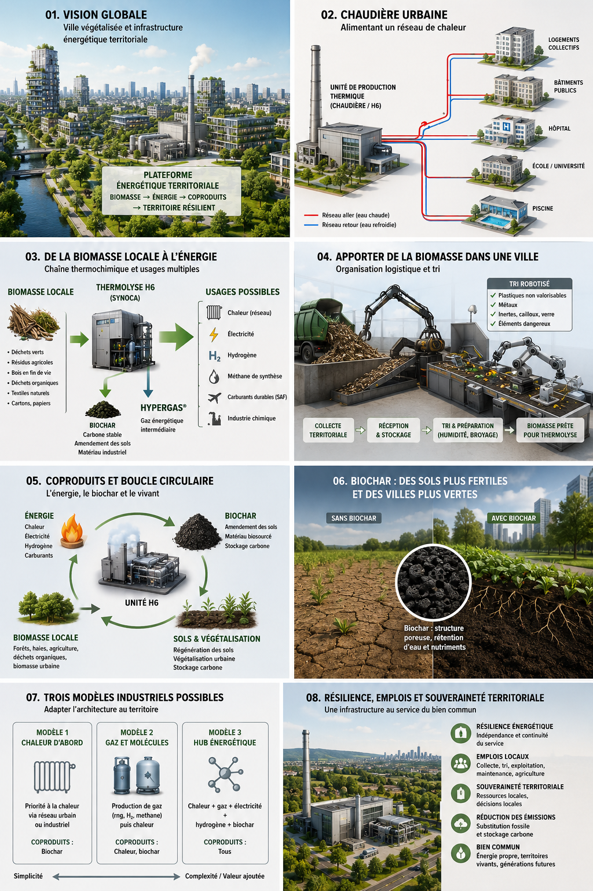

# La chaudière municipale du futur [(English version - EN)](district_heating_H6_vs_boiler.md)

## De la biomasse locale au chauffage urbain, aux coproduits et à une économie territoriale circulaire

> **Document de travail — Atlas mondial de la valorisation économique du biochar**

[**→ Consulter le PDF technique Haffner Energy**](../media/PDF/Synoca_vs_Chaudière_biomasse_position_paper.pdf)

> **Important :** remplacer `PDF_TECHNIQUE_HAFFNER_URL` par le chemin relatif exact du PDF déjà téléchargé dans le dépôt GitHub. Le lien relatif permettra au document de rester portable à l'intérieur du dépôt.

---

## Introduction — Une chaudière peut-elle devenir le cœur d'un territoire ?

Lorsqu'on parle d'une chaudière de plusieurs centaines de kilowatts ou de plusieurs mégawatts, on ne parle évidemment plus du chauffage d'une habitation individuelle. On entre dans le domaine des équipements capables d'alimenter un ensemble d'immeubles, un hôpital, une université, une piscine, une prison, des bâtiments publics ou un véritable réseau de chaleur urbain. Pourtant, la chaudière reste souvent imaginée comme un équipement relativement simple : un combustible entre, il est brûlé, et la chaleur est distribuée aux utilisateurs.

Les technologies modernes de thermolyse permettent cependant d'envisager une architecture plus large. La biomasse n'est plus nécessairement utilisée uniquement comme un combustible brûlé directement. Elle peut d'abord être transformée en un gaz énergétique intermédiaire, puis ce gaz peut être orienté vers différents usages selon la configuration industrielle retenue. La chaleur reste alors un débouché majeur, mais elle devient l'un des éléments d'un ensemble susceptible d'inclure la production de gaz renouvelable, d'électricité, d'hydrogène, de méthane ou d'autres molécules de synthèse.

Dans cette perspective, la question n'est plus seulement : **comment remplacer une chaudière au gaz naturel ou au fioul ?** Elle devient : **comment utiliser les ressources biomasse disponibles autour d'une ville pour construire une infrastructure énergétique locale capable de fournir plusieurs services au territoire ?**

L'ambition de cet article n'est donc pas de présenter une usine miraculeuse qui résoudrait tous les problèmes d'une métropole. Il consiste plutôt à examiner une hypothèse industrielle : **la chaudière municipale pourrait devenir le centre visible d'une plateforme territoriale plus large, associant biomasse, énergie, coproduits, agriculture, emplois locaux, végétalisation et amélioration progressive de la résilience du territoire.**

<!-- IMAGE-01 : images/01-ville-energetique-du-futur.png -->


---

# 1. Pourquoi une ville a-t-elle besoin de chaudières de plusieurs mégawatts ?

La puissance thermique nécessaire à une ville est sans commune mesure avec celle d'un logement individuel. Un immeuble collectif peut déjà nécessiter une puissance significative pour assurer le chauffage et la production d'eau chaude sanitaire. Lorsque plusieurs immeubles sont regroupés, ou lorsqu'il s'agit d'équipements comme un hôpital, une université, une piscine ou un ensemble administratif, les besoins peuvent atteindre plusieurs mégawatts.

C'est précisément dans ce contexte qu'une production centralisée présente un intérêt. Au lieu d'installer et d'entretenir une multitude de petites installations indépendantes, une source énergétique centrale peut fournir de la chaleur à plusieurs consommateurs. La chaleur est alors distribuée par un réseau hydraulique adapté.

Une chaudière ou une plateforme thermique de plusieurs mégawatts pourrait ainsi constituer le cœur énergétique d'un quartier comprenant :

- plusieurs barres d'habitat collectif ;
- des bâtiments municipaux ;
- une école ou un établissement universitaire ;
- un centre sportif ou une piscine ;
- un établissement hospitalier ;
- des bureaux ou des bâtiments tertiaires ;
- des commerces et équipements publics.

La première idée fondamentale est donc simple : **la chaudière urbaine n'est pas un appareil domestique agrandi. C'est une infrastructure de réseau.**

<!-- IMAGE-02 : images/02-chaudiere-urbaine-reseau.png -->


---

# 2. De la chaudière classique à la plateforme thermochimique

Dans une chaudière traditionnelle, le principe est relativement direct : un combustible est brûlé afin de produire de la chaleur. L'architecture envisagée ici est différente. Dans le cas des solutions publiques présentées par Haffner Energy, la biomasse passe par une chaîne thermochimique produisant notamment un gaz de synthèse ou un gaz énergétique intermédiaire appelé Hypergas®. Ce gaz peut ensuite être valorisé selon l'architecture installée.

La chaleur constitue l'application la plus directe. Le gaz produit peut alimenter une chaudière adaptée et produire de l'eau chaude ou de l'eau chaude surchauffée destinée à un réseau thermique. Mais l'intérêt du concept réside dans le fait que le gaz intermédiaire ouvre potentiellement la voie à d'autres formes de valorisation.

```text
BIOMASSE
   ↓
PRÉPARATION
   ↓
THERMOLYSE / REFORMAGE
   ↓
GAZ ÉNERGÉTIQUE
   ├── chaleur
   ├── électricité
   ├── hydrogène, selon l'architecture dédiée
   └── autres molécules, selon les équipements de conversion installés
```

Cette représentation doit toutefois être interprétée correctement. La possibilité théorique de valoriser un gaz intermédiaire de plusieurs façons ne signifie pas qu'une installation donnée peut produire automatiquement tous ces produits en même temps ou basculer instantanément de l'un à l'autre. **Un intermédiaire énergétique peut être polyvalent sans que chaque usine soit universelle.**

---

# 3. Les architectures publiques : SYNOCA, SYNOCA+ et HYNOCA

Les informations publiques de Haffner Energy permettent d'identifier plusieurs architectures correspondant à différents débouchés. Elles ne doivent pas être considérées comme de simples variantes commerciales d'une même chaudière, car chacune implique une chaîne de valorisation différente.

La solution SYNOCA constitue l'architecture la plus directement liée à la production d'un gaz renouvelable utilisable pour des applications thermiques et, selon les équipements associés, pour la production d'électricité. Dans la fiche technique publique étudiée, la solution est notamment associée à une chaudière à eau chaude surchauffée à 120 °C.

SYNOCA+ ajoute une préparation plus poussée du gaz afin de le rendre compatible avec des voies de valorisation vers le méthane ou le méthanol. Il faut néanmoins être précis : la capacité à préparer le gaz pour une synthèse ultérieure ne signifie pas que les unités finales de méthanation ou de synthèse du méthanol sont automatiquement incluses dans le prix du module de base.

HYNOCA correspond à une architecture dédiée à la production d'hydrogène renouvelable à partir de biomasse. La chaîne de séparation et de purification augmente la complexité de l'installation, ce qui explique qu'une architecture hydrogène puisse présenter un CAPEX supérieur à celui d'une installation destinée principalement à la production de gaz ou de chaleur.

```text
                 BIOMASSE
                    ↓
          TECHNOLOGIE THERMOCHIMIQUE
                    ↓
               GAZ INTERMÉDIAIRE
                    ↓
       ┌────────────┼─────────────┐
       ↓            ↓             ↓
    SYNOCA       SYNOCA+       HYNOCA
       ↓            ↓             ↓
 Chaleur /       Préparation    Hydrogène
 électricité     pour synthèse  + CO₂ biogénique
```

<!-- IMAGE-03 : images/03-trois-architectures-hypergas.png -->


---

# 4. La puissance nominale n'est pas nécessairement la puissance utile finale

Lorsqu'une installation est annoncée à 2 MW, il est nécessaire de savoir précisément à quoi correspond cette puissance : puissance énergétique de la biomasse en entrée, puissance du produit principal en sortie ou puissance thermique disponible. Entre l'énergie contenue dans la biomasse et l'énergie finalement utilisée par le consommateur, plusieurs étapes de conversion interviennent.

```text
ÉNERGIE CONTENUE DANS LA BIOMASSE
                ↓
        CONVERSION THERMOCHIMIQUE
                ↓
         GAZ OU PRODUIT INTERMÉDIAIRE
                ↓
        CONVERSION VERS UN USAGE FINAL
                ↓
      ÉNERGIE EFFECTIVEMENT UTILISÉE
```

Si l'objectif final est la chaleur, le rendement global peut être différent de celui obtenu lorsqu'on cherche à produire de l'électricité ou de l'hydrogène. C'est pourquoi une installation de 2 MW ne doit jamais être interprétée automatiquement comme une installation capable de livrer 2 MW utiles sous n'importe quelle forme.

C'est là qu'un environnement urbain dense présente un avantage : **une chaleur considérée comme secondaire dans une usine isolée peut devenir une ressource lorsqu'un réseau de chaleur ou des consommateurs thermiques se trouvent à proximité.**

---

# 5. Pourquoi le chauffage urbain est un excellent premier débouché

Le chauffage constitue probablement l'un des usages les plus simples pour valoriser localement une énergie thermique. Une ville possède déjà des besoins importants pendant plusieurs mois de l'année. Si une installation peut fournir une chaleur adaptée à un réseau existant ou à une nouvelle infrastructure de distribution, elle peut remplacer une partie des combustibles fossiles utilisés auparavant.

Le grand avantage d'un réseau de chaleur est qu'il permet de mutualiser la production. Au lieu d'installer une chaudière individuelle dans chaque bâtiment, une infrastructure centrale produit la chaleur et l'envoie vers plusieurs consommateurs.

Cette logique peut être particulièrement pertinente dans :

- les quartiers d'habitat collectif dense ;
- les zones hospitalières ;
- les campus universitaires ;
- les grands ensembles administratifs ;
- les installations sportives ;
- les zones où plusieurs bâtiments publics sont regroupés.

---

# 6. Le problème de la saisonnalité

Le chauffage est nécessaire en hiver, mais beaucoup moins pendant la période estivale. Une infrastructure thermique conçue uniquement pour répondre au pic hivernal risque donc de connaître une utilisation plus faible pendant plusieurs mois.

C'est ici que les coproduits et les différentes voies de valorisation deviennent intéressants. Pendant la période froide, la priorité peut être donnée à la production de chaleur. Pendant les périodes où la demande diminue, une partie de la ressource pourrait être orientée, selon les équipements installés, vers d'autres usages :

- production d'électricité ;
- cogénération ;
- production de froid à partir de chaleur ;
- préparation de gaz pour une chaîne de synthèse ;
- production d'hydrogène dans une installation dédiée.

Il faut néanmoins éviter de présenter cette saisonnalité comme une fonction automatique garantie par les équipements actuels. Une installation capable de produire plusieurs coproduits simultanément ou alternativement nécessite des équipements de conversion, de stockage et de pilotage adaptés.

La véritable question industrielle est donc : **combien coûte la flexibilité ?**

---

# 7. La biomasse urbaine : une ressource déjà présente

Une ville ne commence pas nécessairement avec zéro biomasse. Elle entretient déjà ses parcs, ses arbres, ses jardins et ses espaces publics. L'élagage, la taille et le remplacement des végétaux produisent des résidus qui doivent être collectés, transportés et traités.

Le projet ne doit donc pas considérer toute matière végétale comme une ressource immédiatement utilisable. Une véritable filière doit être organisée :

```text
COLLECTE
   ↓
CONTRÔLE
   ↓
TRI
   ↓
BROYAGE
   ↓
CRIBLAGE
   ↓
STOCKAGE
   ↓
ALIMENTATION DE L'UNITÉ
```

La meilleure biomasse n'est donc pas nécessairement celle qui est gratuite à l'origine. C'est celle qui présente le meilleur compromis entre disponibilité, qualité, coût de collecte, préparation et distance de transport.

<!-- IMAGE-04 : images/04-voyage-de-la-biomasse.png -->


---

# 8. L'agriculture comme deuxième source de biomasse

Une métropole ne peut probablement pas alimenter une grande installation uniquement avec les résidus provenant de ses propres parcs. En revanche, elle peut s'appuyer sur un bassin territorial plus large.

Dans notre scénario de travail, nous avons imaginé une installation consommant environ **50 000 tonnes de biomasse par an**, avec par exemple :

- environ **13 000 tonnes** provenant des activités municipales et de l'entretien territorial ;
- environ **37 000 tonnes** achetées à des producteurs locaux.

Si la biomasse agricole était achetée, par hypothèse, **30 € par tonne**, cela représenterait environ **1,11 million d'euros par an** versés aux fournisseurs pour les 37 000 tonnes concernées.

Ce chiffre ne constitue pas une donnée officielle concernant une ville particulière. Il s'agit d'un scénario économique destiné à montrer le mécanisme. Du point de vue de l'usine, il s'agit d'une dépense. Du point de vue territorial, une partie de cette dépense devient un revenu distribué localement.

---

# 9. Une dépense pour l'usine peut devenir un revenu pour le territoire

L'analyse classique d'une installation industrielle se concentre sur ses coûts et ses revenus. Le coût de la biomasse est alors simplement inscrit dans la colonne des dépenses.

Une collectivité peut cependant adopter une vision plus large. Si elle achète une partie de sa biomasse à des agriculteurs ou à des fournisseurs locaux, l'argent versé devient un revenu pour une activité locale.

```text
PLATEFORME ÉNERGÉTIQUE
        ↓ paiement
AGRICULTEURS LOCAUX
        ↓ revenus
CONSOMMATION / INVESTISSEMENT
        ↓
ENTREPRISES ET SERVICES LOCAUX
        ↓
ACTIVITÉ ÉCONOMIQUE TERRITORIALE
```

Il serait évidemment exagéré de considérer que chaque euro dépensé crée automatiquement plusieurs euros de richesse supplémentaire. Mais le principe général est clair : **un territoire peut choisir d'organiser une partie de ses dépenses énergétiques de manière à créer davantage de flux économiques locaux.**

---

# 10. La chaudière municipale comme centre d'un écosystème industriel

C'est ici que la chaudière cesse d'être un simple équipement technique. Autour de la plateforme peuvent se développer :

- préparation et logistique de la biomasse ;
- transport local ;
- maintenance industrielle ;
- gestion du réseau de chaleur ;
- production et distribution des coproduits ;
- valorisation du biochar ;
- expérimentation agricole ;
- formation professionnelle.

La ville pourrait ainsi disposer d'une infrastructure autour de laquelle se rencontrent plusieurs secteurs auparavant séparés : les services municipaux, l'agriculture, l'énergie, l'industrie et la gestion des sols.

```text
VILLE ET ESPACES VERTS
          +
AGRICULTURE DU TERRITOIRE
          ↓
      BIOMASSE
          ↓
PRÉPARATION ET LOGISTIQUE
          ↓
PLATEFORME THERMOCHIMIQUE
          ↓
 ┌────────┼─────────┐
 ↓        ↓         ↓
CHALEUR  MOLÉCULES BIOCHAR
 ↓        ↓         ↓
VILLE   INDUSTRIE   SOLS
```

<!-- IMAGE-05 : images/05-hub-municipal-multi-energie.png -->


---

# 11. Le biochar : fermer une partie de la boucle carbone

Le biochar mérite une attention particulière parce qu'il introduit une différence importante avec une simple combustion. Dans une chaîne thermochimique produisant un biochar adapté, une fraction du carbone peut rester sous forme solide et être valorisée dans différents usages.

L'application aux sols est l'une des voies les plus intéressantes, mais elle doit être traitée avec rigueur. Les propriétés du biochar dépendent fortement de la biomasse utilisée et des conditions de production. Les effets sur les sols varient également selon leur nature et les conditions locales.

Il serait donc incorrect d'affirmer qu'un biochar améliore automatiquement tous les sols. En revanche, certains biochars peuvent contribuer à modifier favorablement certaines propriétés physiques ou chimiques des sols et à participer à une stratégie de stockage durable du carbone.

```text
BIOMASSE
   ↓
PRODUCTION D'ÉNERGIE
   +
BIOCHAR
   ↓
APPLICATION À DES SOLS ADAPTÉS
   ↓
AMÉLIORATION POTENTIELLE DE CERTAINES
PROPRIÉTÉS DU SOL
   ↓
VÉGÉTATION ET PRODUCTION DE BIOMASSE
```

---

# 12. Plus d'arbres : un coût ou une infrastructure productive ?

La plantation et l'entretien des arbres coûtent de l'argent. Il serait faux d'affirmer que planter des arbres ne coûte rien simplement parce que leurs résidus peuvent être valorisés.

Mais la question pertinente est celle du coût net. Un arbre urbain peut fournir plusieurs services simultanément : ombre, confort thermique, paysage, biodiversité et qualité de vie. Son entretien génère également de la biomasse résiduelle.

```text
coût net
=
coût de plantation et d'entretien
−
valeur des bénéfices et valorisations obtenues
```

La valeur de la biomasse ne suffit évidemment pas à financer à elle seule toute la politique de végétalisation. Mais elle peut devenir l'un des éléments qui réduisent le coût net du système.

---

# 13. Biodiversité, abeilles et santé

La présence accrue de végétation peut améliorer les habitats disponibles pour de nombreuses espèces. Les pollinisateurs peuvent bénéficier d'une diversité de plantes produisant des ressources à différentes périodes de l'année.

La qualité d'une politique de végétalisation ne dépend cependant pas uniquement de la quantité de végétation. Le choix des espèces est essentiel. Une ville peut chercher à favoriser simultanément :

- les pollinisateurs ;
- la biodiversité locale ;
- l'ombre ;
- la résistance à la chaleur ;
- la faible consommation d'eau ;
- la limitation de certains risques allergènes.

La bonne stratégie n'est donc pas simplement : **plus de fleurs partout**. Elle devrait être : **davantage de biodiversité, avec une sélection intelligente des espèces et une gestion tenant compte de la santé publique.**

---

# 14. Emplois locaux et cohésion territoriale

Une plateforme territoriale de biomasse nécessite de nombreuses compétences. La collecte, le tri, la préparation, la logistique, l'entretien des espaces verts, l'exploitation industrielle et la maintenance représentent des activités concrètes qui ne peuvent pas toutes être délocalisées.

Une collectivité pourrait notamment développer des parcours de formation pour :

- le jardinage et l'entretien paysager ;
- l'arboriculture et l'élagage ;
- la conduite d'engins ;
- la préparation de biomasse ;
- la logistique ;
- la maintenance électromécanique ;
- la conduite d'installations industrielles ;
- la gestion énergétique.

Une filière biomasse ne résoudra évidemment pas seule les problèmes sociaux d'un territoire. Mais une économie locale offrant davantage d'emplois, de formation et de perspectives peut participer à une stratégie territoriale plus large.

---

# 15. L'hydrogène et la qualité de l'air

Si l'hydrogène produit localement est utilisé dans des véhicules à pile à combustible, il peut réduire la pollution directement liée aux gaz d'échappement par rapport à un véhicule utilisant un carburant fossile.

Cela ne signifie pas que la mobilité devient totalement exempte de pollution. Les pneus, les freins et les poussières urbaines continuent de produire des particules. La qualité de l'air dépend également de nombreuses autres sources.

La formulation correcte est donc que le remplacement progressif de certains usages fossiles par des vecteurs énergétiques renouvelables peut contribuer à réduire une partie des émissions polluantes locales.

---

# 16. Les limites : tout ne peut pas entrer dans la chaudière

Une installation de thermolyse de biomasse n'est pas une machine universelle destinée à absorber tous les déchets d'une ville.

Les métaux doivent être séparés et recyclés. Les plastiques peuvent relever du recyclage matière ou de filières thermochimiques spécifiques, mais ils ne doivent pas être confondus avec une biomasse produisant du biochar destiné aux sols. Les déchets hospitaliers présentant des risques infectieux ou chimiques relèvent de filières réglementées spécifiques.

```text
DÉCHETS ET RÉSIDUS
       ↓
TRI ET CARACTÉRISATION
       ↓
BIOMASSE COMPATIBLE → plateforme thermochimique
MÉTAUX              → recyclage
PLASTIQUES          → filières adaptées
DÉCHETS À RISQUE    → filières réglementées
```

Le tri intelligent, les capteurs, la vision artificielle et la robotisation peuvent améliorer cette préparation. Mais ils ne remplacent pas la caractérisation des flux ni les obligations réglementaires.

---

# 17. Les trois modèles industriels

## Modèle 1 — La chaudière urbaine de quartier

Le premier modèle est le plus simple. Une plateforme de thermolyse alimente principalement une chaudière et un réseau de chaleur. La priorité est la substitution d'un combustible fossile pour alimenter un ensemble dense de consommateurs.

Ce modèle convient particulièrement à un quartier comprenant plusieurs bâtiments proches. Son principal avantage est sa simplicité relative : la chaleur est un produit local, difficilement transportable sur de longues distances mais immédiatement utile lorsqu'elle est produite à proximité des consommateurs.

<!-- IMAGE-06 : images/06-modele-1-chaudiere-quartier.png -->


## Modèle 2 — Le hub municipal multi-énergie

Le deuxième modèle conserve la chaleur comme débouché, mais ajoute une stratégie de valorisation plus diversifiée. Pendant l'hiver, la priorité peut être donnée au réseau de chaleur. À d'autres périodes, selon les équipements installés, une partie de l'énergie peut être valorisée différemment.

L'objectif est d'améliorer le facteur d'utilisation annuel de l'installation. La question centrale devient alors l'arbitrage entre :

- le coût d'investissement ;
- la flexibilité ;
- la valeur des différents produits ;
- la saisonnalité des marchés.

<!-- IMAGE-07 : images/07-modele-2-hub-multi-energie.png -->


## Modèle 3 — La métropole circulaire

Le troisième modèle est le plus ambitieux. La plateforme énergétique devient le centre d'un réseau territorial comprenant la ville, l'agriculture et les sols.

La ville fournit une partie de la biomasse issue de l'entretien de ses espaces verts. Les agriculteurs fournissent une partie complémentaire provenant de ressources réellement disponibles. La plateforme produit de l'énergie pour le territoire et peut, selon la technologie, produire un biochar valorisable dans des usages appropriés.

```text
VÉGÉTALISATION
      ↓
ENTRETIEN ET EMPLOIS
      ↓
BIOMASSE RÉSIDUELLE
      ↓
PLATEFORME ÉNERGÉTIQUE
      ↓
ÉNERGIE + BIOCHAR
      ↓
SOLS ET ACTIVITÉS TERRITORIALES
      ↓
NOUVELLE CAPACITÉ DE VÉGÉTALISATION
```

<!-- IMAGE-08 : images/08-modele-3-metropole-circulaire.png -->


---

# 18. Le véritable objectif : réduire le coût net du territoire

Une collectivité ne doit pas nécessairement évaluer une infrastructure uniquement en demandant :

> **Combien de bénéfices l'usine va-t-elle générer ?**

Une meilleure question pourrait être :

> **Combien cette infrastructure réduit-elle le coût net global du territoire ?**

Le bilan devrait intégrer :

- les dépenses évitées d'achat d'énergie ;
- les coûts de gestion de la biomasse ;
- les revenus liés aux produits énergétiques ;
- les revenus potentiels liés aux coproduits ;
- les dépenses distribuées aux fournisseurs locaux ;
- les emplois créés ;
- les coûts de transport ;
- les investissements dans les réseaux ;
- les bénéfices éventuels liés à la végétalisation ;
- les coûts de maintenance et de renouvellement.

Le projet ne doit donc pas être présenté comme une machine destinée à enrichir une mairie. Il peut être compris comme une **infrastructure capable de réduire certaines fuites économiques hors du territoire et de transformer une partie des dépenses existantes en activités locales.**

---

# Conclusion — De la chaudière à l'infrastructure territoriale

Une chaudière urbaine de plusieurs mégawatts n'est pas simplement un équipement plus grand qu'une chaudière domestique. Elle peut constituer le point de départ d'une réflexion beaucoup plus vaste sur l'organisation énergétique d'un territoire.

La première étape consiste à remplacer ou compléter une production de chaleur fossile. La deuxième consiste à examiner la possibilité d'utiliser les coproduits et les différentes voies de valorisation afin de réduire l'inactivité saisonnière de l'infrastructure, sans confondre cette possibilité avec une flexibilité automatique universelle.

La troisième étape est la plus ambitieuse : considérer la plateforme comme un élément d'une économie circulaire territoriale. La ville entretient sa végétation, collecte une biomasse résiduelle, crée des emplois locaux, achète une partie de sa ressource à l'agriculture, produit une partie de son énergie et peut, selon les procédés et les usages, valoriser du biochar dans une stratégie de gestion des sols.

La véritable innovation ne réside alors pas uniquement dans la machine.

Elle réside dans l'organisation du territoire autour de la machine.

**Une ville pourrait ainsi cesser de considérer séparément ses parcs, ses arbres, son agriculture, son énergie, ses déchets, ses sols et son emploi. Ces éléments pourraient devenir les composants d'un même système industriel et écologique.**

C'est peut-être là la définition la plus juste de la chaudière municipale du futur : **non pas seulement une machine qui produit de la chaleur, mais un point de convergence entre matière locale, énergie locale, activité économique, végétalisation et résilience territoriale.**

---

## Documentation et transparence

Cet article distingue trois niveaux :

1. **Les données techniques publiques**, reliées à leur documentation de référence, notamment le PDF Haffner Energy présent dans ce dépôt.
2. **Les scénarios et calculs de travail**, tels que l'exemple territorial de 50 000 tonnes de biomasse par an, qui constituent des hypothèses et non des caractéristiques garanties d'une installation.
3. **La vision prospective**, qui explore la manière dont une collectivité pourrait organiser biomasse, énergie, agriculture, emplois et végétalisation autour d'une plateforme industrielle.

[**→ Ouvrir le PDF technique Haffner Energy**](PDF_TECHNIQUE_HAFFNER_URL)
