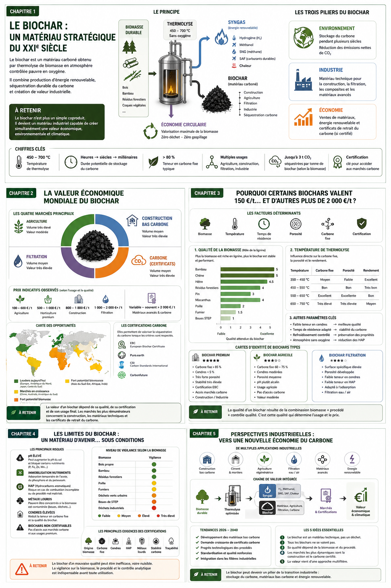

# Atlas mondial de la valorisation économique du Biochar

### Marchés • Applications • Carbone • Industrie • Perspectives

> **Version 1.0 – Juillet 2026**

**Auteur : Eric Jacob**

---

## Objectif

Cet atlas rassemble une synthèse technique, scientifique et économique consacrée au biochar.

Son objectif est de présenter de manière claire :

- les principes de la thermolyse ;
- les propriétés du biochar ;
- les différents marchés mondiaux ;
- les certifications ;
- les perspectives industrielles ;
- les limites et les précautions d'emploi.

Il s'adresse aussi bien :

- aux industriels,
- aux chercheurs,
- aux collectivités,
- aux investisseurs,
- aux étudiants,
- qu'aux décideurs publics.

---

# Pourquoi cet atlas ?

Le biochar est probablement l'un des rares matériaux capables de réunir simultanément :

- la valorisation durable de la biomasse ;
- la production d'énergie renouvelable ;
- la création de matériaux techniques ;
- la séquestration du carbone ;
- l'économie circulaire.

Pourtant, les informations disponibles restent dispersées entre publications scientifiques, rapports industriels et marchés spécialisés.

Cet atlas vise à proposer une vision cohérente, documentée et régulièrement mise à jour.

---

# Sommaire

| Chapitre | Sujet |
|-----------|-------|
| Chapitre 1 | Le biochar : un matériau stratégique du XXIᵉ siècle |
| Chapitre 2 | La valeur économique mondiale |
| Chapitre 3 | Pourquoi certains biochars valent dix fois plus que d'autres |
| Chapitre 4 | Les limites du biochar |
| Chapitre 5 | Perspectives industrielles |

---

# Philosophie

Le biochar ne constitue ni une solution miracle, ni un simple coproduit de la thermolyse.

Sa valeur dépend :

- de la biomasse utilisée ;
- du procédé industriel ;
- de la qualité analytique ;
- de la certification ;
- du marché auquel il est destiné.

L'objectif de cet atlas est de présenter ces éléments de manière objective, sans promotion d'une entreprise ou d'une technologie particulière.

---

# Licence

Sauf mention contraire :

**Texte**

© Eric Jacob

Licence :

Creative Commons Attribution 4.0 International (CC BY 4.0)

Les illustrations originales du projet sont diffusées dans le cadre de cette publication.

---

# Évolution

Ce document est un projet vivant.

Chaque version est publiée sur GitHub afin de permettre :

- l'amélioration continue ;
- la correction d'erreurs ;
- l'ajout de nouvelles données ;
- l'intégration des avancées scientifiques et industrielles.

---

# Dépôt GitHub

https://github.com/ejsnews/manifeste-souverainete-technologique/tree/main/atlas_mondial_biochars

---

> *« Le carbone n'est pas uniquement un déchet à éliminer. Correctement valorisé, il devient une ressource stratégique au service de la transition industrielle. »*
> 
