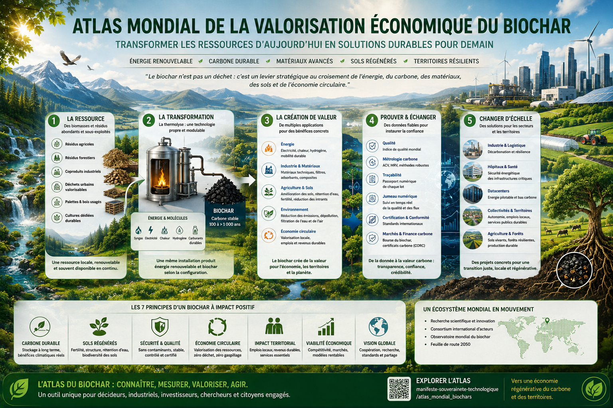

# ATLAS MONDIAL DE LA VALORISATION ÉCONOMIQUE DU BIOCHAR

## Marchés • Applications • Carbone • Industrie • Territoires • Perspectives

**Volume 1 — Version 1.2 — Août 2026**  
**Auteur : Eric Jacob**  
**Licence : Creative Commons CC BY 4.0**

> Un atlas volontairement compact : comprendre le biochar, ses marchés, ses propriétés, ses usages et les infrastructures qui peuvent structurer une filière de thermolyse, d’énergie, de carbone durable et de régénération territoriale.

---

## Lire l’Atlas

| Chapitre | Sujet | Accès |
|---|---|---|
| **1** | Comprendre le biochar | [Ouvrir](ch1_fr.md) |
| **2** | Valeur, marchés et prix | [Valeur et marchés](ch2_fr.md) |
| **3** | Classification et biomasses | [Classification](ch3_fr_classification.md) |
| **4** | Applications, ACV et certifications | [Certifications](ch4_fr_certifications.md) |
| **5** | Outils, infrastructures, territoires et prospective | [Construire la filière de demain](ch5_fr.md) |

---

## Chapitre 1 — Comprendre le biochar

- **[Le biochar : un matériau stratégique du XXIᵉ siècle](ch1_fr.md)**
- [Cycle de la thermolyse](ch1_fr_cycle.svg)
- [Les trois piliers](ch1_fr_3_piliers.svg)
- [Usages](ch1_fr_usages.svg)

---

## Chapitre 2 — Valeur et marchés mondiaux

- **2.1 — [Valeur économique mondiale du biochar](ch2_fr.md)**
- **2.2 — [Prix et valorisation économique](ch2_fr_prix.md)**
- **2.3 — [Carte mondiale](ch2_fr_carte.svg)**

---

## Chapitre 3 — Caractériser avant d’utiliser

- **3.1 — [Classification des biochars](ch3_fr_classification.md)**
- **3.2 — [Paramètres de caractérisation](ch3_fr_parametres.md)**
- **3.3 — [Biomasses et intrants](ch3_fr_biomasses.md)**

> Un biochar n’est pas un produit uniforme : l’intrant, le procédé et les paramètres de production déterminent ses propriétés et donc ses usages possibles.

---

## Chapitre 4 — Applications et garanties

- [Certifications](ch4_fr_certifications.md)
- [Analyse du cycle de vie](ch4_fr_analyse_cycle_vie.md)
- [Matériaux](ch4_fr_materiaux.md)
- [Filtration](ch4_fr_filtration.md)

---

## Chapitre 5 — Construire la filière de demain

### Technologies, qualité et usages

- [Biochar idéal](ch5_fr_biochar_ideal.md)
- [Datacenters IA + biochar](ch5_fr_datacenters.md)
- [Passeport numérique du biochar](ch5_fr_passeport_biochar.md)
- [Indice de qualité](ch5_fr_indice_qualite.md)
- [Guide de l’acheteur](ch5_fr_guide_acheteur.md)

### Mesure, données, carbone et risques

- [Métrologie du carbone](ch5_fr_metrologie_carbone.md)
- [Jumeau numérique](ch5_fr_jumeau_numerique.md)
- [Observatoire mondial](ch5_fr_observatoire_mondial.md)
- [Gestion des risques](ch5_fr_gestion_risques.md)

### Marchés, gouvernance et connaissance

- [Bourse du biochar](ch5_fr_bourse_biochar.md)
- [Indice mondial des prix](ch5_fr_indice_prix_mondial.md)
- [Consortium mondial](ch5_fr_consortium_mondial.md)
- [Recherche mondiale](ch5_fr_recherche_mondiale.md)

### Territoires et prospective

- [Reconquête des déserts](ch5_fr_reconquete_deserts.md)
- [Territoires & résilience — solutions par décideur](ch5_fr_territoires_resilience.md)
- [Feuille de route 2050](ch5_fr_feuille_route_2050.md)

---

## Accès rapide par décideur

Le chapitre **[Territoires & résilience](ch5_fr_territoires_resilience.md)** sert de porte d’entrée sectorielle vers les principaux cas d’usage :

collectivités et métropoles • directions RSE/ESG • industries • datacenters et campus IA • hôpitaux • logistique et distribution • ports • aéroports et SAF • agroalimentaire et chaîne du froid • agriculture et coopératives • réseaux de chaleur • défense et sites critiques • forêts et prévention incendie • molécules renouvelables • finance • carbone et MRV.

---

## Comment lire les figures

Les grandes infographies sont affichées directement dans les articles. Lorsqu’une version SVG apporte une valeur supplémentaire — carte, diagramme, flux ou figure scientifique — elle est proposée séparément.

Les figures de l’Atlas portent l’attribution :

**© Eric Jacob 2026 — Atlas mondial du biochar — CC BY 4.0**

---

## Méthode

L’Atlas distingue autant que possible :

- les données établies ;
- les ordres de grandeur ;
- les observations et retours de terrain ;
- les caractéristiques annoncées par les constructeurs ;
- les hypothèses industrielles ;
- les architectures prospectives.

Lorsqu’une donnée industrielle reste ambiguë, l’Atlas conserve cette incertitude visible plutôt que d’inventer une précision. Les caractéristiques techniques et commerciales doivent être vérifiées dans leur version en vigueur au moment d’un projet.

Le biochar n’est pas présenté comme une solution universelle : sa valeur dépend de l’origine de la biomasse, du procédé, de sa qualité, de l’usage final, du territoire et du bilan de cycle de vie.

---

## Citation

**Eric Jacob**, *Atlas mondial de la valorisation économique du biochar*, Volume 1, version 1.2, 2026.

---

*Projet évolutif publié sur GitHub Pages. Les articles peuvent être lus indépendamment tout en restant reliés à l’Atlas.*
