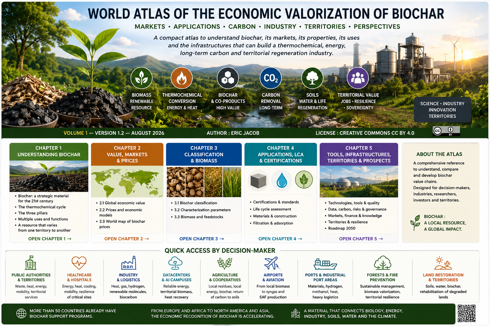

# WORLD ATLAS OF THE ECONOMIC VALORIZATION OF BIOCHAR

## Markets • Applications • Carbon • Industry • Territories • Outlook

**Volume 1 — Version 1.2 — August 2026**  
**Author: Eric Jacob**  
**License: Creative Commons CC BY 4.0**

> A deliberately compact atlas designed to explain biochar, its markets, properties, applications, and the infrastructures that can structure a thermolysis, energy, durable-carbon, and territorial-regeneration value chain.

---

## Read the Atlas

| Chapter | Topic | Access |
|---|---|---|
| **1** | Understanding biochar | [Open](ch1_en.md) |
| **2** | Value, markets and prices | [Value and markets](ch2_en.md) |
| **3** | Classification and biomass | [Classification](ch3_en_classification.md) |
| **4** | Applications, LCA and certifications | [Certifications](ch4_en_certifications.md) |
| **5** | Tools, infrastructure, territories and outlook | [Building tomorrow's value chain](ch5_en.md) |

---

## Chapter 1 — Understanding Biochar

- **[Biochar: a Strategic Material for the 21st Century](ch1_en.md)**
- [Thermolysis cycle](ch1_en_cycle.svg)
- [The three pillars](ch1_en_3_pillars.svg)
- [Applications](ch1_en_uses.svg)

---

## Chapter 2 — Value and Global Markets

- **2.1 — [The Global Economic Value of Biochar](ch2_en.md)**
- **2.2 — [Prices and Economic Valorization](ch2_en_prices.md)**
- **2.3 — [World Map](ch2_en_map.svg)**

---

## Chapter 3 — Characterize Before Use

- **3.1 — [Biochar Classification](ch3_en_classification.md)**
- **3.2 — [Characterization Parameters](ch3_en_parameters.md)**
- **3.3 — [Biomass and Feedstocks](ch3_en_biomass.md)**

> Biochar is not a uniform product: the feedstock, process, and production parameters determine its properties and therefore its possible applications.

---

## Chapter 4 — Applications and Assurance

- [Certifications](ch4_en_certifications.md)
- [Life Cycle Assessment](ch4_en_life_cycle_assessment.md)
- [Materials](ch4_en_materials.md)
- [Filtration](ch4_en_filtration.md)

---

## Chapter 5 — Building Tomorrow's Value Chain

### Technologies, quality and applications

- [Ideal biochar](ch5_en_biochar_ideal.md)
- [AI data centers + biochar](ch5_en_datacenters.md)
- [Digital biochar passport](ch5_en_biochar_passport.md)
- [Quality index](ch5_en_quality_index.md)
- [Buyer's guide](ch5_en_buyer_guide.md)

### Measurement, data, carbon and risks

- [Carbon metrology](ch5_en_carbon_metrology.md)
- [Digital twin](ch5_en_digital_twin.md)
- [Global observatory](ch5_en_global_observatory.md)
- [Risk management](ch5_en_risk_management.md)

### Markets, governance and knowledge

- [Biochar exchange](ch5_en_biochar_exchange.md)
- [Global price index](ch5_en_global_price_index.md)
- [Global consortium](ch5_en_global_consortium.md)
- [Global research](ch5_en_global_research.md)

### Territories and outlook

- [Restoring degraded lands](ch5_en_desert_restoration.md)
- [Territories & Resilience — Solutions by Decision-Maker](ch5_en_territories_resilience.md)
- [Roadmap to 2050](ch5_en_roadmap_2050.md)

---

## Quick Access by Decision-Maker

Are you looking for practical ways to apply thermolysis, biochar, or energy valorization to your activity?

The **[Territories & Resilience](ch5_en_territories_resilience.md)** chapter turns the main sectors into use cases: available resources, energy requirements, valuable products, decarbonization, and value creation.

### Territories & Public Services

- **[Local Authorities & Metropolitan Areas](ch5_en_territories_resilience.md#metropolitan-areas)**  
  Green waste, heat, energy, mobility, and territorial services.

- **[Hospitals & Healthcare Infrastructure](ch5_en_territories_resilience.md#hospitals)**  
  Energy, heat, cooling, mobility, and resilience for critical sites.

- **[District Heating & Real Estate](ch5_en_territories_resilience.md#district-heating)**  
  Valorizing territorial biomass as close as possible to thermal demand.

- **[Defense & Isolated Sites](ch5_en_territories_resilience.md#defense)**  
  Energy autonomy, logistics resilience, and reduced dependencies.

### Industry, Digital Infrastructure & Logistics

- **[Industries](ch5_en_territories_resilience.md#industries)**  
  Heat, gas, hydrogen, renewable molecules, and biocarbon.

- **[Wholesale Markets, Distribution & Logistics](ch5_en_territories_resilience.md#logistics)**  
  Turning residues, pallets, and territorial flows into energy and services.

- **[Data Centers & AI Campuses](ch5_en_territories_resilience.md#data-centers)**  
  Dispatchable energy, territorial biomass, and heat valorization.

- **[Ports & Industrial-Port Zones](ch5_en_territories_resilience.md#ports)**  
  Materials, hydrogen, methanol, heat, fuels, and heavy logistics.

### Agriculture, Food & Living Territories

- **[Agriculture & Cooperatives](ch5_en_territories_resilience.md#agriculture)**  
  Mobilizable residues, local energy, biochar, and returning carbon to soils.

- **[Food Industry & Cold Chain](ch5_en_territories_resilience.md#food-industry)**  
  Valorizing co-products and biomass to produce heat, cooling, and energy.

- **[Forests & Wildfire Prevention](ch5_en_territories_resilience.md#forests)**  
  Creating value from biomass generated through sustainable forest management.

- **[Restoring Degraded Lands](ch5_en_desert_restoration.md)**  
  Biochar, water, soils, and restoration strategies for vulnerable territories.

### Mobility & Renewable Molecules

- **[Airports & Aviation](ch5_en_territories_resilience.md#aviation)**  
  From territorial biomass to syngas and then to SAF pathways.

- **[Hydrogen, Methanol, Biomethane & Fuels](ch5_en_territories_resilience.md#renewable-molecules)**  
  Choosing the molecule that genuinely replaces fossil expenditure.

### ESG, Carbon & Investment

- **[ESG / Sustainability Directors](ch5_en_territories_resilience.md#esg)**  
  Turning an industrial project into demonstrable carbon reduction.

- **[Biochar or Energy Yield?](ch5_en_territories_resilience.md#carbon)**  
  Understanding the trade-off between energy production and retained solid carbon.

- **[Carbon, MRV & Metrology](ch5_en_carbon_metrology.md)**  
  Measuring, documenting, and making carbon performance verifiable.

- **[Financiers & Investors](ch5_en_territories_resilience.md#finance)**  
  Assessing savings, multiple revenue streams, CAPEX/OPEX, and economic robustness.

---

> **Can't find your exact activity?**  
> Start with **[the 8-question method](ch5_en_territories_resilience.md#method)**: identify your residues, the biomass available around your site, your energy expenditure, and the products or services your territory could use.

---

## How to Read the Figures

The main infographics are displayed directly in the articles. When an SVG version provides additional value — map, diagram, flow chart, or scientific figure — it is offered separately.

Atlas figures carry the attribution:

**© Eric Jacob 2026 — World Biochar Atlas — CC BY 4.0**

---

## Method

Wherever possible, the Atlas distinguishes between:

- established data;
- orders of magnitude;
- observations and field feedback;
- characteristics announced by manufacturers;
- industrial assumptions;
- prospective architectures.

When industrial data remain ambiguous, the Atlas keeps that uncertainty visible rather than inventing false precision. Technical and commercial specifications must be checked against the version in force at the time a project is developed.

Biochar is not presented as a universal solution: its value depends on biomass origin, process, quality, final use, territory, and life-cycle assessment.

---

## Citation

**Eric Jacob**, *World Atlas of the Economic Valorization of Biochar*, Volume 1, version 1.2, 2026.

---

*An evolving project published on GitHub Pages. Articles can be read independently while remaining connected to the Atlas.*
