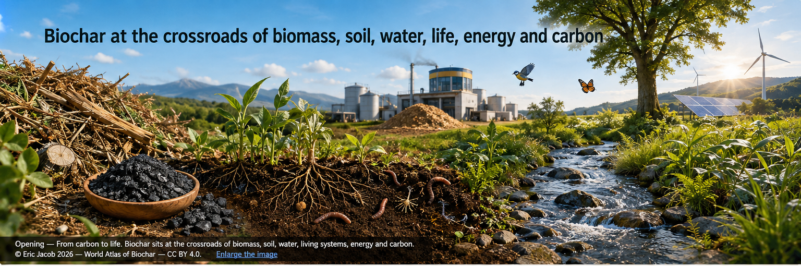
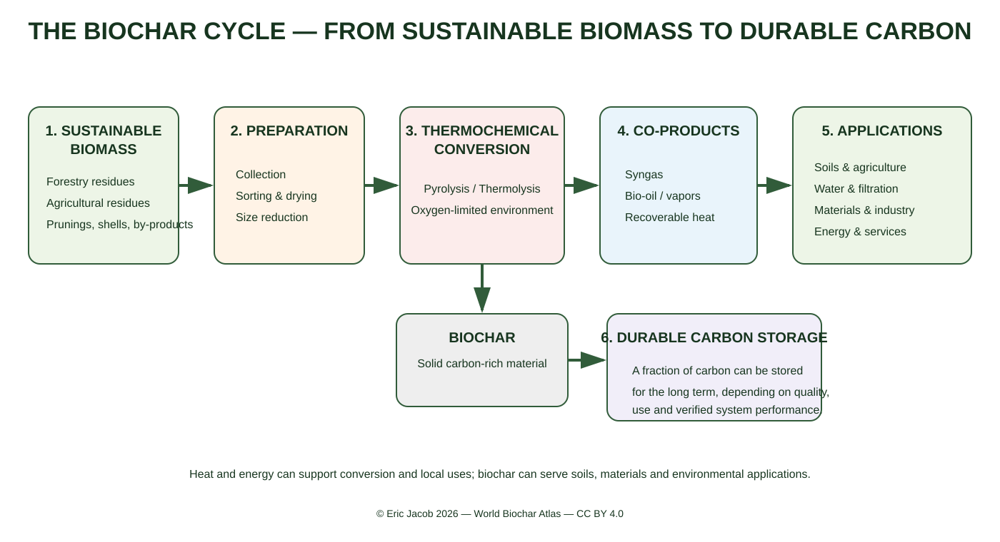
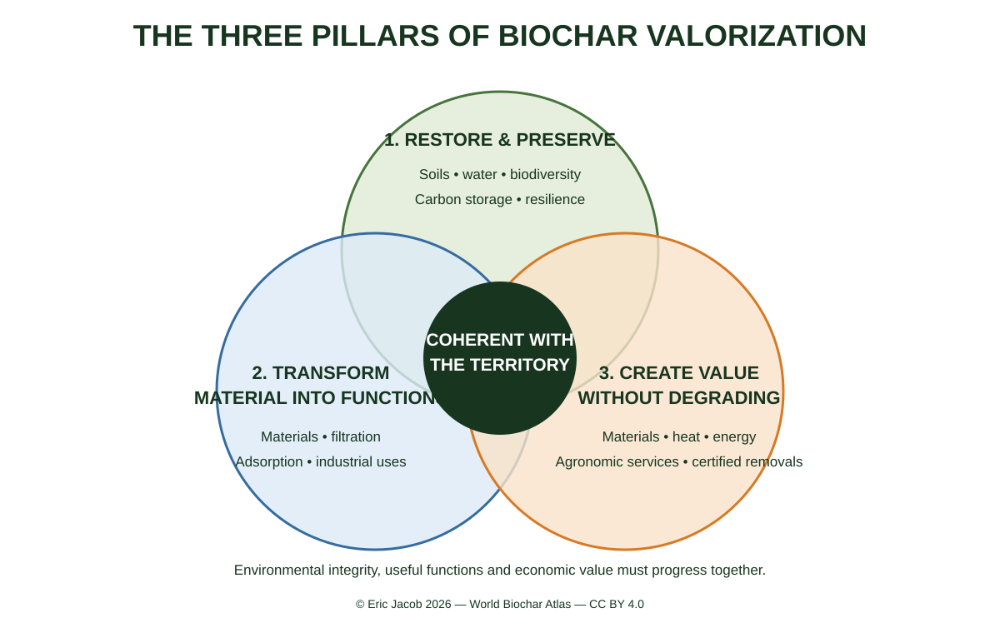

# Chapter 1 — Biochar: a Strategic Material for the 21st Century

> **World Atlas of the Economic Valorization of Biochar — Volume 1**  
> Version 1.2 — August 2026 · Author: Eric Jacob

**[↑ Atlas Contents](index_en.md) · [Chapter 2.1 — Economic Value and Markets →](ch2_en.md)**

---

<figure>
  
  <figcaption><strong>Opening — From carbon to life.</strong> Biochar lies at the intersection of biomass, soil, water, living systems, energy and carbon. © Eric Jacob 2026 — World Biochar Atlas — CC BY 4.0. <a href="ch1_en.png">Enlarge image</a></figcaption>
</figure>

## Understand in One Minute

Biochar is a carbon-rich material obtained through the thermochemical conversion of biomass in an oxygen-limited environment. Part of the initial carbon can thereby be retained in a form that is more stable than in the original biomass.

But its value is not limited to carbon. Depending on the feedstock, process and resulting quality, it can interact with **soil, water, living organisms, materials, or certain filtration processes**.

> ### There is no single “biochar”, but many biochars.
> Their value comes from matching **resource → process → properties → application → territory**.

---

## A Cycle Rather Than an Isolated Product

<figure>
  
  <figcaption><strong>Figure 1 — Biochar production and valorization cycle.</strong> © Eric Jacob 2026 — World Biochar Atlas — CC BY 4.0. <a href="ch1_en_cycle.svg">Enlarge / SVG version</a></figcaption>
</figure>

Thermolysis or pyrolysis does not produce only a carbon-rich solid. Depending on the process, it also generates gases, vapors and heat that may be valorized. Hydrogen, methanol, SNG or SAF are nevertheless **not automatic products of every biochar unit**: producing them may require appropriate downstream conversion steps.

This change in perspective matters: instead of viewing biochar as a bag of black material, we consider **a system of flows** in which a local resource can provide carbon-rich material, heat, energy and territorial services.

---

## Why Preserve Part of the Carbon?

When biomass decomposes or is burned, a large share of its carbon returns relatively quickly to the atmosphere. Thermochemical conversion can direct a fraction of that carbon into a solid that is more resistant to degradation.

The climate benefit depends on the complete system: biomass origin and renewal, preparation, transport, conversion, carbon stability and final destination. This is why the Atlas connects biochar with **[life cycle assessment](ch4_en_life_cycle_assessment.md)**.

---

## Three Dimensions That Must Advance Together

<figure>
  
  <figcaption><strong>Figure 2 — The three pillars of biochar valorization.</strong> © Eric Jacob 2026 — World Biochar Atlas — CC BY 4.0. <a href="ch1_en_3_pillars.svg">Enlarge / SVG version</a></figcaption>
</figure>

### 🌱 Restore and Preserve

In some soils, an appropriate biochar can alter water retention, pH, ion exchange and interactions with nutrients. Its porous structure can also help create microhabitats favorable to certain biological communities.

Field feedback — earthworm activity, crop behavior during dry periods, changes in input requirements or soil structure — is valuable. It must be **documented, measured and compared**, without automatically being turned into a universal property.

### ⚙️ Turn a Material into Functions

Porosity, specific surface area, mineral composition, conductivity and carbon structure open applications in materials, composites, filtration, adsorption and environmental processes. The same term “biochar” therefore covers materials that can perform very different functions.

### 📈 Create Value Without Degrading

Value may come from the material itself, co-produced heat or energy, residue valorization, agronomic services and, when the relevant criteria are genuinely satisfied, certified carbon removal.

Economic success means building **a loop that is coherent with the territory**.

---

## From Black Material to a Living Landscape

Biochar has agronomic value only through what happens around it: water, roots, bacteria, fungi, earthworms, organic matter, minerals and farming practices.

The objective is not to replace soil with an industrial product. It is to examine whether adding a well-chosen material can help a soil perform certain functions more effectively.

In territories exposed to drought, erosion or loss of organic matter, **retaining water that has already been received, supporting living systems and protecting soil structure can be as valuable as adding another nutrient.**

---

## A Different Resource in Every Territory

Pruning wood, genuinely available agricultural residues, shells, pits, hedgerows, bamboo or perennial plants must never become a list of universal prescriptions.

Bamboo can be remarkable in certain regions where it is suitable and available, without any need to transplant that model artificially elsewhere.

> **Use what the territory can renew without degrading what keeps it alive.**

See: **[Sustainable Biomass for Sustainable Biochars](ch3_en_biomass.md)**.

---

## What Really Determines Quality

| What we examine | Why it matters |
|---|---|
| **Biomass** | carbon, minerals, contaminants, structure |
| **Temperature and process** | yield, volatility, stability, porosity |
| **Residence time** | degree of conversion |
| **Post-treatment** | particle size, activation, formulation, safety |
| **Final application** | determines which properties are actually useful |
| **Territory** | water, soil, climate, logistics and available resources |

The notion of the “best biochar” only makes sense when specifying **for which application and in which environment**.

---

## From Laboratory to Field, Then from Field to Laboratory

```text
MEASUREMENT → TEST → FIELD
     ↑                 ↓
     └── observation ──┘
```

Analyses help us understand a material. The field reveals interactions that cannot be reduced to a single laboratory value.

A spectacular agricultural observation is neither universal proof nor information to be dismissed. It is **an experimental hypothesis offered by reality**.

---

## What Biochar Is Not

Biochar is not a justification for overexploiting biomass. It is not automatically a fertilizer, automatically free of contaminants, or automatically “carbon negative”.

And it does not need to be presented as miraculous in order to be remarkable.

> **If a material sustainably improves water behavior, soil structure or soil biology under reproducible conditions, the phenomenon is already important enough to deserve understanding and dissemination.**

---

## The Thread of the Atlas

**Value and markets** → **prices** → **classification** → **parameters** → **biomass** → **certification and LCA** → **applications** → **global infrastructure and tools**.

Readers can follow this progression or enter directly through the topic that interests them.

---

## Continue Reading

**[↑ Atlas Contents](index_en.md) · [Chapter 2.1 — Economic Value and Markets →](ch2_en.md)**

Explore: [Biochar Classification](ch3_en_classification.md) · [Parameters](ch3_en_parameters.md) · [Biomass](ch3_en_biomass.md) · [Life Cycle Assessment](ch4_en_life_cycle_assessment.md)

---

*World Atlas of the Economic Valorization of Biochar — Eric Jacob — Version 1.2 — 2026*  
*License: Creative Commons CC BY 4.0*
