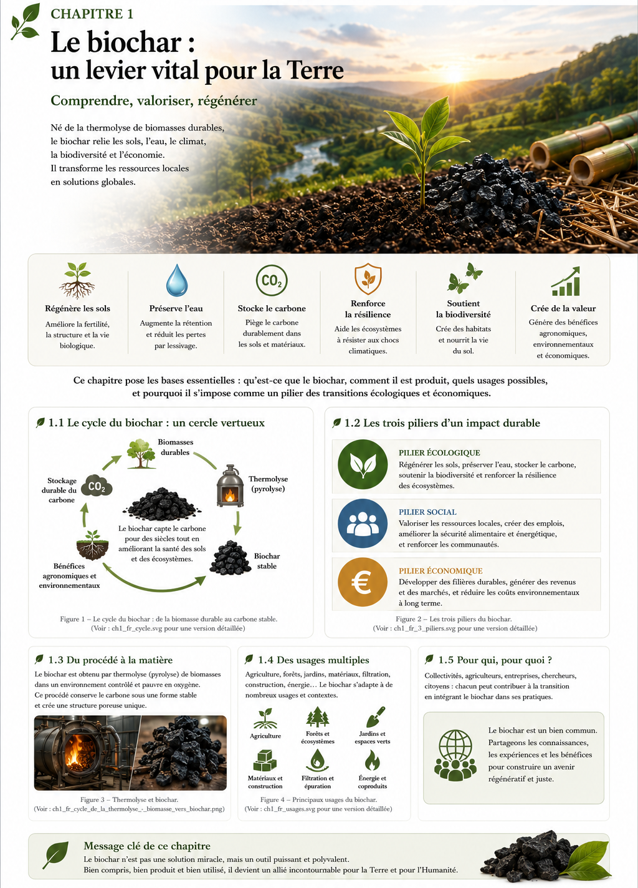

# Chapitre 1 — Le biochar : un matériau stratégique du XXIᵉ siècle

> **Atlas mondial de la valorisation économique du biochar — Volume 1**  
> Version 1.2 — Août 2026 · Auteur : Eric Jacob

**[↑ Sommaire de l’Atlas](README.md) · [Chapitre 2.1 — Valeur économique et marchés →](ch2_fr.md)**

---

<figure>
  
  <figcaption><strong>Ouverture — Du carbone à la vie.</strong> Le biochar se situe à la rencontre de la biomasse, du sol, de l’eau, du vivant, de l’énergie et du carbone. © Eric Jacob 2026 — Atlas mondial du biochar — CC BY 4.0. <a href="ch1_fr.png">Agrandir l’image</a></figcaption>
</figure>

## Comprendre en une minute

Le biochar est un matériau carboné obtenu par transformation thermochimique d’une biomasse dans un milieu à oxygène limité. Une partie du carbone initial peut ainsi être conservée sous une forme plus stable que dans la biomasse d’origine.

Mais son intérêt ne se limite pas au carbone. Selon l’intrant, le procédé et la qualité obtenue, il peut interagir avec **le sol, l’eau, les organismes vivants, les matériaux ou certains procédés de filtration**.

> ### Il n’existe pas « un » biochar, mais des biochars.
> Leur valeur vient de l’adéquation entre **ressource → procédé → propriétés → usage → territoire**.

---

## Un cycle plutôt qu’un produit isolé

<figure>
  
  <figcaption><strong>Figure 1 — Cycle de production et de valorisation du biochar.</strong> © Eric Jacob 2026 — Atlas mondial du biochar — CC BY 4.0. <a href="ch1_fr_cycle.svg">Agrandir / version SVG</a></figcaption>
</figure>

La thermolyse ou pyrolyse ne produit pas uniquement un solide carboné. Selon le procédé, elle génère également des gaz, vapeurs et chaleur susceptibles d’être valorisés. Hydrogène, méthanol, SNG ou SAF ne sont toutefois **pas des produits automatiques de toute unité de biochar** : leur production éventuelle demande des étapes de conversion adaptées.

Le changement de perspective est important : au lieu de considérer le biochar comme un sac de matière noire, on observe **un système de flux** où une ressource locale peut fournir matière carbonée, chaleur, énergie et services territoriaux.

---

## Pourquoi conserver une partie du carbone ?

Lorsqu’une biomasse se décompose ou est brûlée, une grande partie de son carbone retourne relativement rapidement vers l’atmosphère. La conversion thermochimique peut orienter une fraction de ce carbone vers un solide plus résistant à la dégradation.

Le bénéfice climatique dépend du système complet : origine et renouvellement de la biomasse, préparation, transport, conversion, stabilité du carbone et destination finale. C’est pourquoi l’Atlas relie biochar et **[analyse du cycle de vie](ch4_fr_analyse_cycle_vie.md)**.

---

## Trois dimensions qui doivent progresser ensemble

<figure>
  
  <figcaption><strong>Figure 2 — Les trois piliers de la valorisation du biochar.</strong> © Eric Jacob 2026 — Atlas mondial du biochar — CC BY 4.0. <a href="ch1_fr_3_piliers.svg">Agrandir / version SVG</a></figcaption>
</figure>

### 🌱 Restaurer et préserver

Dans certains sols, un biochar approprié peut modifier la rétention d’eau, le pH, les échanges ioniques et les interactions avec les nutriments. Sa structure poreuse peut également contribuer à créer des microhabitats favorables à certaines communautés biologiques.

Les retours de terrain — activité des lombrics, comportement des cultures en période sèche, évolution des besoins en intrants ou de la structure du sol — sont précieux. Ils doivent être **documentés, mesurés et comparés**, sans être transformés automatiquement en propriété universelle.

### ⚙️ Transformer une matière en fonctions

Porosité, surface spécifique, composition minérale, conductivité et structure carbonée ouvrent des usages dans les matériaux, composites, filtration, adsorption et procédés environnementaux. Le même nom « biochar » recouvre donc des matériaux qui peuvent avoir des fonctions très différentes.

### 📈 Créer de la valeur sans dégrader

La valeur peut provenir du matériau, de la chaleur ou de l’énergie coproduite, de la valorisation de résidus, de services agronomiques et, lorsque les critères sont réellement satisfaits, du retrait certifié de carbone.

La réussite économique consiste à construire **une boucle cohérente avec le territoire**.

---

## De la matière noire au paysage vivant

Le biochar n’a d’intérêt agronomique que par ce qui se passe autour de lui : eau, racines, bactéries, champignons, lombrics, matière organique, minéraux et pratiques agricoles.

L’objectif n’est pas de remplacer le sol par un produit industriel. Il est d’examiner si l’adjonction d’un matériau bien choisi peut aider un sol à mieux remplir certaines fonctions.

Dans les territoires soumis à la sécheresse, à l’érosion ou à une perte de matière organique, **conserver l’eau déjà reçue, favoriser le vivant et protéger la structure du sol peut valoir autant que l’apport d’un nutriment supplémentaire.**

---

## Une ressource différente dans chaque territoire

Bois d’élagage, résidus agricoles réellement disponibles, coques, noyaux, haies, bambou ou plantes pérennes ne doivent jamais devenir une liste de prescriptions universelles.

Le bambou peut être remarquable dans certaines régions où il est adapté et disponible sans qu’il soit nécessaire de le transposer artificiellement ailleurs.

> **Utiliser ce que le territoire peut renouveler sans dégrader ce qui le rend vivant.**

Voir : **[Biomasses durables pour biochars durables](ch3_fr_biomasses.md)**.

---

## Ce qui détermine réellement la qualité

| Ce que l’on regarde | Pourquoi cela compte |
|---|---|
| **Biomasse** | carbone, minéraux, contaminants, structure |
| **Température et procédé** | rendement, volatilité, stabilité, porosité |
| **Temps de résidence** | degré de conversion |
| **Post-traitement** | granulométrie, activation, formulation, sécurité |
| **Usage final** | détermine quelles propriétés sont réellement utiles |
| **Territoire** | eau, sol, climat, logistique et ressources disponibles |

La notion de « meilleur biochar » n’a de sens qu’en précisant **pour quel usage et dans quel milieu**.

---

## Du laboratoire au champ, puis du champ au laboratoire

```text
MESURE → ESSAI → TERRAIN
  ↑                 ↓
  └── observation ──┘
```

Les analyses permettent de comprendre un matériau. Le terrain révèle des interactions impossibles à réduire à une seule valeur de laboratoire.

Une remontée agricole spectaculaire n’est ni une preuve universelle ni une information à écarter. C’est **une hypothèse expérimentale offerte par le réel**.

---

## Ce que le biochar n’est pas

Le biochar n’est pas une justification pour surexploiter la biomasse. Il n’est pas automatiquement un engrais, automatiquement exempt de contaminants ou automatiquement « carbone négatif ».

Et il n’a pas besoin d’être présenté comme miraculeux pour être remarquable.

> **Si un matériau améliore durablement l’eau, la structure ou la biologie d’un sol dans des conditions reproductibles, le phénomène est déjà suffisamment important pour mériter d’être compris et diffusé.**

---

## Le fil de l’Atlas

**Valeur et marchés** → **prix** → **classification** → **paramètres** → **biomasses** → **certification et ACV** → **applications** → **infrastructures et outils mondiaux**.

Le lecteur peut suivre cette progression ou entrer directement par le sujet qui l’intéresse.

---

## Continuer la lecture

**[↑ Sommaire de l’Atlas](README.md) · [Chapitre 2.1 — Valeur économique et marchés →](ch2_fr.md)**

À explorer : [Classification des biochars](ch3_fr_classification.md) · [Paramètres](ch3_fr_parametres.md) · [Biomasses](ch3_fr_biomasses.md) · [Analyse du cycle de vie](ch4_fr_analyse_cycle_vie.md)

---

*Atlas mondial de la valorisation économique du biochar — Eric Jacob — Version 1.2 — 2026*  
*Licence : Creative Commons CC BY 4.0*
