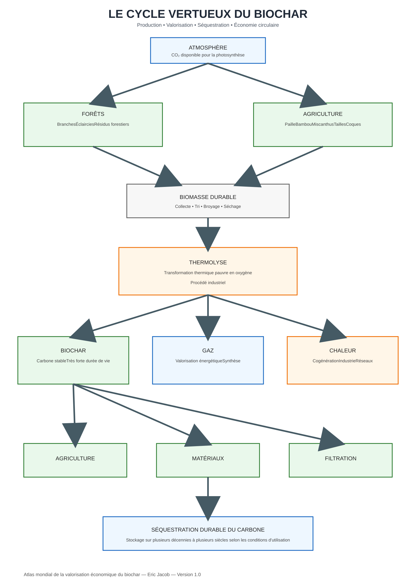
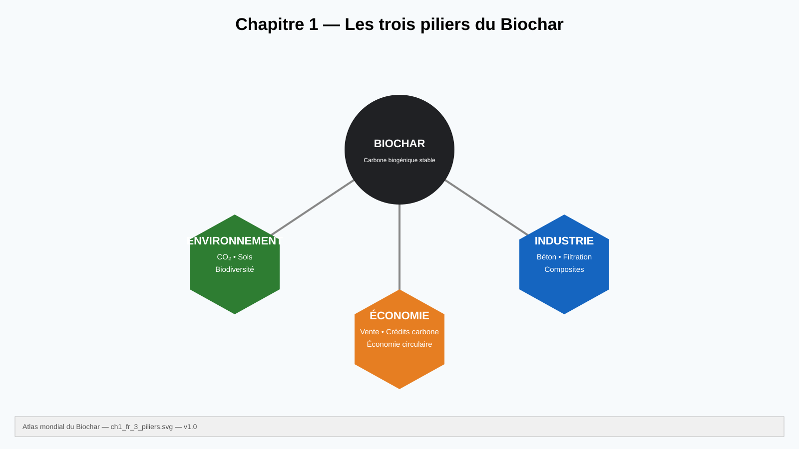

# Chapitre 1 — Le biochar : un matériau stratégique du XXIᵉ siècle

> **Atlas mondial de la valorisation économique du biochar — Volume 1**  
> Version 1.1 — Août 2026 · Auteur : Eric Jacob

**[↑ Sommaire de l’Atlas](./)** · **[Chapitre 2 : marchés et prix →](ch2_fr_prix.md)**

---

## En une minute

Le biochar est un matériau carboné obtenu par transformation thermochimique d’une biomasse dans un milieu à oxygène limité. Une partie du carbone initial peut ainsi être conservée sous une forme plus stable que dans la biomasse d’origine.

Son intérêt ne se limite pas au carbone. Selon l’intrant, le procédé et la qualité obtenue, le biochar peut devenir un matériau pour les sols, les matériaux de construction, la filtration ou d’autres applications industrielles.

**La règle essentielle de cet Atlas est donc : il n’existe pas “un” biochar, mais des biochars.**

---

## Le principe

<figure>
  
  <figcaption>
    <strong>Figure 1 — Cycle de production et de valorisation du biochar.</strong>
    © Eric Jacob 2026 — Atlas mondial du biochar — CC BY 4.0.
    <a href="ch1_fr_cycle.svg">Agrandir / version SVG</a>
  </figcaption>
</figure>

La thermolyse ou pyrolyse ne produit pas uniquement un solide carboné. Selon le procédé, elle génère également des gaz, vapeurs et chaleur susceptibles d’être valorisés.

Il faut cependant éviter une simplification fréquente : **hydrogène, méthanol, SNG ou SAF ne sont pas des produits automatiques de toute unité de biochar**. Leur production éventuelle exige des procédés et étapes de conversion adaptés.

---

## Pourquoi conserver une partie du carbone ?

Lorsqu’une biomasse se décompose ou est brûlée, une grande partie de son carbone retourne relativement rapidement vers l’atmosphère.

La conversion thermochimique peut orienter une fraction de ce carbone vers un solide plus résistant à la dégradation.

L’intérêt climatique dépend alors de l’ensemble du système :

- origine et renouvellement de la biomasse ;
- énergie nécessaire à sa préparation ;
- transport ;
- conditions de conversion ;
- stabilité du carbone obtenu ;
- destination finale du biochar.

Le stockage ne doit donc pas être évalué uniquement à partir de la masse de biochar produite, mais dans une **analyse de cycle de vie**.

---

## Trois piliers : environnement, industrie, économie

<figure>
  
  <figcaption>
    <strong>Figure 2 — Les trois piliers de la valorisation du biochar.</strong>
    © Eric Jacob 2026 — Atlas mondial du biochar — CC BY 4.0.
    <a href="ch1_fr_3_piliers.svg">Agrandir / version SVG</a>
  </figcaption>
</figure>

### Environnement et carbone

Le biochar peut contribuer au retrait durable du carbone lorsque la biomasse est durable, que le procédé est correctement maîtrisé et que le carbone demeure stocké dans un usage approprié.

Dans certains sols, il peut également modifier la rétention d’eau, le pH, la capacité d’échange et les interactions avec les nutriments. Ces effets dépendent fortement du biochar et du sol : **l’usage agricole doit être caractérisé, pas présumé bénéfique**.

### Industrie

La porosité, la surface spécifique, la composition minérale, la conductivité et la structure carbonée ouvrent des usages dans :

- matériaux de construction ;
- composites ;
- filtration et adsorption ;
- procédés industriels ;
- applications environnementales.

### Économie

Un même système peut générer plusieurs formes de valeur : vente du matériau, énergie ou chaleur coproduite, services de traitement de résidus et, lorsque les critères sont satisfaits, retrait certifié du carbone.

Cette pluralité de débouchés est une force, mais elle impose de ne pas additionner des revenus théoriques comme s’ils étaient simultanément garantis.

---

## Ce qui détermine la qualité

Quatre familles de paramètres sont particulièrement importantes :

| Paramètre | Influence |
|---|---|
| **Biomasse** | carbone, minéraux, contaminants, structure |
| **Température** | rendement, volatilité, stabilité, surface |
| **Temps de résidence** | degré de conversion |
| **Post-traitement** | granulométrie, activation, formulation, sécurité |

La notion de « meilleur biochar » n’a donc de sens qu’en précisant **pour quel usage**.

Un produit recherché pour la filtration n’a pas nécessairement les mêmes propriétés optimales qu’un biochar destiné à un sol ou à un matériau composite.

---

## Ordres de grandeur : prudence

Les températures de pyrolyse utilisées pour produire des biochars se situent couramment dans une plage de quelques centaines de degrés Celsius, mais il n’existe pas une température universelle.

De même, parler d’un stockage du carbone « pendant des siècles » décrit un potentiel qui dépend de la fraction carbonée considérée, du procédé et de l’environnement final.

L’Atlas privilégiera donc les plages, les conditions et les méthodes de mesure plutôt que les chiffres spectaculaires isolés.

---

## De la biomasse au matériau conçu

La filière peut être comprise comme une chaîne de conception :

```text
RESSOURCE
   ↓
caractérisation de la biomasse
   ↓
PROCÉDÉ
   ↓
température • temps • atmosphère • énergie
   ↓
BIOCHAR
   ↓
analyses physiques + chimiques + carbone
   ↓
USAGE CIBLÉ
   ↓
sol • matériau • filtration • industrie • stockage carbone
```

Cette logique constitue le fil conducteur des chapitres suivants.

---

## Ce que le biochar n’est pas

Le biochar n’est :

- ni une justification pour surexploiter la biomasse ;
- ni automatiquement un engrais ;
- ni automatiquement exempt de contaminants ;
- ni automatiquement « carbone négatif » ;
- ni un produit industriel uniforme.

Cette prudence est précisément ce qui permet de défendre sérieusement les applications qui, elles, fonctionnent.

---

## À retenir

> **La valeur du biochar ne vient pas seulement de sa capacité à contenir du carbone. Elle vient de la possibilité de concevoir un matériau adapté à un usage tout en intégrant ce matériau dans un cycle de biomasse, d’énergie et de carbone mesurable.**

Le chapitre suivant aborde la question économique : **combien valent réellement les différents biochars et pourquoi leurs prix peuvent-ils être très différents ?**

---

## Continuer la lecture

**[↑ Sommaire de l’Atlas](./)** · **[Chapitre 2 — Marchés et prix →](ch2_fr_prix.md)**

Articles complémentaires :

- [Classification des biochars](ch3_fr_classification.md)
- [Biomasses et intrants](ch3_fr_biomasses.md)
- [Paramètres de caractérisation](ch3_fr_parametres.md)
- [Analyse du cycle de vie](ch4_fr_analyse_cycle_vie.md)

---

*Atlas mondial de la valorisation économique du biochar — Eric Jacob — Version 1.1 — 2026*  
*Licence : Creative Commons CC BY 4.0*
