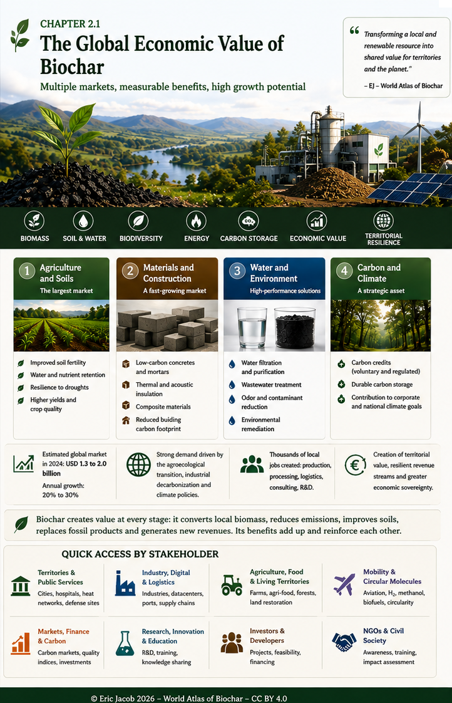

# Chapter 2.1 — The Global Economic Value of Biochar

> **World Atlas of the Economic Valorization of Biochar — Volume 1**  
> Version 1.1 — August 2026 · Author: Eric Jacob

**[← Chapter 1](ch1_en.md) · [↑ Atlas Contents](index_en.md) · [Prices and Economic Models →](ch2_en_prices.md)**

---

## From an Agricultural Amendment to a Strategic Material

Biochar has long been viewed primarily from an agronomic perspective. Its economic relevance becomes much broader when its physical properties, stable carbon, porosity, industrial applications and the value created within territories are considered together.

The aim is not to replace agricultural practices, ecosystems or existing resources. In soils, the relevant approach often consists of **adding an appropriate quantity of characterized biochar** to an already complex living system. The outcome depends on the soil, climate, biochar, its preparation and the application rate.

<figure>
  
  <figcaption>
    <strong>Figure 1 — Biochar as a multi-purpose territorial asset.</strong>
    © Eric Jacob 2026 — World Biochar Atlas — CC BY 4.0.
    <a href="ch2_en.png">Enlarge infographic</a>
  </figcaption>
</figure>

---

## Value Appears in Several Places at Once

A single thermochemical system can create several value streams: processing genuinely available local biomass, producing energy or heat, selling biochar, improving an agricultural or industrial application and, when all methodological conditions are met, valorizing durable carbon removal.

This plurality explains why comparing biochar with a simple material sold by the tonne is insufficient. **Its value depends on what it replaces, improves or makes possible.**

---

## Agriculture: the Value of Living Soil

Field observations are particularly valuable when they describe comparable plots before and after biochar incorporation: changes in soil structure, improved moisture retention, increased biological activity, changes in input requirements, or crop stability during dry periods.

These observations must be documented without being turned too quickly into universal laws. They are precisely **field signals that deserve measurement**.

Earthworms illustrate this approach well. Their abundance is an interesting biological indicator, but it depends on many factors: moisture, available organic matter, temperature, soil texture, farming practices and the absence of unfavorable substances. Biochar-amended soil may provide more favorable conditions in some contexts; the Atlas therefore distinguishes agricultural observations, plausible mechanisms and experimentally established results.

The potential economic benefit then comes not only from yield: it may arise from a combination of water resilience, fertility, reduced use of certain inputs, production stability and gradual improvement of soil capital.

---

## Water: Turning Drought into a Soil-Management Issue

The porous structure of some biochars can alter how water is retained and moves through soil. This function becomes economically important in territories exposed to dry periods, intense rainfall or degraded soils.

Biochar is not an artificial aquifer and does not create water. Under appropriate conditions, however, it can help **retain for longer a fraction of the water passing through the soil**, in interaction with organic matter, roots and soil structure.

This water-related function is one reason why the agronomic value of biochar cannot be reduced to its chemical composition alone.

---

## Construction and Materials

Biochar can be incorporated into concrete, mortar, bricks, plaster, composites and other materials. Depending on the formulation, it can contribute to lower weight, hygric or thermal properties and the durable incorporation of carbon into a long-lived product.

These markets require characterization different from that of agricultural biochar: particle size, moisture, density, binder compatibility and mechanical properties become decisive.

See: **[Biochar and Materials](ch4_en_materials.md)**.

---

## Filtration and Remediation

The porosity and surface chemistry of some biochars open applications in the treatment of water, effluents, air or contaminated environments.

Again, “biochar” is not a sufficient specification. Adsorption depends on accessible surface area, pore distribution, material chemistry and the targeted contaminant. Some applications may require activation or additional treatment.

See: **[Filtration and Adsorption](ch4_en_filtration.md)**.

---

## Carbon: Value That Requires Proof

Carbon contained in biochar can constitute durable storage when its stability, biomass origin, process emissions, traceability and final use meet the requirements of the selected methodology.

A carbon credit must therefore never be considered automatic. It represents an **additional economic layer** when removal is quantified, verified and certified.

This discipline is essential if carbon finance is to support a real value chain rather than a mere promise.

See: **[Certifications](ch4_en_certifications.md)** and **[Carbon Metrology](ch5_en_carbon_metrology.md)**.

---

## Territorial Value: the Overlooked Market

A tonne of biomass transported over long distances consumes energy and exports a resource. Biomass transformed near its place of production can instead circulate several forms of value within the same territory: agricultural activity, heat, energy, biochar, jobs, technical services and potential soil improvement.

The economic model becomes particularly interesting when the flows complement one another:

```text
SUSTAINABLE LOCAL RESOURCE
          ↓
THERMOCHEMICAL CONVERSION
     ↙       ↓        ↘
 BIOCHAR   ENERGY     HEAT
     ↓       ↓        ↓
 SOILS /   LOCAL     LOCAL
MATERIALS ACTIVITY   USES
          ↓
   TERRITORIAL VALUE
```

This logic does not imply autarky. It means avoiding unnecessary transport of bulky biomass and retaining as much of the value created as possible close to its source.

---

## Biomass Resources Adapted to Each Territory

Bamboo illustrates why the Atlas rejects universal recipes. In some regions of Cameroon or other areas where it grows naturally or is already cultivated, it may represent a remarkable resource. This obviously does not mean that French agricultural landscapes should be converted into bamboo plantations.

Managed forests, hedgerows, agricultural residues, shells, pits, prunings, bamboo and perennial plants each have their own geography and ecological function. **Resource diversity must remain a safeguard against monoculture, soil degradation and territorial risks, including wildfires.**

See: **[Sustainable Biomass](ch3_en_biomass.md)**.

---

## Four Markets, One Common Requirement

| Market | Value sought | Essential condition |
|---|---|---|
| **Agriculture** | soil, water, fertility, resilience | biochar–soil suitability and field validation |
| **Materials** | technical functions + incorporated carbon | formulation and measured performance |
| **Filtration** | adsorption / remediation | targeted characterization |
| **Carbon** | quantified durable removal | traceability, LCA and certification |

These markets are not mutually exclusive. On the contrary, they show why precise classification and a biochar passport are becoming necessary.

---

## Key Takeaway

> **The economic value of biochar does not lie in the black carbon material itself, but in the functions that a properly selected biochar can provide to a soil, a material, water, an industry or a territory.**

Remarkable agricultural observations should neither be turned into universal miracles nor dismissed because they challenge existing models. They should become subjects of measurement, comparison and research.

That is how a field practice can become transferable knowledge.

---

## Continue Reading

**[← Chapter 1](ch1_en.md) · [↑ Atlas Contents](index_en.md) · [Chapter 2.2 — Prices and Economic Models →](ch2_en_prices.md)**

See also: [Classification](ch3_en_classification.md) · [Parameters](ch3_en_parameters.md) · [Biomass](ch3_en_biomass.md)

---

*World Atlas of the Economic Valorization of Biochar — Eric Jacob — Version 1.1 — 2026*  
*License: Creative Commons CC BY 4.0*
