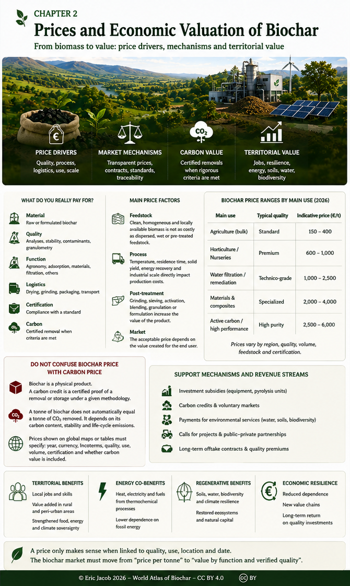

# Chapter 2 — Biochar Prices and Economic Valorization

> **World Atlas of the Economic Valorization of Biochar — Volume 1**  
> Version 1.1 — August 2026 · Author: Eric Jacob

**[← Chapter 2](ch2_en.md) · [↑ Atlas Contents](index_en.md) · [Classification →](ch3_en_classification.md)**

---

## In One Minute

There is no single global price for biochar. Price depends on the biomass, process, analyses, certification, packaging, transport, final application and the possible valorization of carbon removal.

Comparing two prices without comparing product quality and function therefore often leads to the wrong conclusion.

---

## Overview

<figure>
  
  <figcaption>
    <strong>Figure 1 — Prices, economic mechanisms and value creation around biochar.</strong>
    © Eric Jacob 2026 — World Biochar Atlas — CC BY 4.0.
    <a href="ch2_en_prices.png">Enlarge infographic</a>
  </figcaption>
</figure>

The illustration deliberately connects the black material with what gives the value chain its meaning: living soils, vegetation, water, biodiversity and territories. These benefits are not automatic; they depend on the product, soil, climate and application.

---

## What Are We Actually Paying For?

The final price can combine several forms of value:

| Component | Value created |
|---|---|
| Material | raw or formulated biochar |
| Quality | analyses, stability, contaminants, particle size |
| Function | agronomy, adsorption, materials, filtration |
| Logistics | drying, grinding, packaging, transport |
| Certification | compliance with a standard or scheme |
| Carbon | certified removal when the criteria are met |

The market must therefore evolve from a **price-per-tonne** logic toward a **price based on function and verified quality**.

---

## Main Price Drivers

### Feedstock

Clean, homogeneous biomass available locally does not have the same economics as dispersed or wet feedstock requiring substantial pretreatment.

### Process

Temperature, residence time, solid yield, energy recovery and industrial capacity directly influence production cost.

### Post-treatment

Grinding, screening, activation, blending, granulation or formulation can transform a generic biochar into a higher-value product.

### Market

The acceptable price ultimately depends on the value created for the user. A specialized adsorbent cannot be compared with a bulk soil amendment.

---

## Do Not Confuse the Price of Biochar with the Price of Carbon

Biochar is a **physical product**. A carbon credit, when one exists, is **certified evidence of a removal or storage outcome that complies with a defined methodology**.

The two values can be associated, but they must not be confused.

One tonne of biochar does not automatically equal one tonne of CO₂ removed. The calculation depends in particular on its carbon content, stability and life-cycle emissions.

---

## Reading a World Map with Caution

If a world map or table shows prices, it should specify:

- year of observation;
- currency and conversion;
- ex-works or delivered price;
- bulk or retail sale;
- quality and certification;
- application;
- quantity ordered;
- whether carbon value is included.

Without this information, a global average gives an impression of precision greater than reality.

---

## Toward a Global Index

A credible future price index should distinguish several categories, for example:

```text
BIOCHAR
├── agricultural
├── material
├── filtration / adsorption
├── specialized / activated
└── biochar + certified carbon removal
```

Each category should then be adjusted for region, quality, volume and logistical conditions.

This approach is developed in the **[Global Price Index](ch5_en_global_price_index.md)**.

---

## Key Takeaway

> **Biochar is not a perfectly homogeneous commodity. A price only makes sense when connected to a quality, an application, a location and a date.**

---

## Continue

**[← Chapter 2](ch2_en.md) · [↑ Atlas](index_en.md) · [Biochar Classification →](ch3_en_classification.md)**

Related articles: [Buyer's Guide](ch5_en_buyer_guide.md) · [Quality Index](ch5_en_quality_index.md) · [Biochar Exchange](ch5_en_biochar_exchange.md)

---

*World Atlas of the Economic Valorization of Biochar — Eric Jacob — Version 1.1 — 2026*  
*License: Creative Commons CC BY 4.0*
