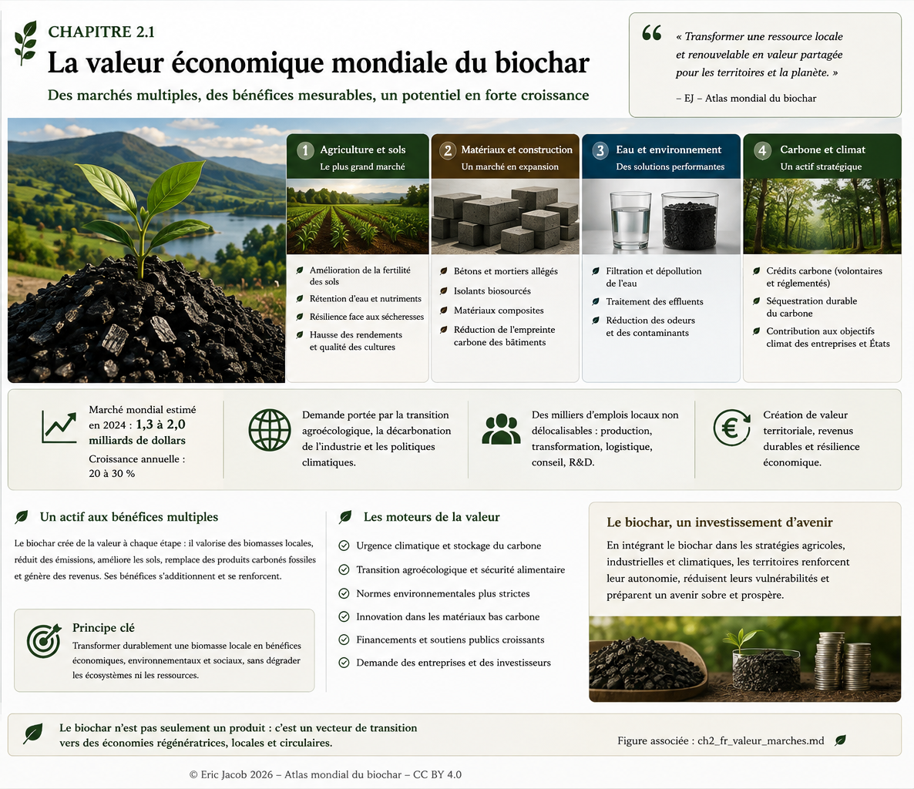

# Chapitre 2.1 — La valeur économique mondiale du biochar

> **Atlas mondial de la valorisation économique du biochar — Volume 1**  
> Version 1.1 — Août 2026 · Auteur : Eric Jacob

**[← Chapitre 1](ch1_fr.md) · [↑ Sommaire de l’Atlas](README.md) · [Prix et modèles économiques →](ch2_fr_prix.md)**

---

## D’un amendement agricole à une matière stratégique

Le biochar a longtemps été regardé principalement sous l’angle agronomique. Son intérêt économique devient beaucoup plus large dès que l’on considère simultanément ses propriétés physiques, son carbone stable, sa porosité, ses usages industriels et la valeur créée dans les territoires.

Il ne s’agit pas de remplacer les pratiques agricoles, les écosystèmes ou les ressources existantes. Dans les sols, l’approche pertinente consiste souvent à **adjoindre une quantité adaptée d’un biochar caractérisé** à un système vivant déjà complexe. Le résultat dépend du sol, du climat, du biochar, de sa préparation et de la dose.

<figure>
  
  <figcaption>
    <strong>Figure 1 — Le biochar comme actif territorial à usages multiples.</strong>
    © Eric Jacob 2026 — Atlas mondial du biochar — CC BY 4.0.
    <a href="ch2_fr.png">Agrandir l’infographie</a>
  </figcaption>
</figure>

---

## La valeur apparaît à plusieurs endroits à la fois

Un même système thermochimique peut créer plusieurs flux de valeur : traitement d’une biomasse locale réellement disponible, production d’énergie ou de chaleur, vente du biochar, amélioration d’un usage agricole ou industriel et, lorsque toutes les conditions méthodologiques sont remplies, valorisation d’un retrait durable de carbone.

Cette pluralité explique pourquoi comparer le biochar à une simple matière vendue à la tonne est insuffisant. **Sa valeur dépend de ce qu’il remplace, améliore ou rend possible.**

---

## Agriculture : la valeur du sol vivant

Les retours de terrain sont particulièrement intéressants lorsqu’ils décrivent des parcelles comparables avant et après incorporation de biochar : modification de la structure du sol, meilleure tenue de l’humidité, activité biologique accrue, évolution des besoins en intrants ou stabilité des cultures pendant des épisodes secs.

Ces observations doivent être documentées sans être transformées trop vite en loi universelle. Elles constituent précisément des **signaux de terrain à mesurer**.

Les lombrics illustrent bien cette approche. Leur abondance est un indicateur biologique intéressant, mais elle dépend de nombreux facteurs : humidité, matière organique disponible, température, texture du sol, pratiques culturales et absence de substances défavorables. Un sol amendé au biochar peut offrir des conditions plus favorables dans certains contextes ; l’Atlas distinguera donc les observations agricoles, les mécanismes plausibles et les résultats établis expérimentalement.

Le bénéfice économique potentiel ne vient alors pas seulement d’un rendement : il peut provenir d’une combinaison entre résilience hydrique, fertilité, réduction de certains intrants, stabilité de production et amélioration progressive du capital-sol.

---

## Eau : transformer la sécheresse en problème de gestion du sol

La structure poreuse de certains biochars peut modifier la manière dont l’eau est retenue et circule dans le sol. Cette fonction devient économiquement importante dans les territoires soumis à des périodes sèches, à des pluies brutales ou à des sols dégradés.

Le biochar n’est pas une nappe phréatique artificielle et ne crée pas d’eau. Il peut cependant contribuer, dans des conditions appropriées, à **conserver plus longtemps une partie de l’eau qui traverse le sol**, en interaction avec la matière organique, les racines et la structure du terrain.

Cette fonction hydrique est l’une des raisons pour lesquelles la valeur agronomique du biochar ne peut pas être réduite à sa seule composition chimique.

---

## Construction et matériaux

Le biochar peut entrer dans des formulations de bétons, mortiers, briques, plâtres, composites et autres matériaux. Selon la formulation, il peut participer à l’allègement, aux propriétés hygriques ou thermiques et à l’incorporation durable de carbone dans un produit à longue durée de vie.

Ces marchés demandent cependant une caractérisation différente de celle d’un biochar agricole : granulométrie, humidité, densité, compatibilité avec le liant et propriétés mécaniques deviennent déterminantes.

Voir : **[Biochar et matériaux](ch4_fr_materiaux.md)**.

---

## Filtration et dépollution

La porosité et la chimie de surface de certains biochars ouvrent des applications dans le traitement de l’eau, des effluents, de l’air ou de milieux contaminés.

Là encore, « biochar » n’est pas une spécification suffisante. L’adsorption dépend de la surface accessible, de la distribution des pores, de la chimie du matériau et du contaminant ciblé. Certaines applications peuvent nécessiter une activation ou un traitement complémentaire.

Voir : **[Filtration et adsorption](ch4_fr_filtration.md)**.

---

## Carbone : une valeur qui exige une preuve

Le carbone contenu dans un biochar peut constituer un stockage durable lorsque sa stabilité, l’origine de la biomasse, les émissions du procédé, la traçabilité et l’usage final satisfont les exigences de la méthodologie retenue.

Le crédit carbone ne doit donc jamais être considéré comme automatique. Il représente une **couche économique supplémentaire** lorsque le retrait est quantifié, vérifié et certifié.

Cette discipline est essentielle pour que la finance carbone soutienne la filière réelle plutôt qu’une simple promesse.

Voir : **[Certifications](ch4_fr_certifications.md)** et **[Métrologie du carbone](ch5_fr_metrologie_carbone.md)**.

---

## La valeur territoriale : le marché oublié

Une tonne de biomasse transportée loin coûte de l’énergie et exporte une ressource. Une biomasse transformée près de son lieu de production peut au contraire faire circuler plusieurs valeurs dans le même territoire : activité agricole, chaleur, énergie, biochar, emplois, services techniques et amélioration éventuelle des sols.

Le modèle économique devient particulièrement intéressant lorsque les flux se complètent :

```text
RESSOURCE LOCALE DURABLE
          ↓
CONVERSION THERMOCHIMIQUE
     ↙       ↓        ↘
 BIOCHAR   ÉNERGIE   CHALEUR
     ↓       ↓        ↓
 SOLS /   ACTIVITÉ   USAGES
MATÉRIAUX  LOCALE    LOCAUX
          ↓
 VALEUR TERRITORIALE
```

Cette logique ne signifie pas l’autarcie. Elle signifie que l’on évite de transporter inutilement une biomasse volumineuse et que l’on conserve autant que possible la valeur créée près de sa source.

---

## Des biomasses adaptées à chaque territoire

Le bambou illustre pourquoi l’Atlas refuse les recettes universelles. Dans certaines régions du Cameroun ou d’autres zones où il pousse naturellement ou est déjà cultivé, il peut représenter une ressource remarquable. Cela ne signifie évidemment pas qu’il faille transformer les paysages agricoles français en plantations de bambou.

Forêts gérées, haies, résidus agricoles, coques, noyaux, tailles, bambou ou plantes pérennes ont chacun leur géographie et leur fonction écologique. **La diversité des ressources doit rester une protection contre la monoculture, la dégradation des sols et les risques territoriaux, notamment les incendies.**

Voir : **[Biomasses durables](ch3_fr_biomasses.md)**.

---

## Quatre marchés, une même exigence

| Marché | Valeur recherchée | Condition essentielle |
|---|---|---|
| **Agriculture** | sol, eau, fertilité, résilience | adéquation biochar-sol et validation terrain |
| **Matériaux** | fonctions techniques + carbone incorporé | formulation et performances mesurées |
| **Filtration** | adsorption / dépollution | caractérisation ciblée |
| **Carbone** | retrait durable quantifié | traçabilité, ACV et certification |

Ces marchés ne s’excluent pas. Ils montrent au contraire pourquoi une classification précise et un passeport du biochar deviennent nécessaires.

---

## À retenir

> **La valeur économique du biochar ne réside pas dans le charbon noir lui-même, mais dans les fonctions qu’un biochar correctement choisi peut rendre à un sol, un matériau, une eau, une industrie ou un territoire.**

Les témoignages agricoles remarquables ne doivent être ni transformés en miracles universels, ni écartés parce qu’ils dérangent les modèles existants. Ils doivent devenir des objets de mesure, de comparaison et de recherche.

C’est ainsi qu’une pratique de terrain peut devenir une connaissance transmissible.

---

## Continuer la lecture

**[← Chapitre 1](ch1_fr.md) · [↑ Sommaire de l’Atlas](README.md) · [Chapitre 2.2 — Prix et modèles économiques →](ch2_fr_prix.md)**

À consulter également : [Classification](ch3_fr_classification.md) · [Paramètres](ch3_fr_parametres.md) · [Biomasses](ch3_fr_biomasses.md)

---

*Atlas mondial de la valorisation économique du biochar — Eric Jacob — Version 1.1 — 2026*  
*Licence : Creative Commons CC BY 4.0*
