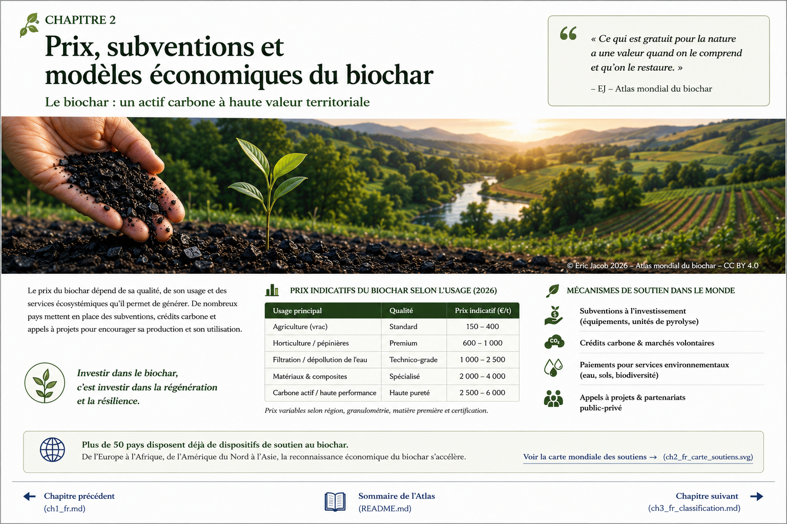

# Chapitre 2 — Prix et valorisation économique du biochar

> **Atlas mondial de la valorisation économique du biochar — Volume 1**  
> Version 1.1 — Août 2026 · Auteur : Eric Jacob

**[← Chapitre 1](ch1_fr.md) · [↑ Sommaire de l’Atlas](README.md) · [Classification →](ch3_fr_classification.md)**

---

## En une minute

Il n’existe pas un prix mondial unique du biochar. Le prix dépend de la biomasse, du procédé, des analyses, de la certification, du conditionnement, du transport, de l’usage final et de la possibilité éventuelle de valoriser le retrait de carbone.

Comparer deux prix sans comparer la qualité et la fonction du produit conduit donc souvent à une conclusion erronée.

---

## Vue d’ensemble

<figure>
  
  <figcaption>
    <strong>Figure 1 — Prix, soutiens et création de valeur autour du biochar.</strong>
    © Eric Jacob 2026 — Atlas mondial du biochar — CC BY 4.0.
    <a href="ch2_fr_prix.png">Agrandir l’infographie</a>
  </figcaption>
</figure>

L’image donne volontairement une place importante au paysage : la valeur économique du biochar n’a de sens que si elle accompagne une valeur agronomique, hydrique, écologique ou industrielle réellement démontrée.

---

## De quoi paie-t-on réellement le prix ?

Le prix final peut agréger plusieurs valeurs :

| Composante | Valeur créée |
|---|---|
| Matière | biochar brut ou formulé |
| Qualité | analyses, stabilité, contaminants, granulométrie |
| Fonction | agronomie, adsorption, matériau, filtration |
| Logistique | séchage, broyage, conditionnement, transport |
| Certification | conformité à un référentiel |
| Carbone | retrait certifié lorsque les critères sont remplis |

Le marché doit donc évoluer d’une logique de **prix par tonne** vers une logique de **prix par fonction et qualité vérifiée**.

---

## Les principaux facteurs de prix

### Intrant

Une biomasse propre, homogène et disponible localement n’a pas la même économie qu’un intrant dispersé, humide ou nécessitant un prétraitement important.

### Procédé

Température, temps de résidence, rendement solide, récupération énergétique et capacité industrielle influencent directement le coût de production.

### Post-traitement

Broyage, tamisage, activation, mélange, granulation ou formulation peuvent transformer un biochar générique en produit à plus forte valeur ajoutée.

### Marché

Le prix acceptable dépend enfin de la valeur créée chez l’utilisateur. Un adsorbant spécialisé ne se compare pas à un amendement vendu en vrac.

---

## Ne pas confondre prix du biochar et prix du carbone

Le biochar est un **produit physique**. Le crédit carbone est, lorsqu’il existe, une **preuve certifiée d’un retrait ou stockage répondant à une méthodologie donnée**.

Les deux valeurs peuvent être associées, mais elles ne doivent pas être confondues.

Une tonne de biochar n’équivaut pas automatiquement à une tonne de CO₂ retirée. Le calcul dépend notamment de sa teneur en carbone, de sa stabilité et des émissions du cycle de vie.

---

## Lire une carte mondiale avec prudence

Si une carte ou un tableau mondial indique des prix, il faut préciser :

- année de l’observation ;
- monnaie et conversion ;
- prix départ usine ou livré ;
- vente en vrac ou au détail ;
- qualité et certification ;
- usage ;
- quantité commandée ;
- inclusion ou non d’une valeur carbone.

Sans ces informations, une moyenne mondiale donne une impression de précision supérieure à la réalité.

---

## Vers un indice mondial

Un futur indice de prix crédible devrait séparer plusieurs catégories, par exemple :

```text
BIOCHAR
├── agricole
├── matériau
├── filtration / adsorption
├── spécialisé / activé
└── biochar + retrait carbone certifié
```

Chaque catégorie devrait ensuite être corrigée pour la région, la qualité, le volume et les conditions logistiques.

Cette approche est développée dans **[l’indice mondial des prix](ch5_fr_indice_prix_mondial.md)**.

---

## À retenir

> **Le biochar n’est pas une commodité parfaitement homogène. Un prix n’a de sens que relié à une qualité, un usage, une localisation et une date.**

---

## Continuer

**[← Chapitre 1](ch1_fr.md) · [↑ Atlas](README.md) · [Classification des biochars →](ch3_fr_classification.md)**

Articles liés : [Guide de l’acheteur](ch5_fr_guide_acheteur.md) · [Indice de qualité](ch5_fr_indice_qualite.md) · [Bourse du biochar](ch5_fr_bourse_biochar.md)

---

*Atlas mondial de la valorisation économique du biochar — Eric Jacob — Version 1.1 — 2026*  
*Licence : Creative Commons CC BY 4.0*
