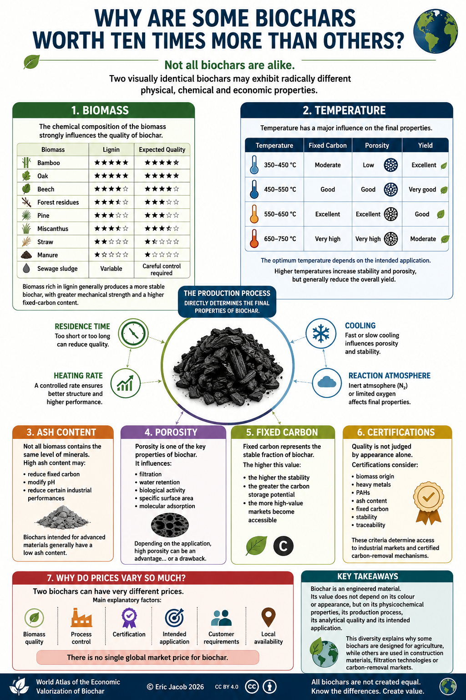

# Chapter 3 — Why Are Some Biochars Worth Ten Times More Than Others?

> **Not all biochars are alike. Two visually identical biochars may exhibit radically different physical, chemical and economic properties.**

**← [Prices & Economic Value](ch2_en_prices.md) • [Contents](index_en.md) • [Sustainable Biomass →](ch3_en_biomass.md)**

---

<figure>
  
  <figcaption>
    <strong>Figure 1 — Not all biochars are created equal.</strong>
    Biomass, production process, temperature, residence time, porosity, fixed carbon, ash content and certifications determine the final properties of biochar.
      
    © Eric Jacob 2026 — World Atlas of the Economic Valorization of Biochar — CC BY 4.0 —
    <a href="ch3_en.png">View full-size infographic</a>
  </figcaption>
</figure>

---

# A Common Misconception

People often speak about **"biochar"** as though it were a single material.

In reality, there are hundreds of different biochars.

Their quality depends primarily on:

- the biomass feedstock;
- the production temperature;
- the residence time;
- the heating rate;
- the cooling process;
- the reaction atmosphere.

The production process directly determines the final properties of the material.

---

# Biomass

The chemical composition of the biomass strongly influences the quality of the resulting biochar.

| Biomass | Lignin | Expected Quality |
|-----------|:------:|:----------------:|
| Bamboo | ★★★★★ | ★★★★★ |
| Oak | ★★★★★ | ★★★★★ |
| Beech | ★★★★☆ | ★★★★☆ |
| Forest residues | ★★★★☆ | ★★★★☆ |
| Pine | ★★★☆☆ | ★★★☆☆ |
| Miscanthus | ★★★★☆ | ★★★★☆ |
| Straw | ★★☆☆☆ | ★★☆☆☆ |
| Manure | ★☆☆☆☆ | ★☆☆☆☆ |
| Sewage sludge | Variable | Careful control required |

Biomass rich in lignin generally produces a more stable biochar, with greater mechanical strength and a higher fixed-carbon content.

---

# Temperature

Temperature has a major influence on the final properties.

| Temperature | Fixed Carbon | Porosity | Yield |
|-------------|--------------|----------|-------|
| 350–450 °C | Moderate | Low | Excellent |
| 450–550 °C | Good | Good | Very good |
| 550–650 °C | Excellent | Excellent | Good |
| 650–750 °C | Very high | Very high | Moderate |

The optimum temperature therefore depends on the intended application.

---

# The Role of Ash

Not all biomass contains the same mineral content.

A high ash content may:

- reduce the fixed-carbon content;
- modify the pH;
- reduce certain industrial performances.

Biochars intended for advanced materials generally exhibit a low ash content.

---

# Porosity

Porosity is one of the major properties of biochar.

It influences, among other things:

- filtration;
- water retention;
- biological activity;
- specific surface area;
- molecular adsorption.

Depending on the application, high porosity may represent either an advantage... or a drawback.

---

# Fixed Carbon

Fixed carbon represents the stable fraction of biochar.

The higher this value:

- the greater the long-term stability;
- the greater the carbon storage potential;
- the more specialized markets become accessible.

---

# Certifications

Biochar quality cannot be assessed from appearance alone.

Certification schemes typically evaluate:

- biomass origin;
- heavy metals;
- PAHs;
- ash content;
- fixed carbon;
- stability;
- traceability.

These criteria determine access to industrial markets and certified carbon-removal mechanisms.

---

# Why Do Prices Vary So Much?

Two biochars may differ greatly in price.

The main reasons include:

✔ biomass quality

✔ process control

✔ certification

✔ intended application

✔ customer requirements

✔ local availability

There is therefore **no single global market price for biochar**.

---

# Key Takeaways

Biochar is an engineered material.

Its value does not depend on its colour or appearance, but on its physicochemical properties, its production process, its analytical quality and its intended application.

This diversity explains why some biochars are designed for agriculture, while others are used in construction materials, filtration technologies or carbon-removal markets.

---

**← [Prices & Economic Value](ch2_en_prices.md) • [Contents](index_en.md) • [Sustainable Biomass →](ch3_en_biomass.md)**

*World Atlas of the Economic Valorization of Biochar — Eric Jacob — Version 1.2 — 2026*