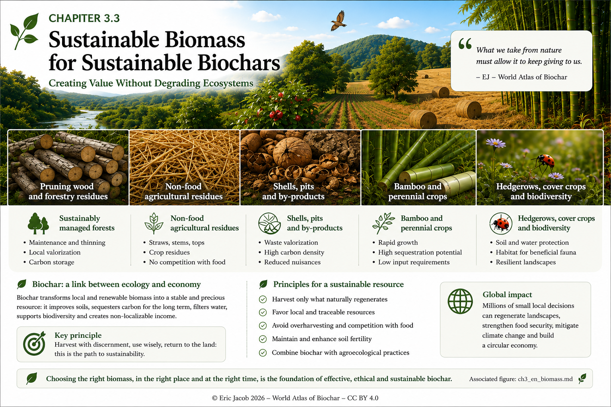

# Chapter 3.3 — Sustainable Biomass for Sustainable Biochars

> **World Atlas of the Economic Valorization of Biochar — Volume 1**  
> Version 1.1 — August 2026 · Author: Eric Jacob

**[← Key Parameters and Properties](ch3_en_parameters.md) · [↑ Atlas Contents](README_en.md) · [Chapter 4 — Certifications →](ch4_en_certifications.md)**

---

## Creating Value Without Degrading Ecosystems

The quality of a biochar begins long before thermochemical conversion. It begins in the landscape from which the biomass originates.

Agricultural residues, pruning wood, forestry by-products, nutshells, fruit pits, bamboo and perennial crops may become valuable resources when they are available without degrading soils, biodiversity or the essential ecological functions of organic matter.

The reasoning must therefore start from the territory—not from the processing capacity of a conversion unit.

<figure>
  
  <figcaption>
    <strong>Figure 1 — Sustainable biomass resources and the principle of territorial valorization.</strong>
    © Eric Jacob 2026 — World Atlas of Biochar — CC BY 4.0.
    <a href="ch3_en_biomass.png">View full-size infographic</a>
  </figcaption>
</figure>

---

## Biomass Is Not Waste as Long as the Ecosystem Still Needs It

A straw stalk, a branch or a fallen leaf may appear available simply because it is not sold.

Yet this organic matter often contributes to:

- soil protection;
- nutrient cycling;
- organic matter renewal;
- moisture conservation;
- biological habitats.

Therefore, the sustainable harvestable fraction is **not automatically equal to the physically collectable quantity.**

> **A sustainable biochar industry harvests renewable surpluses; it does not convert the biological capital of a territory into fuel.**

This distinction becomes increasingly important as industrial production expands.

---

## Different Resources for Different Territories

| Resource | Potential Value | Main Consideration |
|---|---|---|
| **Pruning wood & forestry residues** | Local lignocellulosic resource | Leave sufficient organic matter for ecosystem functioning |
| **Straw, stems and crop residues** | Large agricultural volumes in some regions | Competing uses, soil cover and nutrient cycling |
| **Shells and fruit pits** | Dense concentrated co-products | Seasonality and transport distance |
| **Bamboo & perennial crops** | High productivity in suitable climates | Water availability, species selection and biodiversity |
| **Hedgerows & cover crops** | Multiple ecological services | Avoid sacrificing landscape functions for energy production |

The best resource is the one whose harvest can be **measured, renewed and traced.**

---

## The Cascade Principle

Before directing biomass toward thermochemical conversion, one fundamental question should be asked:

```text
BIOMASS
   ↓
Essential ecological function?
   ↓ No
Food or priority material use?
   ↓ No
Reuse or local valorization?
   ↓
Remaining sustainable fraction
   ↓
THERMOLYSIS / PYROLYSIS
   ↓
Biochar + Renewable Energy + Co-products
```

This cascading approach prevents the development of the biochar sector from creating artificial pressure on the very ecosystems it aims to protect.

---

## Bamboo: High Potential, Not a Universal Solution

Bamboo deserves particular attention because some species can rapidly produce large quantities of biomass while simultaneously supplying construction materials and other renewable products.

In suitable regions, bamboo may become part of integrated systems combining ecological restoration, construction, biomass production and biochar.

However, fast growth alone is not sufficient.

Climate, water availability, species selection, invasive potential, soils, competing land uses and biodiversity must always remain the primary criteria.

The objective is therefore **not to plant bamboo everywhere**, but rather to identify territories where productive perennial species genuinely strengthen local ecological and economic systems.

---

## Agriculture: Do Not Remove What Protects the Soil

A circular agricultural system may convert part of its residues into biochar before returning stable carbon to the territory.

Removing every straw or crop residue, however, would be a mistake.

Part of this biomass remains essential for:

- erosion control;
- soil biological activity;
- nutrient recycling;
- long-term soil fertility.

The sustainable harvestable quantity must therefore be determined locally.

Although this approach requires more planning, it ultimately creates a far more resilient production system.

---

## Hedgerows, Biodiversity and Fire Prevention

Hedgerows, permanent vegetation strips and diversified landscapes provide ecological services that extend far beyond their biomass value.

They regulate water, shelter insects and birds, protect soils and strengthen landscape resilience.

Biochar integrates naturally into this framework when it utilizes pruning residues, maintenance biomass and renewable surpluses **without encouraging the destruction of the vegetation that produces them.**

In wildfire-prone regions, responsible biomass management, vegetation maintenance and strategic fuel breaks may also contribute to integrated fire prevention strategies.

Biochar then becomes **one possible outlet for part of the removed biomass—not a substitute for prevention policies.**

---

## Processing Biomass Close to Its Source

Transporting bulky, wet biomass over long distances rapidly deteriorates both economic performance and environmental balance.

Whenever technically possible, territorial strategies therefore favour:

```text
LOCAL BIOMASS
      ↓
LOCAL PREPARATION
      ↓
LOCAL THERMOCHEMICAL CONVERSION
      ↓
LOCAL USE OF ENERGY & HEAT
      ↓
BIOCHAR FOR ITS MOST APPROPRIATE APPLICATION
```

This proximity transforms treatment costs into economic opportunities while keeping more value within the local territory.

---

## Traceability: Knowing the Origin of Every Ton

A credible biochar industry must be able to trace every batch back to its origin.

The future **[Digital Biochar Passport](ch5_en_digital_passport.md)** should therefore record at least:

- biomass category;
- geographical origin;
- producer or supplier;
- relevant harvesting conditions;
- production date;
- batch number;
- conversion process.

Traceability simultaneously protects product quality and verifies that biochar production does not merely shift environmental impacts upstream.

---

## Key Takeaways

> **The most sustainable biomass is not the one that can be harvested in the greatest quantity. It is the one whose valorization leaves the territory at least as alive, fertile and resilient as it was before harvesting.**

Biochar becomes particularly valuable when it closes a local circular loop: genuinely available biomass is converted, renewable energy is recovered, stable carbon is put to meaningful use, and the landscape that supplies the resource continues to regenerate.

---

## Continue Reading

**[← Key Parameters and Properties](ch3_en_parameters.md) · [↑ Atlas Contents](README_en.md) · [Chapter 4 — Certifications →](ch4_en_certifications.md)**

See also:

- [Biochar Classification](ch3_en_classification.md)
- [Life Cycle Assessment](ch4_en_life_cycle.md)
- [Territories & Resilience](ch5_en_territories_resilience.md)
- [Reclaiming Deserts](ch5_en_desert_restoration.md)

---

*World Atlas of the Economic Valorization of Biochar — Eric Jacob — Version 1.1 — 2026*  
*License: Creative Commons CC BY 4.0*
