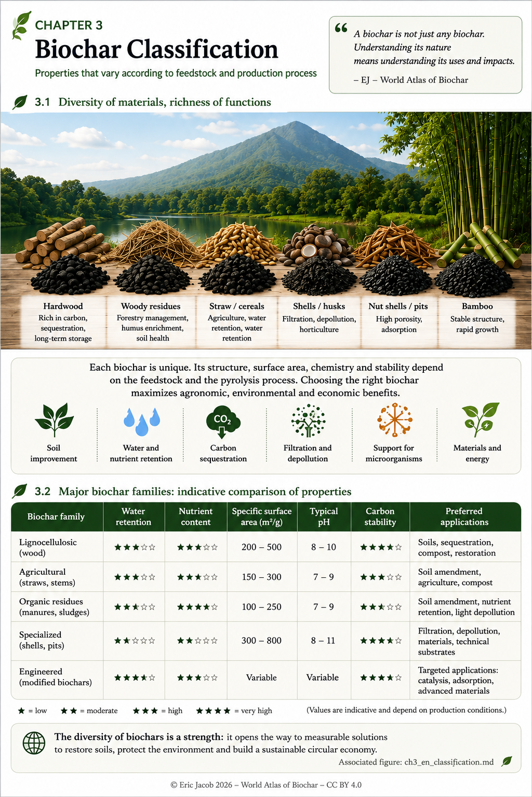

# Chapter 3.1 — Biochar Classification

> **World Atlas of the Economic Valorization of Biochar — Volume 1**  
> Version 1.1 — August 2026 · Author: Eric Jacob

**[← Prices & Economic Value](ch2_en_prices.md) · [↑ Atlas Contents](README_en.md) · [Key Parameters →](ch3_en_parameters.md)**

---

## Understanding Diversity Before Choosing

Two materials marketed under the name *biochar* may exhibit radically different behaviours. The original biomass leaves its mineral and structural fingerprint, while temperature, residence time, atmosphere and post-treatment modify porosity, surface area, stability, pH and chemical functions.

The purpose of classification is **not** to establish a universal ranking. Instead, it aims to **match a properly characterized material with a specific application**, while excluding uses that are incompatible with its properties or safety.

<figure>
  
  <figcaption>
    <strong>Figure 1 — Diversity of biochars and indicative comparison of their properties.</strong>
    © Eric Jacob 2026 — World Atlas of the Economic Valorization of Biochar — CC BY 4.0.
    <a href="ch3_en_classification.png">View full-size infographic</a>
  </figcaption>
</figure>

> **Important note:** The values and star ratings shown in the infographic are comparative guides rather than universal specifications. The same feedstock may produce significantly different biochars depending on the production process.

---

## A Four-Dimensional Classification

A robust classification should be viewed as a chain rather than a simple list.

```text
ORIGINAL BIOMASS
        ↓
CONVERSION PROCESS
        ↓
MEASURED PROPERTIES
        ↓
TARGET APPLICATION
```

This approach avoids a common mistake: inferring the final application solely from the biomass name.

### Feedstock

Wood, lignocellulosic residues, straw, stems, nutshells, fruit stones and agricultural co-products do not provide the same proportions of carbon and minerals.

Some feedstocks also require greater attention regarding potential contaminants.

### Conversion Process

Thermochemical conversion profoundly reorganizes the material.

Temperature, heating rate, residence time, atmosphere, initial moisture content and cooling conditions all influence the final biochar.

### Measured Properties

The resulting material should then be described through measurement:

- fixed carbon;
- ash content;
- pH;
- electrical conductivity;
- specific surface area;
- porosity;
- particle size distribution;
- nutrient content;
- contaminants;
- stability indicators according to the intended application.

### Target Function

Only after these steps can an appropriate application be proposed:

- soil improvement;
- construction materials;
- filtration;
- adsorption;
- industrial applications;
- long-term carbon storage.

---

## Useful Families — Never Absolute Categories

| Indicative Family | Typical Characteristics | Applications to Investigate |
|---|---|---|
| **Lignocellulosic biochars** | carbon-rich structure, porous network, low to moderate mineral content depending on feedstock | soils, construction materials, adsorption |
| **Agricultural residues** | often higher mineral and ash content | soils, blended formulations, territorial applications |
| **Shells and fruit stones** | dense material with high microporosity potential | filtration, adsorption, advanced materials |
| **Complex organic feedstocks** | highly variable composition | applications determined by analyses and regulations |
| **Modified or activated biochars** | intentionally engineered properties | specialized technical functions |

The word **"potential"** is essential.

A family never replaces a proper batch analysis.

---

## An Excellent Biochar... in the Wrong Place

Biochar quality is multidimensional.

A material with an extremely high specific surface area may perform exceptionally well in adsorption while being less suitable for certain agronomic applications.

An alkaline biochar may help correct acidic soils while becoming inappropriate for already alkaline environments.

Likewise, a high mineral content may be beneficial in one context and undesirable in another.

> **Does this biochar possess the properties, safety and traceability required for its intended application?**

This is the real question that classification seeks to answer.

---

## From Classification to the Digital Passport

Ultimately, the Atlas proposes that biochar should no longer be marketed solely under a generic name but through a technical identity linked to each production batch.

```text
BATCH IDENTITY
│
├─ Feedstock and origin
├─ Production process
├─ Physico-chemical analyses
├─ Contaminants
├─ Functional properties
├─ Certifications
└─ Compatible applications / restrictions
```

This naturally leads to the **[Digital Biochar Passport](ch5_en_digital_passport.md)** and the **[Global Biochar Quality Index](ch5_en_quality_index.md)** presented later in the Atlas.

---

## Classification Also Protects Ecosystems

Classification is not limited to analysing the final product.

The biomass itself must also be considered within its territorial context.

Removing excessive crop residues, transporting biomass over long distances or diverting feedstocks that already possess valuable ecological or economic uses may degrade the overall environmental balance.

The best feedstock is therefore not necessarily the one producing the technically highest-performing biochar.

It is the one that produces **the appropriate material without degrading the ecosystem from which it originates.**

---

## Key Takeaways

> **There is no universal biochar suitable for every application. Diversity becomes an asset when every material is properly characterized, traceable and matched with the appropriate use.**

The next chapter leaves the general families behind and focuses on measurement itself: which parameters should be analysed, which ones should be compared, and which become decisive depending on the intended application.

---

## Continue Reading

**[← Prices & Economic Value](ch2_en_prices.md) · [↑ Atlas Contents](README_en.md) · [Key Parameters →](ch3_en_parameters.md)**

See also:

- [Biomass Feedstocks](ch3_en_biomass.md)
- [Buyer's Guide](ch5_en_buyer_guide.md)
- [Global Biochar Quality Index](ch5_en_quality_index.md)

---

*World Atlas of the Economic Valorization of Biochar — Eric Jacob — Version 1.1 — 2026*  
*License: Creative Commons CC BY 4.0*
