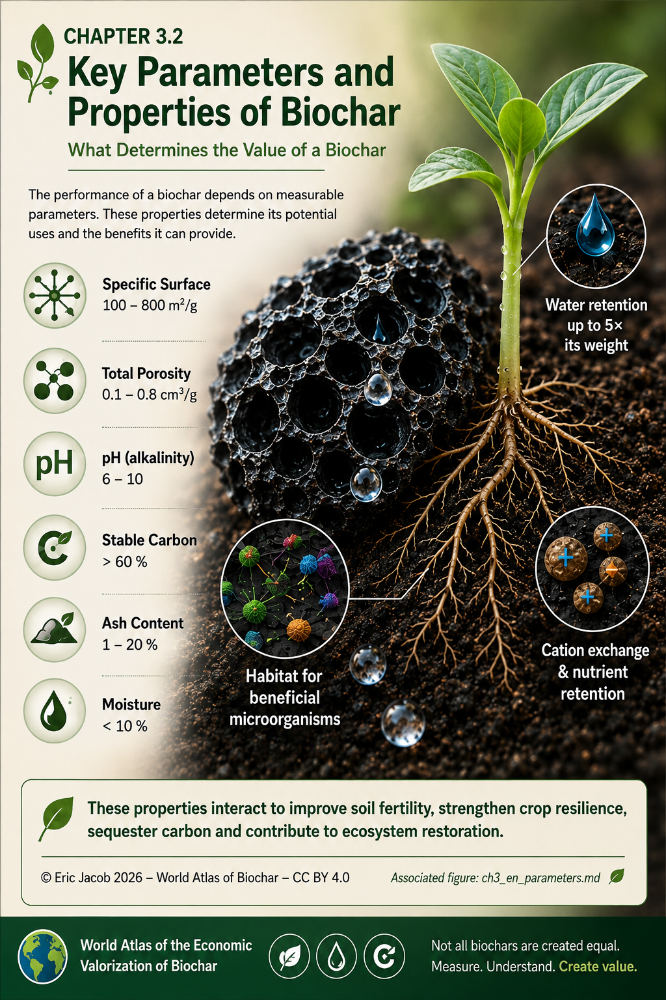

# Chapter 3.2 — Key Parameters and Properties of Biochar

> **World Atlas of the Economic Valorization of Biochar — Volume 1**  
> Version 1.1 — August 2026 · Author: Eric Jacob

**[← Biochar Classification](ch3_en.md) · [↑ Atlas Contents](README_en.md) · [Biomass Feedstocks →](ch3_en_biomass.md)**

---

## What Determines the Value of a Biochar

A biochar is not defined simply by its black colour or by the fact that it originates from thermochemical conversion. Its value results from a combination of **physical, chemical and biological properties**, themselves determined by both the original biomass and the conversion process.

These parameters determine what the material can actually do: retain water, interact with nutrients, provide surfaces that can be colonised by microorganisms, modify certain soil properties, adsorb molecules and permanently store part of its carbon.

<figure>
  
  <figcaption>
    <strong>Figure 1 — Key parameters and functional properties of biochar.</strong>
    The ranges shown are indicative only and should not be considered universal specifications.
    © Eric Jacob 2026 — World Atlas of the Economic Valorization of Biochar — CC BY 4.0.
    <a href="ch3_en_parameters.png">View full-size infographic</a>
  </figcaption>
</figure>

---

## A Porous Structure that Changes Interactions with the Environment

At the microscopic scale, many biochars exhibit a network of pores inherited from plant tissues and transformed during thermochemical conversion. This architecture may create a very large internal surface area and significantly influence the movement of water, ions and dissolved molecules.

However, **specific surface area and porosity are not synonymous**. Two highly porous materials may possess completely different pore-size distributions and therefore interact very differently with water, nutrients or pollutants.

---

## Water Retention: One of the Most Visible Field Effects

Among the most frequently reported agronomic observations is the ability of certain biochars to modify water dynamics within soils. Their porous structure may retain part of the available water and improve its availability inside the root zone.

The magnitude of this effect depends on many variables:

- the biochar itself;
- soil texture;
- soil structure;
- climate;
- application rate;
- agricultural practices.

A remarkable result observed with one material must therefore never be considered a universal property.

For this reason, the Atlas combines **field observations with scientific metrology**. Field experience identifies promising phenomena, while measurements determine under which conditions they can be reproduced.

---

## pH, Minerals and Ash

The pH of a biochar may vary considerably depending on both the feedstock and the production process.

A highly alkaline biochar may be beneficial in acidic soils while being unsuitable elsewhere.

The mineral fraction, often estimated through ash content, deserves the same attention. Minerals may supply useful nutrients but may also significantly modify the chemical behaviour of the final product.

Quality therefore cannot simply be defined as "more" or "less". It depends on **how well the material matches its intended environment**.

---

## Carbon Content and Long-Term Stability

Carbon concentration indicates how much carbon is present inside the material, but it does **not** by itself determine how long that carbon will remain outside the atmosphere.

Long-term stability depends primarily on the molecular structure created during thermochemical conversion.

For reliable carbon accounting, stability should therefore be evaluated through appropriate analytical methods and integrated into the overall life-cycle assessment.

See also:

- **[Carbon Metrology](ch5_en_carbon_metrology.md)**
- **[Life Cycle Assessment](ch4_en_life_cycle_assessment.md)**

---

## Biochar as a Habitat

Part of biochar's agronomic interest does not arise from nutrients that it directly provides, but from the way it modifies the surrounding environment.

Its pores and internal surfaces may create microhabitats, retain moisture and locally modify the availability of certain compounds. Under suitable biological, chemical and hydrological conditions, these characteristics may favour the development of beneficial microbial communities.

Biochar does not create life by itself.

It may instead **improve the habitat of an existing or recovering living ecosystem.**

---

## These Parameters Must Be Considered Together

| Parameter | What it describes | Why it is insufficient on its own |
|---|---|---|
| **Specific surface area** | Accessible interaction surface | Does not describe pore-size distribution |
| **Porosity** | Volume and structure of pores | Does not alone predict water retention or adsorption |
| **pH** | Acidity or alkalinity | Effects depend on soil conditions and application rate |
| **Carbon content** | Quantity of carbon present | Does not measure long-term permanence |
| **Ash content** | Mineral fraction | Mineral composition remains essential |
| **Moisture** | Product condition | Depends on storage and packaging |
| **Contaminants** | Potential safety | Must be compared with application-specific limits |

Biochar characterization therefore becomes a **multidimensional profile** rather than a competition to maximize every individual parameter.

---

## From the Laboratory to the Field

Laboratory analyses provide precise measurements of material properties.

Field conditions then reveal interactions that laboratory tests alone cannot always predict:

- climate;
- roots;
- fungi;
- bacteria;
- earthworms;
- wet and dry cycles;
- agricultural practices;
- long-term soil evolution.

> **The laboratory explains the biochar. The field reveals how the living ecosystem responds to it.**

Only by combining both approaches can remarkable observations be properly understood, reproduced and eventually transferred to larger-scale applications.

---

## Key Takeaways

The value of a biochar does not arise from a single property.

It results from the **interaction between a carbon structure, water, minerals, living organisms, soil and climate.**

By properly characterizing each biochar, it becomes possible to identify where it truly provides added value—and where it should not be used.

---

## Continue Reading

**[← Biochar Classification](ch3_en.md) · [↑ Atlas Contents](README_en.md) · [Biomass Feedstocks →](ch3_en_biomass.md)**

See also:

- [Life Cycle Assessment](ch4_en_life_cycle_assessment.md)
- [Digital Biochar Passport](ch5_en_biochar_passport.md)
- [Global Quality Index](ch5_en_quality_index.md)
- [Carbon Metrology](ch5_en_carbon_metrology.md)

---

*World Atlas of the Economic Valorization of Biochar — Eric Jacob — Version 1.1 — 2026*  
*License: Creative Commons CC BY 4.0*
