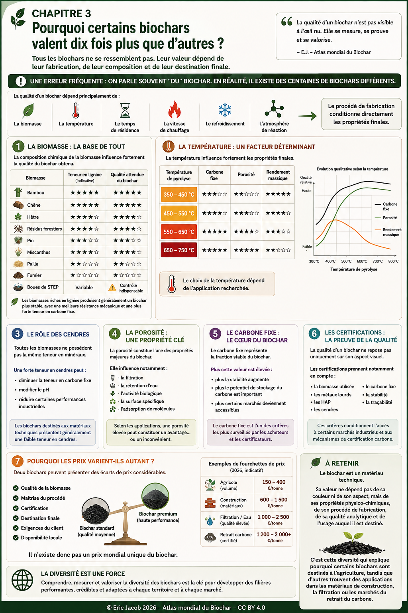

# Chapitre 3 — Pourquoi certains biochars valent dix fois plus que d'autres ?

> **Deux biochars visuellement identiques peuvent présenter des propriétés physiques, chimiques, biologiques et économiques radicalement différentes. Comprendre cette diversité est indispensable avant de comparer des prix ou de choisir un biochar.**

**← [Prix et valorisation économique](ch2_fr_prix.md) • [Sommaire](index.md) • [Biomasses durables →](ch3_fr_biomasses.md)**

---

## Comprendre avant d'acheter

Pourquoi certains biochars valent-ils quelques centaines d'euros par tonne tandis que d'autres atteignent des prix bien supérieurs ?

La réponse est simple : **il n'existe pas un biochar, mais une immense famille de matériaux carbonés**, dont les propriétés dépendent de la biomasse, du procédé de fabrication et de l'usage recherché.

Le prix n'est donc jamais un critère suffisant.

<figure>
  
  <figcaption>
    <strong>Figure 1 — Tous les biochars ne se valent pas.</strong>
    La biomasse, le procédé, la température, le temps de résidence, la porosité, le carbone fixe, les cendres et les certifications déterminent les propriétés finales du matériau.
      
    © Eric Jacob 2026 — Atlas mondial de la valorisation économique du biochar — CC BY 4.0 —
    <a href="ch3_fr.png">Agrandir l'infographie</a>
  </figcaption>
</figure>

---

## Une erreur fréquente

On parle souvent **du** biochar.

En réalité, il existe des centaines de biochars différents.

Leur qualité dépend principalement de :

- la biomasse ;
- la température ;
- le temps de résidence ;
- la vitesse de chauffage ;
- le refroidissement ;
- l'atmosphère de réaction.

Le procédé de fabrication conditionne directement les propriétés finales.

---

## La biomasse

La composition chimique de la biomasse influence fortement la qualité du biochar obtenu.

| Biomasse | Lignine | Qualité attendue |
|-----------|:-------:|:----------------:|
| Bambou | ★★★★★ | ★★★★★ |
| Chêne | ★★★★★ | ★★★★★ |
| Hêtre | ★★★★☆ | ★★★★☆ |
| Résidus forestiers | ★★★★☆ | ★★★★☆ |
| Pin | ★★★☆☆ | ★★★☆☆ |
| Miscanthus | ★★★★☆ | ★★★★☆ |
| Paille | ★★☆☆☆ | ★★☆☆☆ |
| Fumier | ★☆☆☆☆ | ★☆☆☆☆ |
| Boues de STEP | Variable | Contrôle indispensable |

Les biomasses riches en lignine produisent généralement un biochar plus stable, avec une meilleure résistance mécanique et une plus forte teneur en carbone fixe.

---

## La température

La température influence fortement les propriétés finales.

| Température | Carbone fixe | Porosité | Rendement |
|--------------|-------------|----------|-----------|
| 350–450 °C | Moyen | Faible | Excellent |
| 450–550 °C | Bon | Bon | Très bon |
| 550–650 °C | Excellent | Excellent | Bon |
| 650–750 °C | Très élevé | Très élevée | Moyen |

Le choix de la température dépend donc de l'application recherchée.

Une température plus élevée améliore généralement la stabilité du carbone et la porosité, mais réduit souvent le rendement massique. L'objectif consiste donc à trouver le meilleur compromis selon l'usage final.

---

## Les cendres

Toutes les biomasses ne possèdent pas la même teneur en minéraux.

Une forte teneur en cendres peut :

- diminuer la teneur en carbone fixe ;
- modifier le pH ;
- réduire certaines performances industrielles.

Les biochars destinés aux matériaux techniques présentent généralement une faible teneur en cendres.

---

## La porosité

La porosité constitue l'une des propriétés majeures du biochar.

Elle influence notamment :

- la filtration ;
- la rétention d'eau ;
- l'activité biologique ;
- la surface spécifique ;
- l'adsorption de molécules.

Selon les applications, une porosité élevée peut constituer un avantage… ou un inconvénient.

---

## Le carbone fixe

Le carbone fixe représente la fraction stable du biochar.

Plus cette valeur est élevée :

- plus la stabilité augmente ;
- plus le potentiel de stockage du carbone est important ;
- plus certains marchés deviennent accessibles.

---

## Les certifications

La qualité d'un biochar ne repose pas uniquement sur son aspect visuel.

Les certifications prennent notamment en compte :

- la biomasse utilisée ;
- les métaux lourds ;
- les HAP ;
- les cendres ;
- le carbone fixe ;
- la stabilité ;
- la traçabilité.

Ces critères conditionnent l'accès à certains marchés industriels et aux mécanismes de certification carbone.

---

## Pourquoi les prix varient-ils autant ?

Deux biochars peuvent présenter des écarts de prix considérables.

Les principaux facteurs explicatifs sont :

✔ qualité de la biomasse

✔ maîtrise du procédé

✔ certification

✔ destination finale

✔ exigences du client

✔ disponibilité locale

Il n'existe donc pas un prix mondial unique du biochar.

---

## Pourquoi une classification internationale ?

Une classification commune permettra de comparer objectivement :

- les propriétés ;
- les usages ;
- les performances ;
- les certifications ;
- les marchés.

Elle constituera également la base :

- du Passeport numérique du biochar ;
- de l'Indice mondial de qualité ;
- du Guide de l'acheteur ;
- de la future Bourse mondiale du biochar.

---

## À retenir

Le biochar est un matériau technique.

Sa valeur ne dépend pas de sa couleur ni de son aspect, mais de ses propriétés physico-chimiques, de son procédé de fabrication, de sa qualité analytique et de l'usage auquel il est destiné.

C'est cette diversité qui explique pourquoi certains biochars sont destinés à l'agriculture, tandis que d'autres trouvent des applications dans les matériaux de construction, la filtration ou les marchés du retrait du carbone.

---

**← [Prix et valorisation économique](ch2_fr_prix.md) • [Sommaire](index.md) • [Biomasses durables →](ch3_fr_biomasses.md)**

*Atlas mondial de la valorisation économique du biochar — Eric Jacob — Version 1.2 — 2026*
