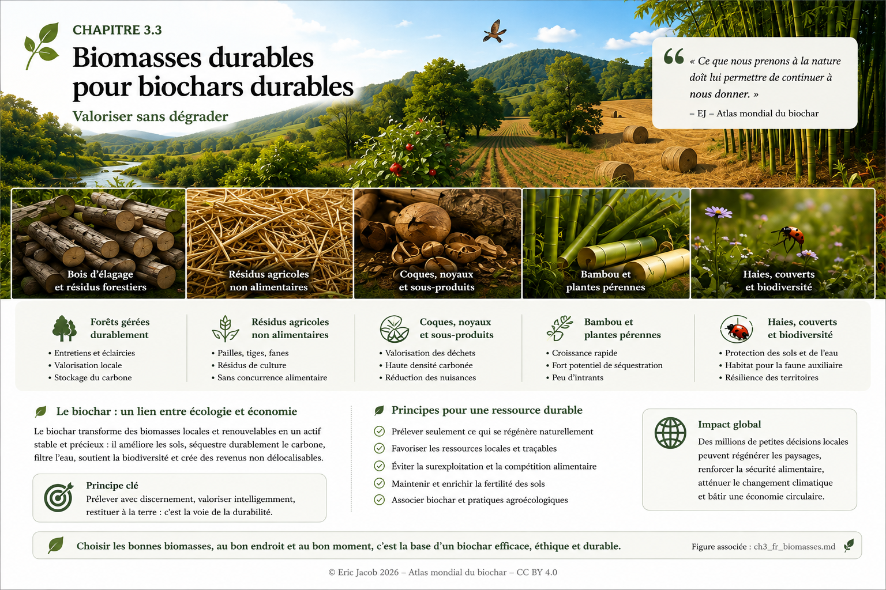

# Chapitre 3.3 — Biomasses durables pour biochars durables

> **Atlas mondial de la valorisation économique du biochar — Volume 1**  
> Version 1.1 — Août 2026 · Auteur : Eric Jacob

**[← Paramètres clés et propriétés](ch3_fr_parametres.md) · [↑ Sommaire de l’Atlas](README.md) · [Chapitre 4 — Certifications →](ch4_fr_certifications.md)**

---

## Valoriser sans dégrader

La qualité d’un biochar commence avant la pyrolyse. Elle commence dans le paysage dont provient la biomasse.

Résidus agricoles, bois d’élagage, sous-produits forestiers, coques, noyaux, bambou ou plantes pérennes peuvent devenir des ressources intéressantes lorsqu’ils sont disponibles sans dégrader les sols, la biodiversité ou les usages essentiels de la matière organique. Le raisonnement doit donc partir du territoire et non de la seule capacité d’une machine à transformer une biomasse.

<figure>
  
  <figcaption>
    <strong>Figure 1 — Biomasses durables et principe de valorisation territoriale.</strong>
    © Eric Jacob 2026 — Atlas mondial du biochar — CC BY 4.0.
    <a href="ch3_fr_biomasses.png">Agrandir l’infographie</a>
  </figcaption>
</figure>

---

## La biomasse n’est pas un déchet tant que l’écosystème en a besoin

Une paille, une branche ou une feuille peut sembler disponible parce qu’elle n’est pas vendue. Pourtant, cette matière participe parfois à la protection du sol, au retour des nutriments, à la matière organique, à l’humidité et aux habitats biologiques.

Le prélèvement soutenable n’est donc jamais automatiquement égal à la quantité physiquement récoltable.

> **Une filière biochar durable prélève un surplus renouvelable ; elle ne transforme pas le capital biologique du territoire en combustible.**

Cette distinction devient essentielle lorsque les volumes industriels augmentent.

---

## Des ressources différentes pour des territoires différents

| Ressource | Intérêt possible | Point de vigilance |
|---|---|---|
| **Bois d’élagage et résidus forestiers** | ressource locale, structure lignocellulosique | laisser au milieu la matière nécessaire à son fonctionnement |
| **Pailles, tiges et fanes** | volumes agricoles importants dans certaines régions | usages concurrents, couverture du sol, nutriments |
| **Coques et noyaux** | coproduits concentrés, souvent denses | saisonnalité et distance de transport |
| **Bambou et plantes pérennes** | forte productivité dans des contextes adaptés | eau, espèces, implantation, biodiversité |
| **Haies et couverts** | fonctions écologiques multiples | ne pas sacrifier leur fonction paysagère à leur seule valeur énergétique |

La bonne ressource est celle dont le prélèvement peut être **mesuré, renouvelé et tracé**.

---

## Le principe de cascade

Avant d’envoyer une biomasse vers une unité thermochimique, il est utile de demander si elle possède une fonction plus importante ailleurs.

```text
BIOMASSE
   ↓
fonction écologique nécessaire ?
   ↓ non
usage alimentaire ou matière prioritaire ?
   ↓ non
réemploi / valorisation locale ?
   ↓
fraction réellement disponible
   ↓
THERMOLYSE / PYROLYSE
   ↓
biochar + énergie + coproduits
```

Cette logique évite que le développement du biochar ne crée lui-même une pression artificielle sur les ressources qu’il cherche à protéger.

---

## Le bambou : potentiel élevé, solution non universelle

Le bambou mérite une place particulière parce que certaines espèces peuvent produire rapidement une biomasse importante tout en fournissant plusieurs usages matériels. Dans les territoires adaptés, il peut participer à des systèmes de restauration, de construction, de biomasse et de biochar.

Mais une plante à croissance rapide n’est pas automatiquement une solution écologique. Le climat, l’eau disponible, l’espèce, le caractère invasif éventuel, le sol, les usages concurrents et la biodiversité locale doivent rester prioritaires.

Le modèle intéressant n’est donc pas « planter du bambou partout », mais **identifier les territoires où une plante pérenne productive renforce réellement le système local**.

---

## Agriculture : ne pas retirer ce qui protège le champ

Une agriculture circulaire peut convertir une partie de ses résidus en biochar puis restituer au territoire un matériau carboné durable. Mais retirer systématiquement toutes les pailles et tous les résidus serait une erreur.

Une fraction peut être nécessaire pour protéger la surface contre l’érosion, nourrir les organismes du sol et restituer des éléments minéraux.

La quantité mobilisable doit donc être déterminée localement. Cette approche rend la filière plus exigeante, mais aussi beaucoup plus robuste.

---

## Haies, biodiversité et prévention

Les haies, bandes végétales, couverts permanents et mosaïques paysagères ont une valeur qui dépasse largement leur biomasse. Ils ralentissent l’eau, abritent insectes et oiseaux, protègent certains sols et peuvent contribuer à la résilience des paysages.

Le biochar peut s’inscrire dans cette architecture lorsqu’il valorise les tailles, entretiens et surplus sans inciter à détruire la structure végétale qui les produit.

Dans certains territoires exposés aux incendies, la gestion raisonnée de la biomasse combustible, l’entretien des interfaces et la création de coupures végétales adaptées peuvent également entrer dans une stratégie globale de prévention. Le biochar constitue alors **un débouché possible pour une fraction de la biomasse retirée**, et non un substitut aux politiques de prévention.

---

## Localiser la transformation

Transporter sur de longues distances une biomasse humide et volumineuse peut dégrader rapidement l’économie et le bilan environnemental.

La logique territoriale favorise donc, lorsque cela est techniquement possible :

```text
ressource locale
      ↓
préparation locale
      ↓
conversion locale
      ↓
énergie / chaleur valorisées localement
      ↓
biochar vers l’usage approprié
```

Cette proximité peut transformer un coût de traitement en ressource économique tout en conservant davantage de valeur dans le territoire.

---

## Traçabilité : savoir d’où vient chaque tonne

Une filière crédible doit pouvoir relier le biochar final à son origine.

Le futur **[Passeport numérique du biochar](ch5_fr_passeport_biochar.md)** devrait donc conserver au minimum la catégorie de biomasse, son origine géographique, le producteur ou fournisseur, les conditions pertinentes de collecte, la date, le lot et le procédé de transformation.

La traçabilité permet simultanément de protéger la qualité du produit et de vérifier que sa production ne déplace pas le problème écologique vers l’amont.

---

## À retenir

> **La biomasse la plus durable n’est pas celle que l’on peut récolter en plus grande quantité. C’est celle dont la valorisation laisse le territoire au moins aussi vivant, fertile et résilient qu’avant son prélèvement.**

Le biochar devient particulièrement intéressant lorsqu’il ferme une boucle locale : une biomasse réellement disponible est transformée, l’énergie est valorisée, le carbone stable trouve un usage pertinent et le paysage qui fournit la ressource continue de se régénérer.

---

## Continuer la lecture

**[← Paramètres clés et propriétés](ch3_fr_parametres.md) · [↑ Sommaire de l’Atlas](README.md) · [Chapitre 4 — Certifications →](ch4_fr_certifications.md)**

À consulter également : [Classification des biochars](ch3_fr_classification.md) · [Analyse du cycle de vie](ch4_fr_analyse_cycle_vie.md) · [Territoires et résilience](ch5_fr_territoires_resilience_biochar_carbone.md) · [Reconquête des déserts](ch5_fr_reconquete_deserts.md)

---

*Atlas mondial de la valorisation économique du biochar — Eric Jacob — Version 1.1 — 2026*  
*Licence : Creative Commons CC BY 4.0*
