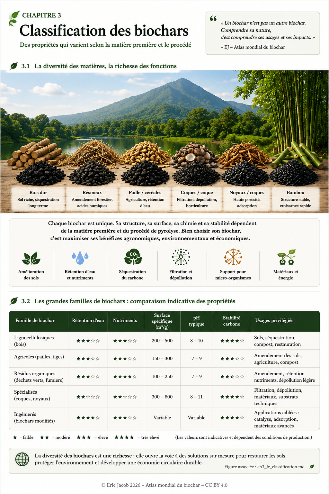

# Chapitre 3 — Classification des biochars

> **Atlas mondial de la valorisation économique du biochar — Volume 1**  
> Version 1.1 — Août 2026 · Auteur : Eric Jacob

**[← Prix et valorisation](ch2_fr_prix.md) · [↑ Sommaire de l’Atlas](README.md) · [Paramètres de caractérisation →](ch3_fr_parametres.md)**

---

## Comprendre la diversité avant de choisir

Deux matériaux portant le nom de *biochar* peuvent présenter des comportements très différents. La biomasse d’origine laisse son empreinte minérale et structurale ; la température, le temps de séjour, l’atmosphère et les traitements ultérieurs modifient ensuite porosité, surface, stabilité, pH et fonctions chimiques.

La classification n’a donc pas pour but d’établir un palmarès universel. Elle sert à **associer un matériau caractérisé à une fonction précise** et à écarter les usages incompatibles avec ses propriétés ou sa sécurité.

<figure>
  
  <figcaption>
    <strong>Figure 1 — Diversité des biochars et comparaison indicative de leurs propriétés.</strong>
    © Eric Jacob 2026 — Atlas mondial du biochar — CC BY 4.0.
    <a href="ch3_fr_classification.png">Agrandir l’infographie</a>
  </figcaption>
</figure>

> **Lecture importante :** les valeurs et étoiles de l’infographie sont des repères comparatifs, pas des spécifications universelles. Un même intrant peut produire des biochars sensiblement différents selon le procédé.

---

## Une classification à quatre dimensions

Une classification robuste peut être pensée comme une chaîne plutôt que comme une simple liste :

```text
BIOMASSE D’ORIGINE
        ↓
PROCÉDÉ DE CONVERSION
        ↓
PROPRIÉTÉS MESURÉES
        ↓
USAGE CIBLÉ
```

Cette structure évite une erreur fréquente : déduire directement l’usage à partir du seul nom de la biomasse.

**Origine.** Bois et résidus lignocellulosiques, pailles et tiges, coques et noyaux ou autres coproduits agricoles n’apportent pas les mêmes proportions de carbone et de minéraux. Certains intrants exigent également une vigilance accrue concernant les contaminants.

**Procédé.** La conversion thermochimique réorganise profondément la matière. Température, vitesse de chauffage, temps de résidence, atmosphère, humidité initiale et refroidissement influencent le produit final.

**Propriétés.** Le matériau obtenu doit ensuite parler par la mesure : carbone, cendres, pH, conductivité, surface spécifique, porosité, granulométrie, nutriments, contaminants et indicateurs de stabilité selon l’usage envisagé.

**Fonction.** Ce n’est qu’après ces étapes qu’une destination peut être raisonnablement proposée : sols, matériaux, filtration, adsorption, applications industrielles ou stockage durable du carbone.

---

## Des familles utiles, mais jamais absolues

| Famille indicative | Caractéristiques possibles | Usages à étudier |
|---|---|---|
| **Lignocellulosiques** | structure carbonée, porosité, faible ou moyenne teneur minérale selon l’intrant | sols, matériaux, adsorption |
| **Résidus agricoles** | minéraux et cendres parfois plus élevés | sols, formulation, usages territoriaux |
| **Coques et noyaux** | matière souvent dense, potentiel de microporosité | filtration, adsorption, matériaux |
| **Intrants organiques complexes** | composition très variable | usage conditionné par analyses et réglementation |
| **Biochars modifiés ou activés** | propriétés volontairement ajustées | fonctions techniques ciblées |

Le mot **« possible »** est essentiel. Une famille ne remplace jamais une analyse du lot.

---

## Un biochar peut être excellent… au mauvais endroit

La notion de qualité est multidimensionnelle. Un matériau possédant une très grande surface spécifique peut être intéressant pour l’adsorption sans être le meilleur choix agronomique. Un biochar alcalin peut contribuer à corriger certains sols acides mais devenir inadapté sur un sol déjà alcalin.

De même, une teneur minérale élevée peut être utile dans un contexte et indésirable dans un autre.

> **Ce biochar possède-t-il les propriétés, la sécurité et la traçabilité nécessaires pour l’usage que nous voulons en faire ?**

---

## De la classification au passeport

À terme, l’Atlas propose de ne plus commercialiser un biochar seulement sous une appellation générique, mais avec une identité technique reliée au lot.

```text
IDENTITÉ DU LOT
│
├─ biomasse et origine
├─ procédé et paramètres essentiels
├─ analyses physico-chimiques
├─ contaminants
├─ propriétés fonctionnelles
├─ certification éventuelle
└─ usages compatibles / restrictions
```

Cette logique prépare directement le **[Passeport numérique du biochar](ch5_fr_passeport_biochar.md)** et l’**[Indice de qualité](ch5_fr_indice_qualite.md)** proposés plus loin dans l’Atlas.

---

## Une classification qui protège aussi les écosystèmes

Classifier ne consiste pas seulement à mesurer le produit final. La biomasse doit elle-même être replacée dans son territoire.

Retirer trop de résidus d’un sol, déplacer une biomasse sur de longues distances ou utiliser une ressource ayant déjà un débouché écologique ou économique pertinent peut dégrader le bilan global.

La meilleure matière première n’est donc pas nécessairement celle qui produit le biochar techniquement le plus performant. C’est celle qui permet d’obtenir **le bon produit sans détériorer le système dont elle provient**.

---

## À retenir

> **Il n’existe pas un biochar idéal pour toutes les fonctions. La diversité devient une richesse lorsqu’elle est caractérisée, traçable et mise au service d’un usage approprié.**

Le prochain article quitte les familles générales pour entrer dans la mesure : quels paramètres analyser, lesquels comparer et lesquels deviennent déterminants selon l’application ?

---

## Continuer la lecture

**[← Prix et valorisation](ch2_fr_prix.md) · [↑ Sommaire de l’Atlas](README.md) · [Paramètres de caractérisation →](ch3_fr_parametres.md)**

À consulter également : [Biomasses et intrants](ch3_fr_biomasses.md) · [Guide de l’acheteur](ch5_fr_guide_acheteur.md) · [Indice de qualité](ch5_fr_indice_qualite.md)

---

*Atlas mondial de la valorisation économique du biochar — Eric Jacob — Version 1.1 — 2026*  
*Licence : Creative Commons CC BY 4.0*
