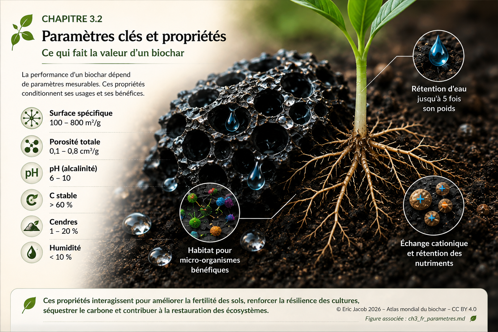

# Chapitre 3.2 — Paramètres clés et propriétés du biochar

> **Atlas mondial de la valorisation économique du biochar — Volume 1**  
> Version 1.1 — Août 2026 · Auteur : Eric Jacob

**[← Classification des biochars](ch3_fr_classification.md) · [↑ Sommaire de l’Atlas](README.md) · [Biomasses et intrants →](ch3_fr_biomasses.md)**

---

## Ce qui fait la valeur d’un biochar

Un biochar n’est pas défini par sa seule couleur noire ni par le fait qu’il provienne d’une pyrolyse. Sa valeur dépend d’un ensemble de propriétés physiques, chimiques et biologiques qui résultent à la fois de la biomasse initiale et du procédé de conversion.

Ces paramètres déterminent ce que le matériau pourra réellement faire : retenir de l’eau, interagir avec des nutriments, fournir des surfaces colonisables par des micro-organismes, modifier certaines propriétés d’un sol, adsorber certaines molécules ou conserver durablement une fraction du carbone.

<figure>
  
  <figcaption>
    <strong>Figure 1 — Paramètres clés et propriétés fonctionnelles d’un biochar.</strong>
    Les plages représentées sont indicatives et ne constituent pas des spécifications universelles.
    © Eric Jacob 2026 — Atlas mondial du biochar — CC BY 4.0.
    <a href="ch3_fr_parametres.png">Agrandir l’infographie</a>
  </figcaption>
</figure>

---

## Une structure poreuse qui change les interactions avec le milieu

À l’échelle microscopique, de nombreux biochars présentent un réseau de pores hérité de la structure végétale puis transformé par la conversion thermochimique. Cette architecture peut créer une surface interne considérable et modifier la circulation de l’eau, des ions et des molécules.

Mais **surface spécifique et porosité ne sont pas synonymes**. Deux matériaux ayant une porosité importante peuvent posséder des distributions de tailles de pores très différentes et ne pas interagir de la même manière avec l’eau ou les molécules dissoutes.

---

## L’eau : un potentiel particulièrement visible sur le terrain

L’un des effets qui attire le plus l’attention dans les retours agronomiques est la modification possible de la dynamique de l’eau dans certains sols. La structure poreuse du biochar peut contribuer à retenir une fraction de l’eau et à modifier sa disponibilité dans le milieu racinaire.

L’ampleur de cet effet varie avec le biochar, la texture du sol, son état initial, le climat et la dose appliquée. Une valeur spectaculaire observée pour un matériau donné ne doit donc pas être transformée en propriété universelle.

L’Atlas associe ainsi **retours de terrain et métrologie** : l’observation révèle ce qu’il faut étudier ; la mesure permet de déterminer dans quelles conditions l’effet peut être reproduit.

---

## pH, minéraux et cendres

Le pH d’un biochar peut varier fortement selon l’intrant et le procédé. Une alcalinité élevée peut être intéressante dans certains sols acides et inadaptée dans d’autres situations.

La fraction minérale, souvent approchée par la teneur en cendres, mérite la même prudence. Elle peut apporter certains éléments utiles mais également modifier fortement la chimie du produit.

La qualité ne peut donc pas être résumée par « plus » ou « moins » : **elle dépend de l’adéquation entre matériau et milieu**.

---

## Carbone et stabilité

La teneur en carbone indique la quantité présente dans le matériau, mais elle ne suffit pas à déterminer la durée pendant laquelle ce carbone restera hors de l’atmosphère.

La stabilité dépend de la structure chimique formée pendant la conversion. Pour une comptabilité carbone sérieuse, elle doit être reliée à des méthodes analytiques et intégrée au bilan du cycle de vie.

Voir : **[Métrologie du carbone](ch5_fr_metrologie_carbone.md)** et **[Analyse du cycle de vie](ch4_fr_analyse_cycle_vie.md)**.

---

## Le biochar comme habitat

Une partie de l’intérêt agronomique potentiel vient moins de ce que le biochar apporte directement que de la façon dont il modifie le milieu.

Ses pores et surfaces peuvent offrir des microhabitats, retenir de l’humidité et modifier localement la disponibilité de certains composés. Cela peut favoriser certaines communautés microbiennes lorsque les conditions biologiques, chimiques et hydriques sont favorables.

Le biochar ne crée pas la vie à lui seul. Il peut **améliorer l’habitat d’un écosystème vivant préexistant ou en restauration**.

---

## Les paramètres doivent être lus ensemble

| Paramètre | Ce qu’il renseigne | Pourquoi il ne suffit pas seul |
|---|---|---|
| **Surface spécifique** | surface accessible aux interactions | ne décrit pas la taille ni l’accessibilité de tous les pores |
| **Porosité** | volume et structure des vides | ne prédit pas seule la rétention d’eau ou l’adsorption |
| **pH** | caractère acide ou alcalin | l’effet dépend du sol et de la dose |
| **Carbone** | quantité de matière carbonée | ne mesure pas seul la permanence |
| **Cendres** | fraction minérale | leur composition est déterminante |
| **Humidité** | état du produit | dépend du stockage et du conditionnement |
| **Contaminants** | sécurité potentielle | doit être confrontée aux seuils de l’usage visé |

La caractérisation devient donc un **profil multidimensionnel**, et non une compétition visant à maximiser chaque valeur.

---

## Du laboratoire au terrain

Le laboratoire permet de caractériser précisément un matériau. Le terrain révèle ensuite les interactions que l’analyse isolée ne peut pas toujours prévoir : climat, racines, champignons, bactéries, vers de terre, cycles humides et secs, pratiques agricoles et évolution du sol dans le temps.

> **Le laboratoire explique le biochar. Le terrain montre ce que devient le système vivant qui l’accueille.**

C’est dans la rencontre entre ces deux niveaux que les propriétés remarquables rapportées par certains utilisateurs peuvent être étudiées, reproduites et, si elles résistent à la mesure, diffusées à plus grande échelle.

---

## À retenir

La valeur d’un biochar ne tient pas à une propriété isolée. Elle vient de **l’interaction entre une structure carbonée, de l’eau, des minéraux, des organismes vivants, un sol et un climat**.

En caractérisant correctement chaque biochar, on peut progressivement déterminer où il apporte réellement une amélioration et où il ne faut pas l’utiliser.

---

## Continuer la lecture

**[← Classification des biochars](ch3_fr_classification.md) · [↑ Sommaire de l’Atlas](README.md) · [Biomasses et intrants →](ch3_fr_biomasses.md)**

À consulter également : [Analyse du cycle de vie](ch4_fr_analyse_cycle_vie.md) · [Passeport numérique](ch5_fr_passeport_biochar.md) · [Indice de qualité](ch5_fr_indice_qualite.md) · [Métrologie du carbone](ch5_fr_metrologie_carbone.md)

---

*Atlas mondial de la valorisation économique du biochar — Eric Jacob — Version 1.1 — 2026*  
*Licence : Creative Commons CC BY 4.0*
