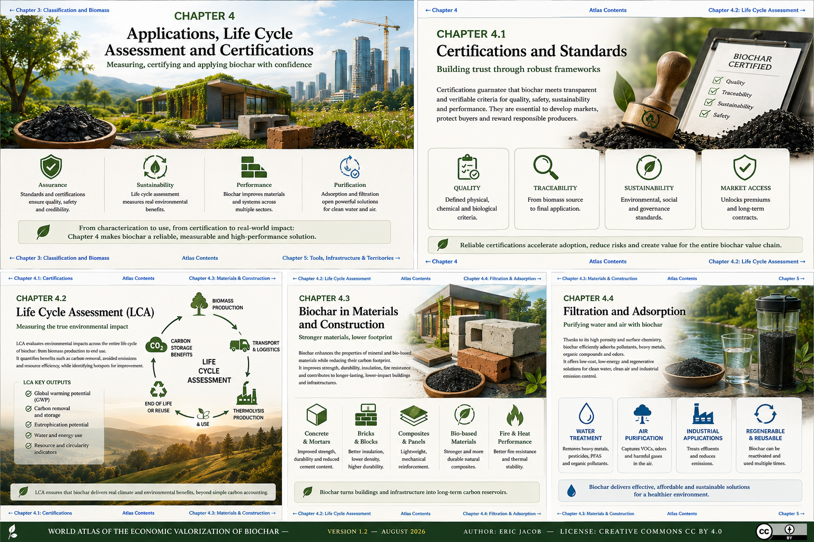

# Chapter 4 — The Limits of Biochar: A Material for the Future... Under Certain Conditions

> **Biochar is not a universal product. Its performance depends directly on the quality of the biomass, control of the thermolysis process and its final application. Inappropriate production or use can significantly reduce its benefits and may even lead to undesirable effects.**

**[← Sustainable Biomass](ch3_en_biomass.md) · [↑ Atlas Contents](README_en.md) · [Certifications →](ch4_en_certifications.md)**

---

<figure>
  
  <figcaption>
    <strong>Figure 1 — Biochar: significant potential, but under clearly defined conditions.</strong>
    Biomass quality, process control, characterization, certification and appropriate end use determine whether biochar delivers its expected environmental and economic benefits.
    © Eric Jacob 2026 — World Atlas of the Economic Valorization of Biochar — CC BY 4.0.
    <a href="ch4_en.png">View full-size infographic</a>
  </figcaption>
</figure>

---

# Not All Biochars Are Equal

The term *biochar* encompasses a very broad family of carbonaceous materials.

Their quality depends primarily on:

- the biomass used;
- the thermolysis temperature;
- the residence time;
- the reaction atmosphere;
- the cooling process;
- quality control.

The external appearance of a biochar does not provide sufficient information to determine its quality.

---

# Biomass Requiring Particular Attention

Certain biomass feedstocks require greater vigilance.

| Biomass | Level of Vigilance | Main Risks |
|-----------|-------------------:|--------------------|
| Clean wood | Low | Very few risks |
| Bamboo | Low | Very few risks |
| Forest residues | Low | Standard monitoring |
| Straw | Moderate | High ash content |
| Manure | Moderate | Variable composition |
| Urban green waste | Moderate | Heterogeneity |
| Sewage sludge | High | Heavy metals, regulatory constraints |
| Industrial waste | Very high | Potential contaminants |

Feedstock traceability is one of the essential conditions for producing high-quality biochar.

---

# pH: An Often Overlooked Parameter

Most biochars are alkaline.

In acidic soils, this property can be beneficial.

Conversely, in soils that are already alkaline, excessive application may lead to:

- an increase in pH;
- reduced phosphorus availability;
- reduced uptake of iron, zinc and manganese;
- nutritional imbalances.

Biochar therefore never replaces a prior agronomic assessment.

---

# Porosity: An Advantage... That Can Temporarily Become a Drawback

The microporous structure of biochar gives it a very large specific surface area.

This property improves:

- water retention;
- habitat for microorganisms;
- adsorption capacity.

However, freshly produced biochar may also temporarily adsorb certain nutrients, particularly nitrogen.

This phenomenon is sometimes referred to as **temporary nutrient immobilization**.

For this reason, many users recommend "charging" biochar before incorporating it into soil, for example with compost, digestate or nutrient solutions.

---

# Polycyclic Aromatic Hydrocarbons (PAHs)

A poorly controlled process may lead to the formation of undesirable organic compounds, including certain polycyclic aromatic hydrocarbons (PAHs).

Risks increase in the event of:

- incomplete combustion;
- the presence of oxygen;
- insufficient cooling;
- poorly controlled temperatures.

Certification schemes impose maximum limits for these compounds.

---

# Heavy Metals

Biochar does not generate heavy metals.

However, it can concentrate heavy metals that were already present in the original biomass.

Particular monitoring is therefore required when feedstocks originate from:

- sewage sludge;
- industrial waste;
- contaminated biomass.

Regular analyses are essential to ensure regulatory compliance.

---

# Certifications

The main international certification schemes assess, among other criteria:

✔ biomass origin

✔ fixed carbon

✔ PAHs

✔ heavy metals

✔ ash content

✔ carbon stability

✔ traceability

These certifications are now a determining factor for accessing the highest-value markets.

---

# Key Takeaways

Biochar should not be considered a standardized product.

Its quality depends on the entire production chain, from biomass selection to final analytical control.

The best results are achieved when biochar is produced, certified and used according to its intended application.

---

## Continue Reading

**[← Sustainable Biomass](ch3_en_biomass.md) · [↑ Atlas Contents](README_en.md) · [Certifications →](ch4_en_certifications.md)**

See also:

- [Biochar Classification](ch3_en_classification.md)
- [Key Parameters and Properties](ch3_en_parameters.md)
- [Life Cycle Assessment](ch4_en_life_cycle_assessment.md)
- [Materials](ch4_en_materials.md)
- [Filtration](ch4_en_filtration.md)

---

*World Atlas of the Economic Valorization of Biochar — Eric Jacob — 2026*  
*License: Creative Commons Attribution 4.0 International (CC BY 4.0)*
