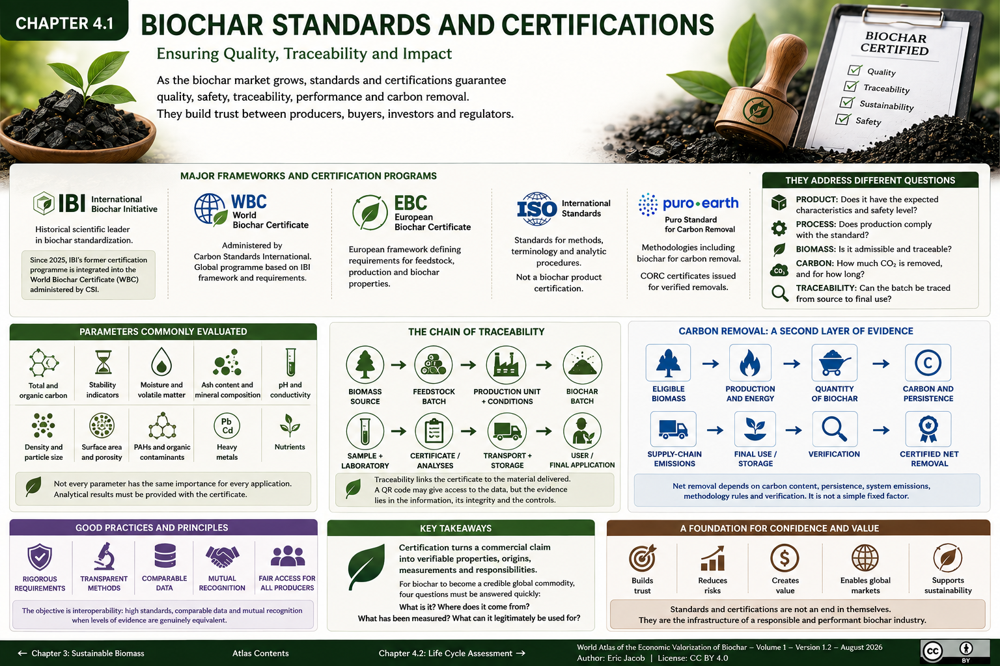

# Chapter 4.1 — Biochar Standards and Certifications

> **World Atlas of the Economic Valorization of Biochar — Volume 1**  
> Version 1.2 — August 2026 · Author: Eric Jacob

**[← Sustainable Biomass](ch3_en_biomass.md) · [↑ Atlas Contents](README_en.md) · [Life Cycle Assessment →](ch4_en_life_cycle_assessment.md)**

---

## Ensuring Quality, Traceability and Impact

As the biochar market grows, the word *biochar* alone can no longer constitute a sufficient guarantee. Two products derived from different biomass feedstocks and production processes may exhibit very different properties, contaminants, stability and applications.

Standards, technical frameworks, analyses and certifications therefore serve several purposes: **defining the product, verifying its safety, making its characteristics comparable, documenting its origin and, when carbon removal is claimed, establishing verifiable accounting.**

<figure>
  
  <figcaption>
    <strong>Figure 1 — Biochar standards, certifications and chain of trust.</strong>
    This map is intended as an educational overview: standards, methodologies and programmes evolve, and their current versions should always be verified with the organizations responsible for them.
    © Eric Jacob 2026 — World Atlas of Biochar — CC BY 4.0.
    <a href="ch4_en_certifications.png">View full-size infographic</a>
  </figcaption>
</figure>

> **Important — August 2026:** the International Biochar Initiative's former dedicated certification programme is no longer a separate programme. IBI states that its framework has been merged into the **World Biochar Certificate (WBC)** administered by Carbon Standards International (CSI). The infographic above retains IBI as a historical and scientific contributor to biochar standardization, not as a current standalone certification.

---

## What Exactly Is Being Certified?

The word *certification* covers several distinct objects that should not be confused.

| Object | Question Being Asked |
|---|---|
| **Product** | Does the material have the expected characteristics and level of safety? |
| **Process** | Does production comply with the requirements of the relevant standard or framework? |
| **Biomass** | Is its origin admissible, sustainable and traceable? |
| **Application** | Is the biochar compatible with its declared end use? |
| **Carbon** | How much net CO₂ is actually removed, and for how long? |
| **Chain of custody** | Can the batch be traced from the original resource to its final use? |

A product-quality certificate and a carbon-removal credit are therefore **not the same thing**.

---

## The World Biochar Certificate and the IBI Legacy

The International Biochar Initiative played a major historical role in defining biochar and developing analytical methods.

Since 2025, IBI states that its former certification framework has been integrated into the **World Biochar Certificate**, administered by Carbon Standards International.

The WBC notably requires laboratory analyses in accordance with programme requirements. This development illustrates a desirable trend: bringing technical frameworks closer together rather than indefinitely multiplying incompatible labels.

For the buyer, however, the essential point remains unchanged: **request the exact certificate, its version, the batch concerned and the associated analytical results.**

---

## EBC, WBC and Quality Frameworks

The European Biochar Certificate (EBC) has made a major contribution to structuring the European market and formalizing requirements relating to feedstocks, production and biochar properties.

Quality frameworks should be understood as technical systems: they define methods, thresholds, categories and control requirements. They never eliminate the need to verify whether the product is actually suitable for its intended application.

A biochar that complies with a standard may be perfectly safe while still being **poorly suited to a particular soil, filtration system or material application**.

---

## ISO: Standardization Is Not the Same as Certifying a Biochar

ISO standards relating to solid biofuels, analytical methods or other related fields may be useful for harmonizing certain measurements and terminology.

However, a technical standard used within an analytical chain should not automatically be presented as a "biochar certification".

This distinction is important to avoid artificially inflating the number of labels associated with a product.

---

## Carbon: A Second Layer of Evidence

When a producer wishes to monetize carbon removal, product characterization alone is no longer sufficient.

The assessment must notably consider:

```text
ELIGIBLE BIOMASS
        ↓
PRODUCTION AND ENERGY
        ↓
QUANTITY OF BIOCHAR
        ↓
CARBON AND PERSISTENCE
        ↓
SUPPLY-CHAIN EMISSIONS
        ↓
FINAL USE / STORAGE
        ↓
VERIFICATION
        ↓
CERTIFIED NET REMOVAL
```

Carbon-removal standards such as the **Puro Standard** include methodologies specifically designed for biochar. Puro.earth notably publishes a Biochar Methodology 2025 and associates verified removals with CORC certificates.

Carbon value should therefore never be calculated simply as:

> tonnes of biochar × fixed factor = credits.

The result depends on carbon content, persistence, system emissions, methodological rules and verification.

---

## Analyses That Build Trust

Depending on the intended application and certification framework, relevant parameters may include:

- total carbon and organic carbon;
- ratios or indicators used to assess stability;
- moisture and volatile matter;
- ash content and mineral composition;
- pH and conductivity;
- density and particle-size distribution;
- specific surface area and porosity where relevant;
- PAHs and other organic contaminants;
- heavy metals;
- nutrients;
- biomass origin and type.

Not every parameter carries the same importance for every market.

Certification should therefore be supplemented by an **analytical data sheet that can actually be used by the customer**.

---

## Traceability: Connecting the Certificate to the Actual Material

Certification loses much of its value if the document cannot be linked to the batch that was actually purchased.

The Atlas proposes a minimum chain:

```text
BIOMASS SOURCE
        ↓
FEEDSTOCK BATCH
        ↓
PRODUCTION UNIT + CONDITIONS
        ↓
BIOCHAR BATCH
        ↓
SAMPLE + LABORATORY
        ↓
CERTIFICATE / ANALYSES
        ↓
TRANSPORT + STORAGE
        ↓
USER / FINAL APPLICATION
```

This architecture connects directly with the **[Digital Biochar Passport](ch5_en_biochar_passport.md)**.

A QR code may facilitate access to this information, but **the QR code itself is not the evidence**. The evidence lies in the data, its integrity, the identity of the batch and the controls that connect them.

---

## Toward Certification Readable by Humans and Machines

The global growth of the biochar sector creates a new challenge: thousands of PDF certificates that are difficult to compare will not be sufficient.

A logical evolution would be to associate each batch with a structured dataset:

```text
UNIQUE IDENTIFIER
│
├── biomass origin
├── producer and production unit
├── process
├── analyses
├── standard/framework + version
├── inspection or certification body
├── LCA
├── certified carbon removal, where applicable
└── applications / restrictions
```

These data could be read by buyers, public authorities, researchers, marketplaces and artificial-intelligence systems.

Certification would then become not merely a compliance document, but **a global infrastructure of trust**.

---

## The Risk of a Jungle of Labels

An uncontrolled proliferation of certification schemes may produce the opposite of the intended result: high costs, confusion, difficulties for small producers and an inability to compare products across markets.

The long-term objective should be interoperability:

> **rigorous requirements, transparent methods, comparable data and mutual recognition where levels of evidence are genuinely equivalent.**

Harmonization does not mean lowering standards. It means avoiding measuring the same thing five times using five incompatible methods.

---

## Small Producers and Fair Access

Excessively expensive certification may exclude local producers who are nevertheless capable of producing high-quality biochar.

A balanced global industry could combine:

- recognized regional laboratories;
- procedures proportionate to production volume and risk;
- shared analytical costs through cooperatives;
- low-cost digital traceability;
- independent controls;
- non-negotiable health and environmental requirements.

Market access should not depend on the ability to finance disproportionate bureaucracy, but **simplification must never eliminate evidence of safety**.

---

## Key Takeaways

> **Certification is not an end in itself. It transforms a commercial promise into a set of verifiable properties, origins, measurements and responsibilities.**

For biochar to become a credible global commodity, four questions must be answered quickly:

**What is it? Where does it come from? What has been measured? What can it legitimately be used for?**

---

## Continue Reading

**[← Sustainable Biomass](ch3_en_biomass.md) · [↑ Atlas Contents](README_en.md) · [Life Cycle Assessment →](ch4_en_life_cycle_assessment.md)**

See also: [Key Parameters](ch3_en_parameters.md) · [Digital Biochar Passport](ch5_en_biochar_passport.md) · [Quality Index](ch5_en_quality_index.md) · [Carbon Metrology](ch5_en_carbon_metrology.md)

---

## Main Institutional Sources

- International Biochar Initiative — *Biochar Standards* and transition to the World Biochar Certificate.
- Carbon Standards International — World Biochar Certificate and European Biochar Certificate.
- Puro.earth — Puro Standard and Biochar Methodology.
- Standards and methodologies evolve: always consult the current official documents before making a commercial or regulatory decision.

---

*World Atlas of the Economic Valorization of Biochar — Eric Jacob — Version 1.2 — 2026*  
*License: Creative Commons CC BY 4.0*
