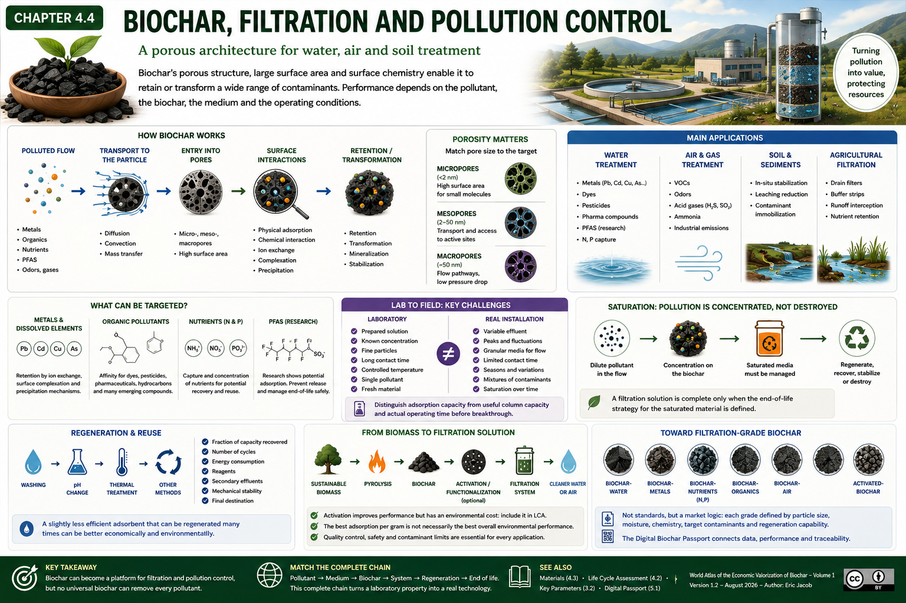

# Chapter 4.4 — Biochar, Filtration and Pollution Control

> **World Atlas of the Economic Valorization of Biochar — Volume 1**  
> Version 1.2 — August 2026 · Author: Eric Jacob

**[← Biochar in Materials](ch4_en_materials.md) · [↑ Atlas Contents](README_en.md) · [Ideal Biochar →](ch5_en_biochar_ideal.md)**

---

## A Porous Architecture for Water, Air and Soil Treatment

Biochar is not merely a stable carbonaceous material. Its porous structure, surface area and chemistry can enable it to retain certain molecules or ions. These properties open up applications in the treatment of water, effluents, air, gases and certain contaminated soils.

But simply referring to a "biochar filter" is not enough. Performance depends simultaneously on the pollutant, the original biomass, conversion temperature, available surface area, pore size, surface chemistry, pH, contact time and the presence of competing substances.

<figure>
  
  <figcaption>
    <strong>Figure 1 — Biochar, filtration and pollution control.</strong>
    The performance ranges shown in the infographic are illustrative and depend strongly on the material, pollutant and experimental conditions. They do not constitute a guarantee of industrial performance.
    © Eric Jacob 2026 — World Atlas of Biochar — CC BY 4.0.
    <a href="ch4_en_filtration.png">View full-size infographic</a>
  </figcaption>
</figure>

---

## Adsorption: Retaining Without Confusing It with Absorption

In many applications, the desired mechanism is **adsorption**: species attach to or interact with a surface.

This must be distinguished from absorption, in which a substance penetrates into the volume of another phase.

Several phenomena can coexist within a biochar:

```text
POLLUTION IN THE FLOW
          ↓
TRANSPORT TO THE PARTICLE
          ↓
ENTRY INTO THE PORE NETWORK
          ↓
SURFACE INTERACTIONS
   ↙       ↓        ↘
physical  chemical  mineral
          ↓
RETENTION / TRANSFORMATION
```

This diversity of mechanisms explains why two biochars with almost identical appearances can exhibit very different performance.

---

## Pore Size Must Match the Target

Porosity is not a single property.

Micropores provide substantial surface area for certain small molecules. Mesopores and macropores contribute to fluid transport and provide access to internal surfaces.

A highly microporous material may therefore have a very large specific surface area while being poorly suited to a bulky molecule or an effluent containing suspended particles.

> **The best adsorbent is not simply the one with the greatest number of square metres per gram: it is the one whose architecture is accessible to the targeted pollutant.**

---

## Metals and Dissolved Elements

Some biochars can retain metal ions through several mechanisms: electrostatic interactions, ion exchange, complexation with surface groups or precipitation with mineral phases.

Their behaviour strongly depends on:

- pH;
- surface charge;
- the mineral composition of the biochar;
- metal concentration;
- competing ions;
- contact time.

A high capacity measured in the laboratory using a solution containing a single metal therefore does not automatically predict performance in complex industrial water. :contentReference[oaicite:1]{index=1}

---

## Organic Pollutants

The carbonaceous matrix may exhibit an affinity for various organic compounds.

The families studied notably include certain:

- dyes;
- pesticides;
- pharmaceutical compounds;
- hydrocarbons and aromatic compounds;
- solvents;
- emerging organic contaminants.

Hydrophobic interactions, the aromatic carbon structure, porosity and surface functional groups can all play a role.

Performance must be determined for **the actual molecule in the actual medium**.

---

## PFAS: Research Potential, Essential Caution

Per- and polyfluoroalkyl substances constitute a particularly difficult family of contaminants to treat.

Biochars and biomass-derived carbons are being investigated for their adsorption potential, but the term PFAS encompasses a very large number of molecules with different behaviours.

Retention is also only the first half of the problem: once the contaminant has been concentrated onto the material, its release back into the environment must be prevented and an appropriate regeneration or destruction pathway determined.

PFAS-loaded biochar **must obviously not subsequently be applied as an agricultural soil amendment**. :contentReference[oaicite:2]{index=2}

---

## Nitrogen and Phosphorus: Capturing a Resource

In agricultural waters or certain effluents, capturing nitrogen- or phosphorus-containing species follows a different logic.

The pollutant is also a nutrient when it is present in the right place and at the appropriate concentration.

A properly designed system could therefore follow this principle:

```text
DILUTE NUTRIENT IN AN EFFLUENT
              ↓
CAPTURE ON A MATERIAL
              ↓
CONCENTRATION
              ↓
CHARACTERIZATION / SAFETY
              ↓
POTENTIAL VALORIZATION
```

This loop is possible only when the other contaminants present in the stream are compatible with the intended use.

---

## Air and Gas Treatment

The same surface principles can be exploited in gas-treatment systems.

Depending on the biochar and any subsequent activation or functionalization, research covers various gaseous compounds and odours.

The constraints, however, become application-specific: humidity, temperature, flow rate, pressure drop, fire risk, saturation and competition between gases.

An adsorbent that performs extremely well in a laboratory flask may be unusable in an industrial column if it causes excessive pressure drop. :contentReference[oaicite:3]{index=3}

---

## Biochar and Activated Carbon: Related, but Not Synonymous

Activated carbon is specifically engineered to develop very high adsorption capacity through controlled activation processes.

An unactivated biochar may have valuable adsorptive properties, but it should not automatically be assumed to replace a commercial activated carbon.

Biochar can, however, serve as a **precursor for activated carbon**.

A possible value chain then becomes:

```text
SUSTAINABLE BIOMASS
      ↓
BIOCHAR
      ↓
ACTIVATION / FUNCTIONALIZATION
      ↓
TECHNICAL CARBON
      ↓
HIGH-VALUE FILTRATION
```

The product then moves into a different economic category: its value no longer depends solely on its mass, but on its measured performance.

---

## Activation and Functionalization

Different strategies can modify the surface and pores of biomass-derived carbon.

These approaches may be physical, thermal or chemical. Mineral phases or functional groups can also be introduced to target specific species.

Such improvements nevertheless have an environmental cost.

Activation requiring substantial amounts of energy or reagents must be included in the **[Life Cycle Assessment](ch4_en_life_cycle_assessment.md)**.

The best adsorption performance per gram is not necessarily the best overall environmental performance. :contentReference[oaicite:4]{index=4}

---

## From Laboratory Testing to an Industrial Filter

A scientific publication may measure maximum adsorption capacity under controlled conditions.

An industrial system must address additional problems:

| Laboratory | Real Installation |
|---|---|
| prepared solution | variable effluent |
| known concentration | peaks and fluctuations |
| fine particles | granules compatible with flow |
| long agitation | limited contact time |
| controlled temperature | seasons and variations |
| one pollutant | mixture of contaminants |
| fresh material | saturation cycles |

It is therefore essential to distinguish **adsorption capacity**, **useful column capacity** and **actual operating time before saturation**.

---

## Saturation: A Filter Does Not Make Pollution Disappear

When an adsorbent retains a substance, that substance generally does not disappear.

It is transferred from a dilute flow into a more concentrated material.

This concentration is extremely useful because it allows a much smaller volume to be treated, but it requires an end-of-cycle strategy:

**regenerate**, **recover**, **stabilize** or **destroy** the contaminant according to its nature.

> **A filtration technology is complete only when the fate of the saturated filter has been defined.**

---

## Regeneration and Reuse

The ability to regenerate a material can fundamentally change its economics.

Depending on the pollutant and biochar, several approaches may be investigated: washing, pH modification, thermal treatment or other suitable processes.

The following should then be measured:

- fraction of capacity recovered;
- number of cycles;
- energy consumption;
- reagents;
- secondary effluent generated;
- mechanical evolution of the material;
- final destination.

A slightly less efficient adsorbent that can be regenerated twenty times may be economically and environmentally preferable to a disposable material. :contentReference[oaicite:5]{index=5}

---

## Agricultural Filtration and Water Protection

Biochar can also be used not to produce drinking water directly, but to intercept certain flows before they reach rivers and other water bodies.

Systems can be investigated in:

- filter strips;
- drains;
- ditches;
- buffer zones;
- treatment substrates;
- stormwater-management infrastructure.

The objective may be to slow water flow, retain certain species and reduce transfers into the environment.

This approach fits the territorial vision of the Atlas: **biochar as a distributed infrastructure for water management**.

---

## A Substitute for Groundwater? A Claim That Needs Precision

The ability of biochar-enriched soil to retain more water can sometimes reduce water stress and increase the fraction of rainfall available to plants.

This does not mean that biochar physically "replaces" groundwater.

The scientifically defensible formulation is more useful:

> **in certain soils and under certain conditions, biochar can contribute to increasing temporary water storage in the root zone and slowing its transfer.**

At large scale, this function could become one element of a territorial strategy combining soils, vegetation, infiltration, water storage and groundwater resources. :contentReference[oaicite:6]{index=6}

---

## Health and Safety

For drinking-water applications, adsorption performance is only one requirement among many.

The material itself must not introduce:

- organic contaminants;
- undesirable metals;
- hazardous particles;
- substances resulting from chemical treatment;
- problematic microbiological compounds.

A value chain intended for drinking water therefore requires regulatory and health validations appropriate to the country and intended application.

---

## Toward Filtration-Grade Biochars

As with materials, industrial development could lead to specialized products:

```text
BIOCHAR-WATER
BIOCHAR-METALS
BIOCHAR-PHOSPHORUS
BIOCHAR-ORGANICS
BIOCHAR-AIR
ACTIVATED-BIOCHAR
```

These names are not existing standards: they illustrate a market logic.

Each grade should be accompanied by data defining its application range, performance, limitations and regeneration characteristics.

The **[Digital Biochar Passport](ch5_en_digital_passport.md)** could contain this information. :contentReference[oaicite:7]{index=7}

---

## From Pollution Control to the Circular Economy

Filtration can create a value chain far richer than simply selling raw material.

A local residue can become biochar and then a filtration material. This material can protect a water resource or an industrial process, potentially be regenerated, and concentrate certain recoverable substances.

Economic value then comes from the **service provided**:

```text
TONNE OF BIOMASS
      ↓
CARBONACEOUS MATERIAL
      ↓
MEASURED PERFORMANCE
      ↓
M³ OF WATER TREATED
or
MASS OF POLLUTANT CAPTURED
      ↓
ENVIRONMENTAL SERVICE
```

This transition from selling material "by the tonne" to selling measured performance constitutes one of the major economic opportunities for technical biochar.

---

## Key Takeaways

> **Biochar can become a platform for filtration and pollution control, but there is no universal biochar capable of retaining every pollutant.**

The complete chain must be matched:

**pollutant → medium → biochar → treatment → system → regeneration → end of life.**

It is this complete chain that transforms a laboratory property into a credible environmental technology. :contentReference[oaicite:8]{index=8}

---

## Continue Reading

**[← Biochar in Materials](ch4_en_materials.md) · [↑ Atlas Contents](README_en.md) · [Ideal Biochar →](ch5_en_biochar_ideal.md)**

See also: [Key Parameters](ch3_en_parameters.md) · [Standards and Certifications](ch4_en_certifications.md) · [Life Cycle Assessment](ch4_en_life_cycle_assessment.md) · [Digital Biochar Passport](ch5_en_digital_passport.md)

---

*World Atlas of the Economic Valorization of Biochar — Eric Jacob — Version 1.2 — 2026*  
*License: Creative Commons CC BY 4.0*
