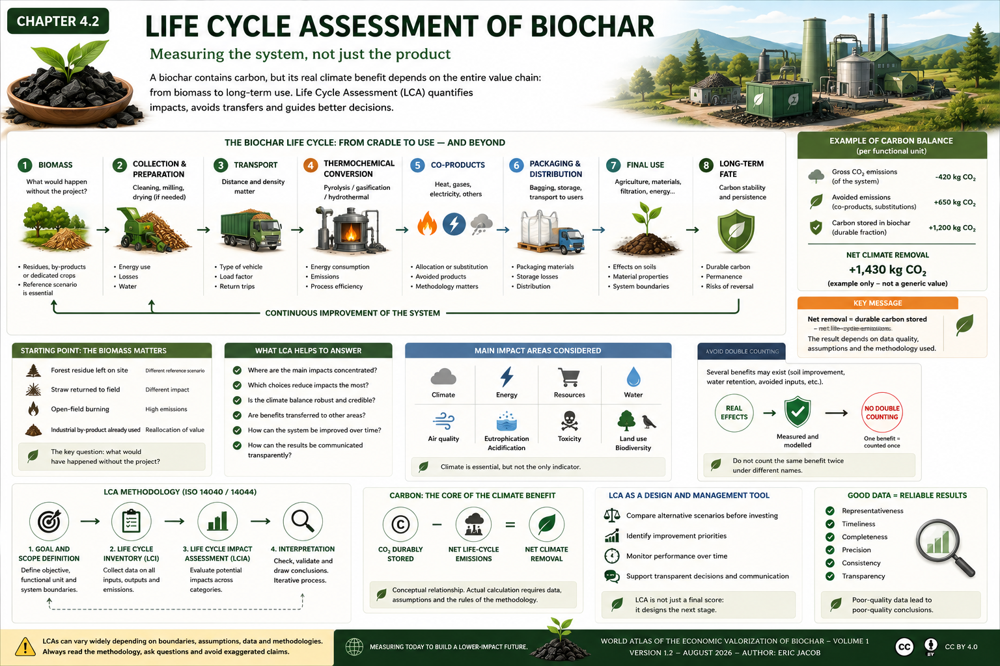

# Chapter 4.2 — Life Cycle Assessment of Biochar

> **World Atlas of the Economic Valorization of Biochar — Volume 1**  
> Version 1.2 — August 2026 · Author: Eric Jacob

**[← Standards and Certifications](ch4_en_certifications.md) · [↑ Atlas Contents](README_en.md) · [Biochar in Materials →](ch4_en_materials.md)**

---

## Measure the System, Not Just the Product

Saying that a biochar contains carbon is not enough to establish its climate benefit. To determine the real impact of a value chain, the entire system must be examined: biomass origin, collection, preparation, transport, thermochemical conversion, energy consumption, co-products, packaging, use and the long-term fate of the carbon.

This is the role of **Life Cycle Assessment (LCA)**.

<figure>
  
  <figcaption>
    <strong>Figure 1 — Biochar LCA: measuring the impacts of the complete system.</strong>
    The carbon-balance values shown in the infographic are a <strong>simplified educational example</strong>, not a generic value applicable to one tonne of biochar.
    © Eric Jacob 2026 — World Atlas of the Economic Valorization of Biochar — CC BY 4.0.
    <a href="ch4_en_life_cycle_assessment.png">View full-size infographic</a>
  </figcaption>
</figure>

> **Caution:** an LCA can produce very different results depending on its system boundaries, functional unit, allocation assumptions, energy mix, biomass, transport distances and reference scenario. Two figures are comparable only when their methodologies are comparable.

---

## From Cradle to Use — and Sometimes Beyond

A biochar LCA can be organized into major stages:

```text
BIOMASS
   ↓
collection + preparation
   ↓
TRANSPORT
   ↓
THERMOCHEMICAL CONVERSION
   ↓
biochar + heat + gases + other co-products
   ↓
packaging + distribution
   ↓
FINAL USE
   ↓
carbon evolution and long-term effects
```

The exact system boundary depends on the question being studied. An assessment devoted to an agricultural product will not necessarily use the same functional unit as a study concerning a construction material or one net tonne of CO₂ removed.

---

## The Starting Point: What Would Have Happened to the Biomass Without the Project?

Biomass is not automatically environmentally "free".

A dead branch left in a forest, straw retained on a field, a residue burned in the open air or an industrial co-product already being used correspond to different reference scenarios.

The LCA must therefore ask a fundamental question:

> **What would have happened to this biomass if the biochar value chain had not existed?**

This comparison can substantially change the result.

Using a genuinely available residue does not have the same environmental balance as diverting a resource from an already useful application or triggering additional harvesting.

---

## Transport: Density Matters as Much as Distance

Raw biomass can be wet and bulky. Transporting large quantities over long distances can consume a significant share of the system's energy.

This is one reason why territorial or semi-decentralized conversion can become attractive: reduce the distance travelled by the least dense material, then transport a more concentrated carbonaceous product when appropriate.

However, there is no universal distance separating a "good" project from a "bad" one. Vehicle type, payload, moisture, empty return journeys, road conditions and the energy used must all be considered.

---

## Thermolysis: The Industrial Core of the LCA

The thermochemical unit transforms biomass and distributes its energy and carbon among several streams.

The assessment should document, in particular:

- energy required for start-up and operation;
- electricity consumption;
- biochar yield;
- gases and vapours produced;
- recovered heat;
- direct emissions;
- potential leaks;
- flue-gas treatment;
- water consumption;
- maintenance and auxiliary systems when significant.

A plant that efficiently recovers and uses its gases and heat may have a very different environmental balance from a unit that dissipates these streams.

---

## Co-products: Real Value, but Delicate Accounting

Heat, electricity, gases or other products may avoid the production of energy or materials elsewhere in the economy.

LCA can account for these co-products through different methods: allocation, substitution, system expansion or other conventions compatible with the chosen framework.

This methodological choice is decisive.

A common mistake is to add together every possible "avoided" emission until an artificially spectacular balance is obtained. Instead, the assessment must specify **which product is actually being replaced, in what context and according to which methodology**.

---

## Stable Carbon: The Core of the Potential Climate Benefit

The carbon contained in biochar has durable climate value only to the extent that a significant fraction resists degradation over the period considered.

Three concepts must be distinguished:

**carbon contained** ≠ **durable carbon** ≠ **net CO₂ removed**.

Net removal must account for system emissions and the permanence rules adopted by the methodology.

Conceptually:

```text
CO₂ DURABLY STORED
        −
NET LIFE-CYCLE EMISSIONS
        =
NET CLIMATE REMOVAL
```

This relationship is conceptual: the actual calculation requires explicitly defined factors, measurements and assumptions.

---

## Climate Is Only One Indicator Among Many

A value chain may be favourable for the climate while shifting impacts toward water, soils or biodiversity.

Depending on its objective, a comprehensive LCA may consider:

| Area | Examples of Indicators |
|---|---|
| **Climate** | greenhouse-gas emissions, carbon removal |
| **Energy** | primary energy consumption |
| **Resources** | raw materials and energy resources |
| **Water** | consumption and pressure on water resources |
| **Air** | particulates and atmospheric pollutants |
| **Eutrophication / acidification** | emissions contributing to environmental imbalances |
| **Toxicity** | substances posing risks to ecosystems or health |
| **Land use** | land-use change and territorial pressures |

Biodiversity and certain agronomic effects remain difficult to condense into a single indicator. They often require complementary analyses alongside conventional LCA.

---

## Soils: Do Not Count the Same Benefit Twice

Agricultural applications may produce several effects: changes in water retention, fertility, soil emissions or input requirements.

These effects may be relevant in an LCA when they are sufficiently documented and compatible with the chosen methodology.

But **double counting** must be avoided: a benefit already included in a factor or scenario must not be added a second time under another name.

Remarkable agricultural observations are particularly valuable research material in this context. When a farmer observes a substantial difference between plots, that observation can help identify the variables that should be measured and incorporated into models.

---

## Time Changes the Result

The LCA of an industrial facility is not fixed forever.

A unit may improve:

- its energy efficiency;
- heat recovery;
- logistics;
- electricity supply;
- pollution-control systems;
- biochar quality;
- its outlets and applications.

An LCA performed at start-up may therefore become obsolete.

The Atlas recommends considering LCA as **a periodic management and optimization tool**, rather than as a report produced once solely to obtain authorization or certification.

---

## Data Quality

A sophisticated calculation built on poor-quality data remains a poor-quality calculation.

Data should be evaluated across several dimensions:

**representativeness** — do they genuinely correspond to the territory and process?  
**timeliness** — are they still valid?  
**completeness** — is any important flow missing?  
**precision** — measured or estimated?  
**consistency** — are the methods compatible?  
**transparency** — can the assumptions be understood?

This discipline becomes essential when LCA is used to assign financial value to carbon removal.

---

## ISO 14040 and ISO 14044

The **ISO 14040** and **ISO 14044** standards provide the general international framework for Life Cycle Assessment.

They structure four major phases:

```text
GOAL AND SCOPE DEFINITION
            ↓
LIFE CYCLE INVENTORY
            ↓
LIFE CYCLE IMPACT ASSESSMENT
            ↓
INTERPRETATION
```

Interpretation interacts with the other phases: an inconsistency discovered at the end may require the inventory or the initial assumptions to be reconsidered.

---

## LCA and Carbon Certification Are Not the Same Thing

An LCA may provide the basis for a carbon methodology, but certification of carbon removal generally imposes additional requirements: eligibility, monitoring, verification, permanence, traceability, risk management and registry procedures.

Conversely, an LCA can be extremely useful even when no carbon credit is sold.

It answers a broader question:

> **Where should we modify the system to obtain greater benefits with fewer resources and lower impacts?**

---

## LCA as a Design Tool

Perhaps the most interesting use of LCA is not to assign a final score to a facility that has already been built.

It can compare alternative architectures before investment:

```text
transport 30 km  VS  transport 300 km
dry biomass      VS  wet biomass
wasted heat      VS  recovered heat
electricity A    VS  electricity B
soil use         VS  material use
```

LCA then becomes a genuine engineering and decision-making tool.

This approach will be particularly important for the territorial infrastructures and coupled energy systems examined in Chapter 5.

---

## Key Takeaways

> **A biochar value chain is not sustainable merely because it produces biochar. It becomes sustainable when the complete system demonstrates, through comparable and transparent data, that its benefits outweigh its impacts.**

LCA therefore transforms an ecological intuition into something measurable.

And when it is used throughout the lifetime of a project, it no longer serves merely to certify the past: **it helps design the next stage.**

---

## Continue Reading

**[← Standards and Certifications](ch4_en_certifications.md) · [↑ Atlas Contents](README_en.md) · [Biochar in Materials →](ch4_en_materials.md)**

See also: [Sustainable Biomass](ch3_en_biomass.md) · [Key Parameters](ch3_en_parameters.md) · [Carbon Metrology](ch5_en_carbon_metrology.md) · [Territories & Resilience](ch5_en_territories_resilience.md)

---

*World Atlas of the Economic Valorization of Biochar — Eric Jacob — Version 1.2 — 2026*  
*License: Creative Commons CC BY 4.0*
