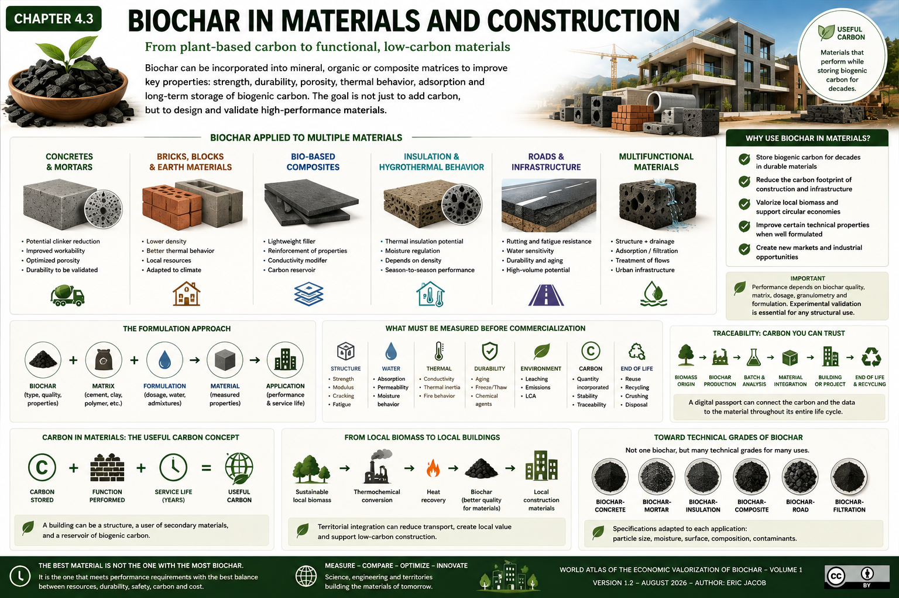

# Chapter 4.3 — Biochar in Materials and Construction

> **World Atlas of the Economic Valorization of Biochar — Volume 1**  
> Version 1.2 — August 2026 · Author: Eric Jacob

**[← Life Cycle Assessment](ch4_en_life_cycle_assessment.md) · [↑ Atlas Contents](README_en.md) · [Filtration and Adsorption →](ch4_en_filtration.md)**

---

## From Plant-Based Carbon to a Functional Material

Biochar can be incorporated into mineral, organic or composite matrices to provide specific functions: low density, porosity, adsorption, hygrothermal behaviour, particular conductivity characteristics or durable storage of a fraction of biogenic carbon.

Its value therefore does not simply consist in "putting carbon into concrete". The objective is to design a **composite material whose final properties are measured**, while assessing whether substitution for a conventional material and the incorporation of carbon genuinely improve the life-cycle balance.

<figure>
  
  <figcaption>
    <strong>Figure 1 — Biochar, materials and low-carbon construction.</strong>
    The performance levels shown are illustrative orders of magnitude: they vary considerably depending on the biochar, matrix, dosage, particle size and formulation. Any structural application must be experimentally validated.
    © Eric Jacob 2026 — World Atlas of Biochar — CC BY 4.0.
    <a href="ch4_en_materials.png">View full-size infographic</a>
  </figcaption>
</figure>

---

## A Formulation Approach, Not a Universal Recipe

Biochar can simultaneously modify several characteristics of a material. Increased porosity, for example, may be beneficial for insulation while becoming detrimental to certain mechanical properties if the formulation is not properly adapted.

The relevant question is therefore not:

> "What percentage of biochar should be added?"

but:

> **"Which properties are we seeking, with which matrix, which biochar and which service-life constraints?"**

This approach directly reflects the classification developed in Chapter 3: a biochar that performs well in soil is not automatically optimal for mortar, brick or a polymer composite.

---

## Concrete and Mortars

The cement sector is particularly interesting because clinker production is highly CO₂-intensive. Biochar incorporation can be investigated as an addition, functional filler or component of a broader formulation intended to reduce the carbon footprint.

Potential effects depend strongly on:

- the type of cementitious matrix;
- the properties of the biochar;
- particle size;
- dosage;
- water demand;
- dispersion;
- interactions with admixtures;
- curing conditions.

The parameters to be measured include:

- compressive strength;
- flexural strength;
- density;
- porosity;
- water absorption;
- shrinkage;
- thermal behaviour;
- durability;
- resistance to chemical attack;
- fire behaviour where relevant.

A formulation that improves one property may degrade another.

Validation must therefore be performed **formulation by formulation**.

---

## Biochar Does Not Necessarily Replace Cement

A common misconception is to equate any incorporation of biochar with direct clinker substitution.

Depending on the formulation, biochar may replace part of another constituent, act as a filler or be added to provide a specific function.

The climate benefit must distinguish between:

```text
BIOGENIC CARBON STORED
          +
CONVENTIONAL MATERIAL AVOIDED
          +
ENERGY POTENTIALLY AVOIDED
          −
BIOCHAR PRODUCTION IMPACTS
          −
TRANSPORT + PROCESSING
          =
NET BENEFIT TO BE ASSESSED BY LCA
```

This is precisely why **[Life Cycle Assessment](ch4_en_life_cycle_assessment.md)** precedes this chapter.

---

## Bricks, Blocks and Earthen Materials

Masonry materials provide other possibilities. A fraction of biochar can modify the density, porosity and thermal behaviour of a brick or block.

In earthen materials or lightly processed formulations, the concept becomes particularly interesting: combining a local mineral resource with a local carbonaceous resource could enable the development of materials adapted to the climate and resources of a territory.

Performance parameters to be examined include mechanical strength, water behaviour, abrasion, dimensional stability, ageing and fire behaviour.

---

## Bio-Based Composites

Biochar can also be investigated in composites combining polymers, plant fibres or other matrices.

Depending on its structure and treatment, it can perform several roles:

**lightweight filler**, **pigment**, **adsorbent**, **conductivity modifier**, **reinforcement of specific properties**, or **reservoir of biogenic carbon**.

Interfaces then become essential. The biochar surface must interact appropriately with the matrix; poor dispersion may create defects instead of improving the material.

---

## Insulation and Hygrothermal Behaviour

The porous structure and low density of certain biochars make them candidates for materials designed for thermal insulation or moisture regulation.

However, porosity does not automatically mean "better insulation". Final thermal conductivity depends on the complete mixture, its density, moisture content and microstructure.

In buildings, real-world behaviour should be assessed over several seasons: a material that performs well when dry may behave differently within a damp wall.

---

## Roads and Infrastructure

Research into incorporating biochar into road materials, bituminous binders or mineral mixtures opens another potentially high-volume market.

The parameters to monitor differ from those used in buildings:

- rutting resistance;
- fatigue;
- ageing;
- water sensitivity;
- thermal behaviour;
- adhesion;
- potential emissions and leaching;
- pavement recyclability.

A high-volume market must never become a means of burying poor-quality biochar. **Quality and safety remain necessary even when the material is not intended for agricultural use.**

---

## Filtration and Multifunctional Materials

At the boundary between construction and environmental treatment, porous materials capable of providing several functions are emerging.

Concrete, ceramics, geotextiles or composites containing biochar could be designed to combine structural functions, drainage, adsorption or treatment of a flow.

This convergence is particularly interesting for urban infrastructure:

```text
RAINWATER
     ↓
SURFACE / STRUCTURE
     ↓
FUNCTIONALIZED POROUS MATERIAL
     ↓
FLOW RETARDATION + FILTRATION
     ↓
INFILTRATION / REUSE
```

This provides a natural transition to the next chapter on **[filtration and adsorption](ch4_en_filtration.md)**. :contentReference[oaicite:2]{index=2}

---

## Incorporated Carbon Must Remain Traceable

When biochar is embedded in a material designed to last for several decades, the final destination of the carbon may be easier to identify than in some dispersed applications.

This does not eliminate the need to document:

- mass of biochar incorporated;
- carbon content and nature;
- biomass origin;
- production process;
- formulation;
- expected service life;
- demolition or recycling scenario.

The **[Digital Biochar Passport](ch5_en_digital_passport.md)** could be linked here to a building or material passport.

This would create a chain of evidence:

```text
BIOMASS → BIOCHAR → BATCH → MATERIAL → BUILDING → END OF LIFE
```

---

## Building a Useful Carbon Stock

One of the most interesting concepts is that of **useful carbon**.

Instead of storing a material solely to prevent its carbon from returning to the atmosphere, the objective is to make that material simultaneously perform a function throughout its storage period.

A building can therefore become at the same time:

- a structure;
- a consumer of secondary materials;
- a reservoir of biogenic carbon;
- potentially, an element of a territorial circular economy.

This approach must nevertheless remain subordinate to building safety and performance requirements. :contentReference[oaicite:3]{index=3}

---

## From Local Biomass to Local Buildings

The territorial approach can become particularly powerful when several flows are brought together.

Sustainable agricultural, forestry or landscape residues can be transformed locally. Heat from the process can be recovered; biochar can serve different markets depending on its quality; and the fraction suitable for materials can be supplied to regional manufacturers.

```text
SUSTAINABLE LOCAL BIOMASS
          ↓
THERMOLYSIS
   ↙              ↘
HEAT             BIOCHAR
   ↓                ↓
LOCAL USE       FORMULATION
                    ↓
                MATERIALS
                    ↓
               CONSTRUCTION
```

This model can potentially reduce certain transport requirements and retain more economic value within the territory. Its actual benefit must naturally be confirmed through LCA.

---

## What Must Be Measured Before Commercialization

| Category | Important Measurements |
|---|---|
| **Biochar** | carbon, ash, contaminants, moisture, particle size |
| **Structure** | strength, modulus, cracking, fatigue |
| **Water** | absorption, permeability, moisture behaviour |
| **Thermal** | conductivity, thermal inertia, fire behaviour |
| **Durability** | ageing, freeze/thaw, chemical agents |
| **Environment** | leaching, emissions, LCA |
| **Carbon** | quantity incorporated, stability, traceability |
| **End of life** | reuse, recycling, crushing, disposal |

Characterizing the finished material is just as important as characterizing the original biochar.

---

## A Formulation Industry to Be Built

The development of this market could create a new industrial specialization: rather than selling "generic biochar", producers could supply **technical grades**.

For example:

```text
BIOCHAR-CONCRETE
BIOCHAR-MORTAR
BIOCHAR-INSULATION
BIOCHAR-COMPOSITE
BIOCHAR-ROAD
BIOCHAR-FILTRATION
```

Each grade could have particle-size, moisture, surface, composition and contaminant specifications adapted to its intended application.

This development could significantly increase product value compared with simply selling unspecified biochar by the tonne. :contentReference[oaicite:4]{index=4}

---

## Key Takeaways

> **Biochar can become much more than a soil amendment: it can become a functional component of materials capable of storing carbon while simultaneously performing a technical function.**

But the fundamental principle remains the same throughout this Atlas:

**measure before making claims, formulate before generalizing, and compare the complete system through Life Cycle Assessment.**

The best material is not the one containing the most biochar. It is the one that achieves the required performance with the best compromise between resources, service life, safety, carbon and cost.

---

## Continue Reading

**[← Life Cycle Assessment](ch4_en_life_cycle_assessment.md) · [↑ Atlas Contents](README_en.md) · [Filtration and Adsorption →](ch4_en_filtration.md)**

See also: [Classification](ch3_en_classification.md) · [Key Parameters](ch3_en_parameters.md) · [Standards and Certifications](ch4_en_certifications.md) · [Digital Biochar Passport](ch5_en_digital_passport.md)

---

*World Atlas of the Economic Valorization of Biochar — Eric Jacob — Version 1.2 — 2026*  
*License: Creative Commons CC BY 4.0*
