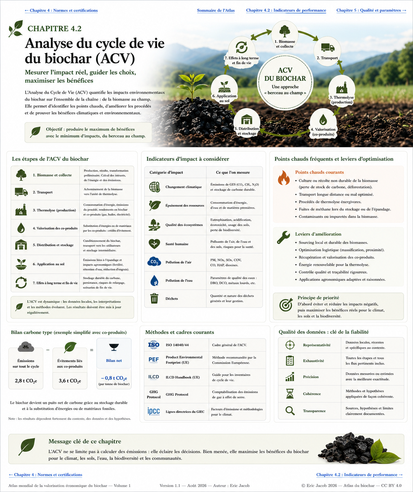

# Chapitre 4.2 — Analyse du cycle de vie du biochar

> **Atlas mondial de la valorisation économique du biochar — Volume 1**  
> Version 1.2 — Août 2026 · Auteur : Eric Jacob

**[← Normes et certifications](ch4_fr_certifications.md) · [↑ Sommaire de l’Atlas](README.md) · [Biochar et matériaux →](ch4_fr_materiaux.md)**

---

## Mesurer le système, pas seulement le produit

Dire qu’un biochar contient du carbone ne suffit pas à établir son bénéfice climatique. Pour connaître l’impact réel d’une filière, il faut examiner l’ensemble du système : origine de la biomasse, collecte, préparation, transport, conversion thermochimique, énergie consommée, coproduits, conditionnement, utilisation et devenir à long terme du carbone.

C’est le rôle de l’**analyse du cycle de vie (ACV)**.

<figure>
  
  <figcaption>
    <strong>Figure 1 — ACV du biochar : mesurer les impacts du système complet.</strong>
    Les valeurs du bilan carbone représentées dans l’infographie sont un <strong>exemple pédagogique simplifié</strong> et non une valeur générique applicable à une tonne de biochar.
    © Eric Jacob 2026 — Atlas mondial du biochar — CC BY 4.0.
    <a href="ch4_fr_analyse_cycle_vie.png">Agrandir l’infographie</a>
  </figcaption>
</figure>

> **Attention :** une ACV peut produire des résultats très différents selon ses frontières, son unité fonctionnelle, les hypothèses d’allocation, le mix énergétique, la biomasse, les distances et le scénario de référence. Deux chiffres ne sont comparables que si leurs méthodes le sont également.

---

## Du berceau à l’usage — et parfois au-delà

Une ACV du biochar peut être organisée en grandes étapes :

```text
BIOMASSE
   ↓
collecte + préparation
   ↓
TRANSPORT
   ↓
CONVERSION THERMOCHIMIQUE
   ↓
biochar + chaleur + gaz + autres coproduits
   ↓
conditionnement + distribution
   ↓
USAGE FINAL
   ↓
évolution du carbone et effets à long terme
```

La frontière exacte dépend de la question étudiée. Une analyse consacrée à un produit agricole n’aura pas nécessairement la même unité fonctionnelle qu’une étude portant sur un matériau de construction ou sur une tonne nette de CO₂ retirée.

---

## Le point de départ : quelle biomasse aurait-on eue sans le projet ?

La biomasse n’est pas automatiquement « gratuite » du point de vue environnemental.

Une branche morte laissée en forêt, une paille conservée au champ, un résidu brûlé à l’air libre ou un coproduit industriel déjà valorisé correspondent à des scénarios de référence différents.

L’ACV doit donc poser une question fondamentale :

> **Que serait-il arrivé à cette biomasse si la filière biochar n’avait pas existé ?**

Cette comparaison peut modifier fortement le résultat.

Utiliser un résidu réellement disponible n’a pas le même bilan que détourner une ressource d’un usage déjà utile ou provoquer une récolte supplémentaire.

---

## Transport : la densité compte autant que la distance

La biomasse brute peut être humide et volumineuse. Transporter de grandes quantités sur de longues distances peut consommer une part significative de l’énergie du système.

C’est l’une des raisons pour lesquelles la conversion territoriale ou semi-décentralisée peut devenir intéressante : réduire la distance parcourue par la matière la moins dense, puis transporter un produit carboné plus concentré lorsque cela est pertinent.

Mais aucune distance universelle ne sépare un « bon » d’un « mauvais » projet. Véhicule, charge utile, humidité, retour à vide, route et énergie utilisée doivent être considérés.

---

## La thermolyse : cœur industriel de l’ACV

L’unité thermochimique transforme la biomasse et répartit son énergie et son carbone entre plusieurs flux.

L’analyse doit documenter notamment :

- énergie nécessaire au démarrage et au fonctionnement ;
- consommation électrique ;
- rendement en biochar ;
- gaz et vapeurs produits ;
- chaleur récupérée ;
- émissions directes ;
- fuites éventuelles ;
- traitement des fumées ;
- consommation d’eau ;
- maintenance et auxiliaires lorsque significatifs.

Une installation qui valorise efficacement ses gaz et sa chaleur peut présenter un bilan très différent d’une unité qui dissipe ces flux.

---

## Les coproduits : valeur réelle, mais comptabilité délicate

La chaleur, l’électricité, les gaz ou d’autres produits peuvent éviter la production d’une énergie ou d’une matière ailleurs dans l’économie.

L’ACV peut traiter ces coproduits par différentes méthodes : allocation, substitution, expansion du système ou autres conventions compatibles avec le cadre retenu.

Ce choix méthodologique est déterminant.

Une erreur classique consiste à additionner toutes les émissions « évitées » possibles jusqu’à obtenir artificiellement un bilan spectaculaire. Il faut au contraire préciser **quel produit est réellement remplacé, dans quel contexte et avec quelle méthode**.

---

## Le carbone stable : cœur du bénéfice climatique potentiel

Le carbone du biochar n’a de valeur climatique durable que dans la mesure où une fraction significative résiste à la dégradation pendant la période considérée.

Il faut distinguer :

**carbone contenu** ≠ **carbone durable** ≠ **CO₂ net retiré**.

Le retrait net doit intégrer les émissions du système et les règles de permanence retenues par la méthodologie.

On peut résumer conceptuellement :

```text
CO₂ durablement stocké
        −
émissions nettes du cycle
        =
retrait climatique net
```

Cette relation est conceptuelle : le calcul réel nécessite des facteurs, mesures et hypothèses explicitement définis.

---

## Le climat n’est qu’un indicateur parmi d’autres

Une filière peut être favorable au climat tout en déplaçant un impact vers l’eau, les sols ou la biodiversité.

Une ACV complète peut considérer, selon son objectif :

| Domaine | Exemples d’indicateurs |
|---|---|
| **Climat** | émissions de gaz à effet de serre, retrait de carbone |
| **Énergie** | consommation d’énergie primaire |
| **Ressources** | matières premières et ressources énergétiques |
| **Eau** | consommation et pressions sur la ressource |
| **Air** | particules et polluants atmosphériques |
| **Eutrophisation / acidification** | émissions contribuant aux déséquilibres des milieux |
| **Toxicité** | substances présentant des risques pour les écosystèmes ou la santé |
| **Occupation des sols** | changement d’usage et pressions territoriales |

La biodiversité et certains effets agronomiques restent difficiles à condenser dans un indicateur unique. Ils nécessitent souvent des analyses complémentaires à l’ACV classique.

---

## Sols : ne pas compter deux fois le même bénéfice

Les applications agricoles peuvent produire plusieurs effets : modification de la rétention d’eau, de la fertilité, des émissions du sol ou de l’utilisation d’intrants.

Ces effets peuvent être pertinents dans une ACV lorsqu’ils sont suffisamment documentés et compatibles avec la méthode retenue.

Mais il faut éviter le **double comptage** : un bénéfice déjà inclus dans un facteur ou un scénario ne doit pas être ajouté une seconde fois sous une autre appellation.

Les observations agricoles remarquables constituent ici une matière de recherche particulièrement précieuse : lorsqu’un agriculteur observe une forte différence entre parcelles, cette observation peut orienter la mesure des variables qui doivent entrer dans les modèles.

---

## Le temps change le résultat

L’ACV d’une installation industrielle n’est pas figée.

Une unité peut améliorer :

- son rendement énergétique ;
- la récupération de chaleur ;
- sa logistique ;
- son approvisionnement électrique ;
- ses systèmes de dépollution ;
- la qualité de son biochar ;
- ses débouchés.

Une ACV réalisée au démarrage peut donc devenir obsolète.

L’Atlas recommande de considérer l’ACV comme **un instrument de pilotage périodique**, et non comme un rapport produit une fois pour obtenir une autorisation ou une certification.

---

## Qualité des données

Un calcul sophistiqué construit sur des données médiocres reste un calcul médiocre.

Les données devraient être évaluées selon plusieurs dimensions :

**représentativité** — correspondent-elles réellement au territoire et au procédé ?  
**actualité** — sont-elles encore valides ?  
**complétude** — manque-t-il un flux important ?  
**précision** — mesure ou estimation ?  
**cohérence** — les méthodes sont-elles compatibles ?  
**transparence** — peut-on comprendre les hypothèses ?

Cette discipline devient essentielle lorsque l’ACV sert à attribuer une valeur financière au retrait de carbone.

---

## ISO 14040 et ISO 14044

Les normes **ISO 14040** et **ISO 14044** constituent le cadre général international de l’analyse du cycle de vie.

Elles structurent notamment quatre grandes phases :

```text
OBJECTIF ET CHAMP DE L’ÉTUDE
            ↓
INVENTAIRE DU CYCLE DE VIE
            ↓
ÉVALUATION DES IMPACTS
            ↓
INTERPRÉTATION
```

L’interprétation dialogue avec les autres étapes : une incohérence découverte à la fin peut obliger à revoir l’inventaire ou les hypothèses initiales.

---

## ACV et certification carbone ne sont pas synonymes

Une ACV peut servir de base à une méthodologie carbone, mais une certification de retrait impose généralement des règles supplémentaires : admissibilité, surveillance, vérification, permanence, traçabilité, gestion des risques et registre.

Inversement, une étude ACV peut être extrêmement utile même lorsqu’aucun crédit carbone n’est vendu.

Elle permet de répondre à une question plus générale :

> **Où devons-nous modifier le système pour obtenir davantage de bénéfices avec moins de ressources et moins d’impacts ?**

---

## L’ACV comme outil de conception

L’usage le plus intéressant de l’ACV n’est peut-être pas de donner une note finale à une installation déjà construite.

Elle peut comparer plusieurs architectures avant investissement :

```text
transport 30 km  VS  transport 300 km
biomasse sèche   VS  biomasse humide
chaleur perdue   VS  chaleur valorisée
électricité A    VS  électricité B
usage sol        VS  usage matériau
```

On obtient alors un véritable outil d’ingénierie et de décision.

Cette logique sera particulièrement importante pour les infrastructures territoriales et les systèmes énergétiques couplés étudiés au chapitre 5.

---

## À retenir

> **Une filière biochar n’est pas durable parce qu’elle produit du biochar. Elle devient durable lorsque le système complet démontre, par des données comparables et transparentes, que ses bénéfices dépassent ses impacts.**

L’ACV transforme ainsi une intuition écologique en objet mesurable.

Et lorsqu’elle est utilisée pendant toute la vie du projet, elle ne sert plus seulement à certifier le passé : **elle aide à concevoir l’étape suivante.**

---

## Continuer la lecture

**[← Normes et certifications](ch4_fr_certifications.md) · [↑ Sommaire de l’Atlas](README.md) · [Biochar et matériaux →](ch4_fr_materiaux.md)**

À consulter également : [Biomasses](ch3_fr_biomasses.md) · [Paramètres](ch3_fr_parametres.md) · [Métrologie du carbone](ch5_fr_metrologie_carbone.md) · [Territoires et résilience](ch5_fr_territoires_resilience_biochar_carbone.md)

---

*Atlas mondial de la valorisation économique du biochar — Eric Jacob — Version 1.2 — 2026*  
*Licence : Creative Commons CC BY 4.0*
