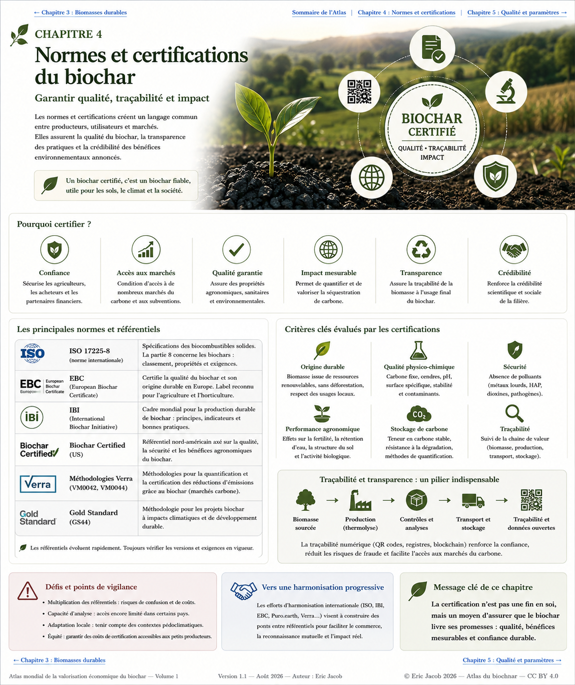

# Chapitre 4.1 — Normes et certifications du biochar

> **Atlas mondial de la valorisation économique du biochar — Volume 1**  
> Version 1.2 — Août 2026 · Auteur : Eric Jacob

**[← Biomasses durables](ch3_fr_biomasses.md) · [↑ Sommaire de l’Atlas](README.md) · [Analyse du cycle de vie →](ch4_fr_analyse_cycle_vie.md)**

---

## Garantir qualité, traçabilité et impact

À mesure que le marché du biochar grandit, le mot *biochar* ne peut plus constituer à lui seul une garantie suffisante. Deux produits issus de biomasses et de procédés différents peuvent présenter des propriétés, des contaminants, une stabilité et des usages très différents.

Les normes, référentiels, analyses et certifications ont donc plusieurs fonctions : **définir le produit, vérifier sa sécurité, rendre ses caractéristiques comparables, documenter son origine et, lorsque le retrait de carbone est revendiqué, établir une comptabilité vérifiable.**

<figure>
  
  <figcaption>
    <strong>Figure 1 — Normes, certifications et chaîne de confiance du biochar.</strong>
    Cette carte est une vue pédagogique : les référentiels, méthodologies et programmes évoluent et leurs versions en vigueur doivent toujours être vérifiées auprès de leurs organismes gestionnaires.
    © Eric Jacob 2026 — Atlas mondial du biochar — CC BY 4.0.
    <a href="ch4_fr_certifications.png">Agrandir l’infographie</a>
  </figcaption>
</figure>

> **Important — août 2026 :** l’ancien programme de certification propre à l’International Biochar Initiative (IBI) n’est plus un programme séparé. L’IBI indique que son cadre a été fusionné avec le **World Biochar Certificate (WBC)** administré par Carbon Standards International (CSI). L’image ci-dessus conserve IBI comme acteur historique et scientifique de la normalisation, et non comme certification autonome actuelle.

---

## Certifier quoi exactement ?

Le mot « certification » recouvre plusieurs objets qu’il faut distinguer.

| Objet | Question posée |
|---|---|
| **Produit** | Le matériau possède-t-il les caractéristiques et la sécurité attendues ? |
| **Procédé** | La production respecte-t-elle les exigences du référentiel ? |
| **Biomasse** | Son origine est-elle admissible, durable et traçable ? |
| **Usage** | Le biochar est-il compatible avec sa destination déclarée ? |
| **Carbone** | Quelle quantité nette de CO₂ est réellement retirée et pour quelle durée ? |
| **Chaîne de traçabilité** | Peut-on suivre le lot de la ressource jusqu’à son utilisation finale ? |

Un certificat de qualité du produit et un crédit de retrait de carbone ne sont donc **pas la même chose**.

---

## Le World Biochar Certificate et l’héritage IBI

L’International Biochar Initiative a joué un rôle historique majeur dans la définition et les méthodes d’analyse du biochar. Depuis 2025, l’IBI indique que son ancien cadre de certification a été intégré au **World Biochar Certificate**, administré par Carbon Standards International.

Le WBC exige notamment des analyses de laboratoire selon les exigences du programme. Cette évolution illustre une tendance souhaitable : rapprocher les référentiels plutôt que multiplier indéfiniment des labels incompatibles.

Pour l’acheteur, le point essentiel reste cependant le même : **demander le certificat précis, sa version, le lot concerné et les résultats analytiques associés.**

---

## EBC, WBC et référentiels de qualité

L’European Biochar Certificate (EBC) a fortement contribué à structurer le marché européen et à formaliser des exigences relatives aux intrants, à la production et aux propriétés du biochar.

Les référentiels de qualité doivent être lus comme des cadres techniques : ils définissent des méthodes, seuils, catégories et exigences de contrôle. Ils ne dispensent jamais de vérifier l’adéquation du produit à l’usage réel.

Un biochar conforme à un référentiel peut être parfaitement sûr tout en étant **mal adapté à un sol, une filtration ou un matériau particulier**.

---

## ISO : normaliser n’est pas certifier un biochar

Les normes ISO relatives aux biocombustibles solides, aux méthodes analytiques ou à d’autres domaines connexes peuvent être utiles pour harmoniser certaines mesures et terminologies.

Mais une norme technique utilisée dans une chaîne d’analyse ne doit pas être présentée automatiquement comme une « certification biochar ».

Cette distinction est importante pour éviter une inflation artificielle des labels.

---

## Carbone : une seconde couche de preuve

Lorsqu’un producteur souhaite valoriser le retrait de carbone, une caractérisation du produit ne suffit plus.

Il faut notamment examiner :

```text
BIOMASSE ADMISSIBLE
        ↓
PRODUCTION ET ÉNERGIE
        ↓
QUANTITÉ DE BIOCHAR
        ↓
CARBONE ET PERSISTANCE
        ↓
ÉMISSIONS DE LA CHAÎNE
        ↓
USAGE FINAL / STOCKAGE
        ↓
VÉRIFICATION
        ↓
RETRAIT NET CERTIFIÉ
```

Des standards de retrait de carbone comme **Puro Standard** disposent de méthodologies spécifiques au biochar. Puro.earth publie notamment une méthodologie Biochar 2025 et associe les retraits vérifiés à des certificats CORC.

La valeur carbone ne doit donc jamais être calculée comme :

> tonnes de biochar × facteur fixe = crédits.

Le résultat dépend de la teneur en carbone, de sa persistance, des émissions du système, des règles méthodologiques et de la vérification.

---

## Les analyses qui construisent la confiance

Selon l’usage et le référentiel, les paramètres pertinents peuvent comprendre :

- carbone total et carbone organique ;
- rapports ou indicateurs utilisés pour apprécier la stabilité ;
- humidité et matières volatiles ;
- cendres et composition minérale ;
- pH et conductivité ;
- densité et granulométrie ;
- surface spécifique et porosité lorsque pertinentes ;
- HAP et autres contaminants organiques ;
- métaux lourds ;
- éléments nutritifs ;
- origine et nature de la biomasse.

Tous les paramètres n’ont pas la même importance pour tous les marchés. La certification doit donc être complétée par une **fiche analytique exploitable par l’utilisateur**.

---

## La traçabilité : relier le certificat à la matière réelle

Une certification perd une grande partie de son intérêt si elle ne permet pas de relier le document au lot réellement acheté.

L’Atlas propose une chaîne minimale :

```text
SOURCE DE BIOMASSE
        ↓
LOT D’INTRANT
        ↓
UNITÉ + CONDITIONS DE PRODUCTION
        ↓
LOT DE BIOCHAR
        ↓
ÉCHANTILLON + LABORATOIRE
        ↓
CERTIFICAT / ANALYSES
        ↓
TRANSPORT + STOCKAGE
        ↓
UTILISATEUR / USAGE FINAL
```

Cette architecture rejoint directement le **[Passeport numérique du biochar](ch5_fr_passeport_biochar.md)**.

Un QR code peut faciliter l’accès à cette information, mais **le QR code n’est pas la preuve**. La preuve réside dans les données, leur intégrité, l’identité du lot et les contrôles qui les relient.

---

## Vers une certification lisible par les humains et les machines

La croissance mondiale de la filière pose un nouveau problème : des milliers de certificats PDF difficilement comparables ne suffiront pas.

Une évolution logique serait d’associer à chaque lot un ensemble de données structurées :

```text
IDENTIFIANT UNIQUE
│
├── origine biomasse
├── producteur et unité
├── procédé
├── analyses
├── référentiel + version
├── organisme de contrôle
├── ACV
├── carbone certifié éventuel
└── usages / restrictions
```

Ces données pourraient être lues par les acheteurs, les administrations, les chercheurs, les places de marché et les systèmes d’intelligence artificielle.

La certification deviendrait alors non seulement un document de conformité, mais **une infrastructure mondiale de confiance**.

---

## Le risque d’une jungle de labels

Une multiplication incontrôlée des certifications peut produire l’effet inverse de celui recherché : coûts élevés, confusion, difficultés pour les petits producteurs et comparaison impossible entre marchés.

L’objectif à long terme devrait être l’interopérabilité :

> **des exigences rigoureuses, des méthodes transparentes, des données comparables et une reconnaissance mutuelle lorsque les niveaux de preuve sont réellement équivalents.**

L’harmonisation ne signifie pas abaisser les exigences. Elle signifie éviter de mesurer cinq fois la même chose de cinq manières incompatibles.

---

## Petits producteurs et équité

Une certification trop coûteuse peut exclure des producteurs locaux pourtant capables de fabriquer un biochar de qualité.

Une filière mondiale équilibrée pourrait combiner :

- laboratoires régionaux reconnus ;
- procédures proportionnées au volume et au risque ;
- mutualisation des analyses par coopératives ;
- traçabilité numérique peu coûteuse ;
- contrôles indépendants ;
- exigences sanitaires et environnementales non négociables.

L’accès au marché ne devrait pas dépendre de la capacité à financer une bureaucratie disproportionnée, mais **la simplification ne doit jamais supprimer la preuve de sécurité**.

---

## À retenir

> **La certification n’est pas une fin en soi. Elle transforme une promesse commerciale en un ensemble de propriétés, d’origines, de mesures et de responsabilités vérifiables.**

Pour que le biochar devienne une matière première mondiale crédible, il faudra pouvoir répondre rapidement à quatre questions :

**Qu’est-ce que c’est ? D’où vient-il ? Que mesure-t-on ? Que peut-on légitimement en faire ?**

---

## Continuer la lecture

**[← Biomasses durables](ch3_fr_biomasses.md) · [↑ Sommaire de l’Atlas](README.md) · [Analyse du cycle de vie →](ch4_fr_analyse_cycle_vie.md)**

À consulter également : [Paramètres](ch3_fr_parametres.md) · [Passeport numérique](ch5_fr_passeport_biochar.md) · [Indice de qualité](ch5_fr_indice_qualite.md) · [Métrologie du carbone](ch5_fr_metrologie_carbone.md)

---

## Sources institutionnelles principales

- International Biochar Initiative — *Biochar Standards* et transition vers le World Biochar Certificate.
- Carbon Standards International — World Biochar Certificate et European Biochar Certificate.
- Puro.earth — Puro Standard et méthodologie Biochar.
- Les versions des référentiels évoluent : toujours consulter les documents officiels en vigueur avant une décision commerciale ou réglementaire.

---

*Atlas mondial de la valorisation économique du biochar — Eric Jacob — Version 1.2 — 2026*  
*Licence : Creative Commons CC BY 4.0*
