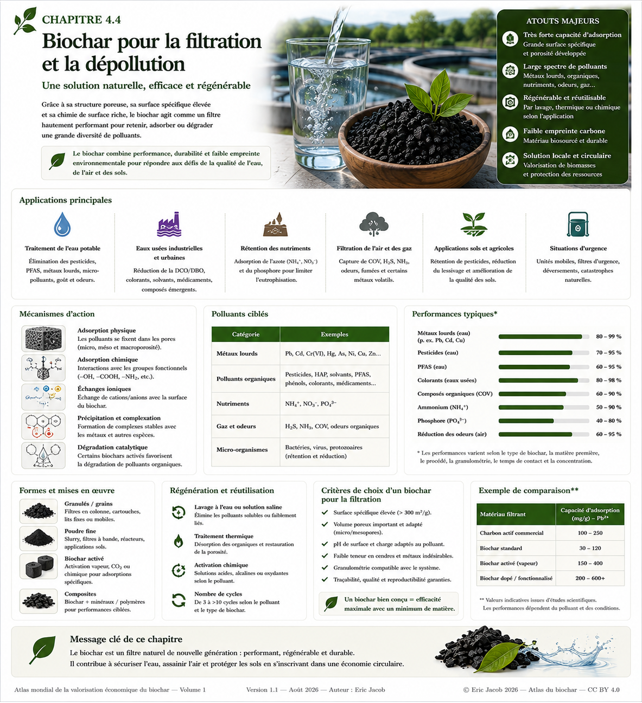

# Chapitre 4.4 — Biochar, filtration et dépollution

> **Atlas mondial de la valorisation économique du biochar — Volume 1**  
> Version 1.2 — Août 2026 · Auteur : Eric Jacob

**[← Biochar et matériaux](ch4_fr_materiaux.md) · [↑ Sommaire de l’Atlas](README.md) · [Biochar idéal →](ch5_fr_biochar_ideal.md)**

---

## Une architecture poreuse au service de l'eau, de l'air et des sols

Le biochar n'est pas seulement un matériau carboné stable. Sa structure poreuse, sa surface et sa chimie peuvent lui permettre de retenir certaines molécules ou certains ions. Ces propriétés ouvrent des applications en traitement de l'eau, des effluents, de l'air, des gaz et de certains sols contaminés.

Mais parler d'un « filtre au biochar » ne suffit pas. L'efficacité dépend simultanément du polluant, de la biomasse d'origine, de la température de conversion, de la surface disponible, de la taille des pores, de la chimie de surface, du pH, du temps de contact et de la présence d'autres substances concurrentes.

<figure>
  
  <figcaption>
    <strong>Figure 1 — Biochar, filtration et dépollution.</strong>
    Les plages de performance figurant dans l'infographie sont illustratives et dépendent fortement du matériau, du polluant et des conditions expérimentales. Elles ne constituent pas une garantie de performance industrielle.
    © Eric Jacob 2026 — Atlas mondial du biochar — CC BY 4.0.
    <a href="ch4_fr_filtration.png">Agrandir l’infographie</a>
  </figcaption>
</figure>

---

## Adsorption : retenir sans confondre avec absorber

Dans de nombreuses applications, le mécanisme recherché est l'**adsorption** : les espèces se fixent sur une surface ou interagissent avec elle.

Il faut la distinguer de l'absorption, où une substance pénètre dans le volume d'une autre phase.

Dans un biochar, plusieurs phénomènes peuvent coexister :

```text
POLLUTION DANS LE FLUX
          ↓
TRANSPORT VERS LA PARTICULE
          ↓
ENTRÉE DANS LE RÉSEAU POREUX
          ↓
INTERACTIONS DE SURFACE
   ↙       ↓        ↘
physiques chimiques minérales
          ↓
RÉTENTION / TRANSFORMATION
```

Cette pluralité explique pourquoi deux biochars ayant une apparence presque identique peuvent présenter des performances très différentes.

---

## La taille des pores doit correspondre à la cible

La porosité n'est pas une propriété unique.

Les micropores offrent une surface importante pour certaines petites molécules. Les mésopores et macropores participent au transport des fluides et rendent accessibles les surfaces internes.

Un matériau extrêmement microporeux peut donc posséder une grande surface spécifique tout en étant mal adapté à une molécule volumineuse ou à un effluent chargé en particules.

> **Le meilleur adsorbant n'est pas celui qui possède simplement le plus grand nombre de mètres carrés par gramme : c'est celui dont l'architecture est accessible à la pollution ciblée.**

---

## Métaux et éléments dissous

Certains biochars peuvent retenir des ions métalliques par plusieurs mécanismes : interactions électrostatiques, échange ionique, complexation avec des groupes de surface ou précipitation avec des phases minérales.

Le comportement dépend fortement :

- du pH ;
- de la charge de surface ;
- de la composition minérale du biochar ;
- de la concentration du métal ;
- des ions concurrents ;
- du temps de contact.

Une forte capacité mesurée avec une solution contenant un seul métal en laboratoire ne prédit donc pas automatiquement la performance dans une eau industrielle complexe.

---

## Polluants organiques

La matrice carbonée peut présenter une affinité pour différents composés organiques.

Les familles étudiées comprennent notamment certains :

- colorants ;
- pesticides ;
- molécules pharmaceutiques ;
- hydrocarbures et composés aromatiques ;
- solvants ;
- contaminants organiques émergents.

Les interactions hydrophobes, la structure aromatique du carbone, la porosité et les groupes fonctionnels de surface peuvent tous intervenir.

La performance doit être déterminée pour **la molécule réelle et le milieu réel**.

---

## PFAS : potentiel de recherche, prudence indispensable

Les substances per- et polyfluoroalkylées constituent une famille particulièrement difficile à traiter.

Des biochars et carbones issus de biomasse font l'objet de recherches pour leur adsorption, mais le terme PFAS couvre un très grand nombre de molécules présentant des comportements différents.

La rétention n'est en outre que la première moitié du problème : une fois le contaminant concentré sur le matériau, il faut empêcher sa remise en circulation et déterminer une filière de régénération ou de destruction appropriée.

Un biochar chargé en PFAS **ne doit évidemment pas être ensuite épandu comme amendement agricole**.

---

## Azote et phosphore : retenir une ressource

Dans les eaux agricoles ou certains effluents, la capture d'espèces contenant de l'azote ou du phosphore présente une logique différente.

Le polluant est aussi un nutriment lorsqu'il se trouve au bon endroit et à la bonne concentration.

Une filière bien conçue pourrait donc suivre le principe :

```text
NUTRIMENT DILUÉ DANS UN EFFLUENT
              ↓
CAPTURE SUR UN MATÉRIAU
              ↓
CONCENTRATION
              ↓
CARACTÉRISATION / SÉCURITÉ
              ↓
VALORISATION ÉVENTUELLE
```

Cette boucle n'est possible que si les autres contaminants du flux sont compatibles avec l'usage envisagé.

---

## Traitement de l'air et des gaz

Les mêmes principes de surface peuvent être exploités dans des systèmes de traitement de gaz.

Selon le biochar et son éventuelle activation ou fonctionnalisation, les recherches portent sur différents composés gazeux et odeurs.

Les contraintes deviennent cependant spécifiques : humidité, température, débit, perte de charge, risque d'incendie, saturation et compétition entre gaz.

Un adsorbant excellent en flacon peut être inutilisable dans une colonne industrielle s'il impose une perte de charge excessive.

---

## Biochar et charbon actif : cousins, pas synonymes

Le charbon actif est conçu pour développer une très forte capacité d'adsorption au moyen de procédés d'activation contrôlés.

Un biochar non activé peut posséder des propriétés adsorbantes intéressantes, mais il ne faut pas supposer qu'il remplace automatiquement un charbon actif commercial.

En revanche, un biochar peut servir de **précurseur à un carbone activé**.

On obtient alors une chaîne de valeur possible :

```text
BIOMASSE DURABLE
      ↓
BIOCHAR
      ↓
ACTIVATION / FONCTIONNALISATION
      ↓
CARBONE TECHNIQUE
      ↓
FILTRATION À HAUTE VALEUR
```

Le produit change alors de catégorie économique : la valeur ne dépend plus seulement de sa masse, mais de sa performance mesurée.

---

## Activation et fonctionnalisation

Différentes stratégies peuvent modifier la surface et les pores d'un carbone issu de biomasse.

Elles peuvent être physiques, thermiques ou chimiques. Des phases minérales ou groupes fonctionnels peuvent également être introduits pour cibler certaines espèces.

Cette amélioration a toutefois un coût environnemental.

Une activation consommant beaucoup d'énergie ou de réactifs doit être intégrée à **[l'analyse du cycle de vie](ch4_fr_analyse_cycle_vie.md)**.

La meilleure performance d'adsorption par gramme n'est pas nécessairement la meilleure performance environnementale globale.

---

## De l'essai en laboratoire au filtre industriel

Une publication scientifique peut mesurer une capacité maximale d'adsorption dans des conditions contrôlées.

Un système industriel doit résoudre d'autres problèmes :

| Laboratoire | Installation réelle |
|---|---|
| solution préparée | effluent variable |
| concentration connue | pics et fluctuations |
| particules fines | granulés compatibles avec l'écoulement |
| agitation longue | temps de contact limité |
| température contrôlée | saisons et variations |
| un polluant | mélange de contaminants |
| matériau neuf | cycles de saturation |

Il faut donc distinguer **capacité d'adsorption**, **capacité utile en colonne** et **durée réelle avant saturation**.

---

## Saturation : le filtre n'efface pas la pollution

Lorsqu'un adsorbant retient une substance, celle-ci ne disparaît généralement pas.

Elle est transférée d'un flux dilué vers un matériau plus concentré.

Cette concentration est extrêmement utile parce qu'elle permet de traiter un volume beaucoup plus petit, mais elle impose une stratégie de fin de cycle :

**régénérer**, **valoriser**, **stabiliser** ou **détruire** le contaminant selon sa nature.

> **Une technologie de filtration n'est complète que lorsque le devenir du filtre saturé est défini.**

---

## Régénération et réutilisation

La possibilité de régénérer un matériau peut transformer son économie.

Selon le polluant et le biochar, plusieurs approches peuvent être étudiées : lavage, modification du pH, traitement thermique ou autres procédés adaptés.

Il faut alors mesurer :

- fraction de capacité récupérée ;
- nombre de cycles ;
- consommation énergétique ;
- réactifs ;
- effluent secondaire produit ;
- évolution mécanique du matériau ;
- destination finale.

Un adsorbant légèrement moins performant mais régénérable vingt fois peut être économiquement et écologiquement préférable à un matériau jetable.

---

## Filtration agricole et protection des eaux

Le biochar peut aussi être utilisé non pas pour produire directement de l'eau potable, mais pour intercepter certains flux avant qu'ils n'atteignent les cours d'eau.

Des systèmes peuvent être étudiés dans :

- bandes filtrantes ;
- drains ;
- fossés ;
- zones tampons ;
- substrats de traitement ;
- ouvrages de gestion des eaux pluviales.

L'objectif peut être de ralentir l'eau, retenir certaines espèces et réduire les transferts vers l'environnement.

Cette approche rejoint la vision territoriale de l'Atlas : **le biochar comme infrastructure diffuse de gestion de l'eau**.

---

## Un substitut aux nappes phréatiques ? Une formulation à préciser

La capacité d'un sol enrichi en biochar à conserver davantage d'eau peut parfois réduire le stress hydrique et augmenter la fraction de pluie disponible pour les plantes.

Cela ne signifie pas que le biochar « remplace » physiquement une nappe phréatique.

La formulation scientifiquement défendable est plus intéressante :

> **dans certains sols et sous certaines conditions, le biochar peut contribuer à augmenter le stockage temporaire d'eau dans la zone racinaire et à ralentir son transfert.**

À grande échelle, cette fonction pourrait devenir un élément d'une stratégie territoriale associant sols, végétation, infiltration, retenues et nappes souterraines.

---

## Sécurité sanitaire

Pour les applications liées à l'eau potable, la performance d'adsorption n'est qu'une condition parmi d'autres.

Le matériau ne doit pas introduire lui-même :

- contaminants organiques ;
- métaux indésirables ;
- particules dangereuses ;
- substances issues d'un traitement chimique ;
- composés microbiologiques problématiques.

Une filière destinée à l'eau potable nécessite donc des validations réglementaires et sanitaires adaptées au pays et à l'usage.

---

## Vers des grades de biochar filtrant

Comme pour les matériaux, le développement industriel pourrait conduire à des produits spécialisés :

```text
BIOCHAR-EAU
BIOCHAR-MÉTAUX
BIOCHAR-PHOSPHORE
BIOCHAR-ORGANIQUES
BIOCHAR-AIR
BIOCHAR-ACTIVÉ
```

Ces noms ne sont pas des normes existantes : ils illustrent une logique de marché.

Chaque grade devrait être accompagné de données permettant de connaître son domaine d'emploi, ses performances, ses limites et sa régénération.

Le **[Passeport numérique du biochar](ch5_fr_passeport_biochar.md)** pourrait contenir ces informations.

---

## De la dépollution à l'économie circulaire

La filtration peut créer une chaîne de valeur beaucoup plus riche qu'une simple vente de matière brute.

Un résidu local peut devenir biochar, puis matériau filtrant. Celui-ci peut protéger une ressource en eau ou un procédé industriel, éventuellement être régénéré, et concentrer certaines matières récupérables.

La valeur économique vient alors du **service rendu** :

```text
TONNE DE BIOMASSE
      ↓
MATÉRIAU CARBONÉ
      ↓
PERFORMANCE MESURÉE
      ↓
M³ D'EAU TRAITÉS
ou
MASSE DE POLLUANT CAPTÉE
      ↓
SERVICE ENVIRONNEMENTAL
```

Cette transition de la vente « à la tonne » vers la vente d'une performance constitue l'un des grands potentiels économiques du biochar technique.

---

## À retenir

> **Le biochar peut devenir une plateforme de filtration et de dépollution, mais il n'existe pas de biochar universel capable de retenir toutes les pollutions.**

Il faut faire correspondre :

**polluant → milieu → biochar → traitement → dispositif → régénération → fin de vie.**

C'est cette chaîne complète qui transforme une propriété de laboratoire en technologie environnementale crédible.

---

## Continuer la lecture

**[← Biochar et matériaux](ch4_fr_materiaux.md) · [↑ Sommaire de l’Atlas](README.md) · [Biochar idéal →](ch5_fr_biochar_ideal.md)**

À consulter également : [Paramètres](ch3_fr_parametres.md) · [Certifications](ch4_fr_certifications.md) · [Analyse du cycle de vie](ch4_fr_analyse_cycle_vie.md) · [Passeport numérique](ch5_fr_passeport_biochar.md)

---

*Atlas mondial de la valorisation économique du biochar — Eric Jacob — Version 1.2 — 2026*  
*Licence : Creative Commons CC BY 4.0*
