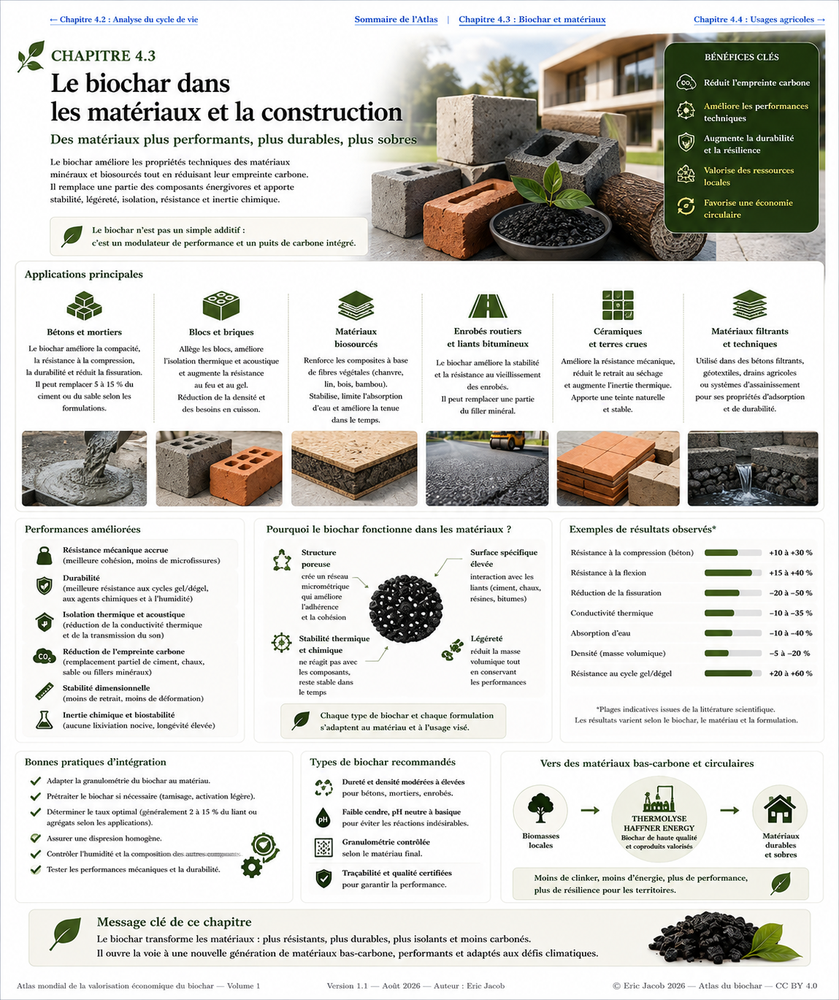

# Chapitre 4.3 — Le biochar dans les matériaux et la construction

> **Atlas mondial de la valorisation économique du biochar — Volume 1**  
> Version 1.2 — Août 2026 · Auteur : Eric Jacob

**[← Analyse du cycle de vie](ch4_fr_analyse_cycle_vie.md) · [↑ Sommaire de l’Atlas](README.md) · [Filtration et adsorption →](ch4_fr_filtration.md)**

---

## Du carbone végétal au matériau fonctionnel

Le biochar peut être incorporé à des matrices minérales, organiques ou composites afin d'apporter certaines fonctions : faible densité, porosité, adsorption, comportement hygrothermique, conductivité particulière ou stockage durable d'une fraction du carbone biogénique.

Son intérêt ne consiste donc pas simplement à « mettre du carbone dans du béton ». Il s'agit de concevoir un **matériau composite dont les propriétés finales sont mesurées**, tout en étudiant si la substitution d'une matière conventionnelle et l'incorporation de carbone améliorent réellement le bilan de cycle de vie.

<figure>
  
  <figcaption>
    <strong>Figure 1 — Biochar, matériaux et construction bas-carbone.</strong>
    Les performances représentées sont des ordres de grandeur illustratifs : elles varient fortement avec le biochar, la matrice, le dosage, la granulométrie et la formulation. Toute application structurelle doit être validée expérimentalement.
    © Eric Jacob 2026 — Atlas mondial du biochar — CC BY 4.0.
    <a href="ch4_fr_materiaux.png">Agrandir l’infographie</a>
  </figcaption>
</figure>

---

## Une logique de formulation, pas une recette universelle

Le biochar peut modifier simultanément plusieurs caractéristiques d'un matériau. Une augmentation de porosité peut par exemple être favorable à l'isolation tout en devenant défavorable à certaines performances mécaniques si la formulation n'est pas adaptée.

La question pertinente n'est donc pas :

> « Quel pourcentage de biochar faut-il ajouter ? »

mais :

> **« Quelles propriétés recherche-t-on, avec quelle matrice, quel biochar et quelles contraintes de durée de vie ? »**

Cette logique rejoint directement la classification du chapitre 3 : un biochar intéressant pour le sol n'est pas automatiquement optimal pour un mortier, une brique ou un composite polymère.

---

## Bétons et mortiers

Le secteur cimentaire est particulièrement intéressant parce que la fabrication du clinker est fortement émettrice de CO₂. L'incorporation de biochar peut être étudiée comme addition, charge fonctionnelle ou composant d'une formulation plus large cherchant à réduire l'empreinte carbone.

Selon le matériau et le dosage, les effets étudiés peuvent concerner :

- masse volumique ;
- résistance mécanique ;
- fissuration et retrait ;
- absorption et transport de l'eau ;
- conductivité thermique ;
- comportement au feu ;
- durabilité ;
- carbone biogénique incorporé.

Il serait cependant incorrect d'affirmer que l'ajout de biochar améliore systématiquement la résistance d'un béton. **À faible dosage et avec une formulation adaptée, certaines études observent des améliorations ; d'autres formulations montrent au contraire une perte de performance mécanique.**

La validation doit donc être faite formulation par formulation.

---

## Le biochar ne remplace pas nécessairement le ciment

Une confusion fréquente consiste à assimiler toute incorporation de biochar à une substitution directe du clinker.

Selon la formulation, le biochar peut remplacer une fraction d'un constituant, être utilisé comme charge ou être ajouté pour obtenir une fonction particulière.

Le bénéfice climatique doit distinguer :

```text
CARBONE BIOGÉNIQUE STOCKÉ
          +
MATIÈRE CONVENTIONNELLE ÉVITÉE
          +
ÉNERGIE ÉVENTUELLEMENT ÉVITÉE
          −
IMPACTS DE PRODUCTION DU BIOCHAR
          −
TRANSPORT + TRAITEMENT
          =
BÉNÉFICE NET À ÉVALUER PAR ACV
```

C'est précisément pourquoi **[l'analyse du cycle de vie](ch4_fr_analyse_cycle_vie.md)** précède ce chapitre.

---

## Briques, blocs et terres

Les matériaux de maçonnerie offrent d'autres possibilités. Une fraction de biochar peut modifier la densité, la porosité et le comportement thermique d'une brique ou d'un bloc.

Dans les matériaux en terre ou les formulations faiblement transformées, l'enjeu devient particulièrement intéressant : associer une ressource minérale locale à une ressource carbonée locale pourrait permettre de développer des matériaux adaptés au climat et aux ressources du territoire.

Les performances à examiner comprennent notamment la résistance mécanique, l'eau, l'abrasion, la stabilité dimensionnelle, le vieillissement et le comportement au feu.

---

## Composites biosourcés

Le biochar peut également être étudié dans des composites associant polymères, fibres végétales ou autres matrices.

Il peut y jouer plusieurs rôles selon sa structure et son traitement :

**charge légère**, **pigment**, **adsorbant**, **modificateur de conductivité**, **renfort de certaines propriétés**, ou **réservoir de carbone biogénique**.

Les interfaces deviennent alors essentielles. La surface du biochar doit interagir correctement avec la matrice ; une mauvaise dispersion peut créer des défauts au lieu d'améliorer le matériau.

---

## Isolation et comportement hygrothermique

La structure poreuse et la faible densité de certains biochars rendent possible leur étude dans des matériaux visant l'isolation thermique ou la régulation de l'humidité.

Mais la porosité ne signifie pas automatiquement « meilleur isolant ». La conductivité thermique finale dépend du mélange complet, de sa densité, de son humidité et de sa microstructure.

Dans le bâtiment, le comportement réel doit être étudié sur plusieurs saisons : un matériau performant à l'état sec peut réagir différemment dans une paroi humide.

---

## Routes et infrastructures

Les recherches sur l'incorporation de biochar dans les matériaux routiers, liants bitumineux ou mélanges minéraux ouvrent un autre débouché de volume potentiellement important.

Les paramètres à surveiller sont différents de ceux du bâtiment :

- résistance à l'orniérage ;
- fatigue ;
- vieillissement ;
- sensibilité à l'eau ;
- comportement thermique ;
- adhérence ;
- émissions et relargages éventuels ;
- recyclabilité de la chaussée.

Un marché de grand volume ne doit jamais devenir un moyen d'enfouir un biochar médiocre. **La qualité et l'innocuité restent nécessaires même lorsque le matériau n'est pas destiné à l'agriculture.**

---

## Matériaux filtrants et multifonctionnels

À la frontière entre construction et traitement de l'environnement apparaissent des matériaux poreux capables d'assurer plusieurs fonctions.

Un béton, une céramique, un géotextile ou un composite contenant du biochar pourrait être conçu pour associer structure, drainage, adsorption ou traitement d'un flux.

Cette convergence est particulièrement intéressante pour les infrastructures urbaines :

```text
EAU DE PLUIE
     ↓
SURFACE / OUVRAGE
     ↓
MATÉRIAU POREUX FONCTIONNALISÉ
     ↓
RALENTISSEMENT + FILTRATION
     ↓
INFILTRATION / RÉUTILISATION
```

Elle constitue une transition naturelle vers le chapitre suivant consacré à la **[filtration et l'adsorption](ch4_fr_filtration.md)**.

---

## Le carbone incorporé doit rester traçable

Lorsqu'un biochar est enfermé dans un matériau destiné à durer plusieurs décennies, la destination finale du carbone peut être plus facile à identifier que dans certains usages dispersifs.

Cela ne dispense pas de documenter :

- masse de biochar incorporée ;
- teneur et nature du carbone ;
- origine de la biomasse ;
- procédé de production ;
- formulation ;
- durée de vie attendue ;
- scénario de démolition ou recyclage.

Le **[Passeport numérique du biochar](ch5_fr_passeport_biochar.md)** pourrait ici être relié au passeport du bâtiment ou du matériau.

On obtiendrait une chaîne de preuve :

```text
BIOMASSE → BIOCHAR → LOT → MATÉRIAU → BÂTIMENT → FIN DE VIE
```

---

## Construire un stock de carbone utile

L'un des concepts les plus intéressants est celui du **carbone utile**.

Au lieu de stocker une matière uniquement pour empêcher son carbone de retourner dans l'atmosphère, on cherche à lui faire assurer simultanément une fonction pendant la durée de stockage.

Un bâtiment peut alors devenir à la fois :

- un ouvrage ;
- un consommateur de matières secondaires ;
- un réservoir de carbone biogénique ;
- éventuellement un élément d'une économie territoriale circulaire.

Cette approche doit toutefois rester subordonnée aux exigences de sécurité et de performance du bâtiment.

---

## De la biomasse locale au bâtiment local

La logique territoriale peut être particulièrement puissante lorsque plusieurs flux sont rapprochés.

Des résidus agricoles, forestiers ou paysagers durables peuvent être transformés localement. La chaleur issue du procédé peut être valorisée ; le biochar peut alimenter différents marchés selon sa qualité ; une fraction adaptée aux matériaux peut rejoindre des fabricants régionaux.

```text
BIOMASSE LOCALE DURABLE
          ↓
THERMOLYSE
   ↙              ↘
CHALEUR          BIOCHAR
   ↓                ↓
USAGE LOCAL     FORMULATION
                    ↓
               MATÉRIAUX
                    ↓
              CONSTRUCTION
```

Ce modèle réduit potentiellement certains transports et conserve davantage de valeur économique dans le territoire. Son intérêt réel doit naturellement être confirmé par l'ACV.

---

## Ce qu'il faut mesurer avant de commercialiser

| Famille | Mesures importantes |
|---|---|
| **Biochar** | carbone, cendres, contaminants, humidité, granulométrie |
| **Structure** | résistance, module, fissuration, fatigue |
| **Eau** | absorption, perméabilité, comportement à l'humidité |
| **Thermique** | conductivité, inertie, comportement au feu |
| **Durabilité** | vieillissement, gel/dégel, agents chimiques |
| **Environnement** | lixiviation, émissions, ACV |
| **Carbone** | quantité incorporée, stabilité, traçabilité |
| **Fin de vie** | réemploi, recyclage, concassage, élimination |

La caractérisation du matériau fini est aussi importante que celle du biochar initial.

---

## Une industrie de formulation à construire

Le développement de ce marché pourrait faire émerger une nouvelle spécialisation industrielle : non pas vendre du « biochar générique », mais produire des **grades techniques**.

Par exemple :

```text
BIOCHAR-BÉTON
BIOCHAR-MORTIER
BIOCHAR-ISOLATION
BIOCHAR-COMPOSITE
BIOCHAR-ROUTE
BIOCHAR-FILTRATION
```

Chaque grade pourrait disposer d'une plage de granulométrie, d'humidité, de surface, de composition et de contaminants adaptée à son usage.

Cette évolution augmenterait fortement la valeur du produit par rapport à une simple vente à la tonne sans spécification.

---

## À retenir

> **Le biochar peut devenir beaucoup plus qu'un amendement : un constituant fonctionnel de matériaux capables de stocker du carbone tout en assurant une fonction technique.**

Mais le principe fondamental reste celui de tout l'Atlas :

**mesurer avant de promettre, formuler avant de généraliser, et comparer le système complet par analyse de cycle de vie.**

Le meilleur matériau n'est pas celui qui contient le plus de biochar. C'est celui qui atteint la performance recherchée avec le meilleur compromis entre ressources, durée de vie, sécurité, carbone et coût.

---

## Continuer la lecture

**[← Analyse du cycle de vie](ch4_fr_analyse_cycle_vie.md) · [↑ Sommaire de l’Atlas](README.md) · [Filtration et adsorption →](ch4_fr_filtration.md)**

À consulter également : [Classification](ch3_fr_classification.md) · [Paramètres](ch3_fr_parametres.md) · [Certifications](ch4_fr_certifications.md) · [Passeport numérique](ch5_fr_passeport_biochar.md)

---

*Atlas mondial de la valorisation économique du biochar — Eric Jacob — Version 1.2 — 2026*  
*Licence : Creative Commons CC BY 4.0*
