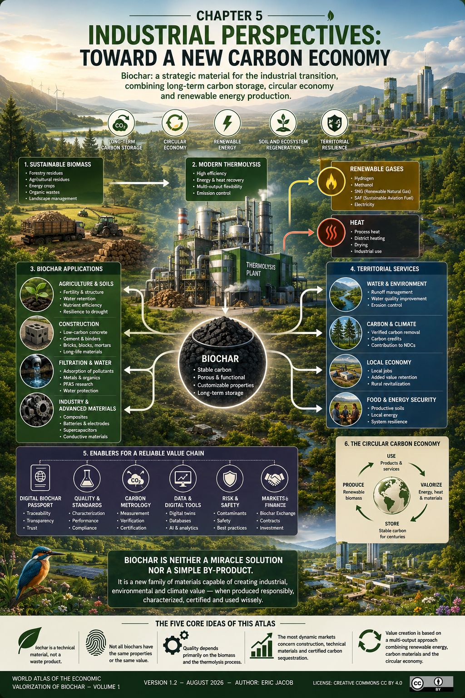

# Chapter 5 — Industrial Perspectives: Toward a New Carbon Economy

> **World Atlas of the Economic Valorization of Biochar — Volume 1**  
> Version 1.2 — August 2026 · Author: Eric Jacob

**[← Chapter 4 — Filtration](ch4_en_filtration.md) · [↑ Atlas Contents](README_en.md) · [Ideal Biochar →](ch5_en_biochar_ideal.md)**

> **Biochar could become one of the strategic materials of the industrial transition by combining long-term carbon storage, circular economy and renewable energy production.**

---

<figure>
  
  <figcaption>
    <strong>Figure 1 — Toward a new biogenic carbon economy.</strong>
    Sustainable biomass can feed integrated thermolysis platforms producing renewable energy and technical biochars for agriculture, construction, filtration and industry, while contributing to long-term carbon storage and territorial circular economies.
    © Eric Jacob 2026 — World Atlas of the Economic Valorization of Biochar — CC BY 4.0.
    <a href="ch5_en.png">View full-size infographic</a>
  </figcaption>
</figure>

---

# An Industrial Transformation

For a long time, thermolysis facilities were primarily designed to produce energy.

Market developments are now leading these facilities to be considered as **multi-output valorization units** capable of simultaneously producing:

- renewable gases;
- carbon-based materials;
- heat;
- environmental services.

This diversification is one of the main drivers of value creation.

---

# An Economy with Multiple Revenue Streams

A modern facility can generate several complementary economic flows.

```text
                Biomass
                    │
                    ▼
              Thermolysis
                    │
     ┌──────────────┴──────────────┐
     ▼                             ▼
 Renewable gases                Biochar
     │                             │
     ▼                             ▼
Hydrogen                    Construction
Methanol                    Agriculture
SNG                         Filtration
SAF                         Industry
     │                             │
     └──────────────┬──────────────┘
                    ▼
            Economic value
```

This diversification can potentially reduce dependence on a single market, although profitability depends on local conditions, operating costs and available outlets.

---

# The Most Promising Sectors

## Construction

The development of low-carbon concrete probably represents one of the largest potential markets of the coming decades.

---

## Cement

The incorporation of carbon-based materials into certain binders is currently the subject of extensive research.

---

## Agriculture

Biochar remains an interesting tool for improving certain soils, particularly when combined with appropriate agronomic practices.

---

## Filtration

The adsorptive properties of biochar open up opportunities in the treatment of water, effluents and certain gases.

---

## Advanced Materials

Research is developing in:

- composites;
- batteries;
- electrodes;
- supercapacitors;
- conductive materials.

These applications remain emerging but could represent high-value markets.

---

# An Opportunity for Industrial Decarbonization

Unlike many climate solutions, biochar acts simultaneously on several levers:

- biomass valorization;
- waste reduction;
- long-term carbon storage;
- substitution for more emission-intensive materials;
- renewable energy production.

This multifunctional approach explains the growing interest from industry.

---

# The Case of Modern Thermolysis Technologies

The latest industrial technologies seek to optimize simultaneously:

- energy efficiency;
- syngas quality;
- biochar quality;
- heat recovery;
- flexibility of end markets.

Depending on industrial choices, the same platform can supply several value chains: renewable hydrogen, methanol, SNG, SAF, heat or carbon-based materials.

Economic performance will nevertheless depend on numerous parameters: biomass quality, process efficiency, investment costs, market access and the regulatory framework.

---

# General Conclusion

Biochar is neither a miracle solution nor merely a co-product of thermolysis.

It represents a new family of materials capable of simultaneously creating industrial, environmental and climate value.

Its development will depend on four essential conditions:

- sustainable and traceable biomass;
- controlled industrial processes;
- recognized certifications;
- markets capable of valuing its properties.

In this context, biochar could become one of the pillars of a circular economy based on the valorization of biogenic carbon.

---

# The Five Essential Ideas of This Atlas

✅ Biochar is a technical material, not a waste product.

✅ Not all biochars have the same properties or the same value.

✅ Quality depends primarily on the biomass and the thermolysis process.

✅ The most dynamic markets today concern construction, technical materials and certified carbon sequestration.

✅ Value creation is based on a multi-output approach combining renewable energy, carbon-based materials and the circular economy.

---

> **“Carbon is not merely a waste product to be eliminated. When stabilized, certified and intelligently valorized, it becomes a strategic resource serving the industrial transition.”**

---

## Continue Reading

**[← Chapter 4 — Filtration](ch4_en_filtration.md) · [↑ Atlas Contents](README_en.md) · [Ideal Biochar →](ch5_en_biochar_ideal.md)**

---

*World Atlas of the Economic Valorization of Biochar — Eric Jacob — Version 1.2 — August 2026*  
*License: Creative Commons CC BY 4.0*
