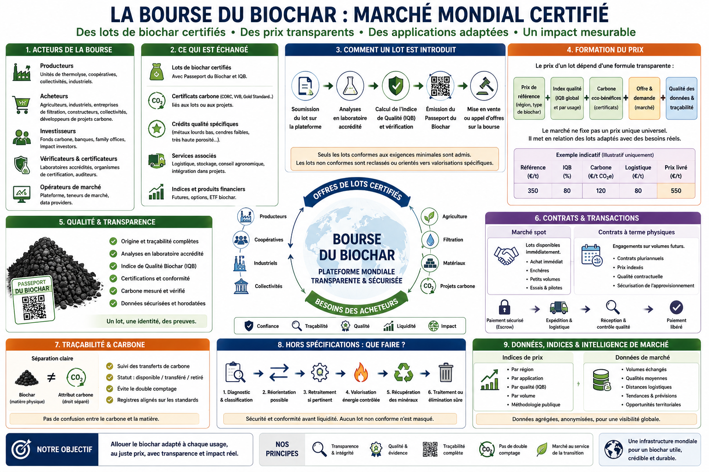

# Chapter 5.5 — Global Biochar Exchange

> **World Atlas of the Economic Valorization of Biochar — Volume 1**  
> Version 1.2 — August 2026 · Author: Eric Jacob

**[← Quality Index](ch5_en_quality_index.md) · [↑ Atlas Contents](README_en.md) · [Global Price Index →](ch5_en_global_price_index.md)**

---

## Moving from a Market of Tonnes to a Market of Verifiable Qualities

Biochar is not a homogeneous commodity. Two batches of the same mass may differ in their feedstock, stability, porosity, mineral composition, contaminants, intended use and carbon value.

A genuine marketplace should therefore not quote "biochar" as though a universal product existed.

It should organize the matching of **characterized batches with characterized needs**.

<figure>
  
  <figcaption>
    <strong>Figure 1 — Global Biochar Exchange: quality, transparency and price formation.</strong>
    Prices, volumes and indexes shown in the infographic are illustrative. They are neither actual quotations nor actual market data.
    © Eric Jacob 2026 — World Atlas of Biochar — CC BY 4.0.
    <a href="ch5_en_biochar_exchange.png">Enlarge infographic</a>
  </figcaption>
</figure>

---

## Why Create a Specialized Marketplace?

An emerging market presents several difficulties:

- fragmented information;
- prices that are difficult to compare;
- widely varying qualities;
- non-standardized contracts;
- significant logistics costs;
- limited visibility on volumes;
- possible confusion between physical biochar and its carbon attribute;
- difficulty for a new buyer in understanding exactly what is being purchased.

A specialized marketplace can reduce these frictions.

Its role is not to decide value on behalf of market participants, but to provide an **infrastructure for comparison, evidence and transactions**.

---

## The Batch as the Fundamental Unit

The traded unit should be a batch identified by its **[Digital Passport](ch5_en_biochar_passport.md)**.

An offer could be described as follows:

```text
BATCH: BC-2026-FR-000184
Available mass: 22.4 t
Origin: territorial maintenance residues
Grade: BA — agriculture
BQI-Agriculture: 82/100
Certification: applicable standard indicated
Carbon: batch analysis
Particle size: 2–10 mm
Location: Grand Est, France
Packaging: bulk / big bag
Carbon attribute: included / separate / unavailable
```

The buyer no longer sees only a price.

The buyer sees **what that price actually buys**.

---

## Market Participants

The platform can connect several categories of actors.

### Producers

Thermolysis units, industrial companies, cooperatives, local authorities or other operators producing characterized batches.

### Buyers

Farmers, distributors, material manufacturers, filtration specialists, local authorities, industrial companies and project developers.

### Laboratories

They provide the measurements required for comparison.

### Certifiers and Verifiers

They provide an independent layer of compliance or evidence.

### Logistics Operators

Biochar is a physical product. Transport, storage, packaging and safety are part of its real price.

### Carbon-Market Participants

When a batch results in certifiable carbon removal, the corresponding attributes must be unambiguously linked to the physical batch.

### Financiers and Insurers

More structured information can reduce certain risks and facilitate the financing of installations or long-term contracts.

---

## Admission of a Batch

A credible Exchange should not accept a simple commercial declaration.

The process could be:

```text
BATCH IDENTITY
      ↓
PASSPORT
      ↓
ANALYSES
      ↓
COMPLIANCE CHECKS
      ↓
BQI BY APPLICATION
      ↓
LOGISTICS DOCUMENTS
      ↓
ADMISSION
```

Mandatory data would depend on the category.

An agricultural batch and a carbonaceous material intended for a technical application do not necessarily have the same requirements.

---

## Several Markets Rather Than One Price

The platform could distinguish:

```text
BIOCHAR — AGRICULTURE
BIOCHAR — FILTRATION
BIOCHAR — MATERIALS
BIOCHAR — INDUSTRY
BIOCHAR — CARBON
BIOCHAR — SPECIAL GRADES
```

The same batch could qualify for several categories when its characteristics allow it.

This segmentation avoids artificially comparing products intended for different functions.

---

## Price Formation

The observed price can conceptually be broken down as:

```text
REGIONAL REFERENCE PRICE
          +
RELEVANT QUALITY
          +
CERTIFICATION
          +
CARBON ATTRIBUTE
          +
PACKAGING
          +
LOGISTICS
          +
SUPPLY / DEMAND
```

This formula does not impose a price.

It explains why two batches do not necessarily have the same value.

---

## Ex-Works Price and Delivered Price

Logistics can represent a significant fraction of value.

The platform should therefore distinguish at least:

- ex-works price;
- packaged price;
- transport cost;
- delivered price;
- distance;
- mode of transport.

A tonne sold for €500 at a distance of 30 km is neither economically nor environmentally equivalent to a tonne sold for €500 at a distance of 2,000 km. :contentReference[oaicite:1]{index=1}

---

## Territory as a Market Variable

Biochar is particularly suited to regional markets.

A Global Exchange does not imply that tonnes should circulate around the world.

On the contrary, it can make it possible to discover:

> **the best available batch nearby.**

A search engine could integrate:

```text
application
+ minimum quality
+ maximum radius
+ volume
+ date
+ certification
+ delivered price
```

The global platform then becomes a tool for **intelligent relocalization**.

---

## Spot Contracts

A spot market allows an immediately available batch to be purchased.

It is useful for:

- trials;
- occasional requirements;
- surpluses;
- first transactions;
- inventory adjustments.

But the biochar market may need long-term contracts more than very short-term speculation.

---

## Physical Forward Contracts

A farmer, manufacturer or distributor may want to secure several years of supply.

A producer needs visibility before financing an installation.

A contract could therefore define:

```text
annual volume
minimum quality
price formula
indexation
origin
tolerances
schedule
logistics
inspection
```

These offtake contracts can contribute to financing industrial capacity.

---

## Do Not Build a Biochar Casino

A useful marketplace should facilitate the real economy.

The objective is not to create artificial volatility or multiply financial products disconnected from physical tonnes.

The priority must remain:

```text
PRODUCER → BATCH → BUYER → REAL USE
```

Any financial instruments should serve risk hedging, financing or contract stability rather than becoming the purpose of the system.

---

## Separate Biochar from the Carbon Certificate

A physical tonne and its carbon attribute are two related but distinct objects.

Several situations are possible:

```text
BIOCHAR + CARBON ATTRIBUTE
BIOCHAR WITHOUT CARBON ATTRIBUTE
BIOCHAR WHOSE ATTRIBUTE HAS ALREADY BEEN TRANSFERRED
```

The passport must indicate the status.

Without this separation, a buyer could believe that it is acquiring a carbon benefit that has already been sold elsewhere. :contentReference[oaicite:2]{index=2}

---

## The Role of the BQI

The **[Biochar Quality Index](ch5_en_quality_index.md)** should not automatically determine the price.

It can, however, facilitate:

- offer filtering;
- comparison;
- quality premiums;
- contracts with thresholds;
- market statistics.

The Exchange could publish several indexes:

```text
BMI-A — agriculture
BMI-F — filtration
BMI-M — materials
BMI-C — carbon
```

The names are conceptual proposals of the Atlas.

---

## Building a Global Price Index

Actual transactions can feed anonymized references:

```text
price
+ quality
+ region
+ volume
+ application
+ date
```

A statistical methodology can then construct indexes while preventing a single atypical transaction from distorting the market.

This architecture is developed in the **[Global Biochar Price Index](ch5_en_global_price_index.md)**.

---

## What Should Be Done with Off-Specification Biochars?

A biochar rejected for one application is not necessarily a valueless waste.

The first step is to determine **why** it is off specification.

### Performance Defect

Insufficient surface area, unsuitable particle size, poorly adapted pH or another functional property.

The batch can sometimes be redirected toward a less demanding application.

### Correctable Defect

Moisture, particle size, dust or homogeneity can sometimes be corrected through drying, screening, granulation, controlled blending or post-treatment.

### Organic Contamination or Insufficient Pyrolysis

Thermal reprocessing can sometimes be considered.

It must be performed in an appropriate installation, with gas control and new characterization.

### Metals, Salts or Mineral Contaminants

Here, **burning the carbon does not destroy metals**.

Combustion instead concentrates mineral elements in the ash.

This may be useful if the objective is specifically to separate the carbon fraction from the mineral fraction, but the ash then becomes a concentrated stream that must be analyzed and directed toward an authorized pathway. :contentReference[oaicite:3]{index=3}

---

## Controlled Combustion: One Possible Route, Not a General Rule

The possibility of consuming an otherwise non-valorized biochar therefore deserves to remain within the Atlas.

The chain would be:

```text
OFF-SPECIFICATION BIOCHAR
          ↓
DIAGNOSIS
          ↓
CONTROLLED COMBUSTION?
          ↓
RECOVERED ENERGY / HEAT
          +
CONCENTRATED ASH
          ↓
ANALYSES
    ↙             ↘
MINERAL         TREATMENT /
RECOVERY        DISPOSAL
```

But this option sacrifices stable carbon: it returns primarily as CO₂.

It must therefore be compared with redirection, reprocessing or incorporation into an authorized technical application.

---

## Can Ash Become a Resource?

Sometimes.

Ash can contain:

- potassium;
- calcium;
- phosphorus;
- silicon;
- other mineral elements.

But it may also concentrate:

- undesirable metals;
- salts;
- contaminants not destroyed by combustion.

The word **ash** therefore means neither fertilizer nor hazardous waste by definition.

It means: **a new material to characterize**.

Analysis may lead to mineral valorization, recovery of elements or a specialized treatment pathway.

---

## A Hierarchy for Non-Compliant Batches

The Atlas proposes the following order:

```text
1 — REASSESS THE APPLICATION
2 — CORRECT THE DEFECT
3 — REPROCESS
4 — VALORIZE IN AN AUTHORIZED TECHNICAL APPLICATION
5 — RECOVER ENERGY / CONCENTRATE MINERALS
6 — TREAT OR DISPOSE THROUGH AN APPROPRIATE PATHWAY
```

The decision depends on the exact nature of the defect.

This hierarchy avoids two opposite mistakes:

- applying a poor product to soil simply because it is called biochar;
- destroying a material that could still be valorized. :contentReference[oaicite:4]{index=4}

---

## The Exchange Must Also Organize Rejections

A responsible marketplace should not merely display the best products.

It can create a private **industrial redirection** category for off-specification batches.

A batch rejected for agriculture could be proposed, where legally and technically compatible, to:

- a material manufacturer;
- a reprocessing operator;
- an energy installation;
- a mineral-recovery specialist.

The batch remains identified by its passport.

Its non-compliance is never erased.

---

## Safety Before Liquidity

The pursuit of a liquid market must never lead to weaker safety criteria.

A non-compliant batch must not become marketable simply because a buyer agrees to accept the risk.

Regulatory and health requirements remain the priority.

The platform must therefore distinguish:

```text
SUBOPTIMAL
≠
NON-COMPLIANT
≠
HAZARDOUS
```

These three situations require different decisions. :contentReference[oaicite:5]{index=5}

---

## Payment and Delivery

A transaction can use an escrow mechanism:

```text
CONTRACT
   ↓
PAYMENT HELD
   ↓
SHIPMENT
   ↓
RECEIPT
   ↓
INSPECTION
   ↓
PAYMENT RELEASED
```

For large contracts, procedures for joint or independent sampling can be established.

The platform must also manage disputes involving mass, moisture, quality and delivery times.

---

## Transparency Without Exposing Industrial Secrets

Buyers need data.

Producers need to protect certain information.

The system can reuse the passport's three access levels:

**public · professional · audit**

Transparency means that important claims can be verified.

It does not mean that every industrial recipe must be published.

---

## Governance

A Global Exchange should not be judge of its own products.

Its governance should separate:

- market operator;
- producers;
- laboratories;
- certifiers;
- index methodology;
- dispute resolution;
- audit.

Admission rules and calculation methods should be public and versioned.

---

## Institutional Integrity

Trust is more important than the name of the operator.

A marketplace could be operated by:

- an international cooperative structure;
- a foundation;
- a multi-stakeholder consortium;
- a company with independent governance;
- several interoperable platforms sharing the same standards.

The most robust model could be **federated**: several operators use a common language while reference data and methodologies remain open. :contentReference[oaicite:6]{index=6}

---

## Preventing Price Manipulation

A small market is vulnerable to artificial transactions.

The index should therefore exclude or appropriately weight:

- related-party transactions;
- excessively small volumes;
- cancelled transactions;
- non-representative prices;
- batches without documented quality.

Aggregated volumes and methodology should be published.

---

## Infrastructure for Cooperatives

The Exchange is not reserved for large industrial companies.

Agricultural or territorial producers can pool:

```text
BIOMASS
   ↓
SHARED UNIT
   ↓
BATCHES
   ↓
QUALITY CONTROL
   ↓
GROUPED SALE
```

A cooperative can thereby achieve volumes and regularity that would be impossible for an isolated producer.

---

## Hubs, Metropolitan Areas and Large Consumers

The same mechanisms can support broader territorial architectures.

A logistics hub, metropolitan area, hospital, industrial site or datacenter may simultaneously seek:

- energy;
- heat;
- residue management;
- biochar;
- materials;
- carbon.

The Exchange can then become an exchange layer between several local infrastructures rather than merely an e-commerce website.

---

## Data for Public Policy

Aggregated data can reveal:

- volumes produced;
- regions with shortages;
- prices;
- applications;
- qualities;
- average distances;
- biomass availability;
- industrial capacity.

This information can help local and regional authorities identify where new thermolysis capacity is genuinely relevant.

---

## What the Exchange Must Never Become

It must not:

- guarantee performance it has not measured;
- conceal the defects of a batch;
- confuse certification with marketing;
- create fictitious volumes;
- sell the same carbon attribute twice;
- favor one producer through its methodology;
- turn an ecological-transition tool into a speculative machine.

Trust is built slowly and can be destroyed by a few opaque transactions. :contentReference[oaicite:7]{index=7}

---

## From the Exchange to the Circular Economy

The real ambition goes beyond quotation.

```text
WASTE / RESIDUE
      ↓
RESOURCE
      ↓
CHARACTERIZED BIOCHAR
      ↓
PASSPORT
      ↓
BQI
      ↓
MARKET
      ↓
OPTIMAL APPLICATION
      ↓
PERFORMANCE FEEDBACK
```

Even an imperfect batch can enter this logic if it is correctly identified and redirected.

The market then becomes a **system for allocating material to the application where it creates the greatest value with the lowest risk**.

---

## Key Takeaway

> **A Biochar Exchange should not create a single price. It should make visible the differences that justify different prices.**

The passport establishes identity.

The BQI describes quality.

The Exchange organizes the matching of quality, geography, volume and application.

The global index observes transactions.

And non-compliant batches are neither disguised nor automatically destroyed: **they are diagnosed, redirected, reprocessed or sent to an appropriate pathway.** :contentReference[oaicite:8]{index=8}

---

## Continue Reading

**[← Quality Index](ch5_en_quality_index.md) · [↑ Atlas Contents](README_en.md) · [Global Price Index →](ch5_en_global_price_index.md)**

See also: [Digital Passport](ch5_en_biochar_passport.md) · [Certifications](ch4_en_certifications.md) · [Life Cycle Assessment](ch4_en_life_cycle_assessment.md) · [Global Consortium](ch5_en_global_consortium.md) · [Risk Management](ch5_en_risk_management.md)

---

*World Atlas of the Economic Valorization of Biochar — Eric Jacob — Version 1.2 — 2026*  
*License: Creative Commons CC BY 4.0*
