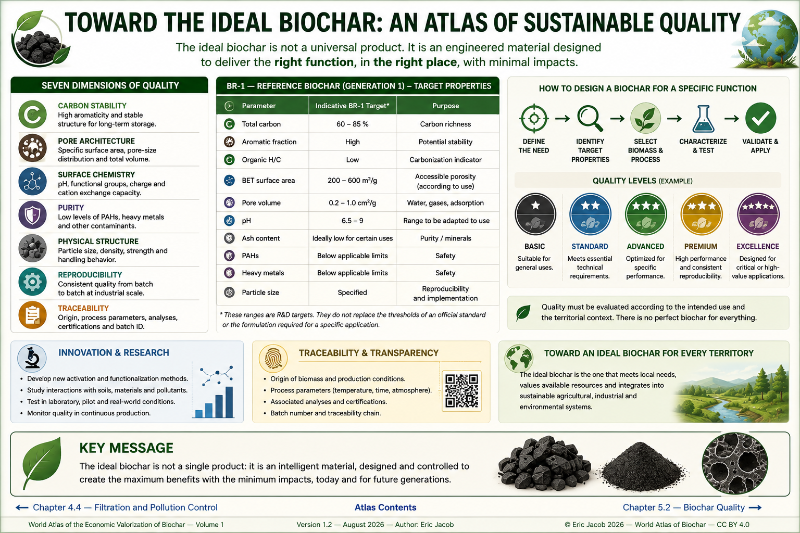

# Chapter 5.1 — Toward the Ideal Biochar

> **World Atlas of the Economic Valorization of Biochar — Volume 1**  
> Version 1.2 — August 2026 · Author: Eric Jacob

**[← Filtration and Pollution Control](ch4_en_filtration.md) · [↑ Atlas Contents](README_en.md) · [AI Datacenters + Biochar →](ch5_en_datacenters.md)**

---

## There Is Probably No Single Ideal Biochar — but Ideal Biochars for Specific Uses

Agriculture, filtration, construction, industry and long-term carbon storage do not require exactly the same properties. Attempting to maximize specific surface area, stability, exchange capacity, mechanical strength, purity, production yield and cost simultaneously quickly leads to conflicting objectives.

The "ideal biochar" should therefore be understood as **a design method**: start from the intended use and territory, define the required properties, select the biomass and process capable of producing them, and then verify the result through measurement.

<figure>
  
  <figcaption>
    <strong>Figure 1 — Toward the ideal biochar: designing quality from the intended use.</strong>
    The numerical ranges shown in this infographic are design guidelines rather than a universal standard; requirements must be adapted to the product, applicable framework and intended use.
    © Eric Jacob 2026 — World Atlas of Biochar — CC BY 4.0.
    <a href="ch5_en_biochar_ideal.png">View full-size infographic</a>
  </figcaption>
</figure>

---

## Reversing the Industrial Logic

The traditional approach often consists of producing a material from the available resource and then trying to find a market for it.

A mature biochar industry can work in the opposite direction:

```text
TERRITORIAL NEED
        ↓
REQUIRED FUNCTION
        ↓
TARGET PROPERTIES
        ↓
BIOMASS + PROCESS
        ↓
CHARACTERIZATION
        ↓
BIOCHAR GRADE
        ↓
USE + TRACEABILITY
```

This reversal transforms biochar from a commodity into an **engineered material**.

---

## Seven Dimensions of Quality

### Carbon Stability

For applications aimed at long-term carbon storage, carbon structure and stability indicators become essential. But maximizing stability should not cause the other functions of the material to be overlooked.

### Pore Architecture

Specific surface area, pore-size distribution and pore volume influence adsorption, water, gases and biological interactions. A large BET surface area alone is not proof of performance.

### Surface Chemistry

pH, functional groups, charge and exchange capacity determine many interactions with nutrients, ions and molecules.

### Purity

PAHs, metals and other contaminants must remain compatible with the applicable framework and intended use. Safety is not an optional property.

### Physical Structure

Particle size, density, abrasion resistance and handling behaviour determine whether the product can actually be transported, mixed or used in an installation.

### Reproducibility

An excellent laboratory sample is not enough. An industrial product must maintain controlled quality **batch after batch**.

### Traceability

Quality must be traceable to a biomass source, production unit, process conditions, analyses and an identifiable batch. :contentReference[oaicite:3]{index=3}

---

## Why a Single Value Is Insufficient

Two biochars can contain the same amount of carbon and still be very different.

Likewise:

- a high specific surface area may be useless if the pores are inaccessible to the target molecule;
- a high pH may be beneficial in acidic soil and inappropriate elsewhere;
- a high mineral content may provide nutrients in one context and become a disadvantage in a technical application;
- a fine particle size may enhance certain interactions while generating dust and pressure losses.

Quality must therefore be described through a **multidimensional profile**.

---

## A Reference Specification, Not a Standard

To compare processes, the Atlas retains the concept of a fictitious reference material: **BR-1 — Reference Biochar, Generation 1**.

BR-1 is neither a certification nor a commercial product. It is a conceptual benchmark intended to help ask the right questions.

| Parameter | Indicative BR-1 Target | Purpose |
|---|---:|---|
| Total carbon | 60–85% | carbon richness |
| Aromatic fraction | high | potential stability |
| Organic H/C | low | carbonization indicator |
| BET surface area | 200–600 m²/g | accessible porosity depending on use |
| Pore volume | 0.2–1.0 cm³/g | water, gases, adsorption |
| pH | 6.5–9 | range to be adapted to use |
| Ash | ideally low for certain uses | purity / minerals |
| PAHs | below applicable limits | safety |
| Metals | below applicable limits | safety |
| Particle size | specified | reproducibility and implementation |

These ranges are deliberately **R&D targets**. They never replace the thresholds of an official framework or the formulation required for a particular application. :contentReference[oaicite:4]{index=4}

---

## There Is No Ideal Biomass Either

An earlier version of this chapter ranked bamboo, hardwood, coconut and shells using stars. This representation was appealing but too general: the most appropriate biomass depends on the territory and the function being sought.

A better hierarchy consists of examining:

**actual availability**, **renewability**, **alternative uses**, **moisture**, **lignin**, **ash**, **minerals**, **contaminants**, **homogeneity**, **logistics** and **ecological risks**.

Bamboo can therefore be a remarkable resource where it already grows abundantly and where harvesting forms part of a sustainable system, without becoming a universal prescription.

> **The best feedstock is the one that provides the required function without impoverishing the territory that supplies it.**

---

## A Family of Grades Rather Than a Universal Champion

The Atlas proposes extending this approach through several conceptual families:

| Code | Dominant Function |
|---|---|
| **BR** | reference and comparison |
| **BA** | agriculture and soils |
| **BF** | filtration and adsorption |
| **BC** | construction and materials |
| **BI** | industry and composites |
| **BS** | long-term carbon storage |
| **BE** | specific energy or electrochemical functions |

These codes are **a working proposal of the Atlas**, not an existing international nomenclature.

Each family could evolve through generations: `BA-1`, `BA-2`, `BF-1`, `BC-1`... :contentReference[oaicite:5]{index=5}

---

## BA — Agricultural Biochar

Biochar intended for soils must be designed according to the soil rather than against it.

Possible objectives include:

- water retention;
- exchange capacity;
- microbial habitat;
- nutrient management;
- correction of certain imbalances;
- carbon stability.

A calcareous soil, an acidic soil, desert sand and clay soil do not require the same material.

In the future, biochars could be formulated from a combined **soil + climate + crop + water availability analysis**.

---

## BF — Filtration Biochar

For filtration, pore architecture, surface chemistry and physical form become critically important.

The design process therefore starts with the contaminant:

```text
TARGET MOLECULE / ION
        ↓
SIZE + CHARGE + CHEMISTRY
        ↓
REQUIRED PORES + SURFACE
        ↓
BIOCHAR / ACTIVATION
        ↓
COLUMN TEST
        ↓
SATURATION + REGENERATION
```

This family directly extends the chapter on **[Filtration and Pollution Control](ch4_en_filtration.md)**. :contentReference[oaicite:6]{index=6}

---

## BC — Biochar for Materials

Construction-grade biochar must be compatible with the matrix into which it is incorporated.

Particle size, water behaviour, density, mechanical strength, dispersion, contaminants and thermal behaviour become as important as carbon.

The objective is not to put the maximum amount of biochar into concrete or brick, but to achieve **the best overall performance for a given quantity of resources**.

---

## BS — Biochar for Long-Term Carbon Storage

When the primary function is long-term carbon storage, the priority shifts toward stability, traceability, carbon measurement, LCA and final destination.

The amount of carbon contained in the material is not enough: the durable fraction must be established and emissions from the value chain must be subtracted.

See: **[Life Cycle Assessment](ch4_en_life_cycle_assessment.md)** and **[Carbon Metrology](ch5_en_carbon_metrology.md)**. :contentReference[oaicite:7]{index=7}

---

## Quality Can Be Calculated — Without Hiding the Trade-Offs

A future quality index could aggregate several parameters, but a single score creates a risk: hiding the fact that a product excellent for one function may perform poorly for another.

The Atlas therefore favours a profile representation:

```text
STABILITY       █████████░
POROSITY        ███████░░░
PURITY          ██████████
WATER           ██████░░░░
MECHANICAL      ████████░░
TRACEABILITY    ██████████
```

This profile could then be interpreted according to the intended use.

This concept is developed further in the **[Biochar Quality Index](ch5_en_quality_index.md)**.

---

## Producing Quality at Industrial Scale

Quality does not depend solely on biomass.

Temperature, heating rate, residence time, atmosphere, feedstock preparation, cooling and post-treatment all modify the final product.

A modern industrial unit must therefore be able to combine:

```text
PRODUCTION RECIPE
        +
PROCESS SENSORS
        +
BATCH ANALYSES
        +
FEEDBACK FROM USE
        ↓
CONTINUOUS IMPROVEMENT
```

Biochar then becomes a material whose production can be controlled like that of a technical product. :contentReference[oaicite:8]{index=8}

---

## The Laboratory Is Not Enough

Moving from the laboratory to industrial scale must verify that performance survives the change of scale.

A robust approach includes:

1. definition of the need;
2. selection of biomass feedstocks;
3. process trials;
4. characterization;
5. application testing;
6. pilot stage;
7. industrial validation;
8. continuous batch control;
9. field feedback.

The final stage is crucial: **the field must feed information back to the laboratory**.

An unexpected agricultural or industrial observation may reveal a property that the original specification had not anticipated.

---

## The Ideal Biochar Is Also Territorial

Quality cannot be separated from place.

A technically exceptional material transported across a continent when an equivalent local solution exists may lose part of its economic and environmental value.

Conversely, a local unit capable of sustainably transforming residues into several biochar grades can become territorial infrastructure.

It connects:

**agriculture → energy → materials → water → carbon → local industry**.

This logic directly prepares the architectures examined throughout the remainder of Chapter 5. :contentReference[oaicite:9]{index=9}

---

## Toward a Digital Design Loop

The digital passport and digital twin proposed later in the Atlas could connect production data with actual results.

```text
BIOMASS
   ↓
PROCESS PARAMETERS
   ↓
BATCH ANALYSES
   ↓
USE
   ↓
FIELD RESULTS
   ↓
DATABASE
   ↓
OPTIMIZATION OF THE NEXT BATCH
```

At large scale, statistical models and artificial-intelligence systems could search for relationships between biomass, process, properties and results.

The objective would no longer be to discover **one** ideal biochar, but progressively to calculate **the biochar best suited to each situation**. :contentReference[oaicite:10]{index=10}

---

## Proposal: BR-1 as an Open Atlas Reference

The BR-1 concept can be retained as an original and evolving proposal.

Its function would be comparable to that of a reference material:

- compare processes;
- test analytical methods;
- structure databases;
- facilitate scientific publications;
- provide an educational target;
- evolve as knowledge advances.

BR-1 should remain open, versioned and clearly separated from regulatory certifications.

---

## Key Takeaways

> **The ideal biochar is not a universal material. It is the result of an optimization between a resource, a process, a function, a territory, measured safety and cost.**

The industry will reach maturity when the question is no longer:

> "How much does a tonne of biochar cost?"

but rather:

> **"What function must it perform, with what measured performance, for how long, and with what overall balance?"**

That is when biochar will truly move from being a product to becoming a **strategic material**. :contentReference[oaicite:11]{index=11}

---

## Continue Reading

**[← Filtration and Pollution Control](ch4_en_filtration.md) · [↑ Atlas Contents](README_en.md) · [AI Datacenters + Biochar →](ch5_en_datacenters.md)**

See also: [Classification](ch3_en_classification.md) · [Parameters](ch3_en_parameters.md) · [Certifications](ch4_en_certifications.md) · [Quality Index](ch5_en_quality_index.md) · [Digital Biochar Passport](ch5_en_digital_passport.md)

---

*World Atlas of the Economic Valorization of Biochar — Eric Jacob — Version 1.2 — 2026*  
*License: Creative Commons CC BY 4.0*
