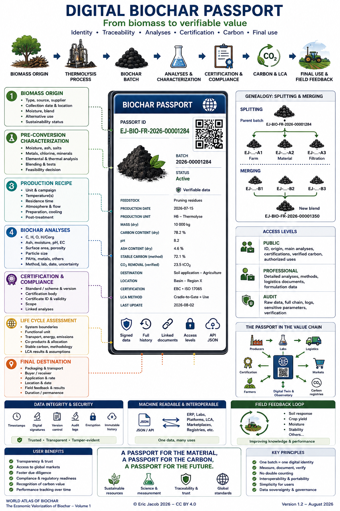

# Chapter 5.3 — Digital Biochar Passport

> **World Atlas of the Economic Valorization of Biochar — Volume 1**  
> Version 1.2 — August 2026 · Author: Eric Jacob

**[← AI Datacenters + Biochar](ch5_en_datacenters.md) · [↑ Atlas Contents](README_en.md) · [Quality Index →](ch5_en_quality_index.md)**

---

## Giving Every Batch a Verifiable Identity

The biochar market cannot become a credible global infrastructure if the buyer receives only an invoice, an isolated PDF certificate and a few analytical values that cannot be durably linked to the physical product.

The Atlas therefore proposes a **Digital Biochar Passport**: a structured, versioned record, readable by both humans and machines, associated with an identifiable batch from the original biomass through to its final use.

This concept follows the broader logic of digital product passports: identity, composition, provenance, environmental data, compliance and life cycle can be linked to a persistent identifier. The European Digital Product Passport framework already provides an important regulatory precedent.

<figure>
  
  <figcaption>
    <strong>Figure 1 — Digital Biochar Passport: from material to evidence.</strong>
    The identifiers, values and certifications shown in the infographic are illustrative and do not describe an actual commercial batch.
    © Eric Jacob 2026 — World Atlas of Biochar — CC BY 4.0.
    <a href="ch5_en_biochar_passport.png">Enlarge infographic</a>
  </figcaption>
</figure>

---

## The Passport Is Not Another Certificate

The objective is not to add another bureaucratic layer.

The passport is **the evidence container** that links information which already exists but is often scattered:

```text
BIOMASS
   ↓
FEEDSTOCK BATCH
   ↓
PROCESS
   ↓
BIOCHAR BATCH
   ↓
ANALYSES
   ↓
CERTIFICATION
   ↓
LCA / CARBON
   ↓
TRANSPORT
   ↓
FINAL USE
```

A certification may be one of the documents contained in the passport.

It is not the passport itself.

---

## A Unique Identity

Each batch should receive a persistent identifier, for example:

```text
EJ-BIO-FR-2026-00001284
```

The exact syntax matters less than four properties:

- uniqueness;
- permanence;
- machine readability;
- practical impossibility of confusing two batches.

This identifier can then be carried by a QR code, label, logistics document or API.

---

## Layer 1 — Biomass Origin

The passport should document the material even before its conversion.

Possible fields:

| Data | Example |
|---|---|
| Type | pruning residues |
| Origin | green-space maintenance |
| Area | territory / supply basin |
| Date | collection or reception |
| Supplier | identifier |
| Moisture | measurement |
| Blend | documented composition |
| Alternative use | information where relevant |
| Status | residue, co-product, maintenance biomass, dedicated crop… |

This last piece of information is important.

A technically high-quality biochar can still have a poor overall environmental balance if its biomass originates from unsustainable exploitation.

---

## Layer 2 — Characterization Before Conversion

For technologies capable of processing diverse resources, feedstock flexibility must be accompanied by rigorous characterization.

The passport can record:

- moisture;
- mineral matter and ash;
- salts;
- chlorine;
- metals;
- elemental composition;
- thermal behavior;
- blending with other resources;
- preliminary tests;
- feasibility decision.

A difficult resource — for example certain marine biomasses — can therefore be documented as a minority component of a blend rather than misleadingly presented as a universally suitable feedstock.

---

## Layer 3 — Production Recipe

The passport does not necessarily have to disclose every industrial secret.

However, it should retain enough information to link the product to the process:

```text
unit
date / production campaign
temperature(s)
residence time
atmosphere
flow rate
preparation
cooling
post-treatment
```

Some data may be public; other information may be restricted to the auditor or producer.

This type of tiered-access architecture makes it possible to reconcile traceability with industrial confidentiality.

---

## Layer 4 — Biochar Analyses

The core of the passport is batch characterization.

Depending on the intended use:

- carbon;
- hydrogen and oxygen;
- H/Corg;
- ash;
- moisture;
- pH;
- conductivity;
- exchange capacity;
- specific surface area;
- pore volume and distribution;
- particle-size distribution;
- PAHs;
- metals;
- other required contaminants.

The passport should record **the value, unit, method, laboratory, date and uncertainty when available**.

A value without its measurement method is incomplete information.

---

## Layer 5 — Certification and Compliance

The passport can point to:

- standard or certification scheme;
- version of the standard;
- organization;
- certificate;
- issue date;
- validity period;
- scope;
- associated analyses.

The objective is to prevent a certification logo from becoming detached from the actual batch to which it applies.

See: **[Standards and Certifications](ch4_en_certifications.md)**.

---

## Layer 6 — Life Cycle Assessment

A credible carbon balance requires preserving the assumptions from which it was calculated.

The passport can contain or reference:

- system boundaries;
- functional unit;
- transport;
- energy;
- direct emissions;
- co-products;
- allocation rules;
- reference scenario;
- stable carbon;
- methodology version.

A value such as `−X kgCO₂e` therefore ceases to be an isolated promotional number: it becomes a result that can be reproduced within a defined framework.

See: **[Life Cycle Assessment](ch4_en_life_cycle_assessment.md)**.

---

## Layer 7 — Final Destination

Traceability should not stop at the factory gate.

The passport should be capable of following:

```text
PRODUCED BATCH
   ↓
PACKAGING
   ↓
TRANSPORT
   ↓
BUYER
   ↓
USE
   ↓
LOCATION / STRUCTURE / PLOT
   ↓
DATE
```

The level of granularity must naturally respect confidentiality and applicable regulation.

For carbon, this final stage is particularly important: permanence also depends on the material's destination.

---

## Splitting and Merging Batches

Real-world logistics creates an interesting problem.

A 20-tonne batch may be divided among several customers. Several smaller batches may also be blended together.

The passport must therefore manage genealogy:

```text
BATCH A
 ├── A1 → farm
 ├── A2 → material
 └── A3 → filtration

BATCH B ─┐
BATCH C ─┼→ BATCH D (blend)
BATCH E ─┘
```

Each descendant retains a link to its parents.

This structure is essential for preventing double claims involving material or carbon.

---

## QR Code: A Gateway, Not the Database

A QR code is useful because a smartphone can open it immediately.

But it should contain only an identifier or a stable address.

```text
QR
 ↓
IDENTIFIER
 ↓
PASSPORT
 ↓
DATA + EVIDENCE
```

If the address changes, a resolution system should preserve the link.

A printed QR code is therefore not the evidence.

**It is the gateway to the evidence.**

---

## Signed Data

A serious passport should distinguish between:

- producer declaration;
- automated measurement;
- laboratory result;
- auditor validation;
- end-user data.

Each event can receive:

```text
author
timestamp
version
cryptographic fingerprint
signature
```

Changing an analysis should not erase the previous value.

A new version should be created.

---

## Blockchain: Sometimes Useful, Never Mandatory

A blockchain can provide a shared registry and make certain modifications difficult.

But it is not necessary for every architecture.

A properly administered database with signatures, audit logs, backups and replication can provide excellent traceability.

The Atlas therefore adopts the following principle:

> **Choose the simplest architecture capable of providing the required level of evidence.**

Technology should not become more important than the data.

---

## Three Access Levels

A global passport would benefit from distinguishing several access levels.

### Public

Accessible to everyone:

- identifier;
- general origin;
- category;
- main analyses;
- certifications;
- verified carbon;
- authorized uses.

### Professional

Accessible to authorized parties:

- detailed analyses;
- logistics documents;
- methods;
- necessary formulation information.

### Audit

Accessible to verifiers:

- raw data;
- complete chain;
- logs;
- sensitive parameters required for verification.

This separation protects industrial secrets without making the evidence opaque.

---

## A Machine-Readable Format

HTML or PDF is convenient for humans.

A global economy also requires a structured format, such as JSON:

```json
{
  "passport_id": "EJ-BIO-FR-2026-00001284",
  "batch": {
    "feedstock": "green-waste-residues",
    "production_date": "2026-08-02"
  },
  "biochar": {
    "carbon_pct": 78.2,
    "ash_pct": 5.1,
    "ph": 8.2
  },
  "certification": [],
  "destination": []
}
```

This format allows marketplaces, laboratories, public authorities, researchers and AI systems to query the data without manually reading thousands of PDF documents.

---

## API and Interoperability

The passport becomes much more powerful if its data can be exchanged with:

- industrial ERP systems;
- laboratories;
- logistics systems;
- carbon registries;
- certification systems;
- agricultural platforms;
- building systems;
- marketplaces;
- observatories;
- digital twins.

The objective is not to build one gigantic global database, but **a common language enabling multiple systems to understand one another**.

---

## The Passport and the Biochar Quality Index

Analytical data from the passport can automatically feed a quality profile or index.

```text
PASSPORT
   ↓
VERIFIED DATA
   ↓
VERSIONED ALGORITHM
   ↓
QUALITY PROFILE
   ↓
FITNESS FOR USE
```

If the algorithm changes, the version used should remain recorded.

See: **[Biochar Quality Index](ch5_en_quality_index.md)**.

---

## The Passport and the Biochar Exchange

A serious marketplace should not trade only:

> "biochar — €700/t".

It should be able to trade a batch defined by its passport:

```text
origin
+ grade
+ analyses
+ certification
+ carbon
+ location
+ availability
+ authorized destination
```

The passport then becomes the identity card of the traded product.

See: **[Biochar Exchange](ch5_en_biochar_exchange.md)** and **[Global Biochar Price Index](ch5_en_global_price_index.md)**.

---

## The Passport and Carbon

When a carbon-removal certificate is associated with biochar, the system must prevent the same tonne from being claimed several times.

The passport can link:

```text
PHYSICAL BATCH
    ↕
QUANTITY OF CARBON
    ↕
CERTIFICATE
    ↕
STATUS
issued / transferred / retired
```

It therefore becomes possible to distinguish ownership of the physical biochar from ownership of the carbon attribute.

---

## The Passport and Field Results

The passport can continue to evolve after the sale.

For agricultural use, voluntary observations could be linked to the batch:

- initial soil;
- application rate;
- crop;
- rainfall;
- irrigation;
- yield;
- soil moisture;
- biological evolution;
- observations over several years.

For a filter:

- volume treated;
- contaminant;
- pressure drop;
- saturation;
- regeneration.

For a material:

- formulation;
- strength;
- ageing.

The passport then becomes **a living performance record**.

---

## From Field Feedback to Research

Millions of batches linked to their results would progressively create a considerable scientific resource.

```text
PASSPORTS
    ↓
ANONYMIZED DATA
    ↓
STATISTICS
    ↓
MODELS
    ↓
NEW HYPOTHESES
    ↓
TRIALS
    ↓
BETTER BIOCHARS
```

Remarkable observations could be detected automatically and subsequently investigated scientifically.

Here, the Atlas connects directly with the concept of the **[Digital Twin](ch5_en_digital_twin.md)**.

---

## Governance: Do Not Entrust Truth to a Single Actor

The passport should not depend exclusively on:

- a producer;
- a certification scheme;
- a carbon registry;
- a marketplace;
- a government;
- an IT provider.

Interoperability and portability are safeguards for resilience.

A producer should be able to change service providers without losing the history of its batches.

---

## An Open Standard

The Atlas proposes that a future global format should define, at minimum:

```text
IDENTITY
ORIGIN
PROCESS
ANALYSES
CERTIFICATION
LCA
CARBON
LOGISTICS
DESTINATION
HISTORY
SIGNATURES
```

Fields may be public or protected, but their definitions should be open.

Such a standard could be developed by a consortium bringing together producers, laboratories, farmers, industries, researchers, certification bodies, carbon-market actors and public authorities.

See: **[Global Biochar Consortium](ch5_en_global_consortium.md)**.

---

## What the Passport Makes More Difficult

A good system makes the following practices more difficult:

- opportunistic changes to stated origin;
- applying a certificate to the wrong batch;
- double counting;
- falsification of analyses;
- selling one grade as another;
- carbon claims without a documented destination;
- disappearance of historical records;
- greenwashing through selective presentation of favorable figures.

It does not eliminate fraud, but it significantly increases the cost of fraud and makes detection easier.

---

## What Should Be Avoided

The passport should not become a digital bureaucracy requiring a small producer to manually enter one hundred fields.

A large proportion of the data can be imported automatically:

```text
SENSORS ────┐
ERP ─────────┤
LABORATORY ──┤
LOGISTICS ───┼→ PASSPORT
AUDITOR ─────┤
USER ────────┘
```

The ideal system collects a piece of data **once**, then reuses it wherever it is legitimately required.

---

## Key Takeaway

> **The Digital Biochar Passport transforms an anonymous tonne of biochar into an identifiable, measured, traceable and comparable material.**

It replaces neither science, nor the laboratory, nor certification.

It connects them.

And this connection can become one of the most important infrastructures of a global biochar market: **the data accompanies the material, from its origin to its actual effect.**

---

## Continue Reading

**[← AI Datacenters + Biochar](ch5_en_datacenters.md) · [↑ Atlas Contents](README_en.md) · [Quality Index →](ch5_en_quality_index.md)**

See also: [Certifications](ch4_en_certifications.md) · [Life Cycle Assessment](ch4_en_life_cycle_assessment.md) · [Ideal Biochar](ch5_en_biochar_ideal.md) · [Biochar Exchange](ch5_en_biochar_exchange.md) · [Digital Twin](ch5_en_digital_twin.md)

---

*World Atlas of the Economic Valorization of Biochar — Eric Jacob — Version 1.2 — 2026*  
*License: Creative Commons CC BY 4.0*
