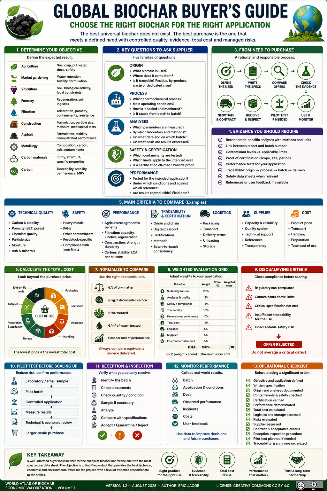

# Chapter 5 — Global Biochar Buyer's Guide

> **World Atlas of the Economic Valorization of Biochar — Volume 1**  
> Version 1.2 — August 2026 · Author: Eric Jacob

**[← Risk Management](ch5_en_risk_management.md) · [↑ Atlas Contents](README_en.md) · [Carbon Metrology →](ch5_en_carbon_metrology.md)**

---

## Choosing the Right Biochar for the Right Application

Buying biochar may appear simple. In reality, two products sold at the same price can have very different properties and performance depending on the biomass, thermochemical process, production conditions, cooling, storage, particle size and, above all, **the intended application**.

> **There is no universally best biochar. The best purchase is the one that meets a defined need with controlled quality, evidence, total cost and risks.**

This guide proposes a rational method for preparing a purchase, comparing offers and checking what is actually delivered. :contentReference[oaicite:2]{index=2}

<figure>

<figcaption><strong>Figure 1 — Biochar Buyer's Guide: choose, verify and monitor.</strong> Responsible purchasing connects the intended use, batch quality, analyses, traceability, total cost and actual observed performance. Numerical thresholds shown in the infographic are illustrative: applicable requirements must be determined according to the intended use and selected framework. © Eric Jacob 2026 — World Atlas of Biochar — CC BY 4.0. <a href="ch5_en_buyer_guide.png">View full-size infographic</a></figcaption>
</figure>

---

## 1. First Question: What Is Your Objective?

Before comparing technical data sheets, the desired result must be defined.

| Application | Main Questions |
|---|---|
| Agriculture | soil, crop, pH, water, dose, safety |
| Market gardening | water retention, fertility, formulation |
| Viticulture | soil, biological activity, local constraints |
| Forestry | regeneration, soil, logistics |
| Filtration | adsorption, porosity, contaminants, resistance |
| Construction | formulation, particle size, moisture, mechanical tests |
| Asphalt | formulation, stability, demonstrated performance |
| Metallurgy | composition, carbon, ash, contaminants |
| Carbon materials | purity, structure, specific properties |
| Carbon | traceability, stability, permanence, MRV |

A criterion that is essential for filtration may be secondary for agricultural soil. A mineral content that is useful for one application may be undesirable for another. :contentReference[oaicite:3]{index=3}

---

## 2. Define the Specification Before Asking for a Price

The buyer should specify:

- exact application;
- quantity;
- frequency and schedule;
- delivery location;
- packaging;
- required particle size;
- storage and handling constraints;
- analytical requirements;
- certification, where applicable;
- batch acceptance criteria;
- required documentation.

This prevents offers that do not meet the same need from being compared.

---

## 3. Questions to Ask the Supplier

The Atlas's initial guide proposed ten questions. They remain an excellent basis, but they can be structured into five families.

### Origin

Ask:

- What biomass is used?
- Where does it come from?
- Is the feedstock traceable?
- Is it a residue, by-product, waste or dedicated crop?
- Does its origin change between batches?

### Process

Ask:

- Which thermochemical process is used?
- What are the main operating conditions?
- How is the biochar cooled?
- Are production parameters monitored?
- Is the process stable from batch to batch?

### Analyses

Ask:

- Which parameters are measured?
- By which laboratory?
- According to which methods?
- On what date?
- On which batch or group of batches?
- On what basis are results expressed: dry matter, wet matter or another basis?

### Safety and Certification

Ask:

- Which contaminants have been tested?
- Which limits apply to the intended use?
- Is a certification claimed?
- Can the corresponding certificate be supplied?
- Does it apply to this product, this facility and this period?

### Performance

Ask:

- Has the product been tested for the intended application?
- Under which conditions?
- Against which reference?
- Are the results reproducible?
- Are field, pilot or industrial data available?

---

## 4. Require Batch-Linked Analyses

A generic technical data sheet is useful, but it does not necessarily describe the material actually delivered.

The buyer should distinguish between:

```text
TYPICAL PRODUCT DATA
          ≠
BATCH-SPECIFIC ANALYSIS
```

For strategic or high-risk applications, the link between the analytical report and the purchased batch becomes essential.

This principle is central to the **[Digital Biochar Passport](ch5_en_biochar_passport.md)**.

---

## 5. Check Units and Measurement Bases

A figure without a clear unit or analytical basis may be misleading.

For example:

```text
CARBON = 75%
```

is incomplete if it does not specify:

- total or organic carbon;
- wet or dry basis;
- analytical method;
- sampling conditions.

The same discipline applies to moisture, ash, surface area, contaminants and nutrients.

---

## 6. Do Not Confuse Different Forms of Carbon

Several concepts are often mixed together:

- total carbon;
- organic carbon;
- fixed carbon;
- stable carbon;
- durable carbon;
- CO₂ equivalent;
- certified net carbon removal.

These values are not interchangeable.

A buyer purchasing biochar for carbon-storage purposes should therefore require a much more detailed carbon characterization than a buyer interested primarily in a physical function.

See **[Carbon Metrology](ch5_en_carbon_metrology.md)**.

---

## 7. Contaminants: Start from the Intended Use

The relevant contaminant list depends on the biomass and final application.

Potential parameters may include:

- heavy metals;
- PAHs;
- organic contaminants;
- feedstock-specific compounds;
- emerging contaminants when relevant.

A value should always be interpreted relative to:

```text
MEASUREMENT
   +
METHOD
   +
APPLICABLE LIMIT
   +
INTENDED USE
```

Safety is not a characteristic that can be compensated for by a low price or excellent technical performance.

---

## 8. Certification: Verify the Exact Claim

The word *certified* should trigger several questions:

- certified by whom?
- according to which framework?
- which version?
- for which product?
- for which production site?
- for which period?
- what exactly is covered by the certification?

A logo on a brochure is not sufficient evidence.

The buyer should request the underlying document and verify its scope.

See **[Standards and Certifications](ch4_en_certifications.md)**.

---

## 9. Performance Must Correspond to the Application

A biochar may be excellent in one market and ordinary in another.

Examples:

**Agriculture:** field or pot trials, water behaviour, nutrient interactions.

**Filtration:** adsorption capacity, kinetics, column tests, saturation and regeneration.

**Construction:** mechanical tests, formulation, durability, water and thermal behaviour.

**Carbon:** stability, traceability, permanence and net life-cycle balance.

A spectacular property that is irrelevant to the intended use should not dominate the purchase decision.

---

## 10. Compare Like with Like

Two quotations can appear comparable while including different services.

The buyer should normalize:

- quantity;
- moisture basis;
- packaging;
- particle size;
- delivery conditions;
- transport;
- analyses;
- certification;
- technical support;
- taxes and duties where applicable.

A price of `€/t` only becomes meaningful once the tonne itself is clearly defined.

---

## 11. Moisture Changes the Real Price

If a product is purchased by gross mass, water can materially affect the economic comparison.

For a gross mass \(M_b\) and moisture mass fraction \(H\):

\[
M_{dry}=M_b(1-H)
\]

The cost per tonne of dry matter is therefore more informative in many comparisons than the cost per gross tonne.

A wetter product may appear cheaper while actually delivering less dry biochar.

---

## 12. Particle Size Has Economic Consequences

Particle size influences:

- dust;
- handling;
- mixing;
- transport;
- flow through filters;
- contact surface;
- application equipment;
- compaction;
- storage.

Grinding, screening, granulation or pelletizing also have a cost.

A buyer should therefore avoid specifying an unnecessarily narrow particle-size range unless the application genuinely requires it.

---

## 13. Packaging and Logistics

Biochar may be supplied:

- in bulk;
- in big bags;
- in smaller bags;
- in granules;
- in pellets;
- in other forms adapted to the application.

The best solution depends on volume, distance, unloading equipment, dust constraints and final use.

Logistics are part of the product's total economic and environmental performance.

---

## 14. Calculate the Total Cost

The purchase price is only one component.

A more complete calculation is:

```text
PRODUCT PRICE
+ PACKAGING
+ TRANSPORT
+ INSURANCE
+ HANDLING
+ STORAGE
+ PREPARATION
+ APPLICATION
+ ANALYSES
+ LOSSES
+ END-OF-LIFE COSTS WHERE RELEVANT
=
TOTAL COST OF USE
```

This total can reverse the apparent ranking between suppliers.

---

## 15. Choose the Right Economic Unit

The appropriate economic unit depends on the service delivered.

Depending on the case, compare:

- €/t of dry matter;
- €/kg of documented carbon;
- €/ha treated;
- €/m³ of material;
- €/m³ of water treated;
- cost per unit of performance;
- life-cycle cost.

An indicator should not create artificial precision when performance has not been sufficiently demonstrated. :contentReference[oaicite:4]{index=4}

---

## 16. The Supplier Is Part of the Product

The buyer must also assess the supplier's ability to deliver reliably over time.

Points to examine include:

- production capacity;
- stability of supply;
- quality system;
- traceability;
- references;
- technical support;
- complaint management;
- operational robustness;
- transparency;
- ability to provide comparable batches over time.

For a strategic contract, a reliable partnership may be worth more than a small price difference. :contentReference[oaicite:5]{index=5}

---

## 17. Evaluate Batch-to-Batch Variability

An exceptional sample does not demonstrate industrial consistency.

When justified by the stakes involved, requesting several historical analyses makes it possible to examine:

- average;
- dispersion;
- trends;
- changes in biomass;
- changes in process;
- frequency of non-conformities.

Quality consistency can become a purchasing criterion in its own right.

---

## 18. Contract: Turn Promises into Verifiable Criteria

A contract may specify:

- specification;
- analytical method;
- tolerances;
- sampling;
- transfer point;
- delivery conditions;
- documentation;
- acceptance criteria;
- counter-analysis procedure;
- treatment of non-conformity;
- responsibilities;
- traceability.

A phrase such as "high-quality biochar" is difficult to enforce. A measurable requirement associated with a defined method is far more useful. :contentReference[oaicite:6]{index=6}

---

## 19. Reception and Inspection

Upon delivery:

```text
IDENTIFY THE BATCH
      ↓
CHECK DOCUMENTS
      ↓
CHECK QUANTITY / CONDITION
      ↓
SAMPLE IF NECESSARY
      ↓
ANALYZE
      ↓
COMPARE WITH SPECIFICATIONS
      ↓
ACCEPT / QUARANTINE / REJECT
```

Inspection should be proportionate to the risk, volume and application.

---

## 20. Storage and Handling

Purchasing does not end when the material is unloaded.

The following must be anticipated:

- moisture;
- dust;
- ventilation;
- temperature;
- cross-contamination;
- packaging stability;
- fire risk according to product characteristics;
- operator safety.

The **[Risk Management](ch5_en_risk_management.md)** chapter develops this approach. :contentReference[oaicite:7]{index=7}

---

## 21. A Weighted Evaluation Grid

The Atlas's initial `/100` grid can be improved by weighting criteria according to the intended use.

Conceptual example:

| Criterion | Weight | Score /10 | Weighted Score |
|---|---:|---:|---:|
| Suitability for use | 20% |  |  |
| Analyses and quality | 15% |  |  |
| Safety / compliance | 15% |  |  |
| Traceability | 10% |  |  |
| Demonstrated performance | 10% |  |  |
| Total cost | 15% |  |  |
| Logistics | 5% |  |  |
| Supplier | 5% |  |  |
| Environmental impact | 5% |  |  |

If \(w_i\) is the weight of criterion \(i\) and \(n_i\) its score out of 10:

\[
S=\sum_i w_i n_i
\]

The weights must total 1. The maximum score is therefore 10.

This grid is a **decision-support tool**, not a certification. :contentReference[oaicite:8]{index=8}

---

## 22. Disqualifying Criteria

An average can conceal a critical defect.

Before calculating the weighted score, define "stop" criteria:

```text
REGULATORY NON-COMPLIANCE
OR
CONTAMINANT ABOVE APPLICABLE LIMIT
OR
INSUFFICIENT TRACEABILITY FOR THE USE
OR
CRITICAL SPECIFICATION NOT MET
        ↓
OFFER REJECTED
```

A very low price therefore cannot mathematically compensate for a defect that is incompatible with the intended use.

---

## 23. Pilot Testing Before Scaling Up

When the application is new or the planned volumes are large, a pilot test can reduce risk.

A rational progression is:

```text
LABORATORY / SMALL SAMPLE
          ↓
PILOT BATCH
          ↓
CONTROLLED APPLICATION
          ↓
MEASUREMENT OF RESULTS
          ↓
TECHNICAL + ECONOMIC REVIEW
          ↓
LARGER-SCALE PURCHASE
```

The pilot should reproduce the future operating conditions as closely as possible.

A successful laboratory test alone does not guarantee industrial or field performance.

---

## 24. Use the Digital Passport — Without Delegating the Purchase Decision to It

The **[Digital Biochar Passport](ch5_en_biochar_passport.md)** can centralize:

- batch identity;
- origin;
- technical characteristics;
- analyses;
- methods;
- certifications;
- uses;
- documents;
- history.

The buyer must nevertheless retain their own contractual file and inspection records. :contentReference[oaicite:9]{index=9}

---

## 25. Detect Warning Signs

Some signals justify more thorough verification:

- no recent analysis;
- results without method or unit;
- confusion between fixed carbon and durable carbon;
- certification mentioned without supporting document;
- vague biomass origin;
- extraordinary performance claims without testing;
- incomparable prices because delivery conditions differ;
- refusal to provide traceability;
- frequent specification changes without explanation.

A warning sign does not automatically indicate fraud. It means that additional evidence is required.

---

## 26. Common Traps

### "More carbon is always better"

False: it depends on the application, stability, contaminants and other properties.

### "Higher BET surface area means better biochar"

False: specific surface area is decisive only for certain applications and does not alone predict actual performance.

### "Certified means optimal"

False: certification verifies a defined scope.

### "The cheapest product is the most economical"

False: total cost can reverse the ranking.

### "Natural means risk-free"

False: a bio-based material may contain undesirable substances or be unsuitable for an application.

### "One successful test proves all applications"

False: performance remains context-dependent. :contentReference[oaicite:10]{index=10}

---

## 27. Monitor Performance After Purchase

Purchasing becomes more intelligent when real-world results are retained:

```text
BATCH
+ APPLICATION
+ CONDITIONS
+ DOSE
+ PERFORMANCE
+ INCIDENTS
+ COSTS
+ USER FEEDBACK
```

This information makes it possible to compare suppliers over time and, where it can be shared, can contribute to the **[Digital Twin](ch5_en_digital_twin.md)** and **[Global Observatory](ch5_en_global_observatory.md)**. :contentReference[oaicite:11]{index=11}

---

## 28. Operational Checklist

Before placing a significant order:

- [ ] objective and application defined;
- [ ] written specification;
- [ ] biomass origin documented;
- [ ] recent analysis available;
- [ ] methods and units specified;
- [ ] relevant contaminants checked;
- [ ] certification verified where required;
- [ ] performance demonstrated for the intended use;
- [ ] total cost calculated;
- [ ] transport and storage assessed;
- [ ] risks evaluated;
- [ ] supplier assessed;
- [ ] contractual acceptance criteria defined;
- [ ] reception inspection procedure established;
- [ ] pilot test planned where necessary;
- [ ] traceability and archiving organized. :contentReference[oaicite:12]{index=12}

---

## Conclusion

The development of the global biochar market will depend as much on product quality as on trust between producers, buyers, laboratories, certifiers and users.

That trust requires:

- transparent data;
- analyses linked to batches;
- explicit methods;
- complete traceability;
- performance demonstrated in the context of use;
- verifiable contracts;
- post-purchase monitoring.

> **A well-informed buyer looks neither for the cheapest biochar nor for the one with the most spectacular technical data sheet. The objective is to find the product that provides the best technical, economic and environmental value for the project, with a level of evidence proportionate to the stakes.** :contentReference[oaicite:13]{index=13}

---

## Figure and Associated Documents

- [Infographic — Buyer's Guide](ch5_en_buyer_guide.png)
- [Buyer Checklist — SVG](ch5_en_buyer_checklist.svg)
- [Decision Tree — SVG](ch5_en_decision_tree.svg)
- [Offer Comparison — SVG](ch5_en_offer_comparison.svg)
- [Parameters — SVG](ch5_en_parameters.svg)
- [Buyer Passport — SVG](ch5_en_buyer_passport.svg)
- [Risk Management](ch5_en_risk_management.md)
- [Carbon Metrology](ch5_en_carbon_metrology.md)
- [Digital Passport](ch5_en_biochar_passport.md)
- [Life Cycle Assessment](ch4_en_life_cycle_assessment.md)

---

**[← Risk Management](ch5_en_risk_management.md) · [↑ Atlas Contents](README_en.md) · [Carbon Metrology →](ch5_en_carbon_metrology.md)**

---

*World Atlas of the Economic Valorization of Biochar — Eric Jacob — Version 1.2 — August 2026*  
*License: Creative Commons CC BY 4.0*
