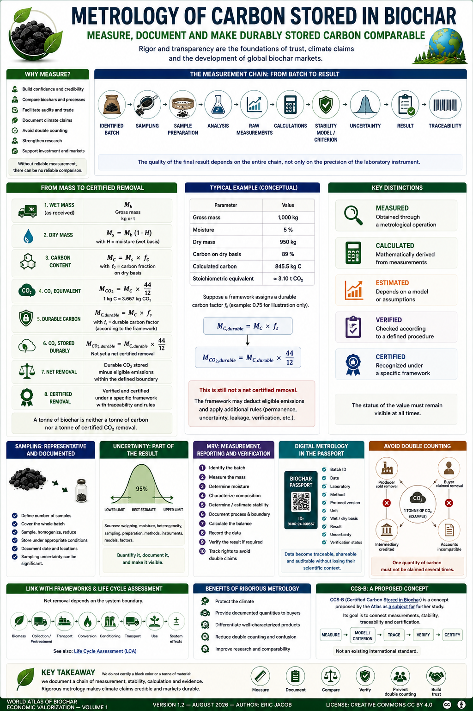

# Chapter 5 — Metrology of Carbon Stored in Biochar

> **World Atlas of the Economic Valorization of Biochar — Volume 1**  
> Version 1.2 — August 2026 · Author: Eric Jacob

**[← Buyer's Guide](ch5_en_buyer_guide.md) · [↑ Atlas Contents](README_en.md) · [Digital Twin →](ch5_en_digital_twin.md)**

---

## Introduction

The development of the biochar market rests on a fundamental question:

> **How much carbon is actually immobilized, for how long, and with what uncertainty?**

Two biochars of identical mass can have very different moisture contents, ash contents, chemical compositions, stability and storage durations. Measuring biochar mass alone is therefore insufficient.

Metrology must distinguish **what is measured**, **what is calculated**, **what is estimated by a model**, and **what is ultimately verified or certified**.

<figure>

<figcaption><strong>Figure 1 — Metrology of carbon stored in biochar.</strong> Measure, document and make durably stored carbon comparable. © Eric Jacob 2026 — World Atlas of Biochar — CC BY 4.0. <a href="ch5_en_carbon_metrology.png">View full-size infographic</a></figcaption>
</figure>

---

## Why Measure?

Rigorous metrology makes it possible to:

- improve confidence;
- compare biochars and processes;
- improve scientific reproducibility;
- facilitate audits and international trade;
- properly document climate claims;
- reduce the risk of double counting.

Measurement quality therefore becomes an invisible infrastructure of the value chain:

> **without reliable measurement, there can be no reliable comparison; without reliable comparison, confidence, financing and markets remain fragile.**

---

## The Main Quantities

Each batch should at minimum specify the basis on which results are expressed.

| Parameter | Unit / Expression |
|---|---|
| Gross mass | kg or t |
| Moisture | % |
| Dry mass | kg or t |
| Ash | % dry matter |
| Total carbon | % according to method |
| Organic carbon | % according to method |
| Fixed carbon | % according to method |
| H/Corg | atomic ratio |
| O/Corg | atomic ratio |
| Estimated durable carbon | kg C or t C |
| CO₂ equivalent | kg CO₂e or t CO₂e |

**One tonne of biochar is therefore neither one tonne of carbon nor one tonne of CO₂ removed from the atmosphere.** :contentReference[oaicite:2]{index=2}

---

## From Wet Mass to Dry Mass

For a gross mass \(M_b\) and a moisture mass fraction \(H\):

$$
M_s = M_b(1-H)
$$

where \(M_s\) is the dry mass.

Example: a batch of **1,000 kg** containing 5% moisture has:

$$
M_s = 1000 \times (1-0.05)=950\ \text{kg}
$$

The wet or dry basis must always be specified in order to avoid artificially distorted comparisons.

---

## From Dry Mass to Carbon

If the mass fraction of carbon measured on a dry-matter basis is \(f_C\):

$$
M_C=M_s\times f_C
$$

With 950 kg of dry matter and 89% carbon:

$$
M_C=950\times0.89=845.5\ \text{kg C}
$$

This quantity describes the carbon corresponding to the batch according to the analytical method used.

It does **not**, by itself, constitute a certified durable atmospheric carbon removal.

---

## Carbon and CO₂ Equivalent

The stoichiometric conversion between carbon and carbon dioxide is based on their molar masses:

$$
M_{CO_2}=M_C\times\frac{44}{12}
$$

Thus:

$$
1\ \text{kg C}\approx3.667\ \text{kg CO}_2
$$

In the previous example:

$$
845.5\times\frac{44}{12}\approx3,100\ \text{kg CO}_2
$$

or approximately **3.10 t CO₂**. :contentReference[oaicite:3]{index=3}

This is a **stoichiometric equivalent**. It must not automatically be presented as 3.10 tonnes of certified net CO₂ removal.

---

## Total Carbon and Fixed Carbon

**Total carbon** represents the amount of carbon present in the sample according to the analytical method used.

**Fixed carbon** is a quantity derived from proximate analysis and characterizes the solid carbonaceous fraction remaining after accounting for volatile matter and ash according to the selected protocol.

A high fixed-carbon content may be consistent with a highly carbonized biochar, but it is not, by itself, sufficient evidence of very long-term permanence.

The distinction is fundamental:

```text
CARBON PRESENT
      ≠
CARBON DEMONSTRATED TO BE DURABLY STORED
```

---

## Atomic Ratios

The **H/Corg** and **O/Corg** atomic ratios are widely used to characterize the degree of carbonization and chemical structure of biochar.

Lower ratios are generally associated with a more aromatic structure and greater resistance to degradation.

They are useful indicators, but their interpretation must remain linked to the analytical framework and the other characteristics of the product.

---

## Stability: Moving from Quantity to Duration

The climate question is not simply:

> How much carbon does this tonne of biochar contain?

It is also:

> **What fraction of this carbon can reasonably be considered durably stored?**

Stability can be assessed using several types of information:

- chemical characteristics;
- atomic ratios;
- production conditions;
- recognized methods for assessing permanence;
- certification frameworks;
- available experimental data.

No single indicator should be presented as universal proof independently of context.

---

## The Measurement Chain

The quality of the final result depends on the entire chain, not merely on the precision of the laboratory instrument.

```text
IDENTIFIED BATCH
      ↓
SAMPLING
      ↓
SAMPLE PREPARATION
      ↓
ANALYSIS
      ↓
RAW MEASUREMENTS
      ↓
CALCULATIONS
      ↓
STABILITY MODEL / CRITERION
      ↓
UNCERTAINTY
      ↓
RESULT
      ↓
TRACEABILITY
```

A highly precise analysis performed on an unrepresentative sample can produce a precise value that nevertheless poorly represents the actual batch.

---

## Sampling

Biochar may be heterogeneous in terms of particle size, moisture, ash content or degree of carbonization.

Sampling must therefore be:

- representative;
- reproducible;
- documented;
- appropriate to the size and heterogeneity of the batch.

The documentation should notably record:

- batch size;
- number of samples;
- sampling method;
- sampling locations;
- homogenization;
- sample reduction;
- storage conditions;
- sampling date.

Sampling uncertainty may differ from analytical uncertainty and may sometimes dominate it. :contentReference[oaicite:4]{index=4}

---

## Laboratories and Comparability

Global comparability requires results to remain linked to:

- an identifiable laboratory;
- an analytical method;
- an instrument or instrument family;
- a protocol;
- a date;
- the version of the applicable framework;
- quality-control procedures.

Where several methods are accepted, the method used must remain attached to the result.

Global metrology does not necessarily mean that a single protocol must be used everywhere. It means that differences between protocols must be sufficiently documented for the results to be interpreted correctly.

---

## Uncertainty Is Part of the Result

Every measurement contains uncertainty.

It may arise from:

- weighing;
- moisture determination;
- batch heterogeneity;
- sampling;
- sample preparation;
- analytical methods;
- instruments;
- the stability model;
- factors used in calculations.

Where several quantities contribute to a calculated result, their uncertainties should be propagated using an appropriate method.

A value on its own is less informative than a value accompanied by its method, calculation basis, date and uncertainty.

The objective is not to eliminate all uncertainty, but to **quantify it, document it and make it visible**. :contentReference[oaicite:5]{index=5}

---

## Measured, Calculated, Estimated, Verified, Certified

The vocabulary must prevent shifts in meaning:

```text
MEASURED
→ obtained through a metrological operation

CALCULATED
→ mathematically derived from measurements

ESTIMATED
→ depends on a model or assumptions

VERIFIED
→ checked according to a defined procedure

CERTIFIED
→ recognized according to a specified framework
```

This distinction is also used in the **[Global Observatory](ch5_en_global_observatory.md)**.

---

## From Physical Carbon to Net Removal

The carbon contained in biochar represents only part of the climate balance.

Depending on the framework and system boundary selected, net removal may need to account for:

```text
DURABLE CARBON IN BIOCHAR
− COLLECTION AND PRETREATMENT
− BIOMASS TRANSPORT
− PROCESS EMISSIONS
− CONDITIONING
− BIOCHAR TRANSPORT
− IMPLEMENTATION
± ELIGIBLE SYSTEM EFFECTS
= NET REMOVAL ACCORDING TO THE FRAMEWORK
```

The system boundaries must therefore be explicit.

This metrology is directly connected to **[Life Cycle Assessment](ch4_en_life_cycle_assessment.md)**. :contentReference[oaicite:6]{index=6}

---

## Avoided Emissions: Do Not Assume Them

Thermolysis can produce heat, gas or other co-products capable of replacing other sources of energy or materials.

However, an emission described as "avoided" should only be counted if the reference scenario and actual substitution can be demonstrated according to the selected methodology.

The same benefit must not be attributed more than once to several products or actors.

---

## The Risk of Double Counting

The same quantity of carbon must not simultaneously become:

- a removal sold by the producer;
- a removal claimed again by the buyer;
- a credit attributed to an intermediary;
- a reduction reused within an incompatible accounting framework.

The **[Digital Biochar Passport](ch5_en_biochar_passport.md)** can help preserve the identity of the batch, its history and its associated statuses. :contentReference[oaicite:7]{index=7}

---

## MRV: Measurement, Reporting and Verification

An **MRV — Measurement, Reporting and Verification** architecture can connect physical material to climate claims:

1. identify the batch;
2. measure its mass;
3. determine its moisture content;
4. characterize its composition;
5. determine or estimate its stability according to the applicable framework;
6. document the process and system boundary;
7. calculate the balance;
8. record the data;
9. have the result verified where necessary;
10. track associated rights to prevent double claims.

MRV does not replace measurement:

> **MRV organizes the evidence.**

---

## Digital Metrology

Each analytical result could be recorded in the digital passport together with:

- batch identifier;
- date;
- laboratory;
- method;
- protocol version;
- unit;
- wet or dry basis;
- result;
- uncertainty;
- verification status.

Scientific and commercial traceability would thereby be strengthened.

The data become **traceable, shareable and auditable without losing their scientific context**. :contentReference[oaicite:8]{index=8}

---

## Atlas Proposal: CCS-B

The Atlas proposes, as a subject for further study, a complementary quantity:

> **CCS-B — Certified Carbon Stored in Biochar**

It would represent a quantity of carbon whose durable storage is documented through measurements, an explicit stability criterion or model, a defined system boundary, traceability and, where necessary, independent verification.

**CCS-B is not an existing international standard.**

Its conceptual purpose is to preserve the distinction:

```text
BIOCHAR MASS
≠
CARBON MASS
≠
STABLE CARBON
≠
NET REMOVAL
≠
CERTIFIED REMOVAL
```

The concept is a prospective proposal by Eric Jacob intended to connect metrology, permanence, certification and traceability without confusing these different levels of evidence. :contentReference[oaicite:9]{index=9}

---

## Complete Conceptual Example

| Parameter | Value |
|---|---:|
| Gross mass | 1,000 kg |
| Moisture | 5% |
| Dry mass | 950 kg |
| Carbon on dry matter | 89% |
| Calculated carbon | 845.5 kg C |
| Stoichiometric equivalent | ≈ 3.10 t CO₂ |

Now suppose, **for educational purposes only**, that a framework assigns a durable-carbon factor \(f_s\).

$$
M_{C,durable}=M_C\times f_s
$$

then:

$$
M_{CO_2,durable}=M_{C,durable}\times\frac{44}{12}
$$

The result still does not automatically equal net certified removal.

The applicable framework may subsequently require deduction of eligible value-chain emissions and application of additional rules concerning permanence, uncertainty, leakage, verification or other factors.

This example therefore illustrates the **measurement chain**, not a universal carbon-credit formula. :contentReference[oaicite:10]{index=10}

---

## Confidence Level

Not all results carry the same evidential weight.

A metrological system can distinguish, for example:

```text
DIRECT MEASUREMENT
        ↓
CALCULATED QUANTITY
        ↓
MODEL-BASED ESTIMATE
        ↓
INDEPENDENTLY VERIFIED RESULT
        ↓
CERTIFIED RESULT UNDER A DEFINED FRAMEWORK
```

The status of the value must remain visible whenever it is stored, exchanged or aggregated.

A highly precise numerical display should never create a false level of confidence.

---

## From the Laboratory to the Digital Twin

Metrological data are essential inputs for the **[Digital Twin](ch5_en_digital_twin.md)**.

```text
LABORATORY MEASUREMENTS
        +
PROCESS DATA
        +
BATCH PASSPORT
        ↓
DIGITAL TWIN
        ↓
COMPARISON
SIMULATION
DRIFT DETECTION
CONTINUOUS IMPROVEMENT
```

The digital model must never transform an estimate into a measurement.

The origin and status of each data point must remain visible. :contentReference[oaicite:11]{index=11}

---

## Toward the Global Observatory

At a larger scale, aggregated data can feed the **[Global Biochar Observatory](ch5_en_global_observatory.md)**.

The Observatory could distinguish:

```text
MEASURED PHYSICAL CARBON
ESTIMATED STABLE CARBON
CERTIFIED REMOVAL
CREDIT ISSUED
CREDIT SOLD
CREDIT RETIRED
```

This separation can help reduce confusion and double counting. :contentReference[oaicite:12]{index=12}

---

## Automation Without a Black Box

Calculation and data-management systems can automate part of the chain.

But automation must not make the result impossible to reconstruct.

It should remain possible to trace:

```text
SOURCE DATA
→ METHOD
→ VERSION
→ CALCULATION
→ UNCERTAINTY
→ RESULT
```

If a model, coefficient or methodological rule changes, the historical calculation should remain reproducible.

---

## Benefits of Rigorous Carbon Metrology

Rigorous metrology simultaneously protects:

- **the climate**, by avoiding the accounting of carbon that is not genuinely durable;
- **the buyer**, by providing a documented quantity;
- **serious producers**, by distinguishing correctly characterized products;
- **the market**, by reducing double counting and misleading comparisons;
- **research**, by improving reproducibility and comparability. :contentReference[oaicite:13]{index=13}

---

## Conclusion

The development of biochar will not depend solely on advances in thermolysis processes.

It will also depend on the ability of stakeholders to **measure, document, compare and verify** the quantity of carbon durably stored.

> **We do not certify a black color or a tonne of material: we document a chain of measurement, stability, calculation and evidence.**

The **CCS-B** concept is proposed as a subject for further study and not as an existing standard. It seeks to bring together the requirements of research, industry and carbon markets while maintaining a clear distinction between physical measurement, permanence estimation and certification. :contentReference[oaicite:14]{index=14}

---

## Figure and Associated Documents

- [Infographic — Carbon Metrology](ch5_en_carbon_metrology.png)
- [Digital Biochar Passport](ch5_en_biochar_passport.md)
- [Life Cycle Assessment](ch4_en_life_cycle_assessment.md)
- [Global Observatory](ch5_en_global_observatory.md)
- [Global Research](ch5_en_global_research.md)

---

**[← Buyer's Guide](ch5_en_buyer_guide.md) · [↑ Atlas Contents](README_en.md) · [Digital Twin →](ch5_en_digital_twin.md)**

---

*World Atlas of the Economic Valorization of Biochar — Eric Jacob — Version 1.2 — 2026*  
*License: Creative Commons CC BY 4.0*
