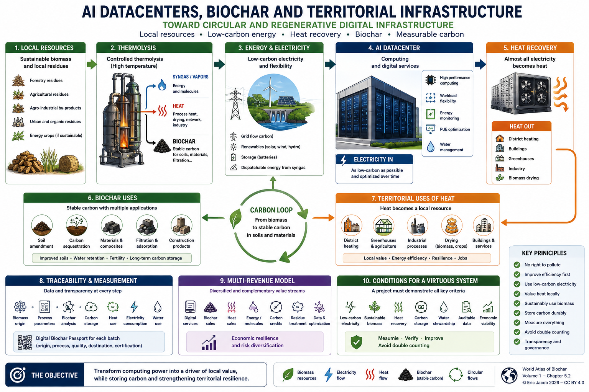

# Chapter 5.2 — AI Datacenters, Biochar and Territorial Infrastructure

> **World Atlas of the Economic Valorization of Biochar — Volume 1**  
> Version 1.2 — August 2026  
> Author: Eric Jacob

**[← Ideal Biochar](ch5_en_biochar_ideal.md) · [↑ Atlas Contents](README_en.md) · [Digital Passport →](ch5_en_biochar_passport.md)**

---

## Summary

The rise of artificial intelligence is increasing demand for computing power, electricity, cooling and infrastructure. A central question therefore emerges: **can a datacenter be designed as a component of a circular territory rather than as an isolated energy consumer?**

The model proposed here combines, where local conditions allow:

- low-carbon electricity;
- residual or sustainable biomass;
- controlled thermolysis or pyrolysis;
- biochar production;
- valorization of gases and heat;
- recovery of datacenter waste heat;
- agricultural, industrial or territorial uses;
- measurement and traceability of carbon flows.

This is a **prospective architecture**, not a claim that a datacenter automatically becomes carbon-neutral or carbon-negative simply because it is associated with biochar.

---

## Overview

The following figure summarizes the proposed model.



*Figure 1 — AI Datacenter + Biochar: links between local resources, thermochemical conversion, computing, heat recovery, carbon storage and traceability. Click the image to open it at full resolution.*

**[Enlarge PNG infographic](ch5_en_datacenters.png)**

---

## 1. The Datacenter as Territorial Infrastructure

A datacenter converts almost all the electricity it consumes into heat. This heat is frequently regarded as a cooling constraint; it can also become a **territorial resource**, provided that a suitable use exists nearby.

Potential outlets include:

- district-heating networks;
- buildings;
- agricultural greenhouses;
- drying of biomass or materials;
- certain industrial processes;
- cooling production or temperature upgrading through heat pumps when justified by the energy balance.

Geographical proximity is essential: transporting heat over long distances can eliminate part of its economic value.

---

## 2. Why Introduce a Biochar Value Chain?

A thermolysis system can convert certain residual biomass resources into several flows.

**Biochar** retains part of the original carbon in a more stable form. Depending on its quality, it can be used in soils, materials, filtration or other applications.

**Gases and vapors** produced by the process can contribute to the system's energy requirements or undergo further conversion depending on the selected technology.

**Heat** can be used for biomass drying, industrial applications or a thermal network.

The model becomes particularly interesting when several of these flows simultaneously find local outlets.

### Technology Example: Haffner Energy

Haffner Energy has been developing biomass thermolysis solutions for more than thirty years. Its current documentation presents, depending on configuration, renewable syngas, hydrogen, methanol and biocarbon, together with biomass/biochar expertise ranging from feasibility studies to process optimization.

The Atlas considers here **the technological and methodological principle, not a universal performance level**: capacity, efficiency, biochar quality and carbon balance must be calculated for the biomass and configuration actually selected.

---

## 3. Biomass: A Resource, Not an Infinite Resource

The renewable nature of biomass alone is not sufficient to guarantee the sustainability of a project.

A serious deployment must examine:

- feedstock origin;
- competing uses;
- collection distances;
- moisture and drying requirements;
- preservation of organic matter in soils;
- biodiversity;
- resource renewal;
- risks associated with poorly adapted dedicated crops.

Forestry, agricultural or industrial residues can be valuable when they are genuinely available and when sufficient organic matter remains within ecosystems.

### Biomass-Agnostic Does Not Mean Uncharacterized Biomass

A technology capable of processing highly diverse biomass resources does not imply that every material can be accepted without prior study. Haffner Energy describes preliminary expertise including feasibility studies, heat and mass balances, testing and process-parameter optimization; its Vitry-Marolles center was designed to test biomass supplied by customers and prospects.

Moisture, ash, salts, minerals, metals, chlorine, tar behavior and other properties can affect yield, corrosion, emissions and biochar quality. A resource may therefore be accepted, accepted under specific conditions — blending, preparation or adapted parameters — or rejected.

Marine biomass illustrates this logic. Problematic algae or sargassum may constitute a potential resource, but their water content, salts, mineral fraction and possible contaminants require analysis, possible blending and testing before industrial extrapolation.

```text
RESOURCE → ANALYSES → TESTING → POSSIBLE BLENDING
         → PROCESS ADJUSTMENT → PRODUCT ANALYSIS
         → FEASIBILITY DECISION
```

This discipline avoids an ecological paradox: producing good biochar from a resource obtained through poorly managed cultivation. The priority objective should remain the valorization of waste, residues, co-products and biomass derived from sustainable territorial management.

---

## 4. Electricity and Computing Flexibility

Biochar does not replace the need for electricity that is as decarbonized as possible.

A datacenter could combine:

- the electricity grid;
- solar;
- wind;
- hydropower where available;
- electrical storage;
- local production from energy co-products.

Certain non-urgent computing workloads can also be shifted in time. In the future, control systems could simultaneously take into account electricity prices, carbon intensity, renewable-energy availability, storage and thermal constraints.

Within certain limits, computing therefore becomes **a controllable energy load**.

---

## 5. Waste Heat as a Co-Product of Computing

Bringing computing infrastructure closer to heat consumers is probably one of the most important elements of the model.

The principle is simple:

```text
Electricity
    ↓
Datacenter
    ↓
Computing
    ↓
Heat
    ↓
Recovery
    ↓
Greenhouses / Buildings / Industry / Drying
```

However, feasibility depends on four parameters: **temperature, continuity, distance and seasonality**.

Heat available at a low temperature may require a heat pump. Its value must then be calculated from the complete system rather than from the datacenter alone.

---

## 6. Biochar as Physical Carbon Storage

The climate value of biochar is based on a fundamental difference from simple financial offsetting: a fraction of the carbon contained in biomass can remain physically present in a durable carbonaceous material.

This does not mean that every tonne of biochar automatically corresponds to a fixed quantity of CO₂ removed from the atmosphere.

It is necessary to know, among other factors:

- dry mass;
- organic carbon content;
- carbon stability;
- energy consumed by the process;
- transport;
- biomass preparation;
- final destination of the biochar.

The balance must therefore be established through **life cycle assessment** and according to a recognized carbon methodology when credits are claimed.

---

## 7. Biochar Must Not Become a Right to Pollute

Associating a datacenter with biochar production must not become a mechanism for justifying unlimited energy consumption.

The logical order should remain:

1. improve computing efficiency;
2. use electricity that is as low-carbon as possible;
3. recover heat where relevant;
4. sustainably valorize local resources;
5. measure the carbon actually stored;
6. account only for reductions or removals that can be demonstrated.

Biochar then becomes **one component of the system**, rather than an environmental alibi.

---

## 8. Water and Cooling

Cooling represents another major challenge.

Depending on climate and technology, the project may prioritize:

- closed-loop systems;
- air cooling;
- reuse of compatible water sources;
- heat recovery;
- limiting withdrawals of drinking water.

There is no universal solution. A system appropriate for a cold and humid region may be unsuitable for an arid region.

Water must therefore be included in the territorial balance alongside electricity, biomass and carbon.

---

## 9. A Territorial Loop

The final objective is not merely to produce biochar or power servers.

It is to seek an **industrial symbiosis**:

```text
Local Residues
      ↓
Thermolysis
 ┌────┼──────────┐
 ↓    ↓          ↓
Biochar  Energy   Heat
 ↓       ↓        ↓
Soils  Datacenter Drying / Network
          ↓
       Computing
          ↓
         Heat
          ↓
Greenhouses / Buildings / Industry
```

The more these flows find nearby and complementary outlets, the more efficient the infrastructure can become.

---

## 10. The Digital Layer: Measure in Order to Demonstrate

Such a system produces a large amount of data.

Each biochar batch could be associated with a digital passport containing:

- biomass origin;
- mass and moisture;
- process parameters;
- chemical analyses;
- carbon content;
- product destination;
- certification data.

The datacenter itself can record:

- electricity consumption;
- grid carbon intensity;
- renewable energy production;
- heat recovered;
- heat actually used;
- water consumption;
- cooling performance.

This data layer is essential for preventing **double counting** and environmental claims that cannot be verified.

---

## 11. A Multi-Revenue Economic Model

The viability of such a system should not depend on a single source of revenue.

Depending on the project, several sources may coexist:

| Flow | Potential Valorization |
|---|---|
| Computing | digital / AI services |
| Biochar | agriculture, materials, filtration |
| Heat | district heating, greenhouses, industry |
| Gas / energy | self-consumption or valorization |
| Carbon | certified credits where eligible |
| Territorial services | treatment of certain residues |
| Data | traceability and optimization |

This diversification can improve economic resilience, but each revenue stream must be assessed separately: **theoretical markets should not be added together as though they were guaranteed**.

---

## 12. Where Does This Model Make the Most Sense?

The most interesting sites would probably combine several conditions:

- substantial computing demand;
- relatively low-carbon electricity;
- residual biomass available nearby;
- regular heat demand;
- suitable industrial land;
- high-performance digital connectivity;
- identified outlets for biochar;
- territorial governance capable of coordinating stakeholders.

Site selection therefore becomes a multi-criteria optimization problem.

---

## 13. A Role for Artificial Intelligence

AI itself could contribute to managing the infrastructure that hosts it.

It could forecast:

- renewable-energy production;
- electricity prices;
- computing requirements;
- thermal demand;
- biomass availability;
- maintenance;
- storage capacity.

This creates an interesting loop:

> **Artificial intelligence contributes to the energy and material optimization of its own infrastructure.**

This optimization does not eliminate its physical footprint; it can, however, help reduce it.

---

## 14. Conditions for Describing the System as Virtuous

A project should be able to demonstrate all of the following:

| Criterion | Question |
|---|---|
| Electricity | What is its actual carbon intensity? |
| Biomass | Is it sustainable and additional? |
| Transport | What distances are involved? |
| Biochar | What are its stability and quality? |
| Heat | How much is actually used? |
| Water | What are the net withdrawals? |
| Carbon | How much is durably stored? |
| Data | Are the results auditable? |
| Economics | Does the model work without unrealistic assumptions? |

A system that fails several of these criteria may remain technically interesting without being legitimately described as "carbon-negative."

---

## Conclusion

The datacenter of the future can be conceived as something other than a computing box supplied by an electricity grid and cooled by rejecting its heat.

It can become an **energy and digital node integrated into its territory**.

The biochar value chain adds another dimension: the possibility of transforming certain biomass resources into useful energy while retaining part of their carbon in a stable material.

The value of the model lies precisely in the combination:

**computing + low-carbon energy + valorized heat + sustainable biomass + biochar + measurement.**

None of these elements is sufficient on its own.

Their integration, proximity and verification of flows are what can transform computing infrastructure into a component of a more circular territorial economy.

---

## Further Reading in the Atlas

- [Ideal Biochar](ch5_en_biochar_ideal.md)
- [Digital Biochar Passport](ch5_en_biochar_passport.md)
- [Carbon Metrology](ch5_en_carbon_metrology.md)
- [Territories & Resilience](ch5_en_territories_resilience.md)
- [Digital Twin](ch5_en_digital_twin.md)
- [Risk Management](ch5_en_risk_management.md)
- [2050 Roadmap](ch5_en_roadmap_2050.md)

---

[← Previous article: Ideal Biochar](ch5_en_biochar_ideal.md) · **[↑ Atlas Contents](README_en.md)** · [Next article: Digital Passport →](ch5_en_biochar_passport.md)

---

*World Atlas of the Economic Valorization of Biochar — Eric Jacob — Version 1.2 — 2026*  
*License: Creative Commons CC BY 4.0*
