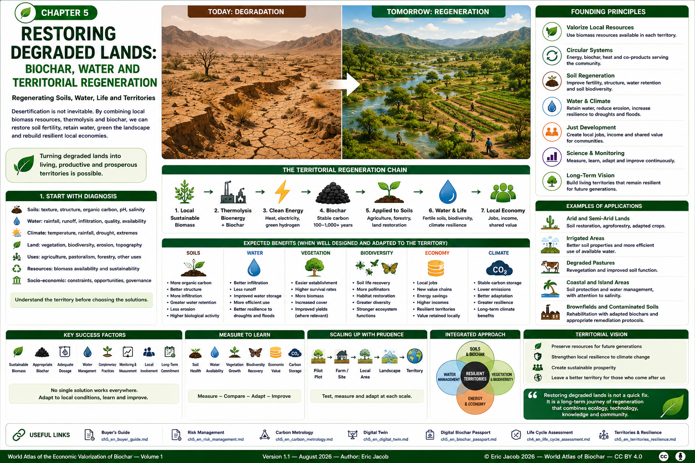

# Chapter 5 — Restoring Degraded Lands: Biochar, Water and Territorial Regeneration

> **World Atlas of the Economic Valorization of Biochar — Volume 1**  
> Version 1.1 — August 2026 · Author: Eric Jacob

**[← Buyer's Guide](ch5_en_buyer_guide.md) · [↑ Atlas Contents](README_en.md) · [Territories & Resilience →](ch5_en_territories_resilience.md)**

---

## Regenerating Soils, Water, Life and Territories

Desertification and land degradation are not a single problem and do not have a universal solution. They result from varying combinations of climate, erosion, loss of organic matter, agricultural practices, pressure on water resources, salinization, wildfires, deforestation, overexploitation or land abandonment.

Biochar therefore does not mechanically "green" a desert. However, **in appropriate soils, climates and agronomic systems**, it can become one component of a broader strategy combining restoration of organic matter, vegetation cover, water management, composts, agroforestry and the circular economy.

The challenge extends beyond amending an individual plot. It consists of organizing a territorial loop in which selected local biomass resources are transformed through thermolysis into **biochar and useful energy flows**, then reintegrated into an economy that progressively restores its soils.



**Figure 1 — Restoring degraded lands: from degraded land to regenerated territories.**  
The infographic illustrates a prospective architecture. Actual performance depends on the soil, climate, biochar, application rate, water availability and management practices. Any numerical values shown are illustrative and should not be interpreted as universal performance levels.  
© Eric Jacob 2026 — World Atlas of Biochar — CC BY 4.0.

---

## 1. Restoration Begins with Diagnosis

Before applying biochar, it is necessary to understand why the territory is degrading.

The diagnosis may include:

- soil texture and structure;
- organic carbon;
- pH;
- salinity;
- water-holding capacity;
- infiltration and runoff;
- wind and water erosion;
- climate and rainfall;
- existing vegetation;
- biodiversity;
- water resources;
- agricultural and pastoral uses;
- actual biomass availability;
- economic and social constraints.

The objective is not to begin with a technological solution and then search for a problem to justify it.

The correct sequence is:

```text
TERRITORY
    ↓
DIAGNOSIS
    ↓
CAUSES OF DEGRADATION
    ↓
AVAILABLE RESOURCES
    ↓
POSSIBLE SOLUTIONS
    ↓
PILOT PROJECT
    ↓
MEASUREMENT
    ↓
ADAPTATION
