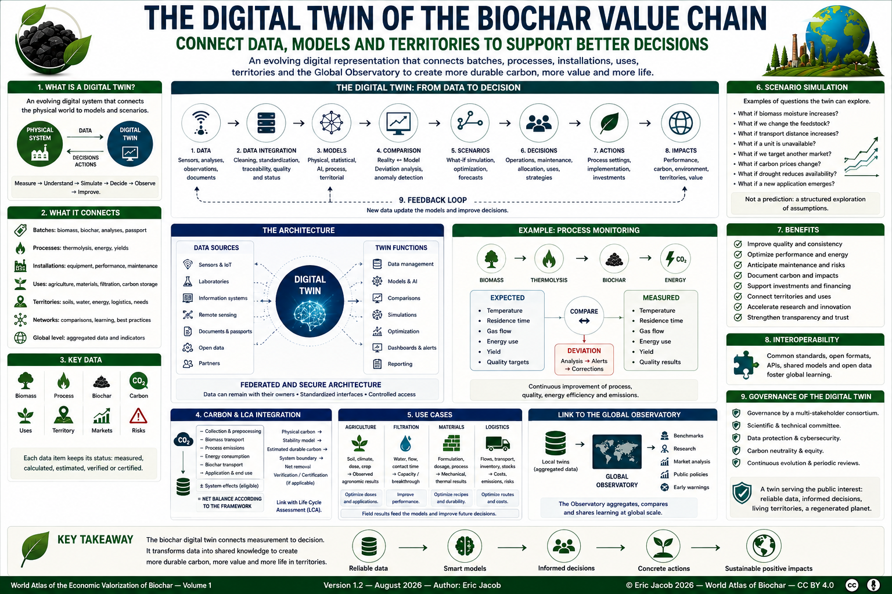

# Chapter 5 — The Digital Twin of the Biochar Value Chain

> **World Atlas of the Economic Valorization of Biochar — Volume 1**  
> Version 1.2 — August 2026 · Author: Eric Jacob

**[← Carbon Metrology](ch5_en_carbon_metrology.md) · [↑ Atlas Contents](README_en.md) · [Global Observatory →](ch5_en_global_observatory.md)**

---

## Connecting Data, Models and Territories to Support Decisions

Advances in sensors, the Internet of Things, information systems, modelling and artificial intelligence make it possible to build evolving digital representations of complex physical systems.

In the biochar value chain, a **digital twin** can connect the biomass batch, thermolysis installation, biochar analyses, energy and logistics flows, end uses, territorial data and observed results.

It is not a perfect copy of reality. It is a digital system **fed by identified data**, capable of comparing the observed state with a model, exploring scenarios and supporting decision-making.

<figure>

<figcaption><strong>Figure 1 — The biochar digital twin: from data to decision.</strong> A prospective architecture connecting measurements, models, processes, territories, uses and scenarios. Numerical values shown in the infographic are illustrative and do not constitute measured global statistics. © Eric Jacob 2026 — World Atlas of Biochar — CC BY 4.0. <a href="ch5_en_digital_twin.png">View full-size infographic</a></figcaption>
</figure>

---

## From a Digital Model to a True Digital Twin

A simple database is not necessarily a digital twin.

```text
PHYSICAL OBJECT
      ↓
DIGITAL DATA
      ↓
DIGITAL MODEL
      ↓
UPDATES FROM REAL-WORLD DATA
      ↓
REALITY ↔ MODEL COMPARISON
      ↓
SIMULATION / PREDICTION
      ↓
DECISION SUPPORT
```

The value of the twin comes from this loop: measurements correct the model, the model identifies anomalies or explores scenarios, and subsequent observations make it possible to evaluate the predictions.

---

## Levels of Representation

| Level | Represented Object | Examples of Data |
|---|---|---|
| Batch | identified biomass or biochar | origin, analyses, moisture, carbon, contaminants |
| Process | thermochemical conversion | temperature, flows, energy, yields |
| Installation | industrial unit | availability, maintenance, emissions, production |
| Site | group of units and flows | heat, storage, logistics, co-products |
| Use | biochar application | dose, formulation, material, filtration |
| Territory | local system | soils, water, biomass, needs, transport, biodiversity |
| Network | several installations | comparisons, learning, resource sharing |
| World | aggregated data | Global Observatory |

These levels do not necessarily have to be merged into a single centralized database. A **federated architecture** can keep sensitive data with their respective owners. :contentReference[oaicite:2]{index=2}

---

## Data Used by the Digital Twin

### Biomass

Origin, category, moisture, particle size, composition, minerals, possible contaminants, collection distance and sustainability status.

An abundant biomass is not automatically a sustainably mobilizable resource.

### Process

Temperatures, residence times, flows, consumption, recovered gases and heat, material yield, measured emissions, shutdowns and maintenance.

### Biochar

Gross and dry mass, carbon, ash, physical properties, H/Corg, contaminants, certifications and quality according to the intended use.

This information can be linked to the **[Digital Biochar Passport](ch5_en_biochar_passport.md)**.

### Carbon

Measured physical carbon, estimated durable carbon, calculation methods, uncertainties, life-cycle data and, where applicable, verification or certification status.

These concepts are developed in **[Carbon Metrology](ch5_en_carbon_metrology.md)**.

### Uses

Agriculture, filtration, construction, materials, carbon storage and other applications generate different performance indicators.

The twin must therefore preserve the context in which a result was obtained.

### Territory

Soils, climate, water, transport, available biomass, energy requirements, industries, infrastructure and biodiversity provide the local context.

A digital twin disconnected from its territory would lose a large part of its decision-making value.

---

## Connecting the Physical and Digital Worlds

The digital twin can be represented as a continuous exchange:

```text
PHYSICAL SYSTEM
      │
      │ sensors, analyses,
      │ observations, audits
      ▼
DIGITAL TWIN
      │
      │ models, comparisons,
      │ forecasts, scenarios
      ▼
DECISION
      │
      │ process settings,
      │ maintenance, allocation,
      │ application strategy
      ▼
PHYSICAL SYSTEM
```

The twin is therefore not merely a visualization interface.

It becomes useful when the digital representation can improve understanding of the physical system and when subsequent observations can verify whether the decision was appropriate.

---

## Data Must Keep Their Status

A digital system can easily place very different values side by side:

- direct measurements;
- laboratory analyses;
- calculated quantities;
- model estimates;
- expert assumptions;
- certified values.

They must not become indistinguishable simply because they appear on the same dashboard.

A robust data model should preserve at least:

```text
VALUE
+ UNIT
+ SOURCE
+ METHOD
+ DATE
+ STATUS
+ UNCERTAINTY
+ VERSION
```

This principle is essential for scientific and commercial credibility.

---

## The Digital Passport as the Batch Identity Layer

The **Digital Biochar Passport** can provide the identity layer of the digital twin.

```text
BATCH ID
   ↓
ORIGIN
   ↓
PROCESS
   ↓
ANALYSES
   ↓
CARBON
   ↓
CERTIFICATIONS
   ↓
USES
   ↓
HISTORY
```

The twin can then connect this batch-level information with process, site and territorial data.

The passport describes and documents the batch.

The twin places it within a dynamic system.

---

## From Process Monitoring to Continuous Improvement

A production twin can compare expected and observed behaviour.

For example:

```text
BIOMASS CHARACTERISTICS
        +
PROCESS SETTINGS
        ↓
EXPECTED OUTPUT
        ↕
MEASURED OUTPUT
        ↓
DEVIATION ANALYSIS
        ↓
PROCESS IMPROVEMENT
```

Possible applications include:

- detecting drift;
- comparing production campaigns;
- anticipating maintenance;
- identifying energy losses;
- improving reproducibility;
- understanding relationships between process conditions and biochar properties.

The model must nevertheless remain subordinate to measurements.

---

## Modelling Biochar Quality

The digital twin could progressively learn relationships between:

```text
BIOMASS
   +
PROCESS
   +
POST-TREATMENT
   ↓
BIOCHAR PROPERTIES
   ↓
PERFORMANCE IN USE
```

This architecture connects directly with the **[Biochar Quality Index](ch5_en_quality_index.md)** and the **[Ideal Biochar](ch5_en_biochar_ideal.md)**.

With sufficient data, it could help determine which production recipe is most likely to achieve a required property profile.

The prediction would remain a hypothesis until verified by measurements.

---

## Digital Twin and Carbon

The carbon component can combine:

- measured batch mass;
- moisture;
- measured carbon;
- stability indicators or models;
- process emissions;
- energy flows;
- transport;
- end use;
- applicable methodological framework.

Conceptually:

```text
PHYSICAL MEASUREMENTS
        ↓
CARBON MODEL
        ↓
ESTIMATED DURABLE CARBON
        ↓
LIFE-CYCLE BOUNDARY
        ↓
ESTIMATED NET BALANCE
        ↓
VERIFICATION / CERTIFICATION
        IF APPLICABLE
```

The twin must preserve the distinction between these stages.

A calculated or modelled value must never silently become a measured or certified value.

---

## Integrating Life Cycle Assessment

The **[Life Cycle Assessment](ch4_en_life_cycle_assessment.md)** can provide another layer of the digital twin.

Instead of producing only a static LCA, a sufficiently instrumented installation could progressively update certain variables:

```text
BIOMASS DISTANCE
ENERGY CONSUMPTION
YIELD
EMISSIONS
TRANSPORT
PRODUCT DISTRIBUTION
```

This would make it possible to explore scenarios while clearly distinguishing measured operational data from generic or modelled LCA assumptions.

---

## Scenario Simulation

One of the most useful functions of a digital twin is the ability to ask:

> **What happens if...?**

Examples:

- biomass moisture increases;
- the feedstock changes;
- transport distance increases;
- a unit is unavailable;
- energy demand changes;
- the biochar is directed toward another market;
- carbon prices change;
- drought modifies local biomass availability;
- a new filtration or construction outlet appears.

A scenario is not a prediction.

It is a structured exploration of assumptions.

---

## Optimization

A digital twin may help optimize several objectives simultaneously:

```text
MAXIMIZE
quality
energy efficiency
useful carbon storage
economic value

MINIMIZE
emissions
resource consumption
logistics
risks
waste
```

These objectives may conflict.

The digital twin therefore should not hide the trade-offs behind a single "optimal" result.

A technically optimal solution may not be environmentally or economically optimal, and vice versa.

---

## Artificial Intelligence

Artificial intelligence can complement physical and statistical models by identifying relationships that are difficult to detect manually.

Potential applications include:

- anomaly detection;
- predictive maintenance;
- quality prediction;
- process optimization;
- matching biochar profiles with applications;
- analysis of territorial scenarios;
- forecasting certain market variables.

AI outputs must retain:

- the model version;
- training data or their description;
- input variables;
- domain of validity;
- uncertainty where available;
- validation history.

> **A precise-looking prediction is not necessarily an accurate prediction.**

---

## Learning from Field Results

A mature digital twin should not stop at the factory gate.

For agriculture:

```text
BATCH
+ SOIL
+ CLIMATE
+ CROP
+ DOSE
→ OBSERVED RESULT
```

For filtration:

```text
BATCH
+ CONTAMINANT
+ WATER MATRIX
+ FLOW
+ CONTACT TIME
→ CAPACITY / BREAKTHROUGH
```

For materials:

```text
BATCH
+ FORMULATION
+ DOSAGE
+ PROCESSING
→ MECHANICAL / THERMAL / DURABILITY RESULTS
```

These results can improve future models.

---

## The Territorial Digital Twin

The concept can be extended from a production unit to an entire territory.

```text
LOCAL BIOMASS
      +
ENERGY NEEDS
      +
SOILS
      +
WATER
      +
INDUSTRIES
      +
TRANSPORT
      +
BIOCHAR USES
      ↓
TERRITORIAL DIGITAL TWIN
```

It could help compare different development strategies.

For example:

- which biomass should be mobilized and which should remain on the land?
- where should a thermolysis unit be located?
- where can heat be valorized?
- which biochar applications are locally relevant?
- what transport flows are generated?
- what environmental constraints must be respected?

The purpose is not to mathematically command a territory, but to make the consequences of different choices more visible.

---

## Interoperability

If every producer develops an incompatible closed system, global learning will remain limited.

The ecosystem should therefore encourage:

- documented data dictionaries;
- explicit units;
- persistent identifiers;
- APIs;
- open formats;
- portability.

This approach is consistent with the **[Global Consortium](ch5_en_global_consortium.md)** proposed in the Atlas. :contentReference[oaicite:3]{index=3}

---

## Dashboards Must Also Show Uncertainty

A dashboard can create an illusion of certainty.

It should therefore display, where relevant:

- last update date;
- proportion of measured data;
- proportion of estimated data;
- verification status;
- uncertainty;
- missing data;
- model version.

A useful dashboard does not merely show what the system "knows".

It also shows **what it does not know well**.

---

## Alerts

The twin can generate alerts when:

- a process variable drifts;
- quality leaves an expected range;
- an analysis is missing;
- a certification expires;
- an abnormal energy consumption appears;
- a carbon calculation changes significantly;
- a risk indicator crosses a threshold.

An alert must remain linked to an operational procedure.

Otherwise, it becomes another notification rather than a risk-control mechanism.

---

## Traceability and Auditability

The system should preserve a history of:

```text
WHO
CHANGED WHAT
WHEN
FROM WHICH SOURCE
USING WHICH MODEL VERSION
```

This history is particularly important when data contribute to contracts, carbon claims, certifications or public reporting.

Corrections should not silently erase the previous state.

Versioning makes the system auditable.

---

## Cybersecurity and Access Rights

Not every data item should necessarily be public.

The architecture can distinguish:

```text
PUBLIC DATA
SHARED DATA
CONTRACTUAL DATA
CONFIDENTIAL INDUSTRIAL DATA
PERSONAL DATA
```

Access rights, backups, authentication, logging and cybersecurity must be designed according to the sensitivity of the system.

The **[Risk Management](ch5_en_risk_management.md)** chapter develops these issues further.

---

## A Federated Architecture

A Global Biochar Digital Twin does not require a giant database containing every industrial secret.

A federated architecture could allow:

```text
LOCAL DATA
      ↓
STANDARDIZED INTERFACE
      ↓
AUTHORIZED QUERY
      ↓
AGGREGATED RESULT
```

Sensitive data can remain with the producer, laboratory or territory while selected indicators are shared.

This approach can reconcile interoperability and confidentiality. :contentReference[oaicite:4]{index=4}

---

## Integration with the Global Observatory

The **[Global Biochar Observatory](ch5_en_global_observatory.md)** can use aggregated outputs from compatible twins.

```text
LOCAL TWIN
      ↓
AGGREGATED / ANONYMIZED DATA
      ↓
GLOBAL OBSERVATORY
      ↓
BENCHMARKS
RESEARCH
MARKET ANALYSIS
PUBLIC POLICIES
```

The Observatory and the twin therefore have different roles:

- the **twin** models and monitors a physical system;
- the **Observatory** aggregates and compares information at a larger scale.

---

## Users and Benefits

| User | Possible Benefit |
|---|---|
| Producers | control, optimize, document |
| Operators | monitor and detect drift |
| Buyers | compare and verify |
| Farmers | adapt products to soils and uses |
| Industrial users | improve formulations and consistency |
| Investors | evaluate performance and risk |
| Researchers | analyze comparable datasets |
| Public authorities | evaluate scenarios and policies |
| Certifiers | access traceable evidence |

No user should automatically have access to all underlying data.

---

## Governance

A shared digital infrastructure raises governance questions:

- who defines the data model?
- who validates methodological changes?
- who controls access?
- who owns the data?
- how are errors corrected?
- how are models audited?
- how are conflicts of interest managed?
- how is continuity ensured if an operator disappears?

The Atlas proposes that international components be governed through a **multi-stakeholder structure** rather than by a single commercial actor.

---

## Avoiding the Black Box

A sophisticated model can become less useful if nobody can explain how it produced a result.

For critical decisions, the system should make it possible to reconstruct:

```text
INPUT DATA
      ↓
TRANSFORMATIONS
      ↓
MODEL + VERSION
      ↓
ASSUMPTIONS
      ↓
RESULT
      ↓
UNCERTAINTY
```

> **The graphical precision of a model is not the precision of the real world.** :contentReference[oaicite:5]{index=5}

---

## An Infrastructure for Continuous Learning

```text
MEASURE → UNDERSTAND → SIMULATE → DECIDE → OBSERVE → CORRECT THE MODEL ↺
```

Negative results are as important as successes: they define the limits of the model's domain of validity.

---

## Outlook

In the longer term, batches, installations and territories could have interoperable digital representations.

They could improve:

- process adaptation;
- maintenance;
- characterization;
- agronomic trials;
- life cycle assessment;
- markets;
- multicentre research;
- territorial understanding.

The ambition is not to automate everything, but to build an infrastructure in which **measurements remain identifiable, models remain open to challenge and decisions remain responsible**. :contentReference[oaicite:6]{index=6}

---

## Conclusion

The digital twin can become the link between the physical world of biochar and the knowledge infrastructure proposed throughout this Atlas:

```text
MATTER → MEASUREMENT → MODEL → SCENARIO → DECISION → OBSERVATION → KNOWLEDGE
```

Properly designed, it can simultaneously improve quality, industrial efficiency, traceability, research and territorial coherence.

> **A digital twin is useful only if it remains connected to reality.**

---

## Figure and Associated Documents

- [Infographic — Digital Twin](ch5_en_digital_twin.png)
- [Carbon Metrology](ch5_en_carbon_metrology.md)
- [Digital Biochar Passport](ch5_en_biochar_passport.md)
- [Life Cycle Assessment](ch4_en_life_cycle_assessment.md)
- [Global Observatory](ch5_en_global_observatory.md)
- [Global Research](ch5_en_global_research.md)

---

**[← Carbon Metrology](ch5_en_carbon_metrology.md) · [↑ Atlas Contents](README_en.md) · [Global Observatory →](ch5_en_global_observatory.md)**

---

*World Atlas of the Economic Valorization of Biochar — Eric Jacob — Version 1.2 — 2026*  
*License: Creative Commons CC BY 4.0*
