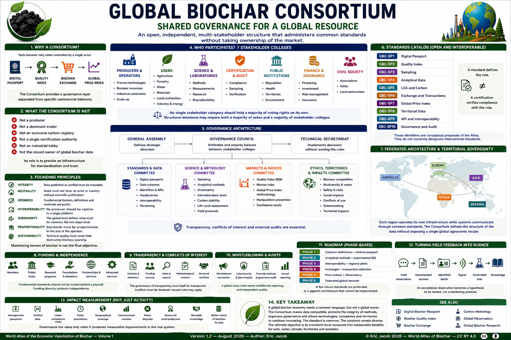

# Chapter 5.7 — Global Biochar Consortium

> **World Atlas of the Economic Valorization of Biochar — Volume 1**  
> Version 1.2 — August 2026 · Author: Eric Jacob

**[← Global Price Index](ch5_en_global_price_index.md) · [↑ Atlas Contents](README_en.md) · [Global Observatory →](ch5_en_global_observatory.md)**

---

## Shared Governance for a Global Resource

Biochar simultaneously concerns agriculture, water, materials, energy, biomass management, carbon, soil restoration and territorial planning. A value chain this cross-cutting should not be governed exclusively by a producer, a marketplace, a certification body or a State.

The Atlas therefore proposes the concept of a **Global Biochar Consortium (GBC)**: an open, independent, multi-stakeholder structure capable of administering common standards without taking ownership of the market.

> **The Consortium does not sell the truth: it organizes the conditions that make it possible to verify it.**

<figure>

<figcaption><strong>Figure 1 — Global Biochar Consortium: governing an open, credible and equitable standard together.</strong> This organization is an institutional proposal of the Atlas and does not represent an international organization currently in existence. © Eric Jacob 2026 — World Atlas of Biochar — CC BY 4.0. <a href="ch5_en_global_consortium.png">View full-size infographic</a></figcaption>
</figure>

---

## Why a Consortium?

The preceding chapters have built several components:

```text
DIGITAL PASSPORT
       ↓
QUALITY INDEX
       ↓
BIOCHAR EXCHANGE
       ↓
GLOBAL PRICE INDEX
```

These tools become dangerous if they are controlled by a single actor.

The organization defining quality could favor its own products. The organization operating the Exchange could favor certain participants. The organization calculating the price index could select transactions that produce a desired result.

The Consortium therefore constitutes a **governance layer separated from specific commercial interests**.

---

## What the Consortium Is Not

It should be neither:

- a producer;
- a dominant trader;
- an exclusive carbon registry;
- a single certification authority;
- an industrial lobby;
- nor the closed owner of global biochar data.

Its role is to provide an **infrastructure for standardization and trust**.

The distinction is fundamental:

```text
COMMON RULES
        ≠
CENTRALIZED CONTROL OF THE MARKET
```

---

## Founding Principles

**Integrity.** Data published as verified must be traceable to evidence.

**Neutrality.** Rules must not favor a technology, company or country without scientific justification.

**Openness.** Fundamental formats, definitions and methods are public.

**Interoperability.** A producer must not become captive to a single platform.

**Subsidiarity.** The global level defines what must be common; territories retain control over what should remain local.

**Proportionality.** A small production unit should not face the same administrative burden as a major industrial installation.

**Sustainability.** Technical quality must never conceal destructive biomass sourcing or an unsustainable supply chain. :contentReference[oaicite:2]{index=2}

---

## Who Participates?

The Consortium could bring together seven stakeholder colleges.

### Producers and Operators

Process technologies, biomass resources, industrial constraints and scale-up.

### Users

Agriculture, forestry, water, materials, local authorities, industry and energy.

### Science and Laboratories

Methods, measurements, research and reproducibility.

### Certification and Audit

Compliance, sampling and independent verification.

### Public Institutions

Regulation, health, territories and environment.

### Finance and Insurance

Information required for financing and risk management.

### Civil Society

Associations, NGOs and local communities.

A fundamental rule could be:

> **No single stakeholder category should hold a majority of the voting rights on its own.**

Structural decisions could require both a majority of votes and a majority of stakeholder colleges. :contentReference[oaicite:3]{index=3}

---

## Governance Architecture

```text
GENERAL ASSEMBLY
        ↓
GOVERNANCE COUNCIL
        ↓
┌───────────┬─────────────┬──────────────┬──────────────┐
│ Standards │ Science     │ Markets      │ Ethics       │
│ & Data    │ & Metrology │ & Indices    │ & Impacts    │
└───────────┴─────────────┴──────────────┴──────────────┘
        ↓
TECHNICAL SECRETARIAT
```

The General Assembly defines the strategic direction.

The Governance Council arbitrates.

The committees develop and supervise the technical work.

The Technical Secretariat implements decisions without becoming the owner of the rules.

---

## Standards and Data

This committee could address:

- digital passports;
- data schemas;
- identifiers;
- APIs;
- vocabularies;
- interoperability;
- versioning;
- migrations.

The objective is to make information understandable and transferable between systems.

---

## Science and Metrology

This committee could address:

- sampling;
- analytical methods;
- uncertainty;
- interlaboratory comparisons;
- carbon stability;
- life cycle assessment;
- field protocols.

Scientific rules should remain open to revision as knowledge progresses.

---

## Markets and Indices

This committee could oversee methodological aspects concerning:

- the Biochar Quality Index;
- market rules;
- Global Price Index methodology;
- prevention of manipulation;
- publication of confidence levels.

The organization responsible for a standard must not silently manipulate that standard to influence market outcomes.

---

## Ethics, Territories and Impacts

Technical performance is not sufficient to define a sustainable value chain.

This committee could examine:

- competition for biomass;
- biodiversity;
- water;
- dedicated crops;
- safety;
- social impacts;
- conflicts of use;
- greenwashing;
- territorial consequences.

> **Maximizing tonnes of biochar is not the final objective.** :contentReference[oaicite:4]{index=4}

---

## Catalogue of Open Standards

The Consortium could maintain a family of common standards:

```text
GBC-SP1   Digital Passport
GBC-SP2   Quality Index
GBC-SP3   Sampling
GBC-SP4   Analytical Data
GBC-SP5   LCA and Carbon
GBC-SP6   Exchange and Transactions
GBC-SP7   Global Price Index
GBC-SP8   Territorial Data
GBC-SP9   API and Interoperability
GBC-SP10  Governance and Audit
```

These identifiers are **conceptual proposals of the Atlas**.

They do not currently designate international standards.

---

## A Standard Is Not a Certification

This distinction must remain explicit.

The Consortium may define **how information should be measured, represented or exchanged**, while an independent organization verifies whether an actor complies with the applicable framework.

```text
STANDARD
defines the rule

        ≠

CERTIFICATION
verifies compliance with the rule
```

Separating these functions reduces the risk that the same organization writes the rules, sells certification and judges disputes. :contentReference[oaicite:5]{index=5}

---

## Recognizing Existing Systems

The objective should not be to impose a new monopoly.

Several certifications and standards may coexist when their scope and compatibility are documented.

The Consortium should therefore seek bridges with:

- ISO standards;
- CEN standards;
- ASTM standards;
- existing biochar frameworks;
- carbon methodologies;
- digital-passport systems;
- national and regional systems.

The objective is to **connect what already exists, not replace everything**. :contentReference[oaicite:6]{index=6}

---

## Federated Architecture and Territorial Sovereignty

There is no need to build a single central database containing all the world's information.

```text
EUROPE ───────┐
AFRICA ───────┤
AMERICAS ─────┼→ COMMON STANDARD
ASIA ─────────┤
OCEANIA ──────┘
```

Each region may operate its own infrastructure while systems communicate through common standards.

Climate, soils, biomass resources, agriculture, regulation and infrastructure vary greatly from one territory to another.

The Consortium can define **the structure of the data without imposing a single global agronomic recipe**. :contentReference[oaicite:7]{index=7}

---

## A Genuine Place for Emerging Countries

A global standard designed exclusively by wealthy markets would reproduce their priorities.

Governance should therefore provide for:

- geographical representation;
- translations;
- remote participation;
- technical assistance;
- proportionate standards;
- open tools;
- training.

A small cooperative should be able to participate without maintaining a regulatory department of twenty people.

In some regions, the principal value of biochar may lie less in a carbon certificate than in:

- soil restoration;
- water management;
- residue valorization;
- useful heat;
- local materials;
- economic activity.

A global system must be capable of recognizing these different forms of value. :contentReference[oaicite:8]{index=8}

---

## Funding and Independence

Possible sources of funding include:

- membership fees;
- technical services;
- public grants;
- foundations;
- research programs;
- partnerships;
- donations;
- advanced services.

However:

> **Fundamental standards should not be locked behind a paywall.**

To reduce dependence, the Consortium could limit the proportion of funding provided by a single actor or sector and publish the origin of its principal funding sources.

Financial diversity is therefore part of institutional independence. :contentReference[oaicite:9]{index=9}

---

## Transparency and Conflicts of Interest

The Consortium should publish, where appropriate:

- statutes;
- members;
- funding sources;
- votes;
- methodologies;
- versions;
- conflicts of interest;
- reports;
- audits.

> **The governance of transparency must itself be transparent.**

Expertise and economic interest can coexist.

Conflicts should therefore be declared rather than concealed, including relevant information concerning:

- employer;
- shareholdings;
- clients;
- research funding;
- institutional mandates.

Recusal rules may apply when necessary. :contentReference[oaicite:10]{index=10}

---

## Whistleblowers and Audits

A global value chain needs a confidential mechanism for reporting issues such as:

- falsified data;
- double counting;
- concealed contamination;
- abusive certification;
- price manipulation.

The Consortium itself must also be auditable.

Audits may concern:

```text
FINANCES
CYBERSECURITY
METHODS
GOVERNANCE
PROCEDURES
```

An institution responsible for trust cannot exempt itself from verification. :contentReference[oaicite:11]{index=11}

---

## Changing a Standard Without Breaking the Ecosystem

Standards must evolve without making historical data unusable.

A possible process is:

```text
PROPOSAL
    ↓
PUBLICATION
    ↓
COMMENTS
    ↓
TESTING
    ↓
REVISION
    ↓
VOTE
    ↓
PUBLISHED VERSION
```

Older versions should remain archived.

Transition periods can allow systems to migrate progressively.

Digital standards should anticipate:

- compatibility;
- deprecated fields;
- migration rules;
- historical documentation.

Changing a definition in 2032 should not make passports issued in 2027 unreadable. :contentReference[oaicite:12]{index=12}

---

## Reference Software and APIs

The Consortium could publish open reference software such as:

```text
passport validator
format converter
BQI library
API client
anonymization tool
statistical tools
```

A common API could allow authorized data to circulate automatically between:

- producers;
- laboratories;
- markets;
- public authorities;
- researchers;
- observatories;
- artificial-intelligence systems.

Companies would remain free to build more advanced commercial services on top of the common infrastructure. :contentReference[oaicite:13]{index=13}

---

## Cybersecurity

A global infrastructure must integrate appropriate mechanisms for:

- strong authentication;
- encryption;
- digital signatures;
- backups;
- replication;
- logging;
- incident response.

Interoperability should not come at the cost of security.

A global standard that facilitates data exchange must also define how integrity and provenance can be protected.

---

## Data Ownership

The Consortium should not become the owner of all data in the value chain.

It may administer standards and possibly certain reference registries, while producers, laboratories, users and territories retain the defined rights over their information.

The principle is:

> **Organize authorized access, not informational expropriation.**

This distinction is particularly important for industrial data, commercial information and territorial sovereignty. :contentReference[oaicite:14]{index=14}

---

## Portability

A producer should not lose its digital history when leaving a platform.

It should be possible, subject to applicable rights and obligations, to retain or export:

```text
PASSPORTS
IDENTIFIERS
HISTORY
ANALYSES
EVIDENCE
```

Open standards therefore protect not only interoperability but also freedom of choice.

A platform may disappear.

The data and their meaning should survive.

---

## Global Observatory and Global Research

Aggregated data can feed the **[Global Biochar Observatory](ch5_en_global_observatory.md)**:

```text
PRODUCTION
PRICES
QUALITY
USES
CAPACITY
CARBON
TERRITORIES
RESEARCH
```

The Consortium can facilitate:

- anonymized datasets;
- common protocols;
- replication of experiments;
- interlaboratory comparisons;
- meta-analyses.

See also **[Global Biochar Research](ch5_en_global_research.md)**. :contentReference[oaicite:15]{index=15}

---

## Turning Field Feedback into Science

Field observations should neither be dismissed as anecdotal nor immediately transformed into scientific certainty.

```text
FIELD OBSERVATION
       ↓
DOCUMENTED CONTEXT
       ↓
IDENTIFIED BATCH
       ↓
SIGNAL
       ↓
CONTROLLED TRIAL
       ↓
KNOWLEDGE
```

An exceptional agricultural observation therefore becomes a **hypothesis to be tested**, rather than a marketing promise. :contentReference[oaicite:16]{index=16}

---

## Avoiding Institutional Capture

Every organization eventually develops interests of its own.

Governance should therefore include mechanisms such as:

- rotation of mandates;
- term limits;
- documented votes;
- external reviews;
- the ability to reuse or derive open standards.

A particularly important principle is:

> **If governance becomes poor, the standard must be able to survive the institution that created it.**

Institutional continuity must not depend on the permanent legitimacy or existence of a single organization. :contentReference[oaicite:17]{index=17}

---

## Roadmap

The French reference deliberately uses a **phase-based roadmap**, rather than imposing arbitrary calendar deadlines:

```text
PHASE 1 — Common definitions + minimal passport

PHASE 2 — Analytical methods + experimental BQI

PHASE 3 — Interoperability + regional pilots

PHASE 4 — Exchanges + transaction collection

PHASE 5 — Price indices + Observatory

PHASE 6 — Federated global network
```

A few robust standards are preferable to a gigantic architecture that cannot actually be implemented. :contentReference[oaicite:18]{index=18}

---

## Measuring Impact

The Consortium's success should not be measured by the number of meetings it organizes.

More meaningful indicators include:

- interoperable passports;
- verified data;
- lower compliance costs;
- faster procedures;
- geographical coverage;
- characterized volumes;
- fewer disputes;
- access for small producers;
- production of reusable knowledge;
- better matching of biochars to appropriate uses.

Governance has value only when it produces measurable improvements in the real system. :contentReference[oaicite:19]{index=19}

---

## Serving Living Systems

Standards, APIs, indices and audits are tools, not final objectives.

```text
BETTER-MANAGED BIOMASS
        ↓
STABLE CARBON
        ↓
SOILS + WATER + MATERIALS
        ↓
MORE RESILIENT TERRITORIES
        ↓
LESS PRESSURE ON THE CLIMATE
```

If the infrastructure becomes bureaucratically perfect but ecologically useless, it has failed. :contentReference[oaicite:20]{index=20}

---

## Key Takeaway

> **A global biochar economy needs a common language, but not a global owner.**

The Consortium proposed by the Atlas should make data compatible, protect the integrity of methods, organize governance and allow technologies, companies and territories to continue innovating.

**The standard is common. The solutions remain diverse.**

The ultimate objective remains to **transform local resources into measurable benefits for soils, water, climate, territories and societies**. :contentReference[oaicite:21]{index=21}

---

## Continue Reading

**[← Global Price Index](ch5_en_global_price_index.md) · [↑ Atlas Contents](README_en.md) · [Global Observatory →](ch5_en_global_observatory.md)**

See also: [Digital Biochar Passport](ch5_en_biochar_passport.md) · [Biochar Quality Index](ch5_en_quality_index.md) · [Biochar Exchange](ch5_en_biochar_exchange.md) · [Carbon Metrology](ch5_en_carbon_metrology.md) · [Global Biochar Research](ch5_en_global_research.md)

---

*World Atlas of the Economic Valorization of Biochar — Eric Jacob — Version 1.2 — 2026*  
*License: Creative Commons CC BY 4.0*
