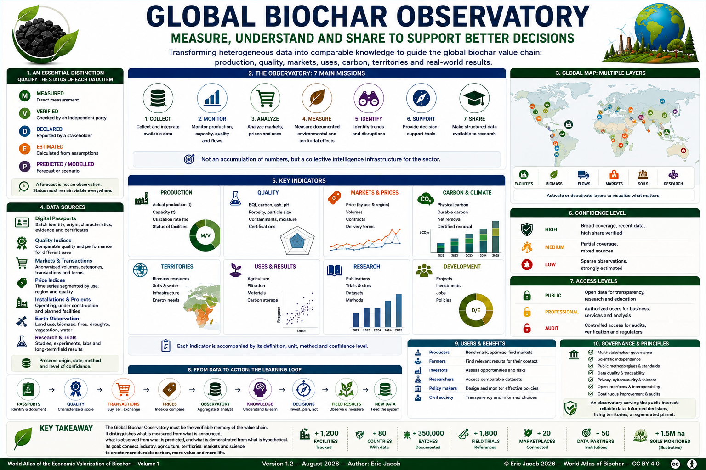

# Chapter 5.8 — Global Biochar Observatory

> **World Atlas of the Economic Valorization of Biochar — Volume 1**  
> Version 1.2 — August 2026 · Author: Eric Jacob

**[← Global Consortium](ch5_en_global_consortium.md) · [↑ Atlas Contents](README_en.md) · [Global Research →](ch5_en_global_research.md)**

---

## Measure, Understand and Share to Act

A global value chain cannot be managed through a succession of announcements, isolated prices, local studies or commercial figures that cannot be meaningfully compared.

The Atlas proposes a **Global Biochar Observatory (GBO)**: an information infrastructure capable of transforming heterogeneous data into comparable knowledge and then into decision-support tools.

The Observatory should not merely answer:

> **How much biochar is produced?**

It should progressively make it possible to ask:

> Where is it produced? From which biomass feedstocks? At what quality? At what price? For which use? With what logistics? What results are actually observed in soils, water, materials and carbon?

<figure>

<figcaption><strong>Figure 1 — Global Biochar Observatory: from data to decisions.</strong> The figures and visualizations shown in this infographic are illustrative and describe the proposed architecture; they do not constitute measured global statistics. © Eric Jacob 2026 — World Atlas of Biochar — CC BY 4.0. <a href="ch5_en_global_observatory.png">View full-size infographic</a></figcaption>
</figure>

---

## An Essential Distinction: Observed, Estimated and Modelled

The Observatory must avoid one of the most common weaknesses of dashboards: displaying numbers with different evidential status as though they carried the same degree of certainty.

Each data item should therefore be qualified:

```text
M — measured
V — verified
D — declared
E — estimated
P — predicted / modelled
```

A measured industrial production volume is not equivalent to an announced production capacity.

A financed project is not equivalent to an operating installation.

A forecast is not an observation.

This distinction must remain visible even in maps and charts. :contentReference[oaicite:2]{index=2}

---

## The Observatory's Missions

The GBO could perform seven main functions:

- collect and integrate available data;
- monitor production, capacity, quality and flows;
- analyze markets, prices and uses;
- measure documented environmental and territorial effects;
- identify trends and disruptions;
- provide decision-support tools;
- make structured data available to research.

It should not produce an accumulation of numbers, but rather a **collective intelligence infrastructure for the sector**. :contentReference[oaicite:3]{index=3}

---

## Data Sources

The Observatory can aggregate several families of sources.

### Digital Passports

The **[Digital Biochar Passport](ch5_en_biochar_passport.md)** provides batch identity, origin, characteristics and supporting evidence.

### Quality Indices

The **[Biochar Quality Index](ch5_en_quality_index.md)** makes it possible to compare properties relevant to different uses without pretending that a single score can summarize every biochar.

### Markets and Transactions

The **[Biochar Exchange](ch5_en_biochar_exchange.md)** and other marketplaces can transmit anonymized information on volumes, categories and transactions.

### Price Indices

The **[Global Price Index](ch5_en_global_price_index.md)** can provide time series segmented by use, region and quality.

### Installations

Public registers, operators and institutions can provide information on facilities that are operating, under construction or at project stage.

### Earth Observation

Satellite imagery can help document land use, biomass, fires, drought, vegetation and changes in certain territories.

### Research

Scientific publications, experimental networks, laboratories and long-term trials can contribute measured and contextualized results.

The challenge is not merely to collect these sources, but to **preserve their origin, date, methodology and level of confidence**. :contentReference[oaicite:4]{index=4}

---

## A Federated Architecture

A global Observatory does not require every piece of information to be stored in one central database.

A federated architecture can connect several systems:

```text
PRODUCERS
     ↓
DIGITAL PASSPORTS
     ↓
LABORATORIES
     ↓
MARKETPLACES
     ↓
PUBLIC REGISTERS
     ↓
RESEARCH NETWORKS
     ↓
TERRITORIAL SYSTEMS
     ↓
GLOBAL OBSERVATORY
```

Some data may remain with their owners while standardized interfaces make selected information accessible.

This approach reduces the need to centralize sensitive industrial information.

---

## Standardizing Before Comparing

Before aggregating values, the Observatory must determine whether they actually describe the same thing.

For example:

```text
PRICE / t
```

is insufficient if one value includes transport and another does not.

Likewise:

```text
CARBON = 80%
```

is ambiguous without analytical method and measurement basis.

The Observatory therefore needs:

- common definitions;
- explicit units;
- documented methods;
- conversion rules;
- metadata;
- persistent identifiers;
- versioning.

Interoperability is first and foremost a problem of **meaning**, not merely a technical problem.

---

## A World Map That Shows More Than Production

The global map could include several layers:

```text
PRODUCTION FACILITIES
BIOMASS RESOURCES
BIOCHAR FLOWS
MARKETS
PRICES
QUALITY
SOILS
WATER
CARBON
RESEARCH
PROJECTS
LOGISTICS
```

Users should be able to activate or deactivate layers depending on their needs.

A map of production alone would show where the material is manufactured.

A richer Observatory could show **where it can create value and under what conditions**.

---

## Production and Capacity

The Observatory should clearly distinguish:

```text
ANNOUNCED CAPACITY
       ≠
INSTALLED CAPACITY
       ≠
OPERATING CAPACITY
       ≠
ACTUAL PRODUCTION
```

These quantities may differ considerably.

Each installation could therefore have a status such as:

```text
PROJECT
FINANCED
UNDER CONSTRUCTION
COMMISSIONING
OPERATING
TEMPORARILY STOPPED
CLOSED
```

The date of the status must remain visible.

---

## Quality Data

Global production tonnage has limited meaning if the characteristics of the material are unknown.

The Observatory can therefore progressively connect volumes with:

- biomass;
- process;
- carbon content;
- stability indicators;
- ash;
- pH;
- porosity;
- contaminants;
- particle size;
- certifications;
- intended uses.

This would allow analysis of the market by **quality families**, not merely by tonnes.

---

## Market Data

The market component can aggregate:

```text
PRICE
VOLUME
REGION
QUALITY
USE
PACKAGING
DELIVERY TERMS
DATE
```

This is essential because there is no single meaningful global price for all biochars.

Agricultural biochar, filtration-grade material, construction biochar and specialized industrial carbon materials belong to different economic segments.

The **[Global Price Index](ch5_en_global_price_index.md)** develops this methodology further.

---

## Carbon Data

The Observatory must preserve the distinction between:

```text
BIOCHAR MASS
CARBON MASS
ESTIMATED DURABLE CARBON
NET REMOVAL
CERTIFIED REMOVAL
CREDIT ISSUED
CREDIT SOLD
CREDIT RETIRED
```

These quantities cannot be treated as synonyms.

The **[Carbon Metrology](ch5_en_carbon_metrology.md)** chapter establishes the corresponding measurement logic.

---

## Field Results

One of the most valuable long-term functions of the Observatory would be to connect biochar characteristics with actual results.

For agriculture:

```text
BIOCHAR
+ SOIL
+ CLIMATE
+ CROP
+ DOSE
+ PRACTICE
→ RESULT
```

For filtration:

```text
BIOCHAR
+ CONTAMINANT
+ WATER MATRIX
+ FLOW
+ CONTACT TIME
→ PERFORMANCE
```

For materials:

```text
BIOCHAR
+ MATRIX
+ FORMULATION
+ PROCESS
→ PERFORMANCE
```

The objective is not to claim universal effects, but to identify **contexts in which comparable products produce comparable results**.

---

## Territorial Data

A global value chain is ultimately composed of local systems.

Territorial data may include:

- available biomass;
- competing biomass uses;
- soil types;
- water constraints;
- industries;
- energy needs;
- transport infrastructure;
- climate;
- biodiversity;
- waste and residue flows.

The Observatory can therefore connect global comparison with local decision-making.

---

## A Tool for Territories

A territory considering a biochar or thermolysis project could examine:

```text
LOCAL RESOURCE
      +
LOCAL NEEDS
      +
COMPARABLE PROJECTS
      +
MARKETS
      +
LOGISTICS
      +
FIELD RESULTS
      ↓
DECISION SUPPORT
```

It can then assess whether a local value chain has genuine coherence before investing.

---

## A Tool for Producers

A producer could identify:

- nearby markets;
- required quality profiles;
- regional prices;
- unmet needs;
- laboratories;
- logistics infrastructure;
- results associated with comparable biochars.

Data can reduce part of the industrial uncertainty. :contentReference[oaicite:5]{index=5}

---

## A Tool for Farmers

A farmer could search for experiments comparable to their own context rather than relying on an abstract global average.

```text
MY SOIL
+
MY CLIMATE
+
MY CROP
+
AVAILABLE BIOCHAR
        ↓
COMPARABLE CASES
```

This can be considerably more useful than a general statement that "biochar increases yields." :contentReference[oaicite:6]{index=6}

---

## A Tool for Investors

The Observatory could provide information on:

- market depth;
- price history;
- projects;
- capacity;
- biomass availability;
- risks;
- outlets;
- regulatory maturity.

The objective is not to recommend an investment, but to make the assumptions behind an investment **verifiable**. :contentReference[oaicite:7]{index=7}

---

## Open and Protected Data

Three levels can be maintained:

```text
PUBLIC
PROFESSIONAL
AUDIT
```

Public data support transparency and research.

Professional data support authorized transactions and services.

Audit-level data enable verification without requiring general disclosure.

This architecture can reconcile transparency with legitimate confidentiality. :contentReference[oaicite:8]{index=8}

---

## Key Indicators

The Observatory could monitor, among others:

| Domain | Indicators |
|---|---|
| Production | actual tonnes, capacity, utilization rate |
| Quality | BQI, analyses, non-conformities |
| Market | prices, volumes, uses |
| Territory | distances, biomass, installations |
| Soils | trials, retention, yields, biology |
| Carbon | physical stock, certified removal |
| Research | studies, trials, datasets |
| Development | projects, investments, jobs |

Indicators must be accompanied by their definition and level of confidence. :contentReference[oaicite:9]{index=9}

---

## Do Not Confuse Completeness with Precision

The Global Observatory will never immediately know every installation and every flow.

It should therefore display its coverage:

```text
GEOGRAPHICAL COVERAGE
MARKET COVERAGE
SHARE OF VERIFIED DATA
LAST UPDATE
```

Saying:

> "We cover approximately 45% of the estimated market"

is more credible than presenting an incomplete map as exhaustive.

The `45%` figure here is an **illustrative example**, not a measured estimate of the current global market. :contentReference[oaicite:10]{index=10}

---

## Data Quality and Confidence

Each published indicator can be accompanied by a confidence level.

For example:

```text
HIGH CONFIDENCE
— broad coverage
— recent data
— high proportion verified

MEDIUM CONFIDENCE
— partial coverage
— mixed sources

LOW CONFIDENCE
— sparse observations
— strong dependence on estimates
```

The exact methodology should be public and versioned.

A confidence indicator should explain the strength of the evidence, not merely decorate the dashboard.

---

## Detecting Anomalies

Statistical tools and artificial intelligence can help identify:

- impossible values;
- duplicate records;
- sudden price changes;
- inconsistent units;
- suspicious production volumes;
- unusual quality changes;
- missing data;
- contradictions between sources.

An anomaly should trigger investigation.

It should not automatically be interpreted as fraud or error.

---

## Forecasting and Scenarios

The Observatory may also host models exploring:

- production growth;
- biomass availability;
- prices;
- climate effects;
- demand;
- regulatory developments;
- carbon markets;
- territorial deployment.

But predictions must remain explicitly separated from observations:

```text
OBSERVED DATA
      ≠
MODELLED SCENARIO
      ≠
FORECAST
```

A scenario is useful precisely because its assumptions are visible and can be changed.

---

## Integration with Digital Twins

Local **[Digital Twins](ch5_en_digital_twin.md)** can provide aggregated and qualified data to the Observatory.

| Digital Twin | Global Observatory |
|---|---|
| follows a defined system | aggregates many systems |
| may use detailed data | prioritizes shareable data |
| simulates operation | compares territories and value chains |
| supports operational control | supports understanding and decisions |
| may contain confidential data | organizes dissemination and aggregation |

The two infrastructures are complementary rather than interchangeable. :contentReference[oaicite:11]{index=11}

---

## Integration and Interoperability

The Observatory can connect with:

```text
CARBON REGISTRIES
↕
MARKET PLATFORMS
↕
POLICIES AND REGULATIONS
↕
NATIONAL SYSTEMS
↕
RESEARCH AND INNOVATION
```

Common standards, open interfaces and federated data can make information reusable without forcing every stakeholder into a single technological platform.

---

## Governance

The Observatory may be supervised by the **[Global Consortium](ch5_en_global_consortium.md)**, but its scientific committee should retain methodological autonomy.

Audits should examine:

- data origin;
- transformations;
- models;
- security;
- bias;
- conflicts of interest.

Public methodologies allow external criticism and independent reproduction. :contentReference[oaicite:12]{index=12}

---

## Scientific Independence

An Observatory that influences markets, investment or public policy must not allow its indicators to be silently modified to favor one stakeholder.

Governance should therefore separate, as far as possible:

```text
DATA PROVIDERS
METHODOLOGY
TECHNICAL OPERATION
SCIENTIFIC REVIEW
GOVERNANCE
COMMERCIAL USERS
```

Changes in definitions or algorithms should be documented and versioned.

---

## Privacy, Confidentiality and Cybersecurity

A global information infrastructure may contain commercially sensitive information.

Protection can include:

- access control;
- authentication;
- encryption;
- logging;
- backups;
- anonymization;
- aggregation thresholds;
- incident procedures.

The objective is to make useful information accessible without unnecessarily exposing confidential information.

---

## A Cumulative Knowledge Infrastructure

The value of the Observatory increases over time.

```text
YEAR 1: a few thousand batches
YEAR 3: regional series
YEAR 5: linked field results
YEAR 10: long historical records
```

Long-term effects of biochar could then be studied with a depth that is impossible in a fragmented system. :contentReference[oaicite:13]{index=13}

These figures describe the **conceptual maturation of the database**, not a forecast of actual future coverage.

---

## From Data to Action

The complete chain proposed by the Atlas becomes:

```text
PASSPORTS
    ↓
QUALITY
    ↓
TRANSACTIONS
    ↓
PRICES
    ↓
OBSERVATORY
    ↓
KNOWLEDGE
    ↓
DECISIONS
    ↓
FIELD RESULTS
    ↓
NEW DATA
```

This is a learning loop.

Each use can improve the understanding of subsequent uses. :contentReference[oaicite:14]{index=14}

---

## The Observatory and Global Research

The Observatory provides memory.

The **[Global Biochar Research Network](ch5_en_global_research.md)** can transform part of this memory into hypotheses, experiments and validated knowledge.

```text
OBSERVATORY
     ↓
SIGNAL
     ↓
RESEARCH QUESTION
     ↓
EXPERIMENT
     ↓
RESULT
     ↓
REPLICATION
     ↓
KNOWLEDGE
     ↓
OBSERVATORY
```

This relationship prevents field observations from being dismissed as anecdotal while also preventing them from being immediately transformed into scientific certainty.

---

## What the Observatory Must Not Become

It must not become:

- a marketing showcase;
- a ranking system based on incomplete data;
- a database that hides uncertainty;
- a central owner of all industrial information;
- an automatic certification authority;
- a system that transforms predictions into facts;
- a substitute for laboratories and scientific research.

Its credibility depends precisely on its ability to display **limits, missing data and uncertainty**.

---

## Key Takeaway

> **The Global Biochar Observatory should not be a showcase of numbers: it should be the verifiable memory of the value chain.**

It must distinguish what is measured from what is announced, what is observed from what is predicted, and what is demonstrated from what remains hypothetical.

Its ambition is to connect industry, agriculture, territories, markets and science so that decisions can progressively rely on cumulative knowledge rather than isolated impressions.

Above all, it must make it possible to look beyond tonnes toward **restored soils, better-managed water, better-utilized biomass, durable carbon, more resilient territories and shared knowledge**. :contentReference[oaicite:15]{index=15}

---

## Continue Reading

**[← Global Consortium](ch5_en_global_consortium.md) · [↑ Atlas Contents](README_en.md) · [Global Research →](ch5_en_global_research.md)**

See also: [Digital Passport](ch5_en_biochar_passport.md) · [Quality Index](ch5_en_quality_index.md) · [Biochar Exchange](ch5_en_biochar_exchange.md) · [Global Price Index](ch5_en_global_price_index.md) · [Life Cycle Assessment](ch4_en_life_cycle_assessment.md) · [Carbon Metrology](ch5_en_carbon_metrology.md) · [Digital Twin](ch5_en_digital_twin.md)

---

*World Atlas of the Economic Valorization of Biochar — Eric Jacob — Version 1.2 — 2026*  
*License: Creative Commons CC BY 4.0*
