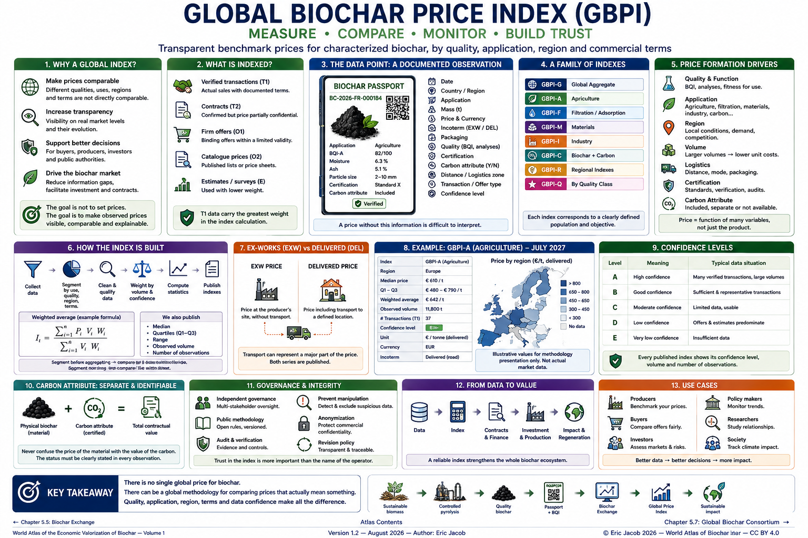

# Chapter 5.6 — Global Biochar Price Index

> **World Atlas of the Economic Valorization of Biochar — Volume 1**  
> Version 1.2 — August 2026 · Author: Eric Jacob

**[← Biochar Exchange](ch5_en_biochar_exchange.md) · [↑ Atlas Contents](README_en.md) · [Global Consortium →](ch5_en_global_consortium.md)**

---

## Measuring a Market Without Inventing a Universal Price

The global development of biochar creates a paradox: prices are increasingly circulated, yet they remain difficult to compare.

One tonne sold for local agriculture, one tonne of highly porous carbon intended for filtration, and one tonne associated with certified carbon removal do not represent the same economic product.

The Atlas therefore proposes a **Global Biochar Price Index (GBPI)** based on sufficiently documented transactions and offers, segmented by quality, application, region and commercial conditions.

The objective is not to set prices.

> **The objective is to make observed prices visible, comparable and explainable.**

<figure>
  
  <figcaption>
    <strong>Figure 1 — Global Biochar Price Index: benchmark, compare and monitor markets.</strong>
    The values, charts, maps and numerical examples shown in the infographic are illustrative and do not constitute actual market quotations.
    © Eric Jacob 2026 — World Atlas of Biochar — CC BY 4.0.
    <a href="ch5_en_global_price_index.png">Enlarge infographic</a>
  </figcaption>
</figure>

---

## Why a Global Index?

Without a structured benchmark, market participants may simultaneously observe:

- relatively low agricultural prices;
- much more expensive specialized biochars;
- premiums linked to certification;
- carbon values that are either separate or included;
- considerable differences between regions;
- transport costs sometimes exceeding the ex-works value.

Publishing a simple global average would mix these realities.

The GBPI should therefore operate as a **family of indexes**.

---

## The Basic Data Point: A Documented Transaction

Each observation must contain enough information to be interpretable.

Conceptual example:

```text
date
country / region
application
mass
price
currency
Incoterm / delivery conditions
packaging
BQI or quality data
certification
carbon attribute included? yes/no
distance or logistics zone
transaction / offer
confidence level
```

A value of `€800/t` without this information is difficult to use meaningfully.

---

## Transactions and Offers Do Not Have the Same Value

A price displayed by a seller is not necessarily a price actually paid.

The Atlas therefore proposes distinguishing:

```text
T1 — verified transaction
T2 — verified contract but price partially confidential
O1 — firm offer
O2 — catalogue price
E  — estimate / survey
```

The main index should give greater weight to actual transactions.

Other data can enrich the analysis while markets remain relatively illiquid.

---

## A Family of Indexes

The architecture could include:

| Index | Function |
|---|---|
| **GBPI-G** | global aggregate |
| **GBPI-A** | agriculture |
| **GBPI-F** | filtration |
| **GBPI-M** | materials |
| **GBPI-I** | industry |
| **GBPI-C** | biochar associated with carbon |
| **GBPI-R** | regional indexes |
| **GBPI-Q** | indexes by quality class |

These names are working proposals of the Atlas.

What matters most is that each series corresponds to a clearly defined population.

---

## Segment Before Aggregating

A robust methodology begins by creating homogeneous segments:

```text
TRANSACTIONS
    ↓
APPLICATION
    ↓
QUALITY
    ↓
REGION
    ↓
COMMERCIAL CONDITIONS
    ↓
COMPARABLE SEGMENT
```

Only then can several segments be aggregated.

This rule prevents a small volume of highly specialized biochar from artificially increasing the supposed price of global agricultural biochar.

---

## The BQI as a Normalization Variable

The **[Biochar Quality Index](ch5_en_quality_index.md)** can provide useful information for explaining part of the difference in prices.

A statistical analysis can investigate:

$$
P = f(Q,U,R,V,L,C,\ldots)
$$

where:

- \(P\) = price;
- \(Q\) = quality;
- \(U\) = application;
- \(R\) = region;
- \(V\) = volume;
- \(L\) = logistics;
- \(C\) = certification or carbon attribute.

The objective is not to impose this function on the market, but to understand the variables that explain transactions.

---

## A Simple Weighted Average

For a sufficiently homogeneous segment, an initial index can use:

$$
I_t =
\frac{\sum_{i=1}^{n} P_i V_i W_i}
{\sum_{i=1}^{n} V_i W_i}
$$

where:

- \(P_i\) = normalized transaction price;
- \(V_i\) = volume;
- \(W_i\) = confidence or representativeness weight.

A 100-tonne sale therefore carries more weight than a 100-kg sample, without necessarily allowing one gigantic transaction to dominate the entire index if weighting caps are applied.

---

## Median and Trimmed Mean

Young markets often contain extreme values.

It is therefore useful to publish several statistics:

- weighted average;
- median;
- quartiles;
- range;
- observed volume;
- number of transactions.

A trimmed mean may exclude extremes according to a published rule.

The reader can then distinguish **central price level from dispersion**.

---

## Currency Conversion

A global index must convert currencies according to a stable methodology.

Each observation retains:

```text
original price
original currency
date
exchange rate used
normalized price
```

Historical series should never lose the original data.

This traceability makes it possible to recalculate the index later using a different methodology.

---

## Normalize Units

Offers may be expressed:

- per tonne;
- per kilogram;
- per m³;
- per bag;
- per pallet.

A mass-based price requires a genuinely known mass.

For products sold by volume, density must be measured or documented before conversion.

An insufficiently reliable density estimate should reduce the confidence level.

---

## Separate Ex-Works and Delivered Prices

Two series may be necessary.

### GBPI-EXW

A benchmark close to the producer's ex-works price.

### GBPI-DEL

Delivered price within a defined area or distance.

This distinction is particularly important for biochar, whose density and geography can make transport a determining factor.

---

## A Proximity Index

The Atlas also proposes a complementary indicator:

> **the price of the best compatible batch within a given radius.**

For an agricultural buyer:

```text
BQI-A ≥ 70
radius ≤ 150 km
volume ≥ 10 t
certification required
```

The engine can calculate the median delivered price of batches that actually meet the requirement.

This territorial indicator may be more useful than a global average.

---

## Carbon Must Remain Identifiable

When the price includes a carbon-removal certificate or attribute, this information must remain separate.

The publication can distinguish:

```text
physical biochar price
+
carbon attribute value
=
total contractual price
```

If contractual separation is unavailable, the transaction should be marked accordingly.

This prevents an increase in carbon prices from being interpreted as an increase in the material value of biochar. :contentReference[oaicite:1]{index=1}

---

## Data Quality

Every publication should display a confidence level.

For example:

| Level | Interpretation |
|---|---|
| **A** | numerous verified transactions |
| **B** | sufficient and representative transactions |
| **C** | limited but usable data |
| **D** | offers and estimates predominate |
| **E** | insufficient data |

Thus:

```text
GBPI-A Europe: €642/t
Confidence: B
Observed volume: 8,420 t
```

is considerably more informative than:

```text
Biochar price: €642/t
```

---

## Do Not Publish When We Do Not Know

One of the most important rules of a credible index is the ability to state:

> **insufficient data.**

An artificial number creates an illusion of precision and may influence contracts.

A properly explained blank cell is scientifically preferable to an invented quotation.

---

## Geographic Coverage

A world map should represent not only prices but also **data density**.

A region with three observations should not appear as reliable as a region with several thousand documented tonnes.

The Atlas therefore recommends displaying simultaneously:

```text
PRICE
VOLUME
NUMBER OF OBSERVATIONS
CONFIDENCE
```

---

## Publication Frequency

Monthly publication appears reasonable for a market that remains relatively illiquid.

As volumes increase, some segments could become weekly.

Daily publication only makes sense if it is supported by enough transactions.

> **Publication speed should never exceed the actual speed of the market.**

---

## Revisions

Statistics may be revised when a transaction is corrected or new information becomes available.

Each series should retain:

```text
initial value
publication date
revision
reason
methodology version
```

Revisions should never be silent.

---

## Public Methodology

To remain credible, the GBPI should publish:

- inclusion criteria;
- exclusion criteria;
- segmentation;
- currency treatment;
- transport treatment;
- weighting rules;
- treatment of extreme values;
- minimum publication threshold;
- revision methodology.

A participant should be able to approximately reproduce the calculation from the same dataset.

---

## Independent Governance

The operator of a **[Biochar Exchange](ch5_en_biochar_exchange.md)** may provide a large quantity of data, but it should not control the methodology alone.

Multi-stakeholder governance could involve:

- producers;
- buyers;
- laboratories;
- statisticians;
- scientists;
- public-sector actors;
- finance;
- end users.

An independent methodology committee could oversee changes.

---

## Preventing Manipulation

A price index can become an economic target.

Controls should detect:

- related-party transactions;
- fictitious purchases;
- artificial transaction splitting;
- extreme prices;
- inconsistent volumes;
- duplicates;
- cancelled operations;
- wash trading;
- deliberately delayed data.

Suspicious observations can be excluded or quarantined until verification. :contentReference[oaicite:2]{index=2}

---

## Confidentiality

Companies will not always want to publish their contracts.

The index can therefore operate using anonymized data.

The public sees:

```text
segment
region
aggregate price
aggregate volume
dispersion
confidence
```

An authorized auditor can access the necessary evidence.

This separation protects commercial confidentiality while still allowing a public benchmark.

---

## An Index Is Not a Mandatory Price

The GBPI should explicitly be presented as a **reference**.

A contract may be:

```text
GBPI-A France
+ quality premium
+ transport
+ packaging
```

or completely independent of the index.

Publishing a reference should not prevent two parties from negotiating freely.

---

## Indexing Contracts

Multi-year contracts can use a formula such as:

$$
P_t = P_0 \times \frac{GBPI_t}{GBPI_0}
$$

or a more complete formula incorporating energy, inflation, transport and quality.

This can reduce the risk of fixing today a price that becomes unrealistic three years later. :contentReference[oaicite:3]{index=3}

---

## Supporting the Financing of Production Units

A bank or investor may find it difficult to finance an installation when nobody knows the probable value of its production.

Historical indexes make it possible to examine:

- volatility;
- quality premiums;
- market depth;
- regional demand;
- revenue scenarios.

The GBPI can therefore become an indirect financial infrastructure for the sector.

---

## Supporting Farmers and Buyers

A buyer can determine whether an offer is consistent with:

- quality;
- region;
- volume;
- certification;
- delivery.

The objective is not systematically to find the cheapest product.

A more expensive biochar may be economically superior if a lower application rate or better performance creates greater value.

---

## Price by Function Delivered

Over time, the market could move beyond price per tonne.

For some applications, more intelligent indicators could include:

```text
€/m³ of water actually retained
€/kg of contaminant adsorbed
€/tCO₂e durably removed
€/unit of material performance
€/ha for a measured agronomic result
```

These metrics are more difficult to establish, but they connect price more directly to the **actual function delivered**.

---

## Field Feedback and Value Adjustment

The **[Digital Biochar Passport](ch5_en_biochar_passport.md)** can link post-use performance to the original batch.

If certain families of biochar repeatedly demonstrate better performance, the market may progressively assign them a premium.

The chain becomes:

```text
TRANSACTION
    ↓
APPLICATION
    ↓
RESULT
    ↓
DATA
    ↓
BETTER UNDERSTANDING OF VALUE
```

Price then progressively becomes less dependent on marketing alone.

---

## AI and Anomaly Detection

Artificial intelligence can search for:

- abnormal prices;
- duplicates;
- quality inconsistencies;
- sudden changes;
- conversion errors;
- suspicious groups of transactions.

It can also produce forecasts.

But forecasts must be clearly separated from observations.

```text
OBSERVED INDEX ≠ FORECAST
```

This distinction should remain visible in every interface.

---

## Forecasts

Scenarios may integrate:

- new production capacity;
- energy prices;
- agricultural demand;
- regulation;
- carbon markets;
- low-carbon materials;
- biomass availability.

Results should be published as scenarios and intervals, not as certainties.

---

## A Public Market Observatory

The GBPI could feed an open dashboard containing:

```text
WORLD MAP
PRICES BY APPLICATION
PRICES BY QUALITY
VOLUMES
CAPACITIES
CONFIDENCE
TRENDS
```

Sensitive detailed data would remain protected.

This architecture connects directly with the **[Global Observatory](ch5_en_global_observatory.md)** developed in the Atlas. :contentReference[oaicite:4]{index=4}

---

## Example Publication

A monthly sheet could look like this:

```text
GBPI — JULY 2027

Agriculture — Europe
median: €610/t
Q1–Q3: €480–790/t
observed volume: 11,800 t
confidence: B+

Filtration — Europe
median: €1,320/t
Q1–Q3: €980–1,740/t
observed volume: 2,100 t
confidence: C+

The values above illustrate a publication format.
They are not actual market data.
```

The reader can immediately distinguish between **price level and statistical robustness**. :contentReference[oaicite:5]{index=5}

---

## From an Index to a Mature Market

Market maturation can follow several stages:

```text
ANECDOTAL PRICES
      ↓
STRUCTURED DATA COLLECTION
      ↓
PASSPORTS
      ↓
SEGMENTATION
      ↓
INDEXES
      ↓
INDEXED CONTRACTS
      ↓
FINANCING
      ↓
DEEPER MARKET
```

The index does not create the market by itself.

It reduces the opacity that slows its development.

---

## Key Takeaway

> **There is no single global price for biochar. There can, however, be a global methodology for comparing prices that actually mean something.**

Quality must be known.

Application must be known.

Geography must be known.

Commercial conditions must be known.

And every number should indicate **the quantity and quality of the data supporting it**.

Only under these conditions can a global index become a reference rather than another source of confusion.

---

## Continue Reading

**[← Biochar Exchange](ch5_en_biochar_exchange.md) · [↑ Atlas Contents](README_en.md) · [Global Consortium →](ch5_en_global_consortium.md)**

See also: [Digital Biochar Passport](ch5_en_biochar_passport.md) · [Biochar Quality Index](ch5_en_quality_index.md) · [Global Observatory](ch5_en_global_observatory.md) · [Carbon Metrology](ch5_en_carbon_metrology.md)

---

*World Atlas of the Economic Valorization of Biochar — Eric Jacob — Version 1.2 — 2026*  
*License: Creative Commons CC BY 4.0*
