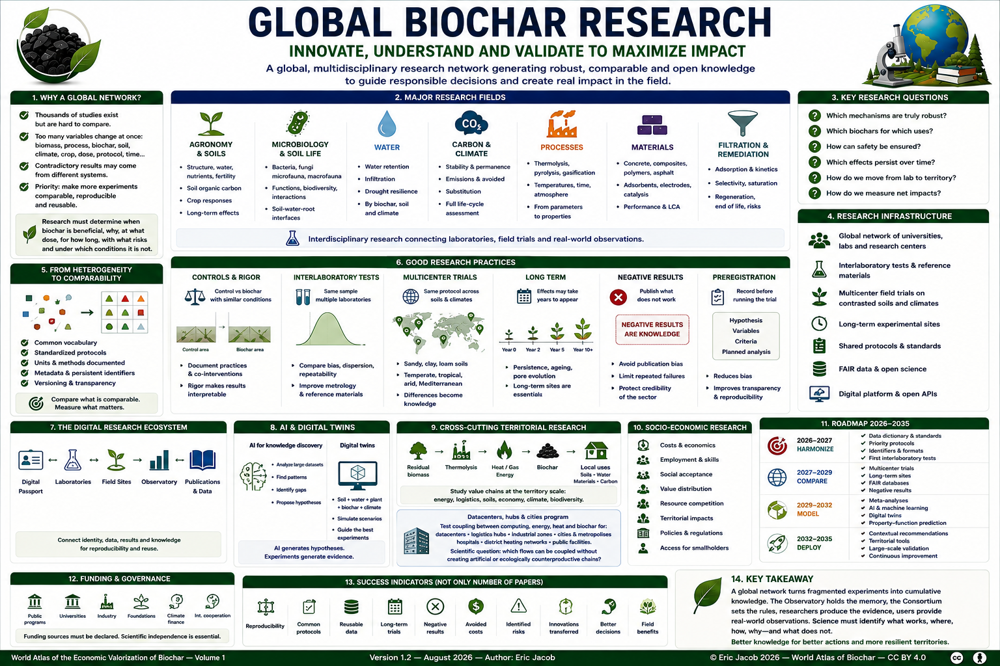

# Chapter 5.9 — Global Biochar Research

> **World Atlas of the Economic Valorization of Biochar — Volume 1**  
> Version 1.2 — August 2026 · Author: Eric Jacob

**[← Global Observatory](ch5_en_global_observatory.md) · [↑ Atlas Contents](README_en.md) · [Carbon Metrology →](ch5_en_carbon_metrology.md)**

---

## Innovate, Understand and Validate to Maximize Impact

Biochar lies at the intersection of disciplines that still communicate imperfectly: soil science, microbiology, chemistry, process engineering, hydrology, climatology, materials science, energy, economics and public policy.

The initial version of this Atlas already proposed a **Global Biochar Research Network** designed to bring together universities, laboratories, technical centers, producers and certifiers. This version retains that principle and integrates it into the broader architecture developed in Chapter 5: digital passports, quality, markets, the Global Consortium and the Global Observatory.

> **Global research is not intended to demonstrate that biochar is always beneficial. It must determine when it is beneficial, why, at what dose, for how long, with what risks, and under which conditions it is not.**

<figure>

<figcaption><strong>Figure 1 — Global biochar research: from knowledge to impact.</strong> The organization, roadmap and priorities represented constitute a prospective proposal of the Atlas. © Eric Jacob 2026 — World Atlas of Biochar — CC BY 4.0. <a href="ch5_en_global_research.png">View full-size infographic</a></figcaption>
</figure>

---

## Why a Global Network?

Thousands of studies already investigate biochar, but comparison remains difficult when several parameters change simultaneously:

- biomass;
- process;
- temperature;
- residence time;
- biochar;
- soil;
- climate;
- crop;
- dose;
- protocol;
- experimental duration.

Two apparently contradictory publications may actually be studying two different systems.

The priority is therefore not simply to produce more papers. It is to make a growing proportion of experiments **comparable, reproducible and reusable**.

---

## Major Research Fields

### Agronomy and Soils

Central questions include:

- soil structure;
- water;
- nutrients;
- fertility;
- interactions with amendments;
- evolution of soil organic carbon;
- crop responses;
- long-term effects.

The objective is not to replace agronomic practices with biochar, but to understand **where an appropriate amount of biochar provides an additional function**.

### Microbiology and Soil Life

Biochar pores and surfaces can modify microbial habitats and soil-water-root interfaces.

Research must distinguish:

```text
OBSERVATION
≠
CORRELATION
≠
DEMONSTRATED MECHANISM
```

Bacteria, fungi, microfauna and macrofauna require protocols capable of studying not only their abundance, but also their functions.

### Water

Water-retention effects must be studied according to:

- biochar type;
- particle size;
- porosity;
- soil type;
- dose;
- climate;
- ageing.

Saying that biochar "retains water" is insufficient.

Research must quantify **how much, in which soil and for how long**.

### Carbon and Climate

Research must improve knowledge of:

- stability;
- permanence;
- oxidation kinetics;
- process emissions;
- avoided emissions;
- substitution;
- indirect effects;
- complete life-cycle assessment.

See also **[Life Cycle Assessment](ch4_en_life_cycle_assessment.md)** and **[Carbon Metrology](ch5_en_carbon_metrology.md)**.

### Processes

Thermolysis, pyrolysis, gasification, activation and other treatments must be studied as transformation systems.

Essential variables include:

```text
BIOMASS
+ MOISTURE
+ TEMPERATURE
+ RESIDENCE TIME
+ ATMOSPHERE
+ HEAT TRANSFER
+ POST-TREATMENT
→ PRODUCTS
```

Research must connect process parameters with final properties rather than treating all chars as equivalent.

### Materials

Biochar can be studied in:

- concrete;
- mortars;
- composites;
- polymers;
- asphalt;
- insulation;
- adsorbents;
- electrodes;
- catalysis;
- other functional materials.

Actual relevance must be evaluated through performance and LCA, not merely through the presence of biogenic carbon.

### Filtration and Remediation

Research must characterize:

- target contaminants;
- adsorption;
- kinetics;
- selectivity;
- saturation;
- regeneration;
- end of life;
- release risks.

A material that captures a contaminant subsequently becomes a contaminated material: **end-of-life management is part of the scientific problem**.

---

## A Priority: Understanding Off-Specification Biochars

Research should not focus exclusively on the best products.

Industrial processes can generate batches that are:

- too rich in ash;
- too wet;
- too alkaline;
- too acidic;
- insufficiently carbonized;
- outside a desired particle-size range;
- unsuitable for a particular certification;
- unsuitable for the initially intended market.

The scientific question then becomes:

> **Can another safe and useful application be found, or should the material be rejected?**

This issue is important for both resource efficiency and risk management.

An off-specification product for one application is not automatically waste, but neither should it automatically be redirected to another market without characterization.

---

## Complex Biomass Feedstocks

The development of the sector requires research beyond homogeneous woody feedstocks.

Potential research subjects include:

- agricultural residues;
- pruning residues;
- husks and shells;
- digestates;
- contaminated biomass where legally and technically relevant;
- mixed biomass;
- industrial biogenic residues;
- invasive plants.

For each feedstock, research must examine the complete chain:

```text
RESOURCE
→ COLLECTION
→ PREPARATION
→ PROCESS
→ BIOCHAR
→ CONTAMINANTS
→ USE
→ END OF LIFE
```

The existence of a biomass resource does not automatically justify its conversion.

---

## Marine and Aquatic Biomass

Algae and other aquatic biomass feedstocks open specific research questions:

- salts;
- minerals;
- metals;
- iodine or other specific elements;
- water content;
- drying requirements;
- seasonal variability;
- ecosystem impacts;
- possible competition with other uses.

Marine biomass should therefore not simply be treated as terrestrial biomass with a different origin.

Its chemistry and ecological context require dedicated protocols.

---

## Harmonizing Protocols

A useful global network needs more than common vocabulary.

Each protocol should indicate:

```text
OBJECTIVE
SAMPLE
EQUIPMENT
METHOD
CALIBRATION
UNCERTAINTY
RAW DATA
PROCESSING
EXCLUSION CRITERIA
VERSION
```

This makes it possible to distinguish a genuine difference from one produced by the measurement method.

---

## Interlaboratory Tests

The same sample can be sent to several laboratories.

The results can then be compared in terms of:

- bias;
- dispersion;
- repeatability;
- reproducibility;
- preparation effects;
- detection limits.

These campaigns can help produce reference materials and progressively improve global metrology.

This approach directly complements **[Carbon Metrology](ch5_en_carbon_metrology.md)**.

---

## Multicenter Trials

The same principle should be applied to field research.

A common protocol can be tested simultaneously on:

```text
SANDY SOIL
CLAY SOIL
LOAMY SOIL
TEMPERATE CLIMATE
MEDITERRANEAN CLIMATE
TROPICAL CLIMATE
ARID CLIMATE
```

Differences then become scientific information rather than an obstacle.

---

## Studying the Long Term

A large part of biochar's potential value concerns effects that may persist for several years.

Experiments lasting only a few weeks can be useful for investigating certain mechanisms, but are insufficient for conclusions concerning:

- permanence;
- ageing;
- pore evolution;
- biological interactions;
- nutrient dynamics;
- soil structure;
- long-term yields.

The global network should maintain **long-term experimental sites**.

---

## Controls Are Essential

Field observations can be spectacular, but their interpretation requires comparison.

Ideally:

```text
CONTROL AREA
     vs
BIOCHAR AREA
```

with initial conditions as similar as possible.

If compost, fertilizers or other practices change simultaneously, those changes must also be documented.

This rigor does not diminish the value of the results: **it makes it possible to determine what produced them**.

---

## Measuring Soil Life

A protocol may monitor:

- earthworm density;
- earthworm biomass;
- respiration;
- microbial diversity;
- fungi;
- aggregation;
- infiltration;
- organic matter;
- available nutrients.

Unusual observations reported by farmers can help identify sites where more detailed measurements are justified.

---

## Participatory Research

Farmers, foresters, local authorities and industrial operators should not merely be treated as experimental sites.

They can contribute by:

- defining research questions;
- documenting practices;
- providing time series;
- reporting phenomena;
- testing simplified protocols.

Participatory science must nevertheless preserve explicit levels of evidence.

---

## FAIR Data

Where rights and constraints allow, data should follow the FAIR principles:

```text
Findable
Accessible
Interoperable
Reusable
```

Open data that are incomprehensible because they lack units or protocols have limited scientific value.

Metadata are therefore as important as the data file itself.

---

## Negative Results

Research suffers from publication bias: positive findings are often easier to publish.

For biochar, this can create a distorted picture.

The network should encourage publication of findings such as:

- no effect;
- temporary effect;
- reduced yield;
- problematic contaminant;
- economically unviable process;
- invalidated hypothesis.

> **Knowing what does not work prevents the same failure from being repeated elsewhere.**

---

## Preregistration

For certain experiments, researchers can record before beginning:

- hypothesis;
- variables;
- criteria;
- planned analysis.

This practice reduces the temptation to reconstruct the hypothesis after seeing the results.

---

## Open Publications

The network can encourage:

- preprints;
- supplementary data;
- code;
- protocols;
- models;
- negative results.

The objective is not to abolish scientific publishing, but to improve the reuse of knowledge while respecting authors' rights.

---

## A Digital Research Infrastructure

The **[Global Observatory](ch5_en_global_observatory.md)** can provide the data layer.

The research network provides the experimental layer.

```text
OBSERVATORY
     ↕
LABORATORIES
     ↕
FIELD SITES
     ↕
PUBLICATIONS
     ↕
PASSPORTS
```

Each object can have an identifier and be linked to the others.

---

## The Passport as a Scientific Key

The **[Digital Biochar Passport](ch5_en_biochar_passport.md)** makes it possible to avoid a statement as vague as:

> "We used biochar."

A paper could instead reference the precise batch tested.

Researchers could then know:

- biomass;
- process;
- analyses;
- date;
- quality;
- possible certification.

Reproducibility becomes much more realistic.

---

## Artificial Intelligence

Artificial intelligence can analyze large volumes of structured data, search for correlations, identify gaps in the literature and propose research directions.

An AI system could explore:

```text
BIOMASS
+ PROCESS
+ BIOCHAR
+ SOIL
+ CLIMATE
+ DOSE
+ CROP
+ TIME
→ RESULT
```

It may identify interactions that a human researcher would not have spontaneously tested.

But AI generates a **hypothesis**.

The experiment produces the evidence.

---

## AI and Reproducibility

Each AI-assisted analysis should preserve:

- model;
- version;
- relevant parameters;
- data used;
- date;
- code or procedure when publishable.

A scientific conclusion should not depend on a system that becomes impossible to identify a few years later.

---

## Digital Twins

In the longer term, models may represent:

```text
SOIL
+
WATER
+
PLANT
+
BIOCHAR
+
CLIMATE
```

and simulate several scenarios before a physical experiment.

The **[Digital Twin](ch5_en_digital_twin.md)** does not replace experimentation; it helps select the experiments likely to provide the most information.

---

## Research on Territorial Uses

Biochar should also be studied as one component of a territorial system:

```text
LANDSCAPE MAINTENANCE
+
RESIDUAL BIOMASS
+
THERMOLYSIS
+
HEAT / GAS
+
BIOCHAR
+
LOCAL USES
```

This approach makes it possible to evaluate economics, energy, fire risk, soils, water and carbon simultaneously.

---

## Datacenters, Hubs and Cities: A Cross-Cutting Research Program

The **[Datacenters](ch5_en_datacenters.md)** chapter studies the coupling between computing, energy, heat and biochar.

The same methodology can be tested for:

- logistics hubs;
- distribution platforms;
- industrial zones;
- cities and metropolitan areas;
- hospitals and major facilities;
- district-heating networks.

The scientific question is not:

> "Can biochar be installed everywhere?"

It is:

> **Which biomass, energy, heat, material and carbon flows can be coupled without creating an artificial or ecologically counterproductive chain?**

This program may eventually justify a dedicated territorial chapter. It is recorded here as a research axis so that it is not lost.

---

## Economic Models

Research must also examine:

- CAPEX;
- OPEX;
- biomass cost;
- transport;
- energy;
- value of co-products;
- biochar;
- carbon;
- risks;
- lifetime;
- financing.

A technically excellent process that is economically impossible will have little large-scale impact.

Conversely, a process that is profitable because it relies on ecologically destructive practices is not sustainable.

---

## Comparative Life Cycle Assessment

Projects must be compared with their reference scenario.

For example:

```text
RESIDUE LEFT ON SITE
vs
COMPOSTING
vs
OPEN BURNING
vs
ENERGY RECOVERY
vs
THERMOLYSIS + BIOCHAR
```

The relevant scenario depends on the territory.

An LCA without a realistic reference scenario can produce a misleading conclusion.

---

## Socio-Economics

Research programs should study:

- employment;
- skills;
- social acceptance;
- distribution of value;
- access for small farms;
- sovereignty;
- competition for resources;
- territorial effects.

Technology does not spread merely because it works in a laboratory.

---

## Global Research Priorities

A roadmap could concentrate efforts on six questions.

### 1. Which Mechanisms Are Truly Robust?

Identify effects that can be reproduced across several contexts.

### 2. Which Biochars for Which Uses?

Build property-function relationships.

### 3. How Can Safety Be Ensured?

Study contaminants, stability, exposure and end of life.

### 4. Which Effects Persist?

Develop long-term datasets.

### 5. How Do We Move from Laboratory to Territory?

Study logistics, economics and scale.

### 6. How Do We Measure Net Impacts?

Assess LCA, carbon, water, biodiversity and social effects.

---

## Funding

Global research can combine:

- public programs;
- universities;
- foundations;
- industry;
- climate finance;
- international cooperation.

Funding sources must be declared.

Industrial funding does not automatically invalidate a study, but its existence must be visible and methodological independence must be protected.

---

## Intellectual Property and Open Science

Not everything can be open.

An industrial operator may legitimately protect:

- processes;
- proprietary parameters;
- trade secrets;
- patentable inventions.

But results used to support an important public claim must be sufficiently documented to be evaluated.

The correct architecture separates:

```text
TRADE SECRET
≠
EVIDENCE DATA
```

---

## Training

The network can support:

- courses;
- technical training;
- webinars;
- summer schools;
- workshops.

These actions can be linked to competence levels:

```text
OPERATOR
TECHNICIAN
LABORATORY
AGRONOMIST
ENGINEER
AUDITOR
RESEARCHER
```

The quality of the value chain depends as much on people as on machines.

---

## A 2026–2035 Roadmap

### 2026–2027 — Harmonize

- data dictionary;
- priority protocols;
- identifiers;
- first interlaboratory trials.

### 2027–2029 — Compare

- multicenter trials;
- long-term sites;
- FAIR databases;
- negative results;
- comparative models.

### 2029–2032 — Model

- meta-analyses;
- AI;
- digital twins;
- property-function prediction.

### 2032–2035 — Deploy

- contextual recommendations;
- territorial tools;
- large-scale validation;
- continuous improvement.

This roadmap is prospective and should evolve according to the results.

---

## How Should Success Be Measured?

Not by the number of publications alone.

More relevant indicators include:

- reproducibility;
- common protocols;
- reusable data;
- long-term trials;
- published negative results;
- avoided costs;
- identified risks;
- transferred innovations;
- improved decisions;
- benefits actually measured in the field.

---

## A Science Capable of Saying No

The credibility of biochar will also depend on research being able to conclude:

> "In this case, this biochar is not suitable."

Or:

> "This biomass should not be used."

Or:

> "This application does not provide the claimed benefit."

This capacity for refutation protects the value chain against its own excesses.

---

## From Research to Action

The final loop becomes:

```text
QUESTION
   ↓
HYPOTHESIS
   ↓
EXPERIMENT
   ↓
DATA
   ↓
REPLICATION
   ↓
KNOWLEDGE
   ↓
APPLICATION
   ↓
FIELD OBSERVATION
   ↓
NEW QUESTION
```

Research is therefore not an isolated chapter of the Atlas.

It is the mechanism that allows all the other chapters to **correct themselves over time**.

---

## Key Takeaway

> **Biochar's potential will only be sustainable if its benefits, limitations and risks are subjected to the same standard of evidence.**

A global network can transform thousands of fragmented experiments into cumulative knowledge.

The Observatory provides the memory.

The Consortium provides the common rules.

Laboratories produce the measurements.

Users provide real-world observations.

And research connects these elements to determine not whether "biochar works", but **which biochar works, where, how, why, and at what environmental, economic and social cost**.

---

## Continue Reading

**[← Global Observatory](ch5_en_global_observatory.md) · [↑ Atlas Contents](README_en.md) · [Carbon Metrology →](ch5_en_carbon_metrology.md)**

See also: [Digital Biochar Passport](ch5_en_biochar_passport.md) · [Biochar Quality Index](ch5_en_quality_index.md) · [Life Cycle Assessment](ch4_en_life_cycle_assessment.md) · [Datacenters](ch5_en_datacenters.md) · [Digital Twin](ch5_en_digital_twin.md)

---

*World Atlas of the Economic Valorization of Biochar — Eric Jacob — Version 1.2 — 2026*  
*License: Creative Commons CC BY 4.0*
